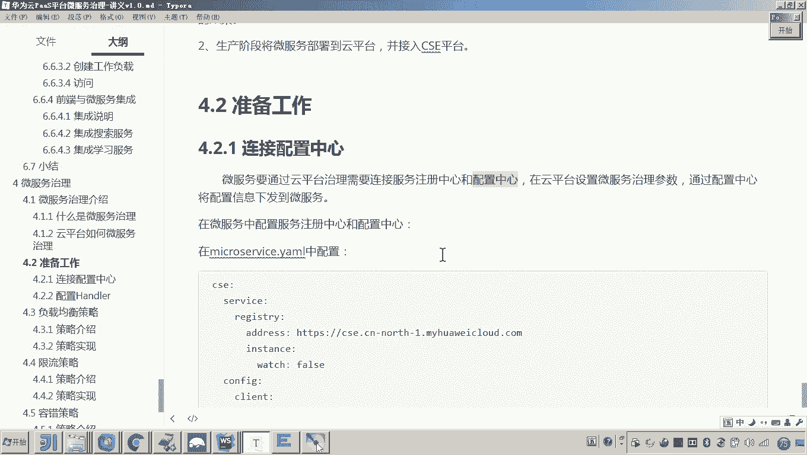
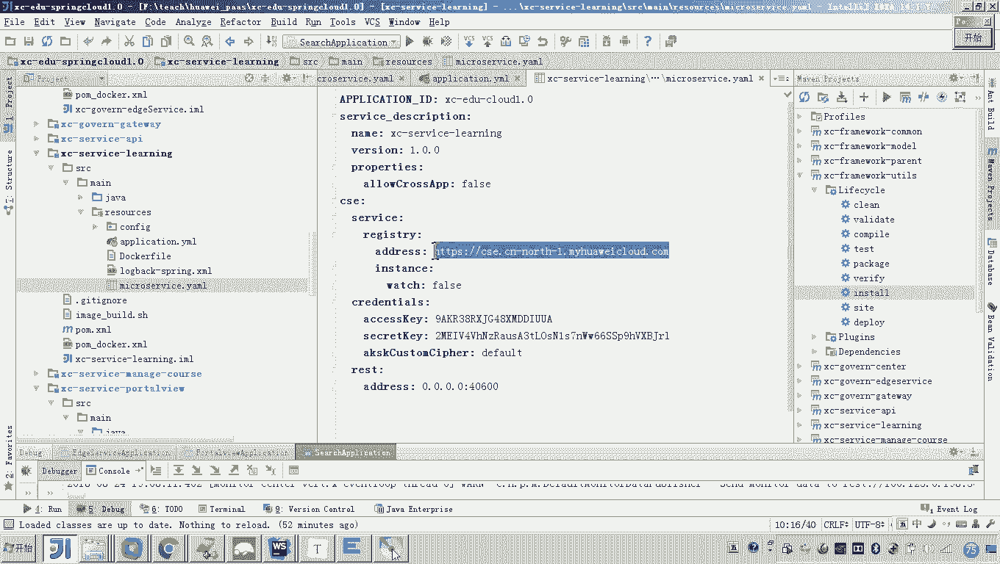
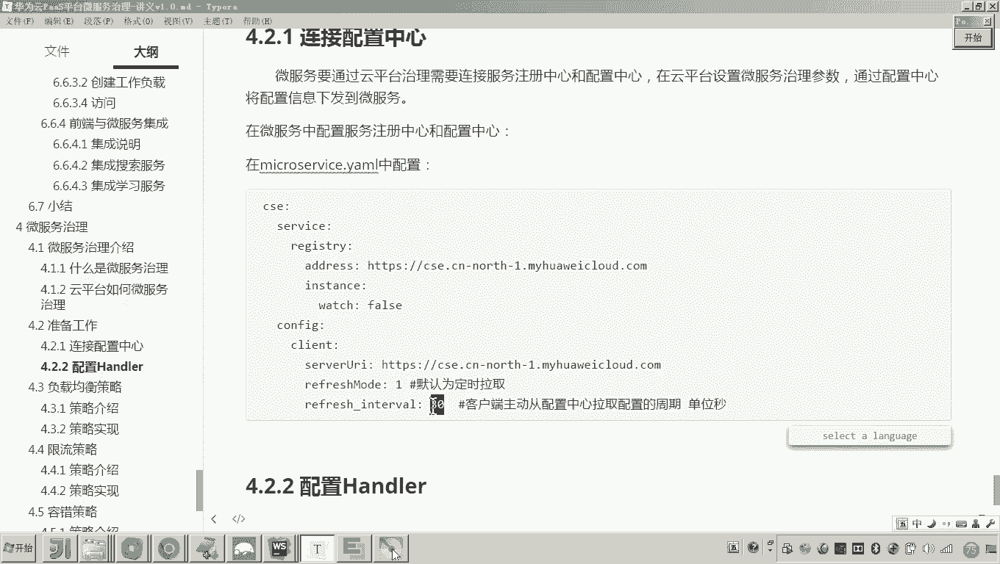
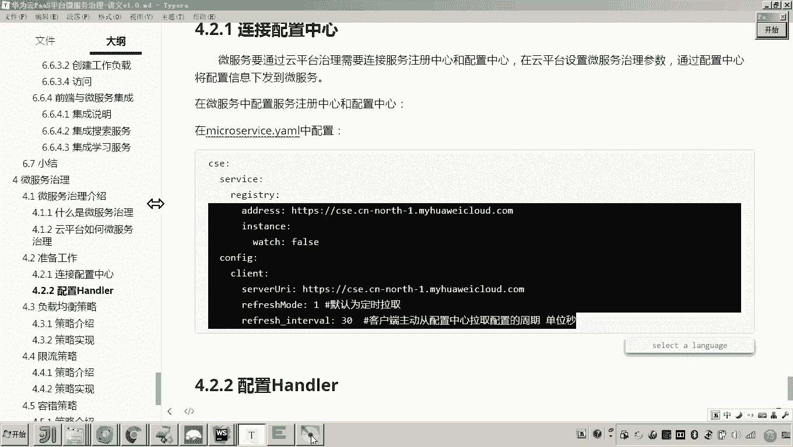
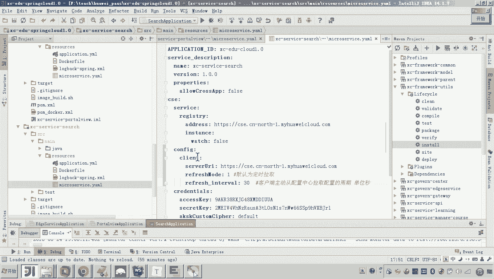
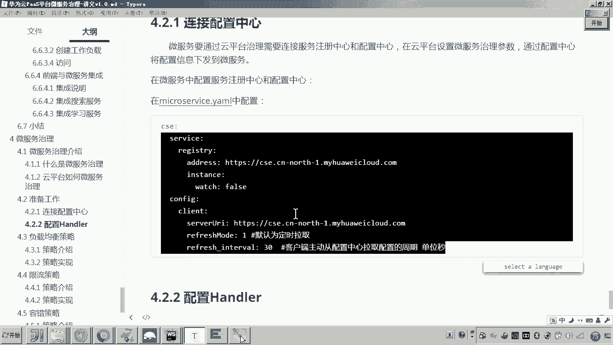
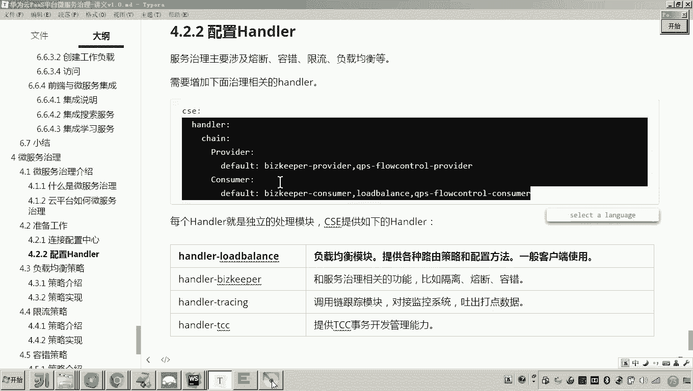
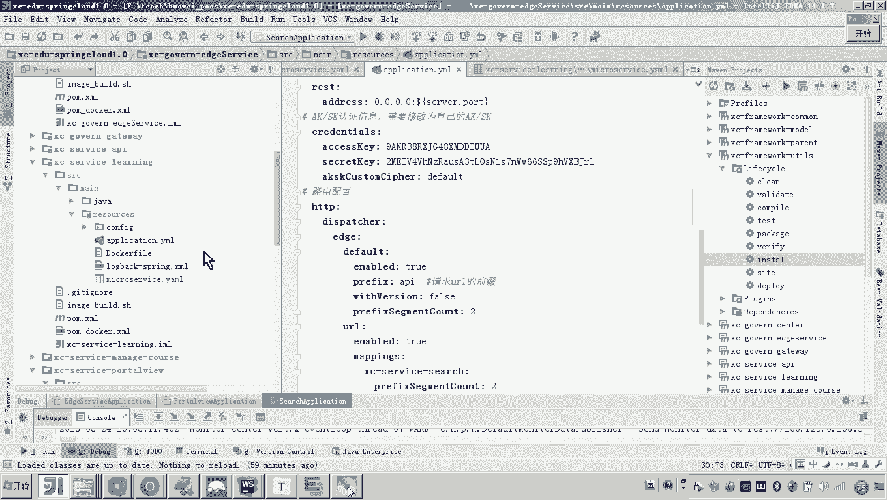
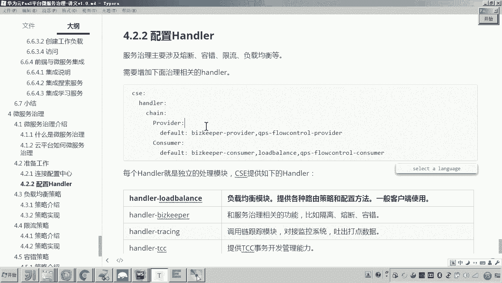

# 华为云PaaS微服务治理技术 - P130：08-微服务治理-连接配置中心和配置Handler - 开源之家 - BV1wm4y1M7m5

好，那么接下来呢我们就准备开始学习常用的微服务治理策略。那么在学习之前呢，我们有一些准备工作要做。好，那首先第一个呢啊刚才我在介绍呃，这个微服务治理的这个原理的时候呢。

呃微服务是需要从统一的这个配置中心来获取呃治理参数的那这个配置中心在哪里呢？啊，这个配置中心不用我们来部署了，也是云平台给我们提供的。所以那么在微服务当中，我们首先要配置，要连接服务注册中心和配置中心。

也就是这两个中心。那当然我们在呃早期开发呃我们这个呃CSE的这个项目的时候呢，就是学生在线接入CSE平台的时候啊，我们其实每个微服务应该都已经接入了这个啊注册中心，对吧？啊，你可以随便找一个。

比如说这个学习服务，你可以看一下。那这个是不是就是我们说的服务注册中心啊，都已经接进去了。😊。

但是还有一个中心就是配置中心。配置中心呢就是统一管理这个微服务的配置文件参数的。所以这里边我们也要连接这个配置中心。好，那这个配置中心怎么配置呢？也是非常简单的。各位看一下啊，上边是不是就是注册中心啊。

下边就是配置中心，也就是加一个configure啊这么一个选项就可以了。那么这个configu选项各位可以看一下啊，这个路径是一致的啊，这个路径都是我们云平台的这个目录啊。

然后关键是下边是不是有两个参数啊，这两个参数我们了解一下啊，啊，一般也不用改，那这个就是因为微服务是不是要从配置中心来拿参数啊，所以这里面一就表示默认是定时从配置中心拉取参数获取参数。

那么定时那定多长时间呢？那下边这个参数呢就是啊周期啊，每隔30秒啊，每个默认就是30秒，每隔30秒从配置中心拿一次参数。所以你把上边这2块东西，然后配到我们所有的这个微服务啊。

那么这里边因为我们学生在线当初我们是抽取了一个业务流程还好，因为这个微服务还不多啊，加上网。😊。

总共几个呀，总共4个，对吧？所以现在呢我们从网关呢开始配哎，网关开始配来，我们把这些呃准备工作先做了啊。😊，好，那么这里边呢注意看啊，这是网关啊，网关你看原来是不是网关都已经配过这个confi了。

所以来我们把它拷一下。😊，这是不是就成了。好，然后接下来呢我们再看啊，这个是啊学习服务啊，学习服务。那么也我们也把这个配一下啊，来把这个搞一下。😊，没问题吧。好。

然后接下来还有嗯这个portto view。😊，报头 view，然后呢把这个也配置一下。然后最后一个search啊搜索好。那有说老师这个每个微服务都要配吗？没错，嗯，因为每个微服务都可能被治理。

所以你呢都要把它配上去。好了，那么配完了这个配完了这个配置中心和注册中心两个中心以后呢。

我们还需要配一个东西叫做handler。嗯，这个handler是什么呢？啊，应该我们在学习servicecomp框架的时候，应该了解过吧。就是说呃它这个框架啊在运行的时候啊，其实有很多模块。😊。

有什么模块呢？哎，比如说有负载均衡模块啊，还有什么这个隔离熔断容错的模块，还有什么？用用于用于这个来跟踪我们整个微服务调用链的一个模块，还有TCC事物控制的模块。

所以这些模块注意这些模块是独立的一个一个的模块。那么我们可以认为就是这个handlerhandler每一个handler就对应一个模块。但是现在各位你要让我们的微服务具有这个呃微服务治理的这个能力。

也就是说哎和云平台啊，像对接，要让微服务来来认识来处理微服务治理的这些策略的话，那么你就要配置handler。对，那这个handler各位handler是什么呢？

各位他要配置第一个handler这是啥意思呀？因为这个handler我我在这是不是已经写清楚了，就是用来处理这个熔断容错隔离的这些东西。那这个呢就是处理限流的啊，然后下面这个是不是就是什么负载均衡。😊。

对不对？好，那你说老师那你这里边怎么呃在这儿配了一个，下边又配了一个，这是啥意思？你可注意看啊，可不一样啊，你看这个指的是作为服务提供方要配置的这个hander。

这个是作为服务消费方要配置的hander，你没发现他每个这个hand的名字不一样，看懂了吗？对。😊，啊，那么那这是什么意思呢？我给大家解释一下，比如你说这个哎这个什么呢？

这是不是就是我们说的这个负载均衡模块呀，这个hander我们是不是配在了消费者啊，我也就是说如果你是一个消费者的话，那你是不是需要。😊，配到这儿啊，对不对？好了。

那么也就是说这个这个handler所提供的功能呢，是作为你是一个消费者来提供这个负载均衡的这个功能。😊，是这意思吧？哎，负载均衡的功能。也就说老师那这个还是不理解，为啥你给你举个例子，比如说这是服务A。

😊，对吧而现在呢他要调用谁呀？他要调用服务机啊。😊，这个B。对不对？而现在呢各位那我我现在要配置负载均衡，我在我在哪配？😡，我是在B上配还是在A上配？😡，各位，你告诉我。是在B上。那你想呀。

A去调用A去调用B，对不对？A是不是要去调用B了？😡，没错吧，但是B如果不支持负载均衡，能行不能？😡，不行了，所以B作为什么？作为提供方哎，各位B是不是服务提供方，A是不是服务消费方，对不对？好了。

那A去消费B。😡，A去请求B。那么A作为这个请求的出发点。😡，这儿是不是得有负载均衡的策略了？懂我意思吗？因为B假如说我有先我现在有三个实力在这放。😡，看好我B有三个实例。好了，负载均衡。

第一个算法轮询好了，A作为消费方现在来请求B了。如果负载均衡配成什么配成这个轮巡，那么A去请求B，它就会第一次请求第一个B，第二次请求第二个这个B第三次请求第三个B。😊，对不对？😡。

所以你这个负载均衡一定是在哪呀？是不是消费方里头啊？😡，所以说这里边一定注意，就这些handler的配置的位置啊，你你不能乱了。嗯，好了，我们把这个handler呢也配置一下。😡，好。

这是最基本的这个治理的这个策略所所必须要配置的handler啊。所以你就在什么呀啊，你就在所有的这个什么这个这个微服务当中，你把这些handler给我配一下啊，就可以了。嗯，好了，我们从设序开始配。😊。

在哪？在这配。😊，可以吧，哎，然后呢，在这个port view。😊，好，这么配，然后在在哪里，在这个呃learning。诶。啊，3序。设计是不是配过了，然后port view配过了。

然还有一个是不是叫learning？拍一下。是这意思吧，哎，然后最后一个是不是就是一个怎么样？😊，是不是网关呢？哎，网关网关在哪？对，然后点在这配上去。好，各位。

现在我们所有的微服微服务是不是都配上去了？哎，那么这里哎到这儿，我们说这个准备工作呢基本上就完成了。对，第一个是我们要连接让每个配置微服务都连接配置中心。

第二个我们让每个微服务呢都要配置这些handler。嗯，那后边呢如果我们再讲一些其他的策略的时候，需要额外配置的这个呃handler呢，我们再去额外的往这配就行了啊。

那现在这几个handler都是最基本的。😊。

好了。