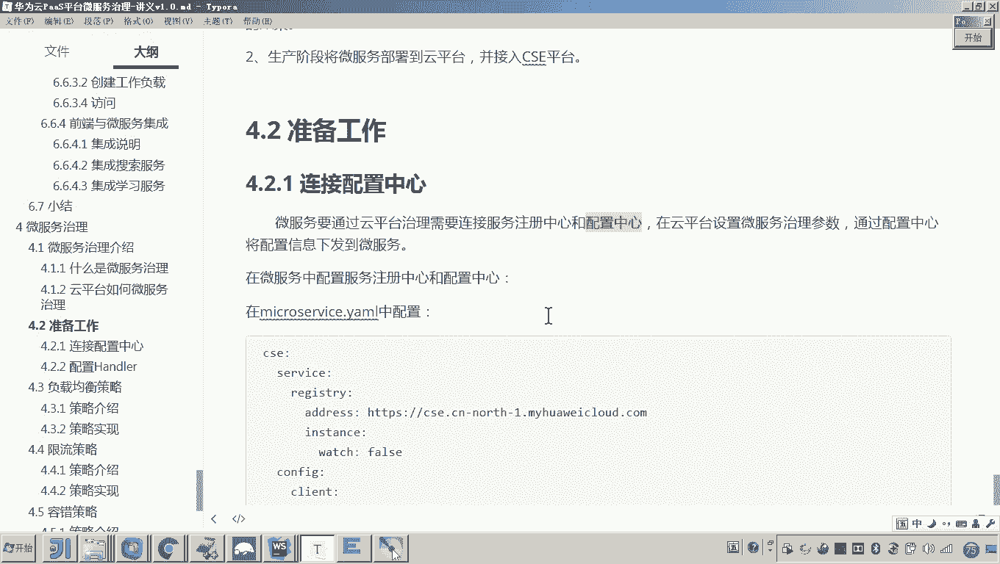
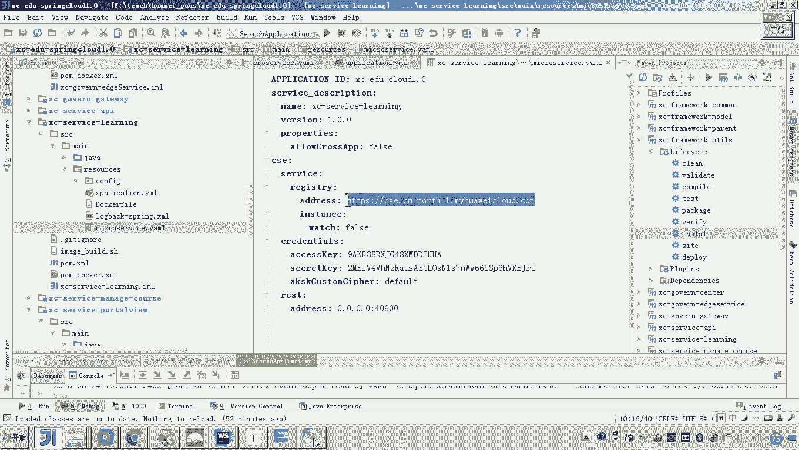
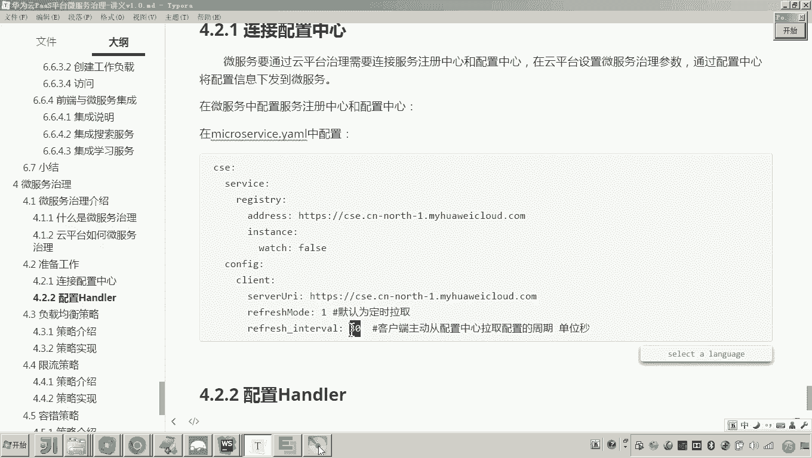
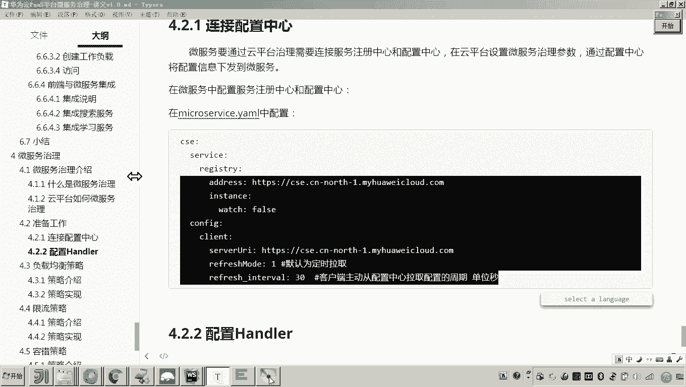
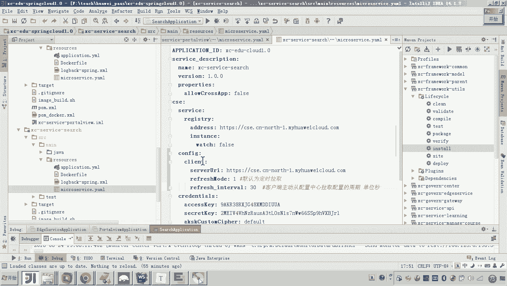
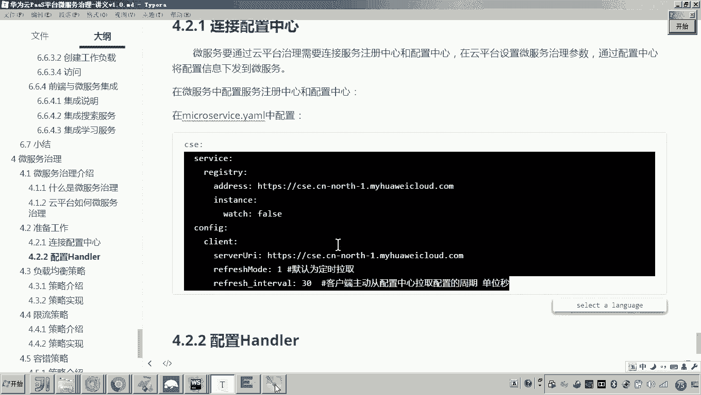
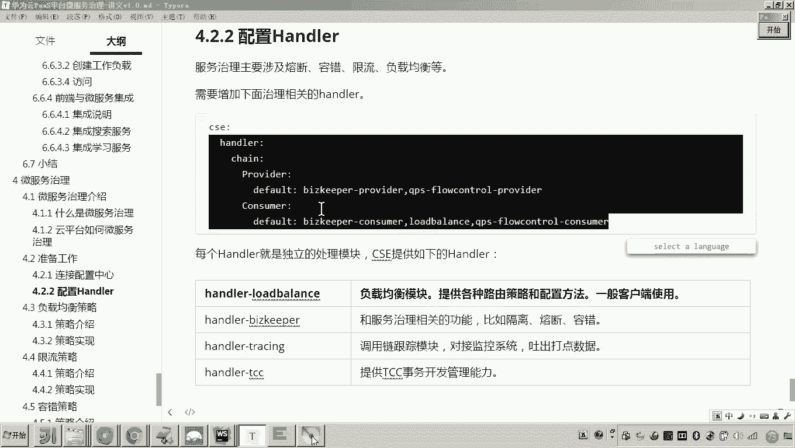
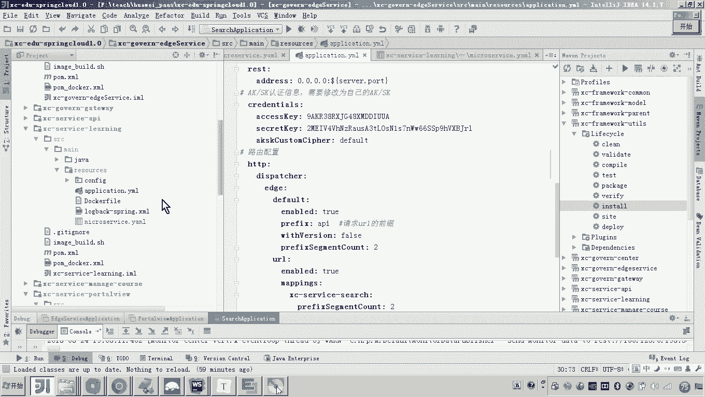
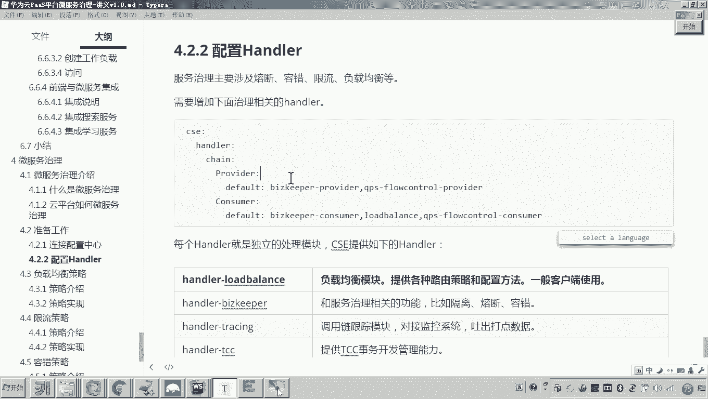

# 华为云PaaS微服务治理技术 - P130：08-微服务治理-连接配置中心和配置Handler

在本节课中，我们将要学习微服务治理前的两项关键准备工作：如何让微服务连接统一的配置中心，以及如何配置必要的Handler模块，为后续应用各种治理策略打下基础。





## 概述

微服务治理依赖于从统一的配置中心获取治理参数。因此，在应用任何治理策略之前，必须确保所有微服务都已正确连接到服务注册中心和配置中心。同时，为了让微服务框架能够识别并处理这些治理策略，还需要在服务中配置相应的Handler模块。

## 连接配置中心





上一节我们介绍了微服务治理的基本原理，本节中我们来看看如何连接配置中心。配置中心由云平台统一提供，用于集中管理所有微服务的配置参数。

在项目开发初期，每个微服务通常已经接入了服务注册中心。然而，要使用治理功能，还必须连接配置中心。配置方法非常简单，只需在微服务的配置文件中添加`config`选项。



以下是配置中心的连接示例：
```yaml
servicecomb:
  service:
    registry:
      address: https://cse.cn-north-1.myhuaweicloud.com
  config:
    client:
      serverUri: https://cse.cn-north-1.myhuaweicloud.com
      refreshMode: 1
      refresh_interval: 30000
```
*   `serverUri`：配置中心的地址，通常与注册中心地址一致。
*   `refreshMode: 1`：表示启用定时从配置中心拉取参数的模式。
*   `refresh_interval: 30000`：定义了拉取参数的周期，单位为毫秒，默认值为30000毫秒（即30秒）。



需要将此配置添加到所有微服务中。以“学生在线”项目为例，其包含网关、学习服务、门户服务和搜索服务共四个微服务，每个都需要进行配置。

## 配置治理Handler

在连接好配置中心后，我们还需要配置Handler。Handler是微服务框架中实现特定治理功能的独立模块，例如负载均衡、熔断容错等。

为了让微服务具备处理治理策略的能力，并与云平台对接，必须配置这些Handler。Handler的配置需要区分服务提供方和服务消费方的角色。

以下是需要配置的核心Handler及其作用：
*   **负载均衡 (`loadbalance`)**：此Handler应配置在**服务消费方**。当消费方调用一个拥有多个实例的服务提供方时，该Handler决定将请求分发到哪个实例（例如采用轮询算法）。
*   **熔断容错 (`bizkeeper-provider`, `bizkeeper-consumer`)**：这两个Handler分别用于服务提供方和消费方，用于处理服务的隔离、熔断和容错逻辑。
*   **限流 (`ratelimiting-provider`)**：此Handler配置在**服务提供方**，用于控制到达该服务的请求流量，防止被突发流量压垮。

配置时，需根据微服务的角色（提供方或消费方）添加对应的Handler。例如，一个作为消费方的服务需要配置`loadbalance`和`bizkeeper-consumer`。

现在，我们需要在所有微服务中配置这些基础的Handler。以下是配置示例，需添加到每个微服务的`servicecomb`配置项下：
```yaml
servicecomb:
  handler:
    chain:
      Provider:
        default: bizkeeper-provider,ratelimiting-provider
      Consumer:
        default: loadbalance,bizkeeper-consumer
```

按照此格式，为项目中的网关、学习服务、门户服务和搜索服务逐一完成配置。



## 总结

本节课中我们一起学习了微服务治理前的关键准备工作。
1.  我们首先让所有微服务连接到了统一的配置中心，确保它们能够定期获取治理参数。
2.  接着，我们为每个微服务配置了必要的Handler模块，包括负载均衡、熔断容错和限流Handler，并明确了它们在不同服务角色（提供方/消费方）下的配置差异。





完成以上两步后，我们的微服务便具备了接收和执行云平台下发的治理策略的基础能力。在后续课程中，当引入更复杂的治理策略时，只需在此基础上额外配置对应的Handler即可。