# 华为云PaaS微服务治理技术 - P131：09-微服务治理-负载均衡策略-策略实现 - 开源之家 - BV1wm4y1M7m5

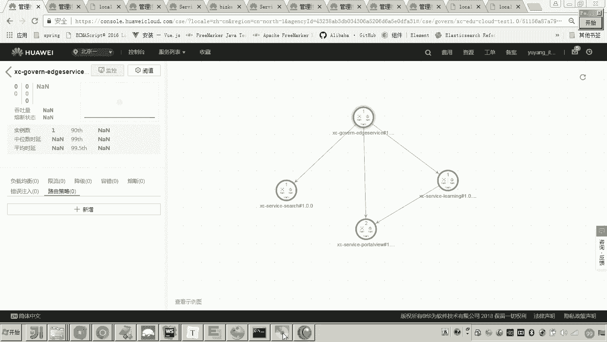

好，那下边呢我们就来测试这个呃负载均衡的策略。那怎么做呢？怎么设置这个负载均衡呢？首先你进入服务目录。

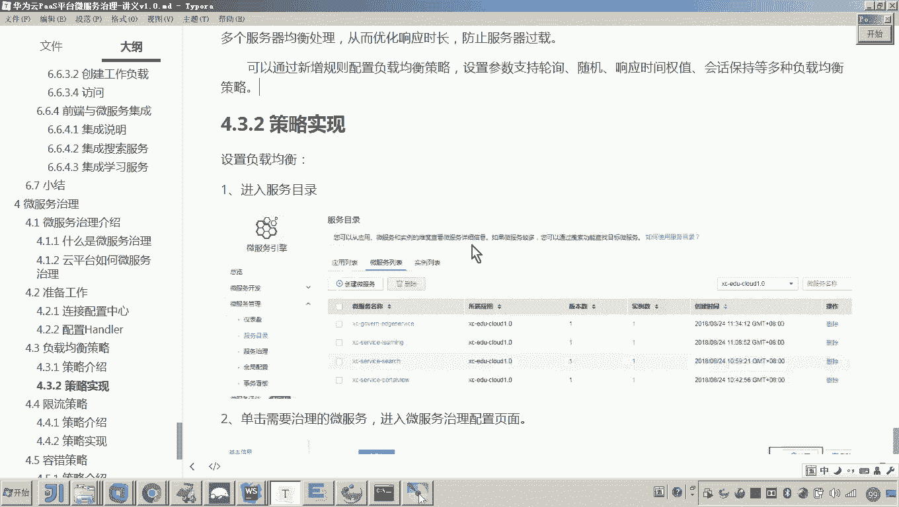

好，那进入服务目录之后呢，各位呃在这个服务目录这里边，各位你也看到了是不是有4个微服务啊。对你说我现在想治理哪一个微服务呢？那你就点哪一个。😊。

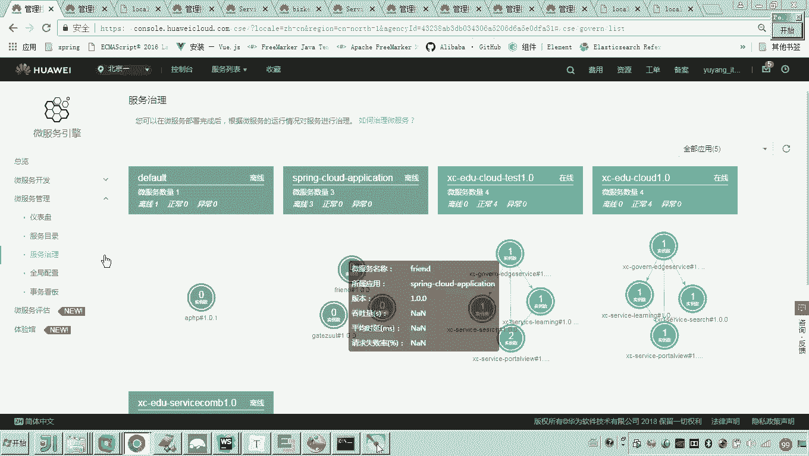

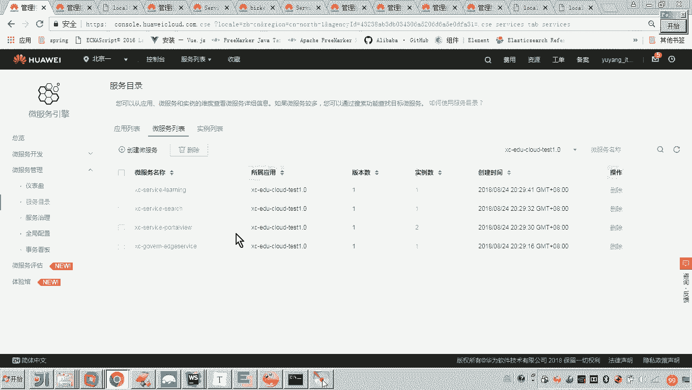

哎，比如说我现在点网关，因为负载均衡是不是在这个服务消费方上面设置是吧？那我就点网关，然后点开网关，你看这儿是不是有一个按钮啊，我就点治理。😊。

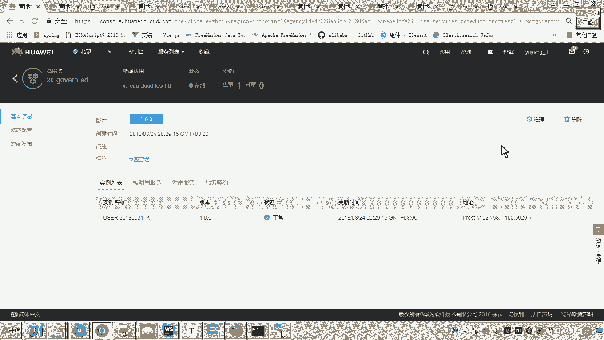

哎，就进来了。就就这么做啊哎，然后呢，然后呢进到了这个大家看这个这个这个前边上边有一个title，这个是不是就是我们说的这个网关的微服务呀，当前指的是呃准备治理这个网关的这个微服务啊。哎。

那这个网关的微服务，你看下边是不是有一个策略叫负载均衡，点点开。😊，然后下边是不是有一个新增啊？好，点开。那这个时候注意看啊，在这个所有服务列表下边，这都是网关所消费的这些服务都在这里头了。😊，对。

也就是说注意注意就这个箭头现在在图上显示出来，那么。😡，这个消费方所消费的这个服务啊，在这个列表当中就已经对都已经出来了。懂我的意思了吧？那如果说刚开始你这个服务只是在服务目录注册成功。

而没有像我刚才这样去来回的调一下他们之间的这些请求。那么你这个时候它们之间的这个关系，云平台它是无法识别的。当云平台无法识别他们之间的关系的时候，那么你这个负载均衡这里头啊，它所消费的消这个作为消费方。

哎，所要消费的这些服务提供方的这些服务的名称，它是不显示的。懂我的意思吧。也就是说当有箭头的，这才显示名称。😊。

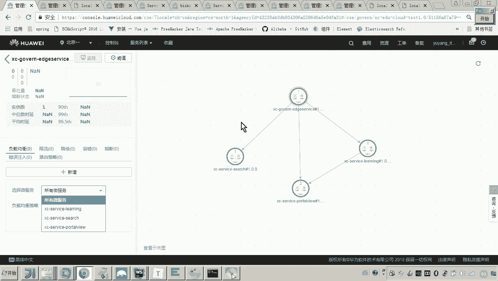

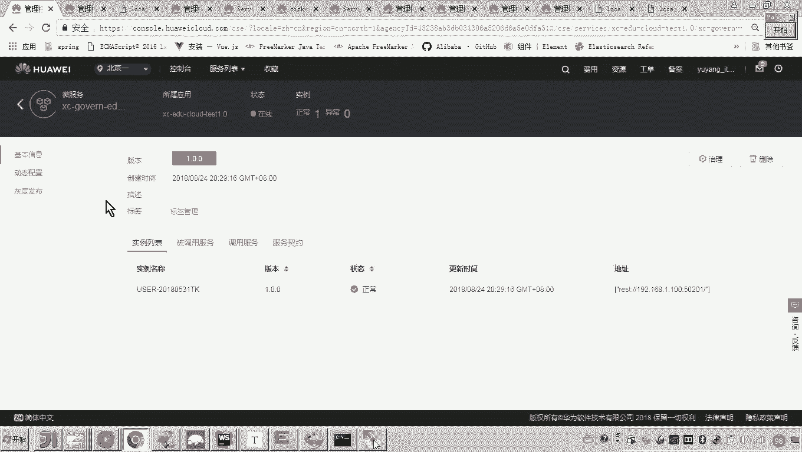

嗯，举个例子，比如说这里边是网关，是不是可以去消费我们说的这个什么呀？消费我们说的这个port头 view啊，他们之间是不是有个箭头啊，那么在这儿它就会显示这个port头 view了。😊，嗯。

如果他们中间没有这个箭头，那这个他也不会显示。好了，那现在我们说显示出来哎，正是我们需需要的什么意思呢？因为我现在就要测试了，怎么测试呢？😊，我要在网关上面设置负载均衡的策略。嗯。

针对他所哎消费的这个port头 view，你就选择port头 view。负载均衡策略我们最常用的啊，这里边注意看轮循确定这个时候这个策略是不是就设置成功了？一旦这个策略设置成功。

那么在云平台的统一配置中心，这个数据就有了。也就我现在是不是在云平台设置的这个策略啊，那这个参数呢就已经同步到我们说的这个统一配置中心了。那统一配置中心有了这个参数之后呢。😊。

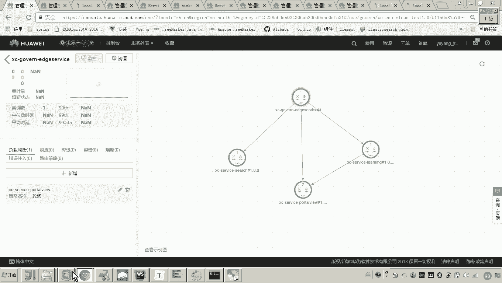

那这个各个微服务就会定时从什么？从配置中心来拿这些参数。所以现在哎所以现在这个port头 view呢应该已经拿到了这些参数。😊，拿到这些参数之后。

我们现在就可以来测试看看它是不是它是不是这种什么呀复这个轮巡的方式来这个轮询调度。什么是轮巡呢？就是我第一次请求，哎，我现在是不是有俩port view啊，我第一次请求哎，第一个。

然后再请求就开始请求第二个再请求就开始请求第一个就是这样依次的哎轮巡来请求这两个服务。来，那么我们怎么测试一下呢？😊。

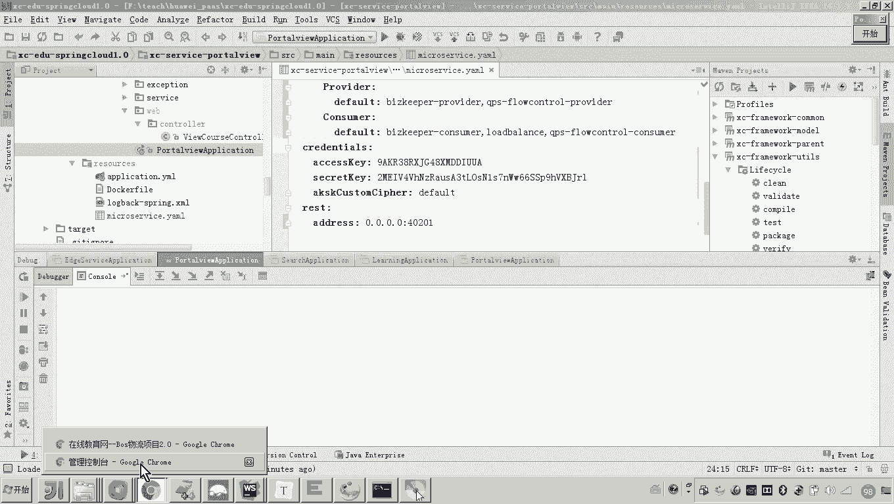

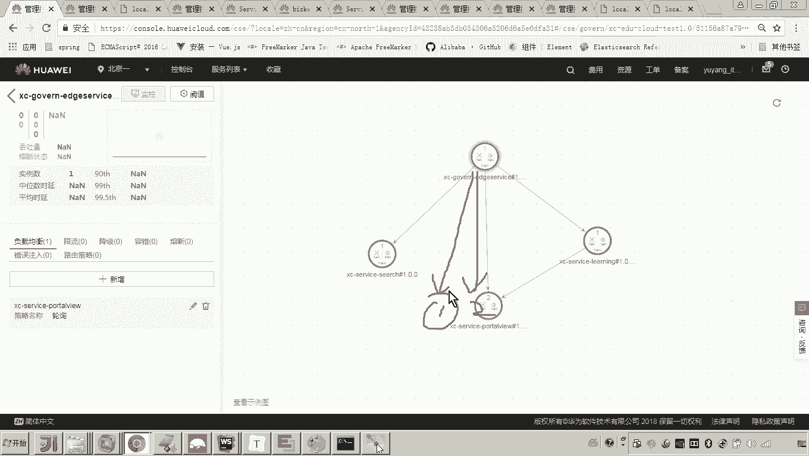

呃，刚才我们是不是已经测试这个port view啊，这个是不是就是get拿到这个课程的详细信息啊？那么我们找到portal view它的这个方法，这儿是不是有一个get？刚才我是不是在这加了个日志啊。

那现在我们就来观察看这个微服呃，这两个啊，这是一个实例。对，这是一个实例，这是一个实例。这两个实例，哪一个控制台打日志，说明哪个被调用，是这意思吧？好，那现在呢我们来看我把这个屏幕给它最小化。好。

注意看我这里面就刷新一下就行了。😊。

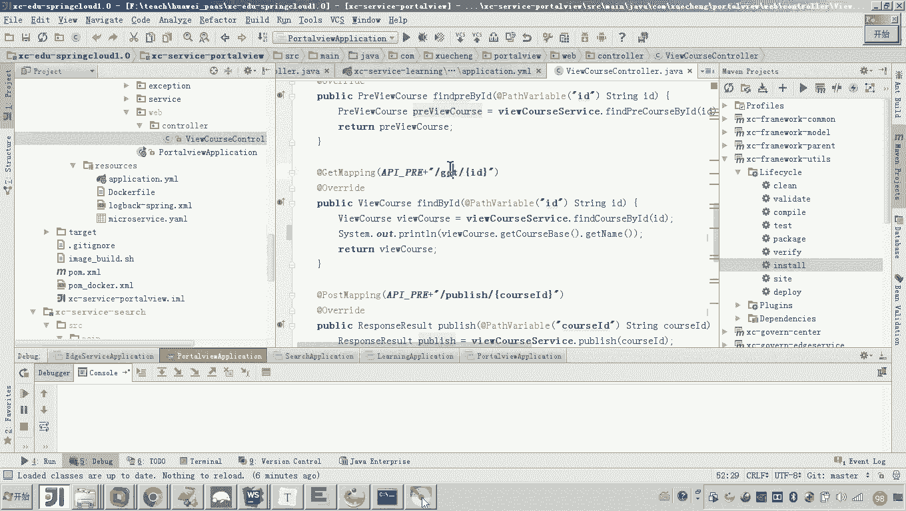

卡刷。哎。这是不是打印出来一个课程名称再刷。诶，再刷不打印了。但是这个打印了。看见了吧？哎，他们呃每人呃请求，他们就是呃每人一次轮循着来，然后再来。😊，你看。你会发现看看再看。😊，就是我每点一次看好。

对，你看啊，你看大家看这个啊，我点一次啊。😊，一。2。一。2。一。2、看。这是不是就是轮询啊？对，这就是轮询的这个调度的这个策略啊。那么好，也比如说老师，那你刚才是不是还有很多的其他的策略呀？

对我们可以看一下，那其他的策略我们也可以去尝试的设置一下，可以吧？好，那这里边呢我们来看啊，修改策略，修改成什么呢？我可以修改成随机可以吧。😊。

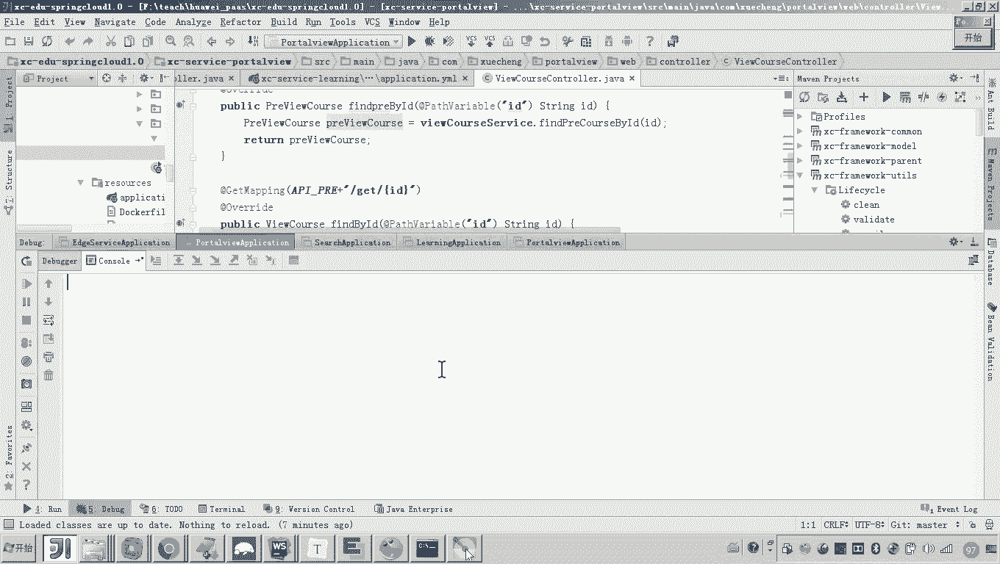

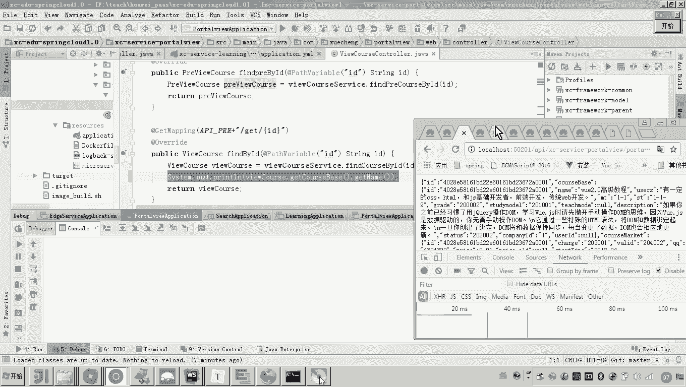

什么意思？如果我要修改成随机的话，他是不是就不会像刚才一样对每人一次啊轮巡啊，一地一次啊替换的轮巡，他不会这样了吧。那我们测试一下。😊。

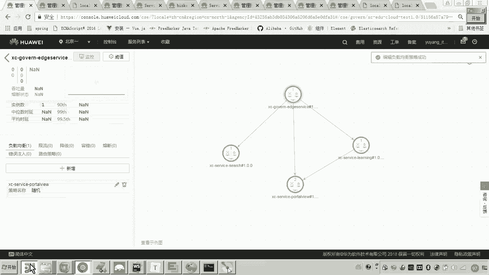

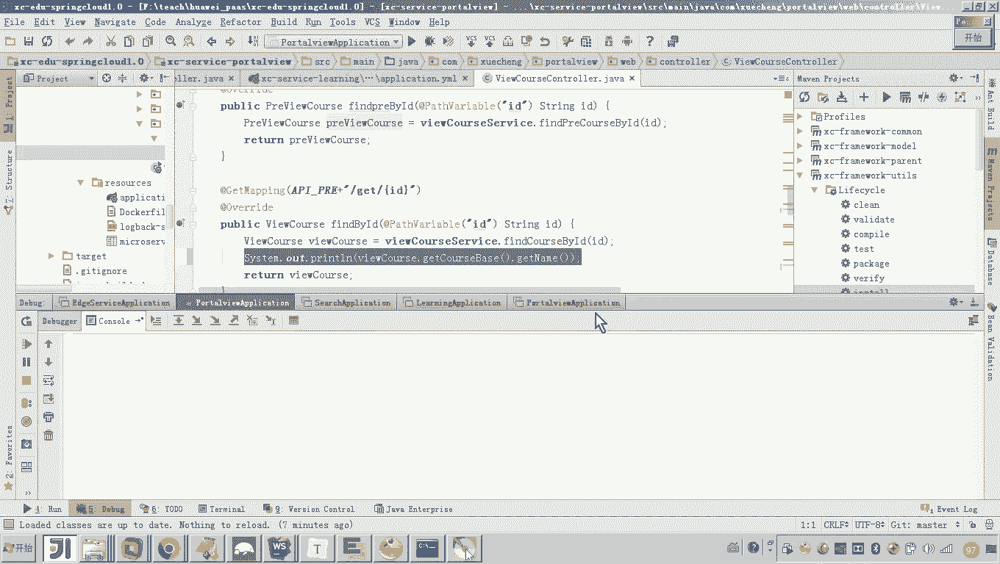

看好啊。

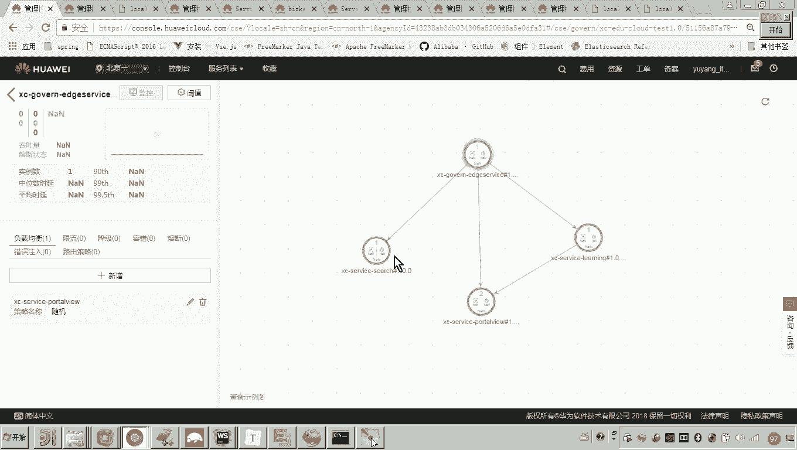

还是把这个最高化。😊，嗯，然后呢怎么弄刷心吧。😊，哎，你看有了吧。你看看你看啊1212你看。他并没有按照我我点了这个频度来走，看啊，我点一下啊。😡，注意听。12121212看12我点这么多次。

这是不是没有一次被执行啊，所以这就是一种随机的策略。对嗯。

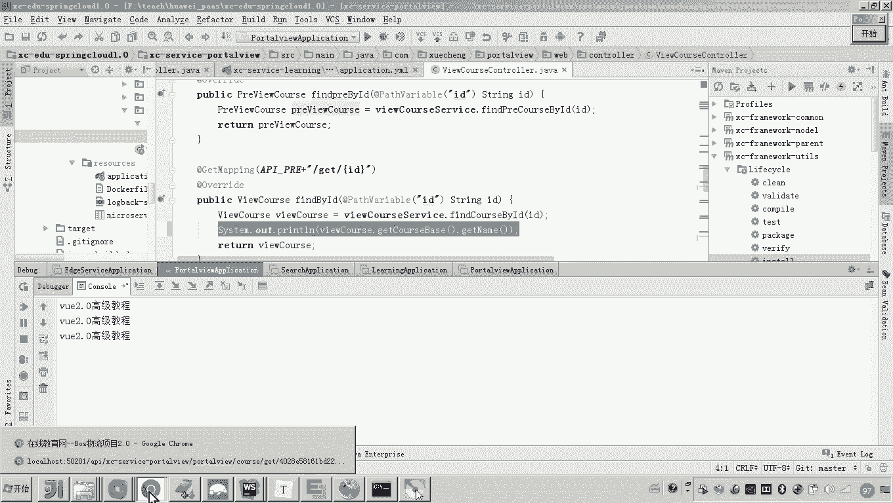

好，所以说这个这就是负载均衡的效果，对吧？哎，那么我们是不是就可以测试出来了啊，当然它还有其他的策略，比如说这里边还有什么响应时间全值，还有绘画，哎，哎，这是什么意思？叫做绘画年制，啥意思？😊。

那我们说当呃。但我们设置了这个策略的话，它是不是会怎么弄啊？我们看研一下效果可以吧，确定。😮，看好啊。呃，那么我们还是回到这儿啊呃，来，那我这里边我把它清一下。

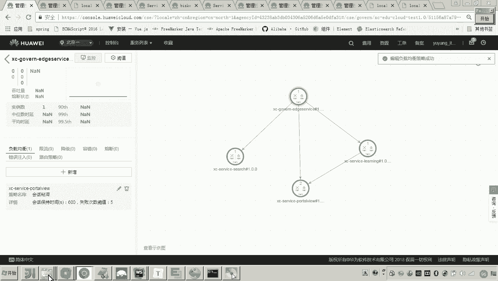

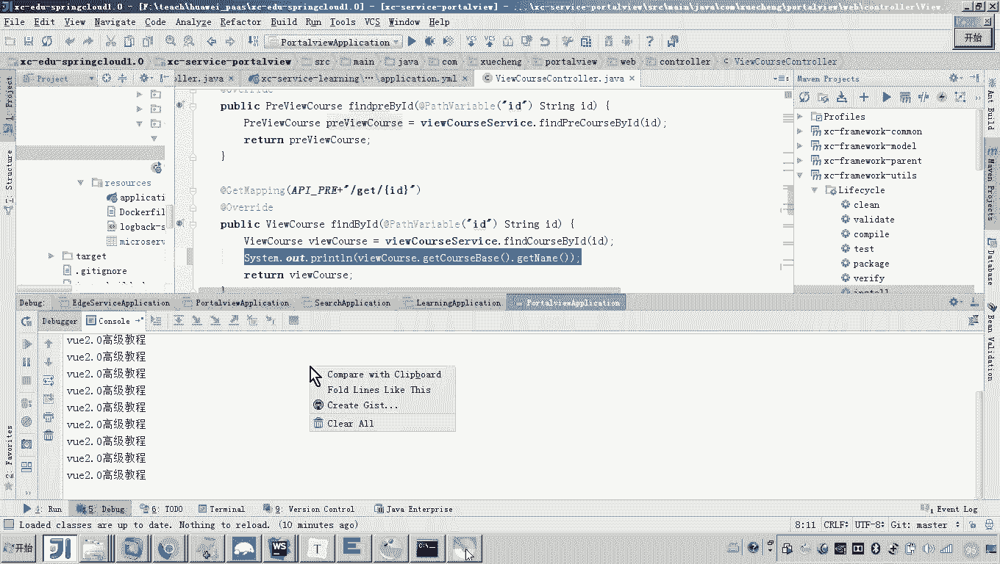

什么叫绘画年制啊？啥意思？来看一下。那我就还是来测试吧。😊。

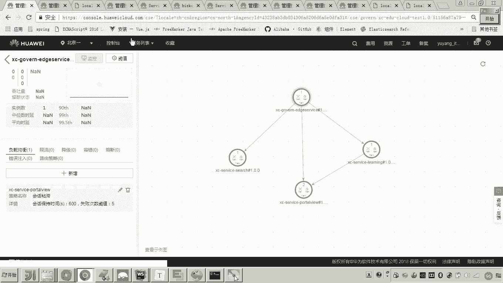

诶，看好。你看我现在每点一次，他是不是都请求这个。😡，也就是说现在各位看啊1212121212。那也就是说我这一个客户端的这一这个这个客户端给他请求网关想获取这个port view的这个绘画是不是全部的哎。

通过这一个实力，让他来进行处理了。是这意思吧？哎，那这是不是就是绘画研制的意思。对你可以看到。😊，看懂了吧？哎，那那那有人说老师，那你啥时候他是那个实力去去干嘛呀，去这个处理了呀。😡。

那你得单独又起了一个什么，又起了一个新的绘画，对吧？哎，我又打开了一个新的这个客户端。😡，懂我的意思吧哎。😡。

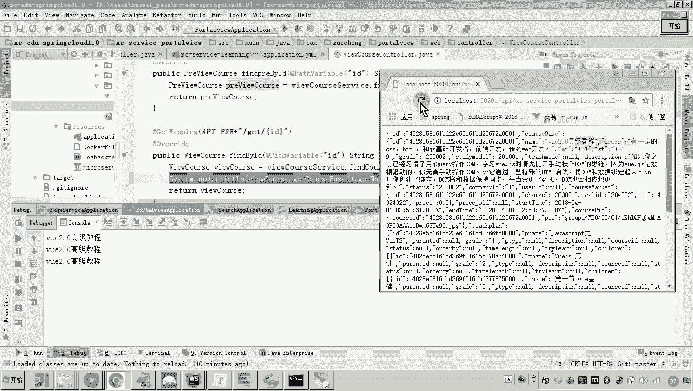

对，那这个呢大家可以测试一下。因为因为我们现在我这个本地这个这个浏览器是不是是不是现在只有只起了这么一个浏览器啊，回头你可以用其他的这个啊浏览器的版本啊，或者说用让你同事的电脑去测一下。😊。

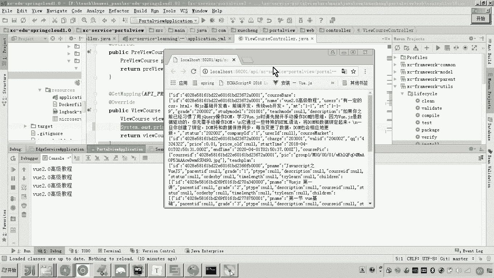

所以也就是说当这个客户端请求过来之后呢，呃那么他就会把这个绘画呢对这个定向到嗯这个统一的呃同一个这个实例中。😊，好，那有如说老师，那你这种有什么用啊？😡，那给你举个例子，你就知道啊。

比如说现在各位我们是不是有两个实力啊，负载均衡了，对吧？对，呃，如果说现在我们去请求了这个各位这个用户的绘画是不是在这个实力上边会有啊？😊，那当再次请求轮询的方法，要请求这个这个这个是另外一个实例的话。

那另外一个实例他的绘画是不是没有啊，没有的话，他是不是还需要重新创建绘画呀？那这个时候我们说他就不太。😊，对，对于我们去去进行处这个程序处理的时候呢，我们就要针对这种唉针对很有可能这个绘画没有。

我们是不是要把绘画统一的在同一个地方统一去管理起来呀，对，但是如果我们采用这种绘画研制的方式，各位，那我们就不用这么做了。也就是说当我请求他两个两个实例是吧？同一个用户的同一次绘画呢。

他就会到同一个实例当中，所以哎这里边我们完全可以怎么弄啊，完全可以去不用处理，不用处理这些绘画的这些数据了。因为这个绘画已经在这里保留了，对吧？但是一般来说我要强调一下啊。

可能有些同学刚才没有听的态度啊，一般来说对于分布式系统啊，我们对于绘画的处理，都是在统一的地方来处理这个什么处理这个绘画。哎。

但是当刚才我说的这个场景呢呃更好的这个方法就是哎我可以得到同一个用户的同一个绘画的相关的数据，在我这个实例当中。😊，嗯，那其实是对于我们提高一些性能或者其他的方面是有好处的对吧？用绘画保持嘛。好。

那么呃这就是以上咱们了解到的这个什么呀？这个负载均衡策略啊，其他的策略呢大家可以呃尝试去测试一下啊，测试一下。对，那以上呢就是负载均衡的这个策略。呃，我们总结一下。

就是要在服务的消费方嗯来设置负载均衡的策略，通过云平台来设置。😊。

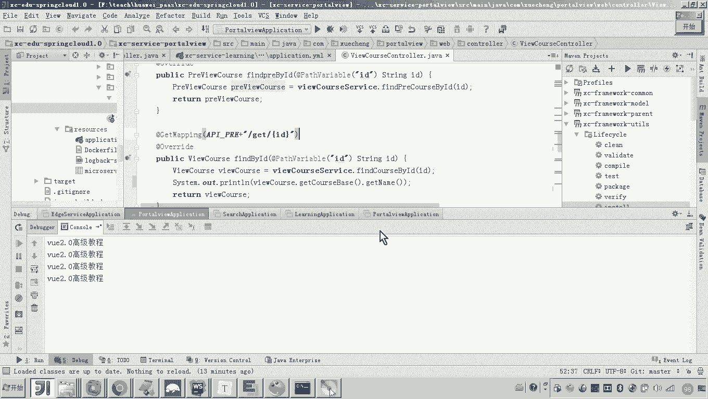

好。

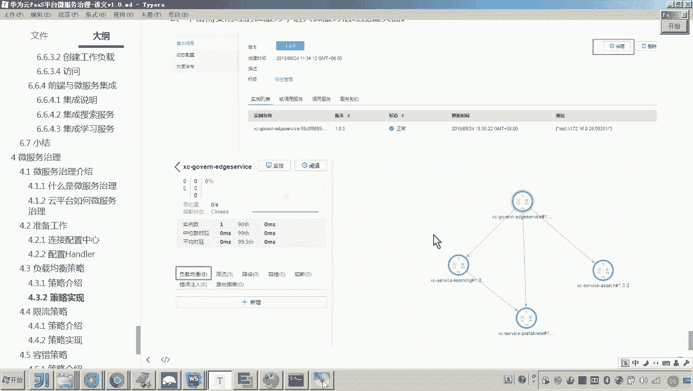