# 华为云PaaS微服务治理技术 - P132：10-微服务治理-负载均衡策略-搭建测试环境 - 开源之家 - BV1wm4y1M7m5

好，那么下边呢我们就开始微服务治理的讲解。首先我们先看第一个策略啊，叫负载均衡。好，那么我们先介绍一下这个负载均衡。呃，负载均衡呢在什么时候会用呢？啊？当出现访问量流量比较大的时候呢。

我们就会用到负载均衡了。呃，什么意思呀？比如说举个例子，嗯，原来呢我们是呃比如说A现在要访问什么呀？访问B。哎，呃原来是一个节点。哎，那现在呢A访问B的流量呢过大的时候呢。

我们说B呢此时呢它已经承受不住一个节点啊，一个节点承受不住了，那怎么办呢？我们再来一个节点。😊，那么此时你会发现A是不是需要访问两个节点啊，也就是两个这个B节点呀。好。

那这个时候呢我们就需要在A上边A作为消费方，我们在A上边来设置啊这个呃负载均衡的策略了？那好了，那么这样的话，我们是不是就可以解解决了啊，我们说这个A的呃负载这个A的这个服务器过载的这个问题啊？😊。

这样的话，我们这个响应的时长是不是就缩短了？哎，提高了我们这个响应的效率。好，那现在呢各位我们说这个负载均衡怎么设置呢？那这就是后边要进行负载的实现了。好了，那么我们在实现呃这个负载均衡策略的之前呢。

我们先把这个环境啊给准备一下。😊，什么环境啊？就刚才老师画的一张图啊，现在是不是要A来访问啊两个节点呀？哎，那现在各位啊，我们可以想一下，现在在我们的这个呃微学生在线的那几个微服务上边。😊，对啊。

我们说A的这个位置呢都有哪些？😊，就是作为消费方，哎，这个这个这个位置有哪些？😊，好了，那现在呢我们来回到这个我们的这个管理平台上边，这个是我们当初呃把学生在线部署到这个云平台的一个什么一个图形。

对不对？那大家看一下吧，那这个A的位置是不是就是网关是不是也算一个A呀？网关是不是作为消费方来请求各个微服务，对不对？还有这个什么呀？学习服务，它是不是也要请求这个port view啊？😊。

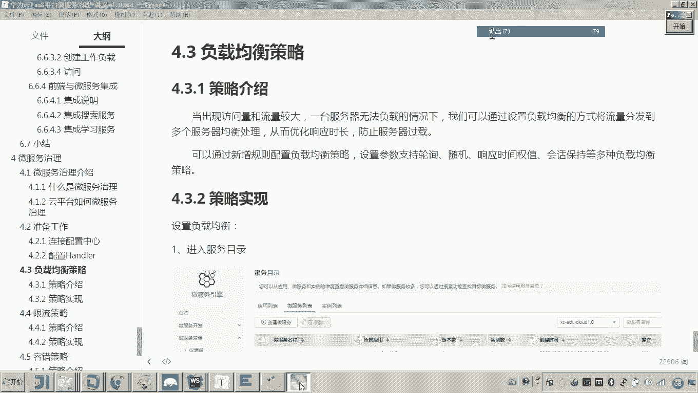

所以这个学习服务它也是不是也是一个A。对不对？哎，好了，所以说也就是学习服务也是一个消费方，哎，网关也是消费方，只要消费方，我们都可以设置这个负载均衡。嗯，好了，那现在这个负载均衡这一块咱们怎么设置呢？

啊，在设置之前呢，我们先把这个环境准备一下。😊。

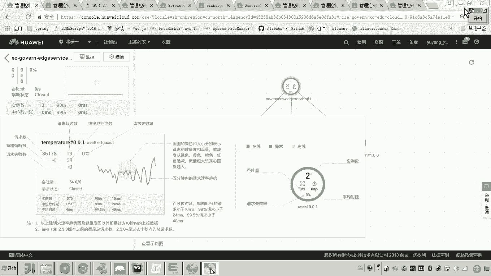

呃，各位，我们说现在我们要测试这个啊微服务治理啊，我们还是在测试平台，就是在我的本机啊。我们现在呢把这个微服务都起起来起来之后呢。

各位他是不是就会像把这个每个服务的信息注这个注入到我们的这个云平台里头啊，就好比就好比各位就好比现在大家看到的这个服务目录。😊。

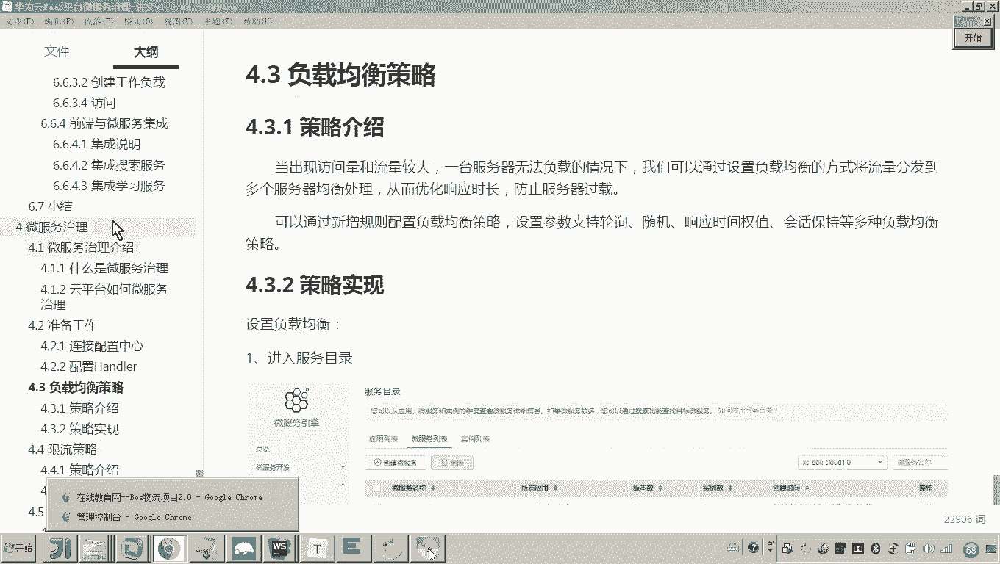

你这个服务目录是不是就是当初我们把学生在线部署到云平台，然后呢。这每一个服务都注册到了这个这个目录下呀。就是这个应用项XCEDUcloud1。0，对不对？

那这个名字是不是和我们现在的这个应用的名字一一对应的？😊，好了，那现在呢因为现在各位看到的这些服务呢都是云平台上边正在运行的啊服务。呃，我不准备向这个目录里边注注注册了，怎么办呢？呃，我想这么做啊。

看好啊，我现在先把环境准备一下呃，我把每一个这个应用的这个名称啊，我我给他改一下。😊。

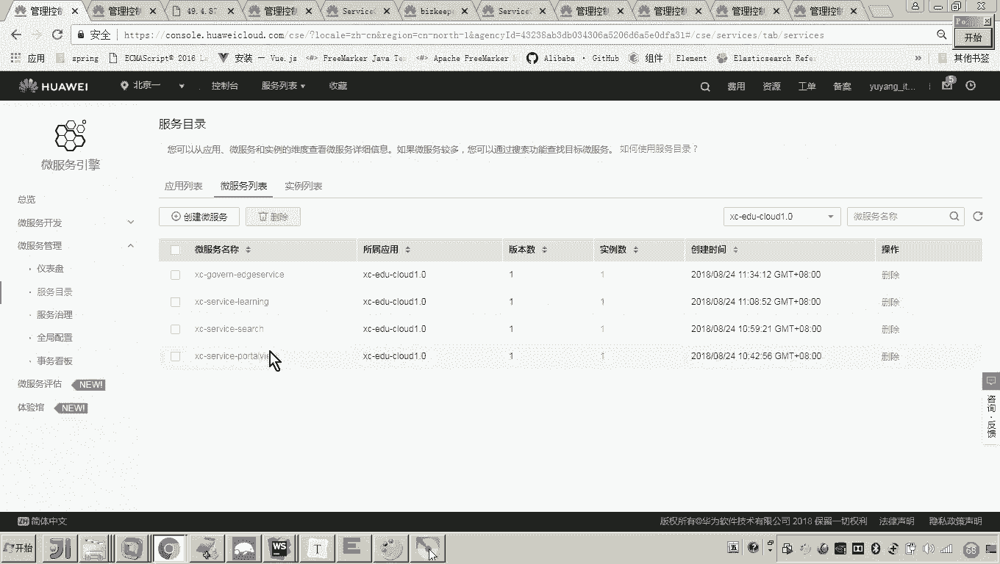

我改一下。对。啊，为啥改呀？😡，呃，我我是不是不想跟现在云平台上边的这些服务所属的这个项目的互相掺和，对吧？对我单独弄一个测试的这个项目。😊。

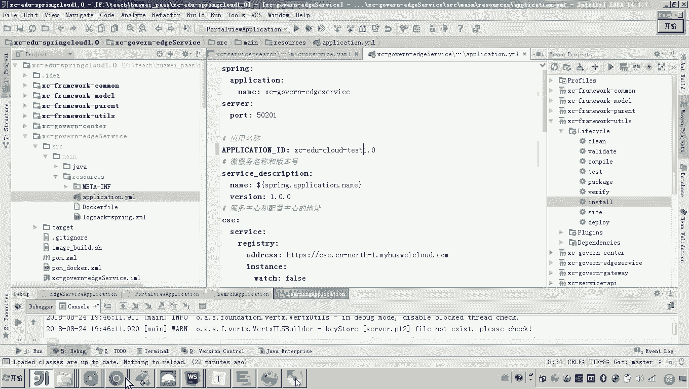

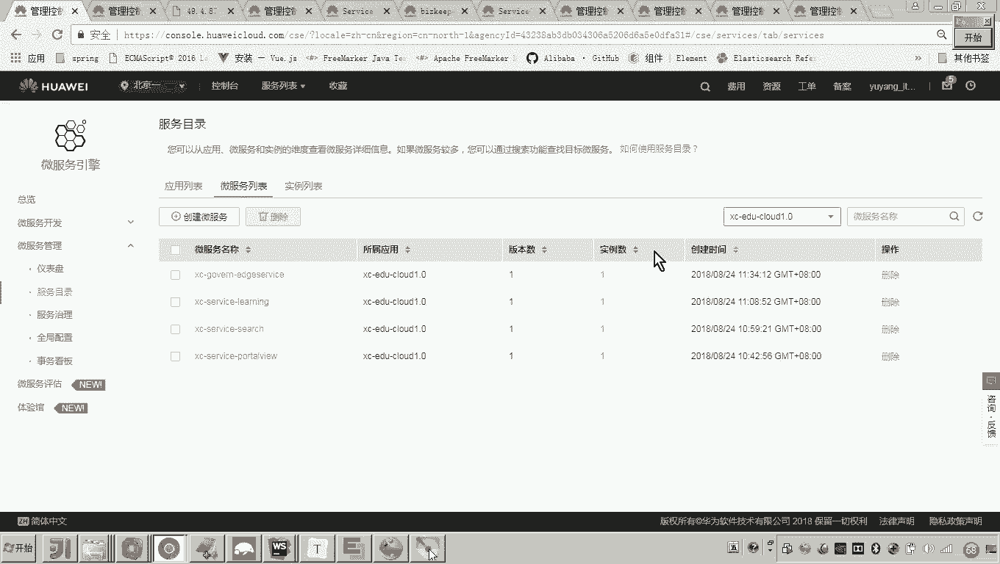

好，这样的话我们就把所有的这个呃我们总共算上网关，总共4个服务啊。我们把这几个服务的这个呃项目名都改了。😊，各位我们改一下。那现在我们如果把它改完了之后啊，现在我们怎么做呀？😊。

我们是不是就可以去把我们的这个微服务重启起来呃，这个启动起来了，对吧？好了，那现在呢我们就启动吧，先启动什么呀，网关吧，然后呢再启动这个port view。😊，各位，我把这四个微服务起来之后呢。

我们一会儿呢就应该在云平台这个服务目录里边来观察了，看看这几个微服务是否成功的呃，在我们这个云平台的服务注册中心注册了。😊，嗯，好，我们来看一下啊。

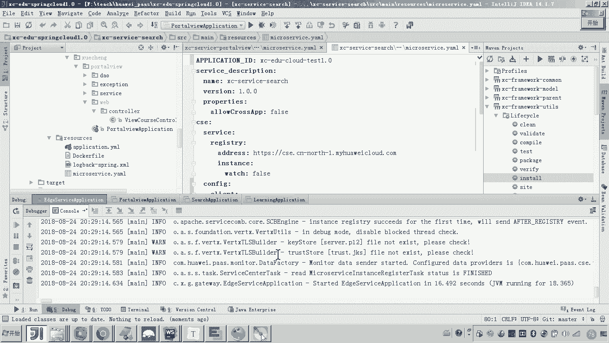

好，这个网关是不是都已经成功了呀？那现在我们来吧，刷新一下看看。😊，哎，刷新一下吧。那大家可以看到这里边是不是就多了一个test呀？对，现在已经三个了啊。😊，好。

那那也就是说一会儿呢我们哎你看你看这个我们这个服务是不是就是我本地跑的呀？而现在原来的这个这是不是在云平台上的呀？所以我们单独弄一个项目。哎，好了，那现在就注册成功了，注册成功之后呢，呃。

那有如说老师他能访问嘛？肯定能访问。当初我们把学生在线接入CSE的话，我们是不是就是这么测试的？对他可以访问的？嗯，怎么访问呢？😊。

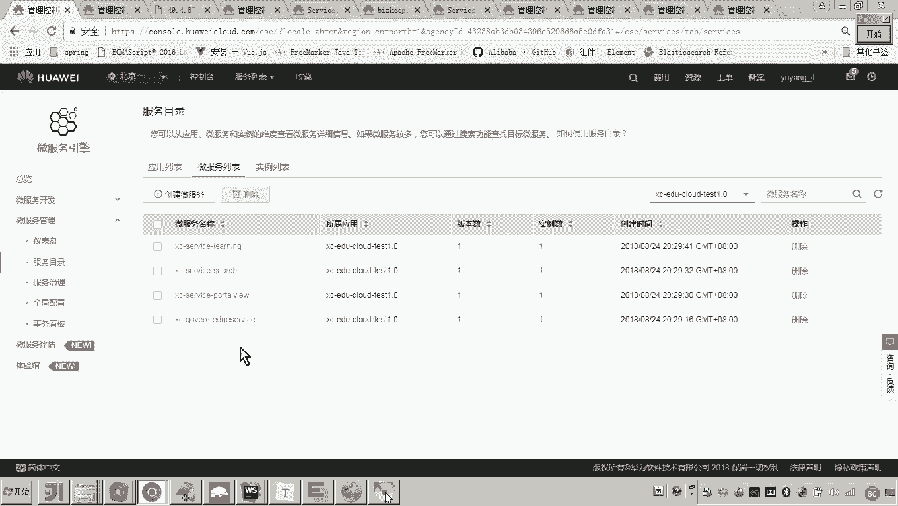

啊，我们现在通过网关访问吧。😡，网关访问网关哎，是不是就是我们上边的这个agserv呀，看一下这个ag service呃，它的这个端口吧，叫50201是不是啊？啊，那采用它这种默认的路由方式吧。好。

我们来看啊啊，这个是不是就是port view啊？那现在我把前面地址改一下。😊。

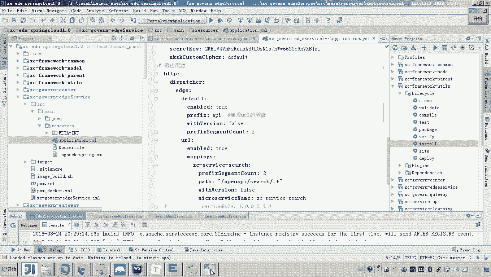

好，然后后边所有的都是API打头，然后后边跟微服务的名称。对不对？回撤。好，那大家来看它是不是就可以访问呀，这个访问的是不是就是访问的portto view啊？哎，呃，那还可以访问什么呀？

还可以访问其他的微服务吧。😊，我们访一没访问一个什么呀，访问一个se吧。😊，比如说这个社序我们可以用呃。open APII哎，这个还是。看一下好，这就不行了。为啥呀？我这个本地。😊，各位。有问题了。

因为我这个现在是跑到本地吧，那个本地我这个ES是不是得起来呀？😊，马他起来啊，我们让他跑通嗯。

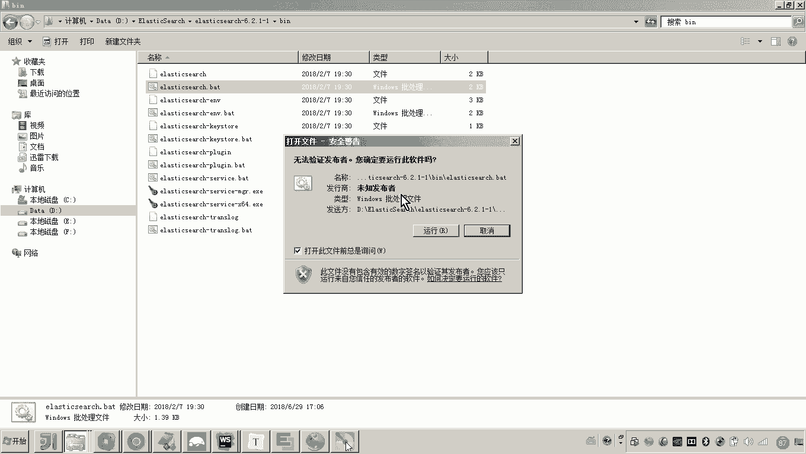

把我本地的这个依来那个设据呢，把它起来。

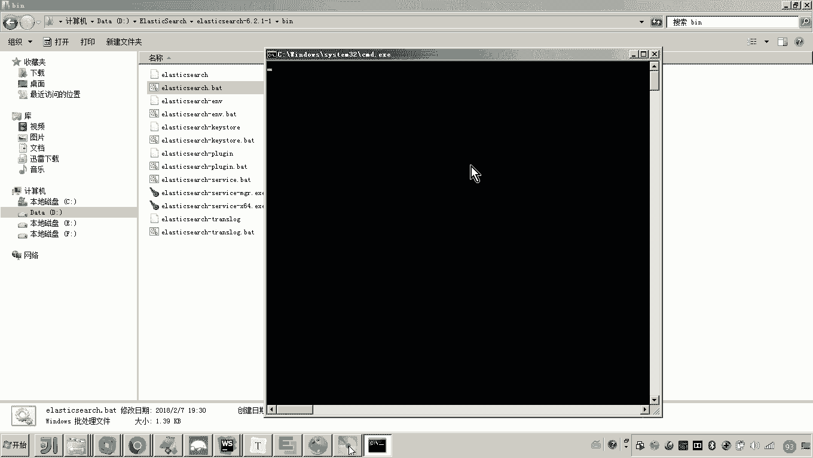

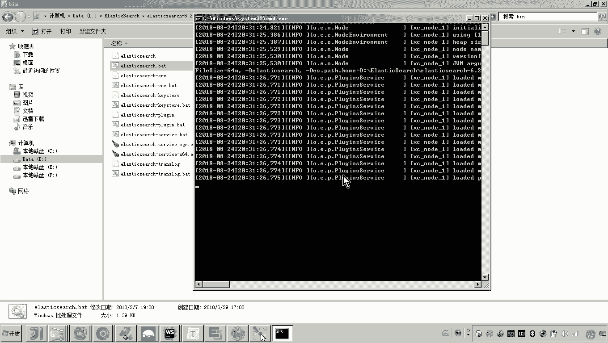

好，那来我们等等一下啊。

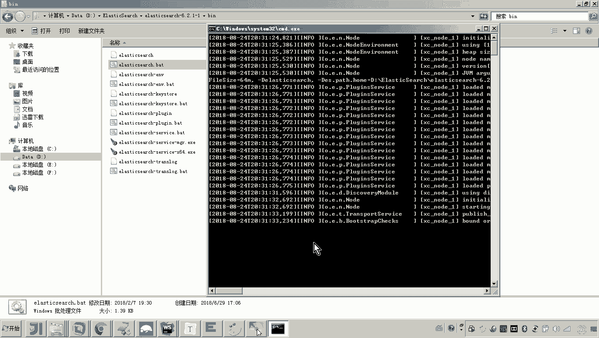

还有就是说那你。因为我现在我是不是把这几个微服务都起来了，我简单测一下，看看能不能访问嘛。因为因为一会儿我们还是要呃微服务治理呢，也是要进行这样测试的啊，来刷新一下。😊，好，大家来看是不是可以吧嗯。😊。

嗯，还要访问什么呢？还要访问，是不是就可以访问我们说的这个什么呀APIXClearning。😊，啊，service。对不对？然后后边后边我也忘了跟什么了，对不对？我们找一下啊。😊，找一下看看啊。

我们再测一下，把这几个微服务都测一下。😊，呃，看一下他的这个接口。啊，我们应该是这个看见了吗？这个呃get media对吧？哎，杠lening杠ge media。😊，好。把这个也测一下。然后呢。他吧。

然后后边是啥呀？后边是不是就是一个课程ID。😊，一个课程ID和一个课程计划嘛，那里面来来我们从这找一个啊。找一个。

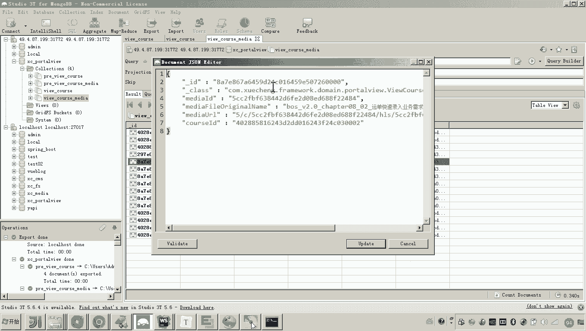

课程的ID。课程的计划。

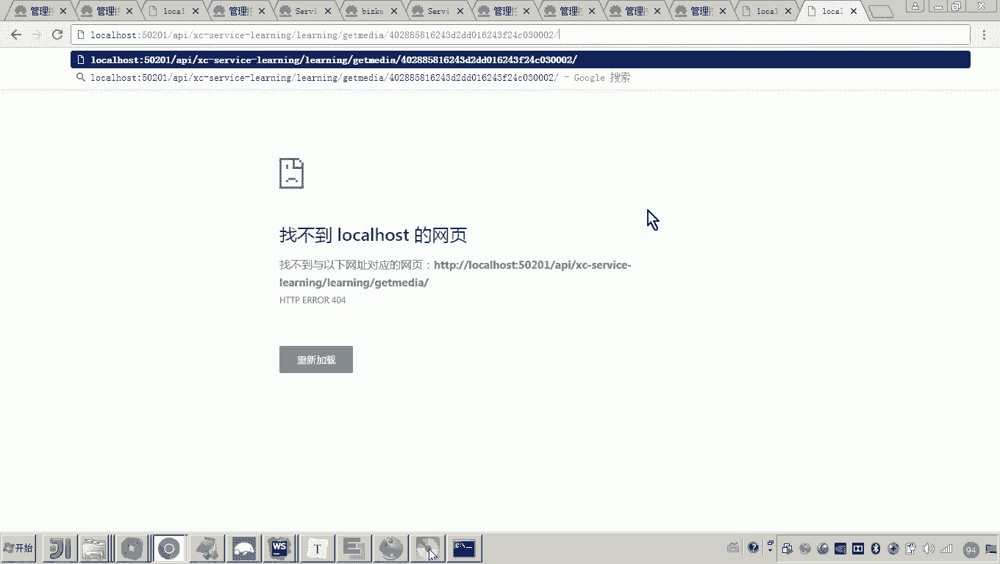

这个。哎，各位看他是不是可以啊？哎哎，那这几个接口。😊，是不是都是走的我的本地啊，现在他是不是都可以啊？对，所以这里边注意看啊呃我的这个环境呢基本上就快准备好了。😊，那还差一个什么呢？😡，呃。

一会儿我要测试负载均衡。那这个负载均衡刚才咱们也说了，这个负载均衡的话，它是不是需要有。😊，两个节点吧，也就是说比如说这个是我们的这个网关，网关来请求我们的微服务，这里边应该是俩节点，对不对？😊。

是吧哎哎所以说现在呢那我那我测试谁呀？我任意找一个吧，一会儿我就让网关请求这个portal view可以吧？那所以说现在我准备把这个portal view呀，我给它启动两个实例。😊。

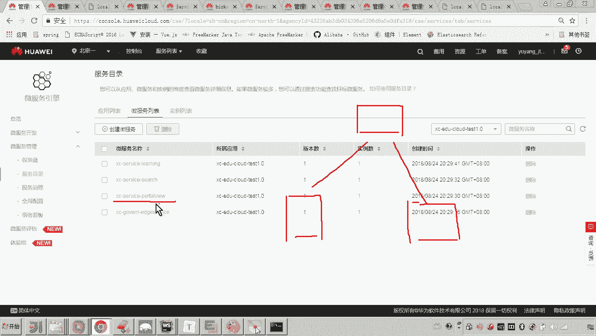

现在你看到的各位，你看到的是不是一个实例呀，对不对？哎，那这一个实例呢注意看啊，注意看，那你找到这个port头 view。😊，注意找到这个port头 view。那么这个这个port view这个里头呀。

一会儿我会去访问它的接口。😡，那么我们访问这些接口的时候。😊，呃，我会加一个日志。😊，哎，我来这里边呢我就加了个日志。😊，啊，那么这应该是我早期加的啊，那加完了这个日志，一会儿我去访问的时候。

他只要一打日志，说明我们是不是就访问这个方法了。对，现在我再启动一个实例。😊，那咋启动时间，本机跑俩时力，这个端口不能冲突。所以这里面我给它改一下啊，改个改个端口名，然后我再启动。😊，看好啊。😊。

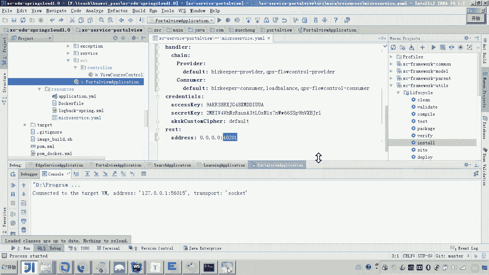

注意看。啊，我们得把这个环境给它造好啊，一会儿我们要大量测试很多的这个。😊，呃，微服务治理的策略。所以这个环境呢我们先把它给造好。好，那现在这个就起起来了吧。好了，嗯，那到这儿各位哎，我们再回过来啊。

回到这个刷新这儿，这四个微服务吧，对，四个，有说老师刚才你不是启动了一个实例啊，你这么怎么还是4个，你注意啊，这个是微服务实例这一列，你看这个portal view这儿是不是显示了两个实例啊。😊。

没错吧，所以这些都正常了啊。呃，然后呢你再看仪表盘，哎，不用不是看仪表盘啊，看微夫治理这儿注意。😊，你看这个小项目是不是就出来了，这是我们测试的项目。这几个微服务各位，你告诉我是不是都是。😡。

本地的服务呀嗯。😊，啊，那你点进去，我们简单看一下，哎，你看这些服务现在是不是都有关系了呀，看见了吗？哎，刚开始应该他俩他们是没有关系的啊。因为我我刚才是不是测试接口让他们互相调用。

然后这个云平台它是不是就可以查可以识别到这个服务之间有调用关系啊。对，你看好了，那这个就是我们的这个测试环境呢，我就搭建好了。嗯，好。😊。

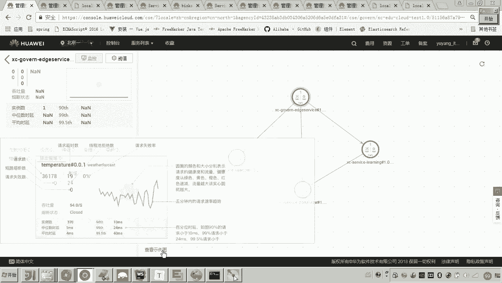