# 华为云PaaS微服务治理技术：P132：10-微服务治理-负载均衡策略-搭建测试环境 🛠️

在本节课中，我们将学习如何为微服务负载均衡策略的测试搭建一个独立的本地环境。通过修改服务名称并启动多个服务实例，我们将创建一个与线上环境隔离的测试项目，以便后续进行负载均衡等治理策略的验证。

## 概述

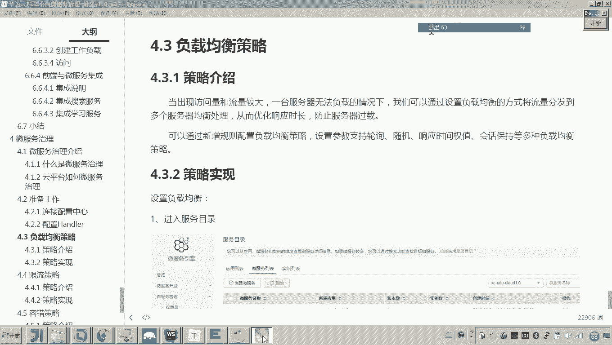

负载均衡策略用于在服务访问流量过大时，将请求分发到多个服务实例上，以提高系统的处理能力和响应效率。在讲解具体的负载均衡实现之前，首先需要准备一个合适的测试环境。

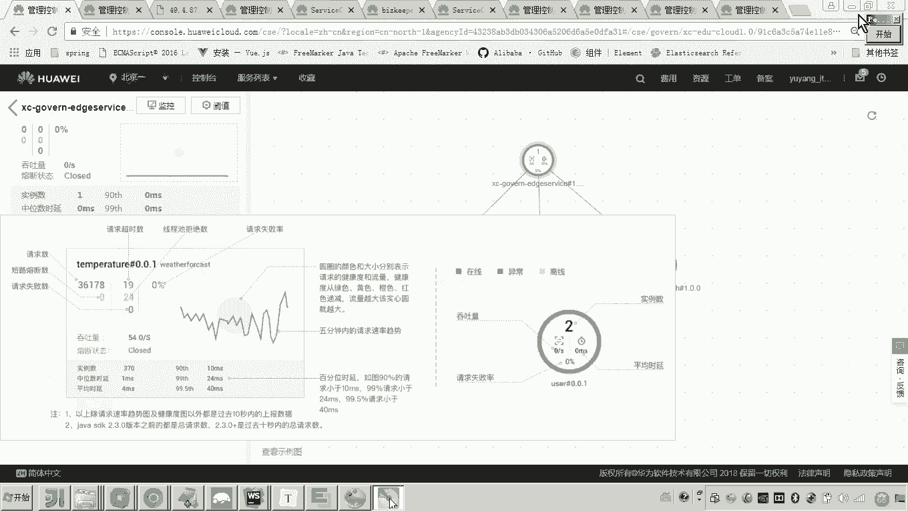

## 负载均衡的应用场景

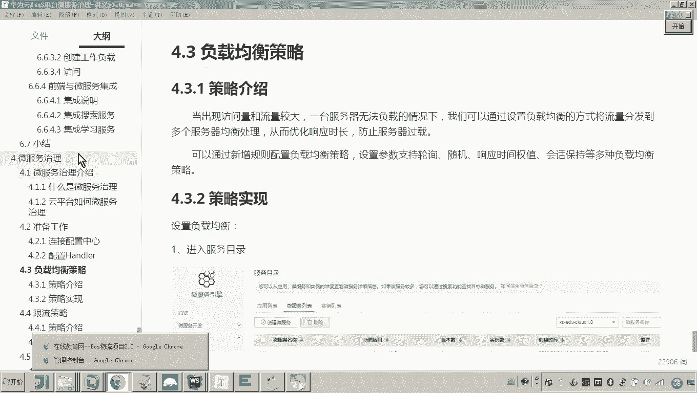

当消费方（例如服务A）访问提供方（例如服务B）的流量过大，导致单个B服务实例无法承受时，就需要引入负载均衡。此时，我们可以部署多个B服务实例。消费方A需要通过配置负载均衡策略，来决定如何将请求分发到这两个B实例上，从而解决服务器过载问题，缩短响应时间，提高效率。

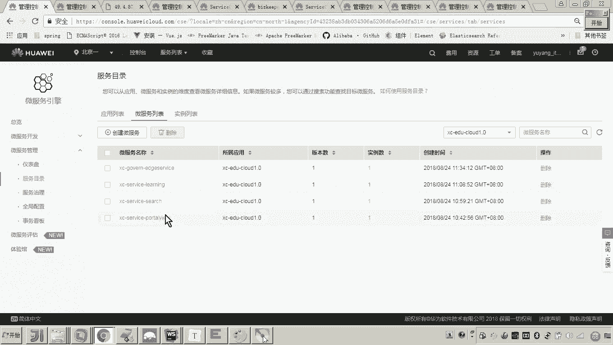

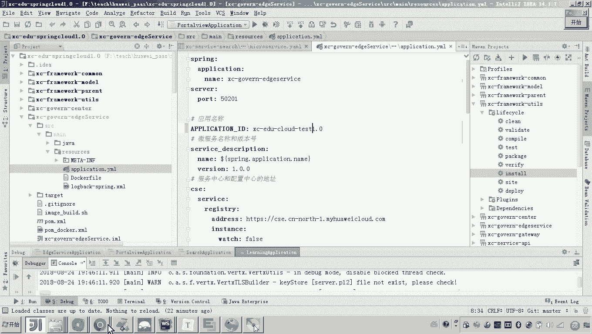

## 搭建独立测试环境

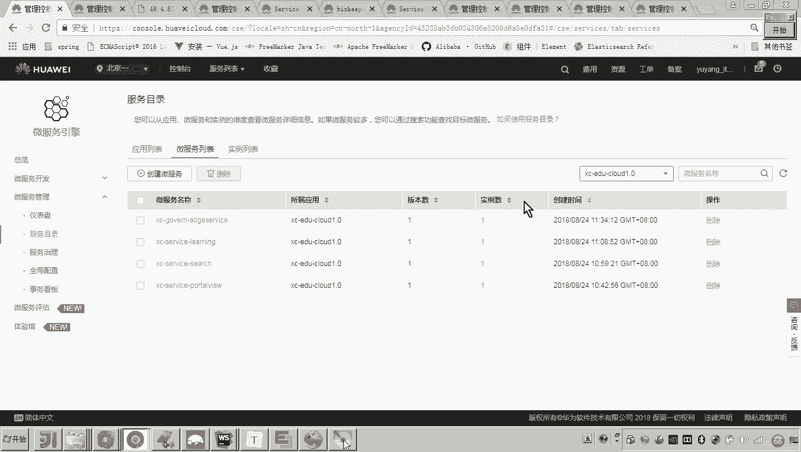

上一节我们介绍了负载均衡的基本概念，本节中我们来看看如何搭建一个独立的测试环境。为了避免与云平台（华为云CSE）上已有的运行服务互相干扰，我们需要创建一个全新的测试项目。

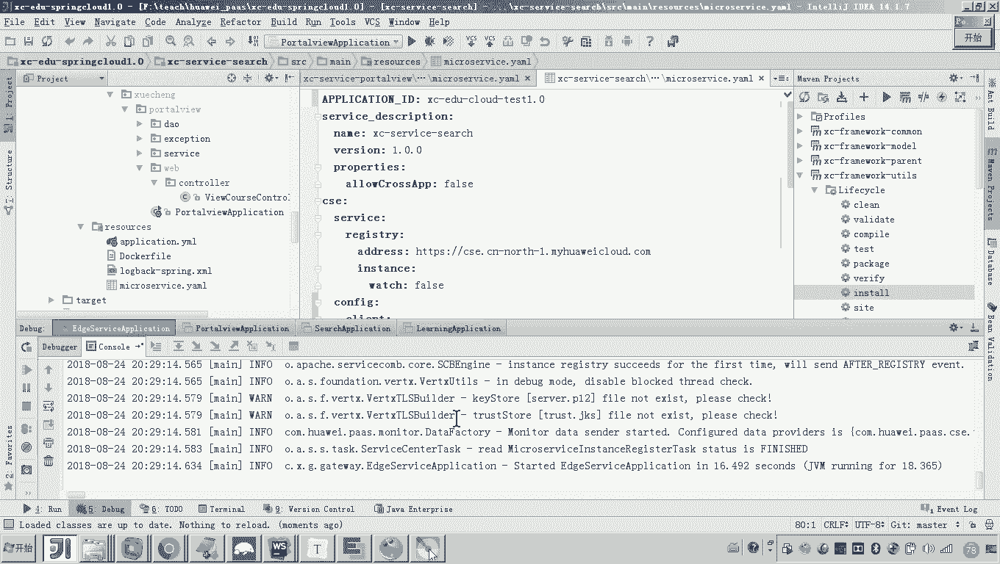

具体做法是修改本地微服务项目的应用名称。在我们的“微学生在线”案例中，涉及网关、学习服务等。我们将所有服务的项目名称进行修改，例如在配置文件中将应用名统一加上“test”后缀。

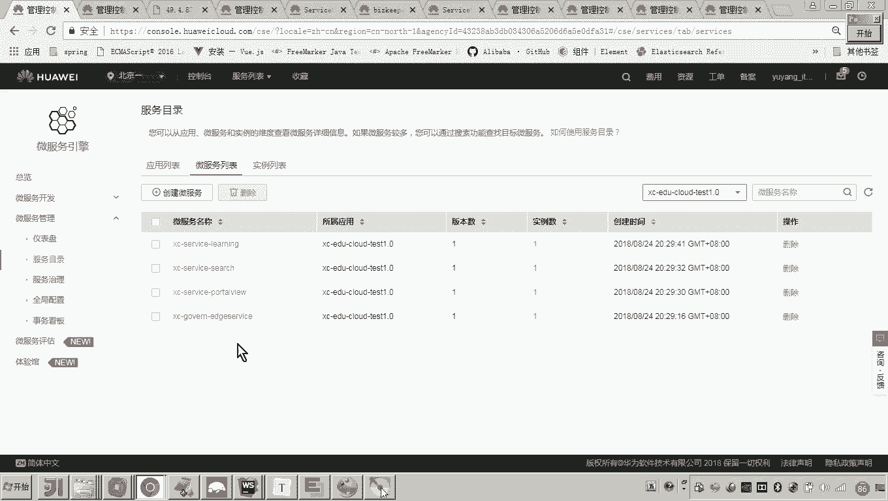

修改完成后，依次启动本地的网关、`port view`等服务。服务启动后，会自动注册到华为云CSE的服务注册中心。

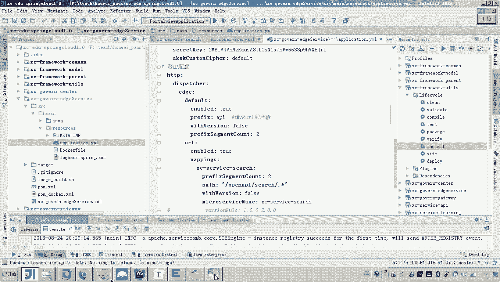

## 验证服务注册与调用

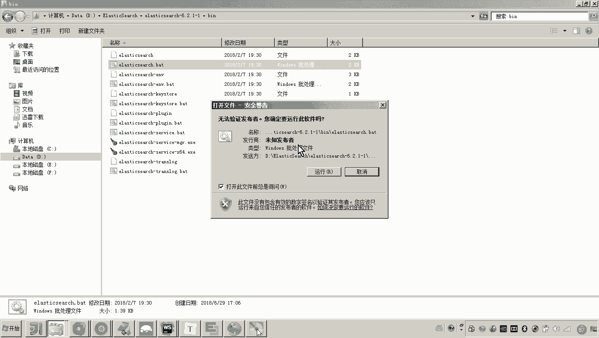

以下是验证步骤：

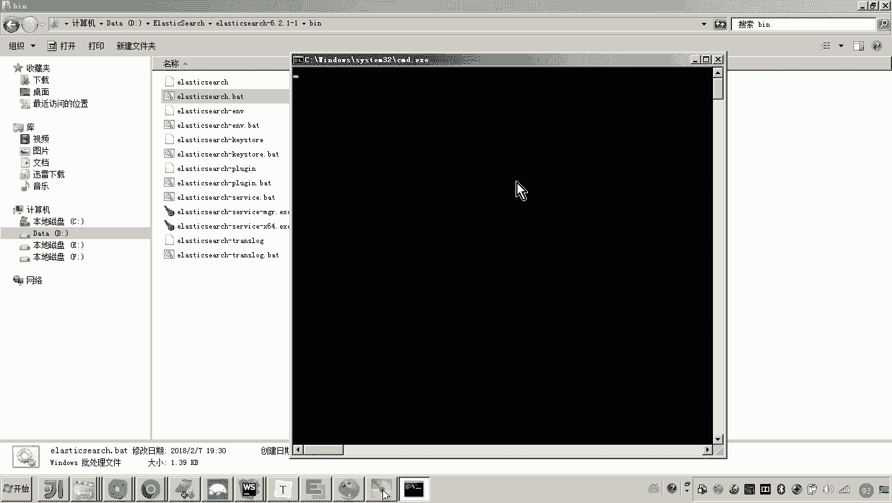

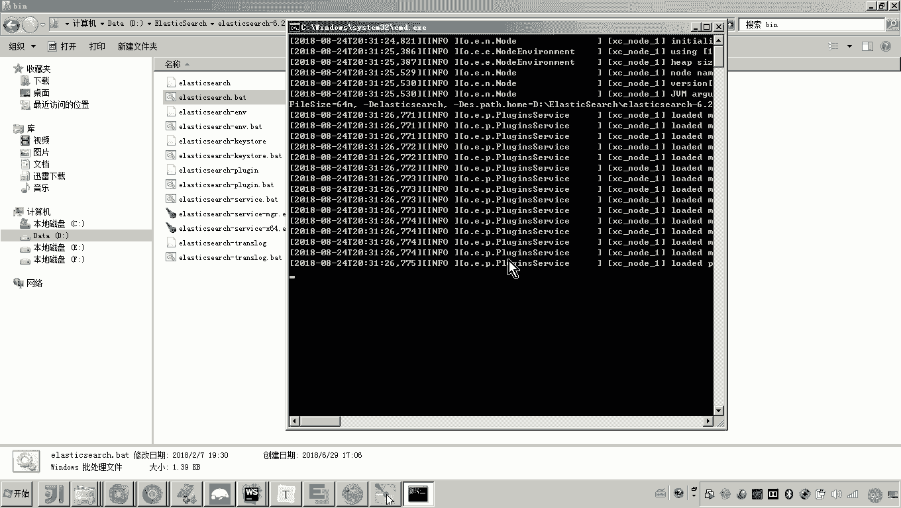

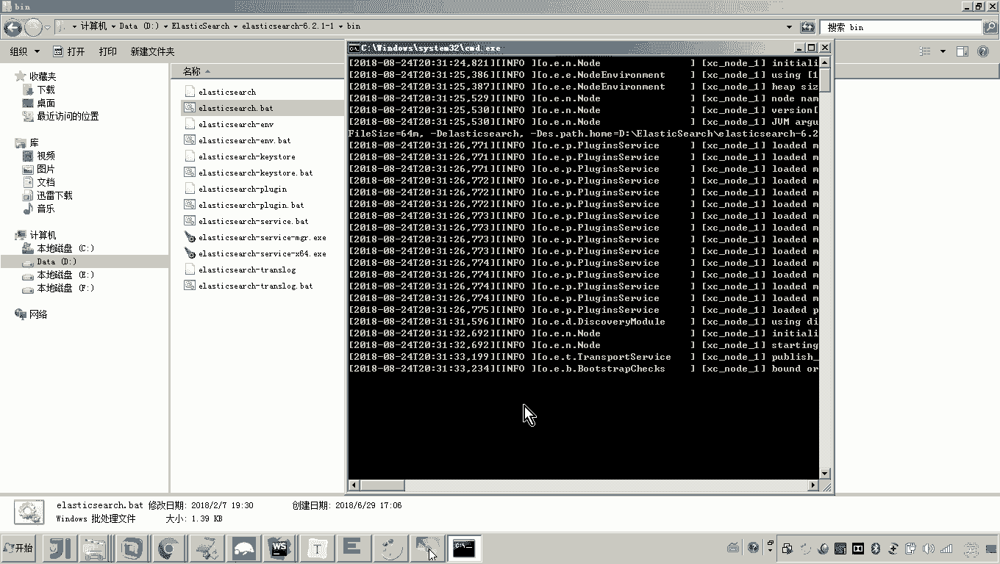

1.  **观察服务目录**：在华为云CSE控制台的服务目录中刷新，可以看到多出了一个以“test”命名的项目，下面包含了我们本地启动的微服务实例。这表明本地服务已成功注册到云平台，且与线上服务分离。
2.  **测试服务调用**：通过网关访问本地服务。例如，使用网关地址（如 `http://localhost:50201`）配合API路径（如 `/api/portview/...`）来调用 `port view` 服务的接口。确保Elasticsearch等依赖服务在本机正常运行，使所有接口调用成功。
3.  **确认调用关系**：在云平台的微服务治理页面，进入我们的测试项目，可以看到服务之间的调用链路图。这是因为我们通过网关调用了其他服务，云平台能够自动识别并展示这些调用依赖关系。

## 准备多实例用于负载均衡测试

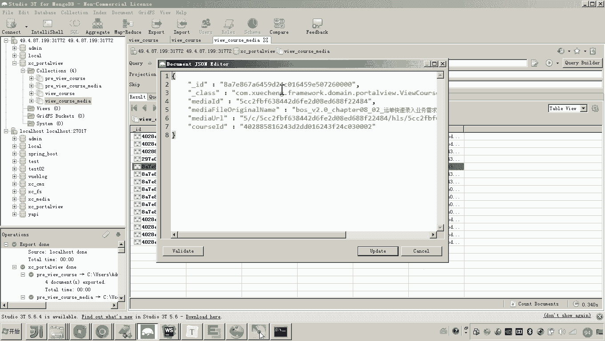

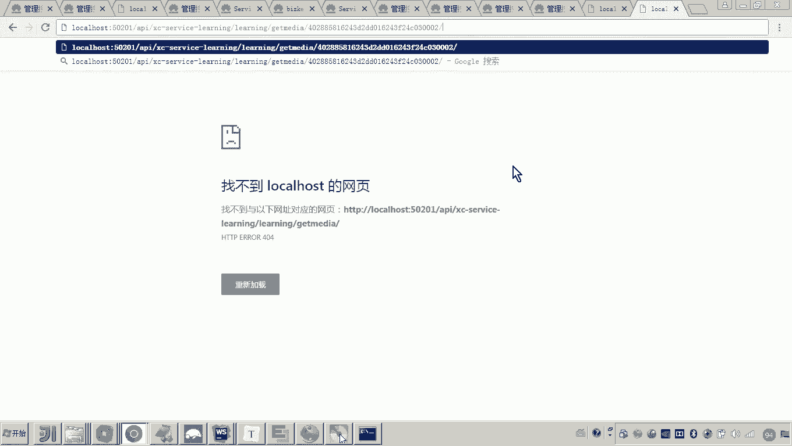

为了测试负载均衡策略，我们需要一个服务存在多个实例。接下来，我们将以 `port view` 服务为例，启动它的第二个实例。

由于是在同一台机器上启动，必须避免端口冲突。我们需要修改第二个实例的配置文件，为其指定一个不同的服务器端口（Server Port）。

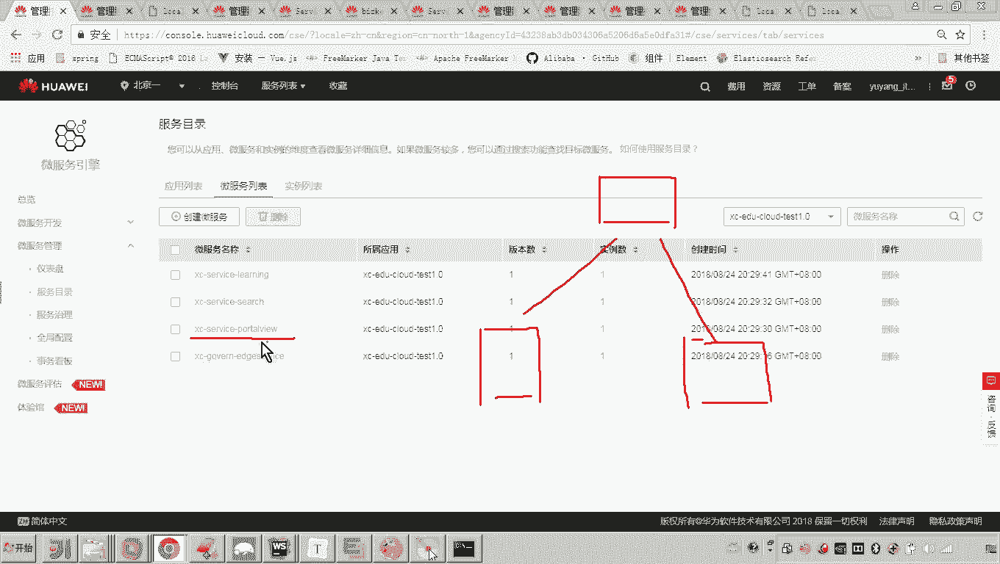

启动第二个实例后，在云平台服务目录中查看 `port view` 服务，确认其实例数变为2。同时，为了在测试时能清晰区分请求被哪个实例处理，我们可以在 `port view` 服务的接口代码中添加日志打印逻辑。

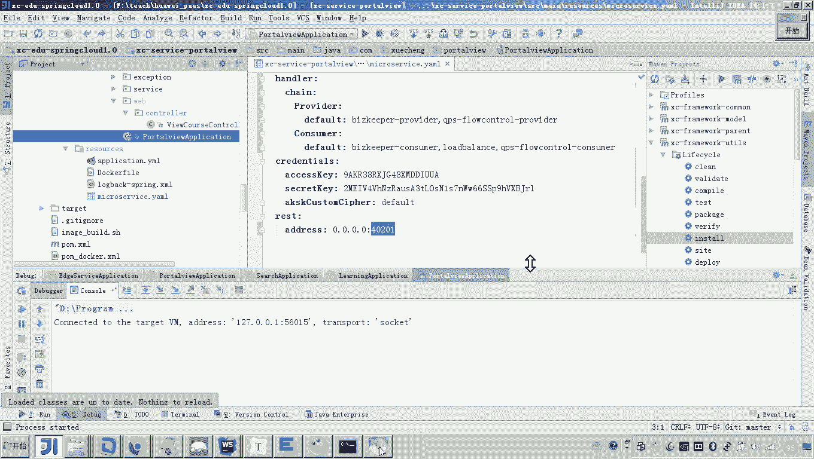

至此，一个包含多实例服务的独立测试环境就搭建完毕了。

## 总结

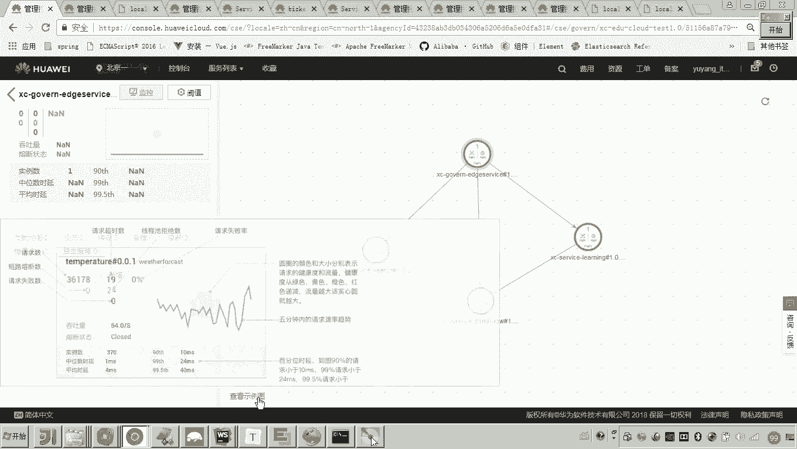

本节课中我们一起学习了为微服务负载均衡测试搭建环境的方法。我们首先修改了本地服务的应用名称，创建了独立的测试项目并成功注册到云平台。然后，我们启动了 `port view` 服务的两个实例，为后续验证负载均衡策略如何在不同实例间分配请求做好了准备。在接下来的课程中，我们将基于此环境配置和测试具体的负载均衡策略。