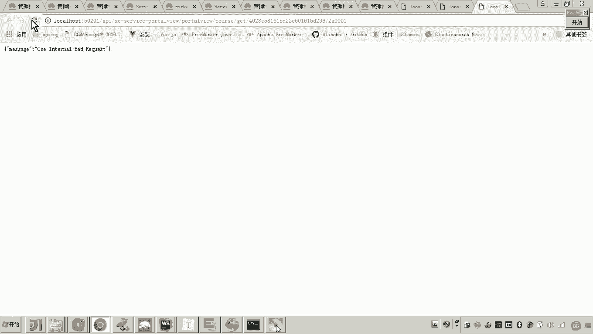
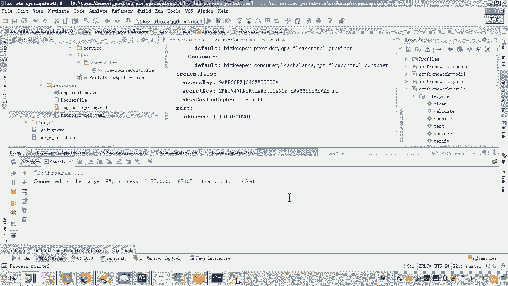
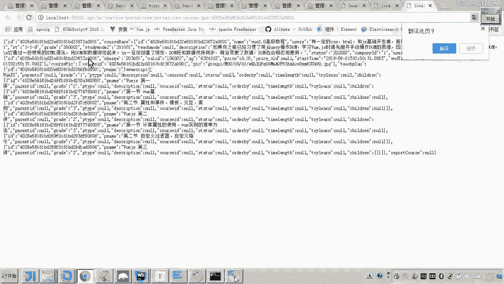
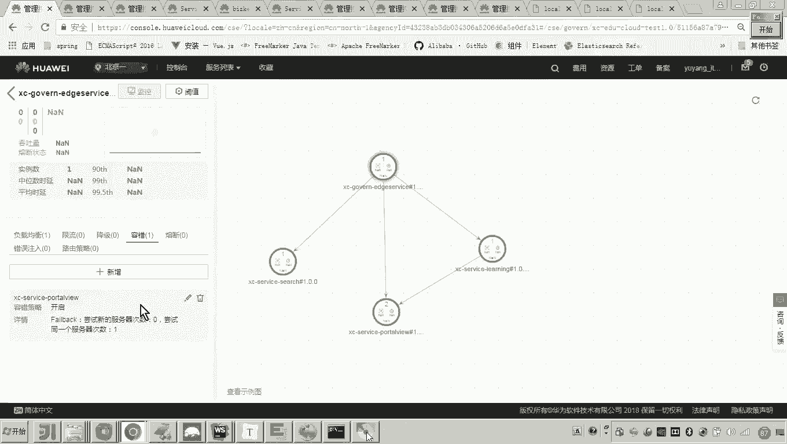
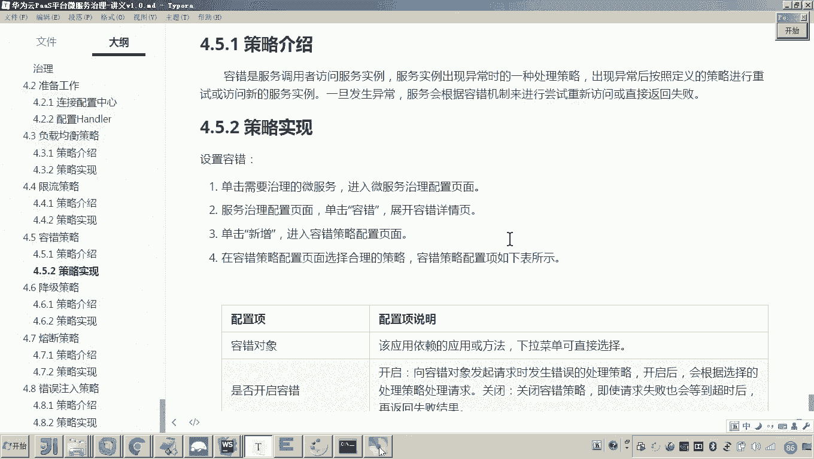

# 华为云PaaS微服务治理技术 - P134：12-微服务治理-容错策略 - 开源之家 - BV1wm4y1M7m5

好，那接下来呢我们来学习另外一种策略，叫容错策略。这个容错策略是什么意思呢？我们先来介绍一下啊啊，容错是服务调用者访问服务实力，服务实力出现异常的一种处理策略。什么意思呀？

服务调用者是不是就是服务消费方呀？比如说这里边我有一个A服务哎，这个A服务呢，他准备来请求这个怎么呀B服务好了。😊，那我们问题来了，当A请求B的时候呢，这个时候啊B呢啊B这个服务呢已经死掉了。

这时候我问你这个请求是不是就请求不了了？😊，那这时候A请求不了之后，A它的处理策略是什么呢？哎，这个就是容错的策略。懂我意思吧？那你说老师A请求不到了，是不是就。😊，那肯定返回失败了嘛，那当然也不是吧。

也就是说这个B呢可能它还有什么呀？它是不是还有另外一个节点呀？那A的策略是不是就应该去尝试再去请求另外一个这个同一个这个这个B服务的另外一个实例，懂我意思吗？😡，这是不是就是他的一个一种策略呀？对。

那有如说老师这个A就这么傻嘛，他怎么就他他不知道这个B有多个实力啊，他不知道需要你去设置A的什么容错策略。A不光他可以尝试去请求其他的实力。那A呢，我也可以设置它，当请求一次请求不到的之后。

A呢就直接返回失败了。就是我我不再去尝试请求其他实力了。😊，所以大家来看这个容错，就是当服务消费者哎去请求服务实力的时候呢，发现出现了异常他的处理策略。

那具体有哪些策略呢？这里面其实列了以下四种。嗯啊，其实主要是围绕着就是说我调用你调用不通了，我是否尝试链接，还是直接返回失败。哎，然后比如说你像第一种说在不同的服务器上尝试链接。哎，第二种哎。

我不再尝试链接了啊，那我就直接返回失败结果吧。第三种是在同一服务器上尝试链接。第四种是同一服务器上尝试链接的次数。😊。

啊。就是我可以尝试重试一次，哎，这0到9的整数你自己填。😊。

好，那我们现在来测试一下吧。😊，那怎么测试呢？

嗯，其实这个。这个治理的这个策略呢，其实问题就是其实他的操作好简单，但是就是这个场景要去造这个场景呢，不太好照。大家可以看到啊，现在来看呃，现在我们看到。😊。

这。😊，这应该是5个服务实例，是不是都启中的？对，那现在呢各位我们来看啊，现在这个。😊，嗯，这是什么呀？这是不是就是网关请求p头 view啊？😊，网关请求破头右，大家可以看看是不是正常的。😊，对吧呃。

那网关请求portal view是正常的那我们来看一下啊，各位你也看到了他是不是请求的这个post头 view啊。😮，好了，我我准备把它当掉。😡，我是不是把它当掉了？好了，那现在我把它当掉了之后。

你再来请求试试。😡，你看。是不是就不通了，看见了吗？不通了。你看我现在刷新几次，它是不是也不同。对，这就是A的，就是请求方的一种表现形式。就是说他不知道尝试，他不知道从事从事其他的实力。😡。

那怎么去解决这个事儿呢？看好，我点击我点击什么呢？我点击这个网关，然后再容错这里新增。😡。

我针对portto view的请求，我开启容错策略。😡，刚才我们是不是介绍了四个策略？对，其中这个fell back是啥意思？是不是要在同一服务器去尝试其他实例的请求啊，那我确定。😡。

你注意我此时是不是就把这个容错的策略是不是就启动了，是不是就开启了？😡，那现在各位我觉得现在我们就可以尝试了。我如果此时再刷新，他就应该去尝试连接其他的实力了。😊。

啊，你再你再刷一下，比如那那那个什么那个那个策略呢，他还没有下发到这个这个什么这个微服。嗯。😊，再来。

这这这个这个策略是不管用了是吧，咋回事？😊，我现在点的是这个网关吧，然后这个策略我看一下啊。😊。

port头 view。我现在是请求这个接口，是请求pview吗？没错啊。😊。

对不对？哎，他应该去请求他的才才对是吧？哎，注意啊呃，注意这里边我就说这个测试场景看好啊，看好我我把它都关掉啊，注意我们再来还原这个测试。😊。

注意听。因为我我跟你说，这个测试它不是一帆风顺的啊，也就是说。这个测试场景如果照的不对，他就不对。看好，我现在我是现在把这个容错的这个什么策略是不是就删掉了吧？我现在在重造这个场景，注意看啊。😊。

呃，现在我是两个portto view实力，大家看没问题吧。😊，好了，呃，我我现在我要在本机启中两个实例注意看啊，左边的这个我准备用这个40200端口。😊，可以吧？好，我起起来。

看好啊，你一定要保证他都能提供服务。否则呢，你这个测试可能就因为你你因为你这个测试场景大的不对，导致你这个策略测的不对。好，现在是不是起起来了，对吧？嗯，然后起起来之后注意看啊，注意看呃。

这个port view我准备改端口了。😊，对吧好，起起来。

看好啊。哎，现在是不是两个都齐起来了？对，现在你来访问。😊，访问这个。

是不是有了？😊，各位，现在数据是不是可以正常查？😡，对不对？哎，并且这个数据你看在这不是打日志了吧？😡，对吧你看好啊，我给他停了。😡，我停了之后，你再来访问。😡，哎，有人说老师怎么再来访问还可以。

你注意听我要造这个场景啊就不太好照，怎么造啊。看好，我们我们之前是不是学了一个负载均衡啊，你注意听啊，看好，我在这儿，我把这个负载均衡设置成这个绘画年制。😡。

我年制是啥意思呀？我年制的话就是说这个。调用服务方，他是不是会只要请求某一个实力，他是不是会一直请求绘画是不是已经年制了？😡。

那那有说老师你绘画年制的目的是啥？😡，看好嗯，我现在就告诉你我的目的啊，你把它改成零，再来启动。

看好。我现在是不是起来了吧？😊，对吧。😡，好。注意看。好，你再回来刷新啊，走，先在是正常吧，正常，你看打的日志在哪里打的。😡。

是不是在这儿打的，对不对？好，现在我要把它干掉。😡，干掉了吧，注意看啊，我要刷新了。😡。

错了，你看是不是不行。对不对？你看是不是还不通，你狂刷也没事，他也不通。因为它的负载纠营策略，他已经他已经定到那绘画年制了嘛。😡，那怎么办呢？看好看好。😡。

我为了防止因为绘画粘制而导致这个容错的这个问题。啊，我加一个容错的机制。我怎么加我加一个从事其他的实例，我是不是加上了，刚才你也看到了，我狂刷，是不是他都报错，因为他的绘画已经粘制到这个实力了。

这个实力是不是已经挂了。而现在一旦我设置的容错，你再刷新。😡。

各位就通了。看懂这个意思了吧？就是因为容错机制导致哎他就可以从事其他的实力。😡。

对，所以在实际的开发当中，对这些负载这个这个这些什么呀？这些微服务治理的策略呢？哎，我们说你不管负载均衡限流，其他的怎么设置。对于容错。对我都建议你通常都建议你肯定是要尝试连接其他实例的。😊。

懂我的意思吧？也就是说，因为你的这个微服务是不是会部署很多这个实力啊？哎，你请求一个实力，如果请求不到哎呃，那你就要尝试。所以说这个容错的配置啊，应该说我们用的是最多的。😊。

啊，当然你也可以还有一项配置，这个用的也比较多，就是你也可以设置从事的次数。对，因为你想从事一直从事，那我这个对于我这个什么资源的损耗是有的对，每次请求假如说那边有一个定时任务一直在查。

而这边就一直重事，对不对？那这里边我没必要去浪费资源呀。😡，那我完全可以怎么弄啊，那我完全可以设置从事的次数。😡。

是不是哎，好了呃，那这以上呢就是我们说的这个容错策略的测试。所以大家在测试的时候呢，呃一定要注意呃，把场景呢清零一下，然后呢好好再来去呃根据你的想法呢去先把这个测试场景造出来，然后再去测试这些参数。😊。

好。