# 华为云PaaS微服务治理技术 - P135：13-微服务治理-降级策略 - 开源之家 - BV1wm4y1M7m5

好，那么接下来我们再讲一种策略叫降级策略。啊，什么是降级策略呢？降级是容错的一种特殊形式。就是当服务吞吐量巨大，然后资源不够用了。哎，这里边又提到资源了啊。😡，哎，当资源不够用的情况下。

我们可以使用降级机制关掉一部分重要。哎，关掉一部分不重要的服务，性能较差的服务，避免他占用资源。😊，哎，好像这个资源跟前边我讲的这个限流好像有点类是吧？那我们看一下啊，我们回忆一下这个限流当时咋做的。

说这个限流是为了保证这个呃这个资源。😊。

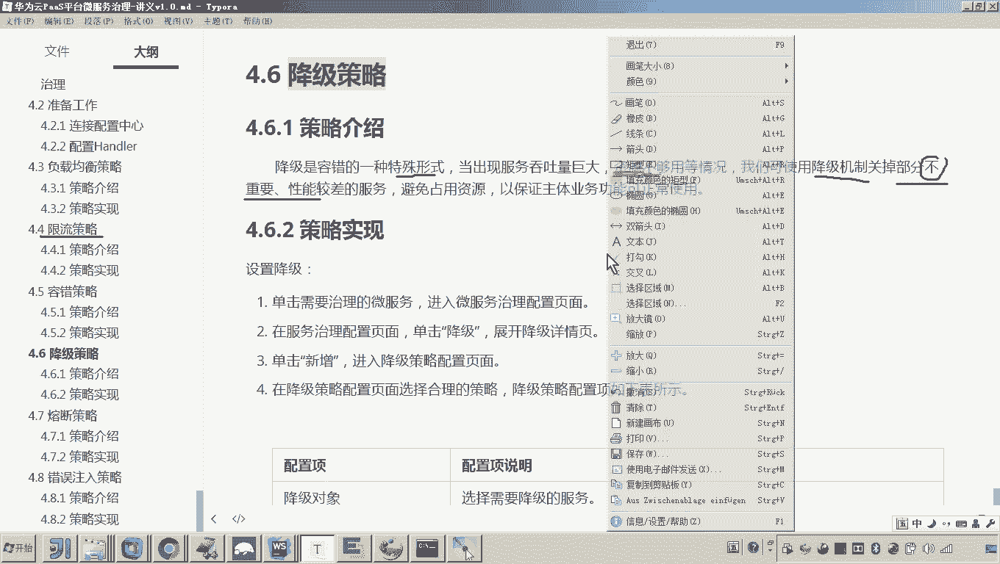

凭这个这个平衡的去分配，对不对？也就是说我这个服务器上跑了很多微服务，是不是？哎，你你不想让某一个服务呢占用过多的资源，哎，给他平衡分配资源，对不对？而现在这个降级呢。😊。

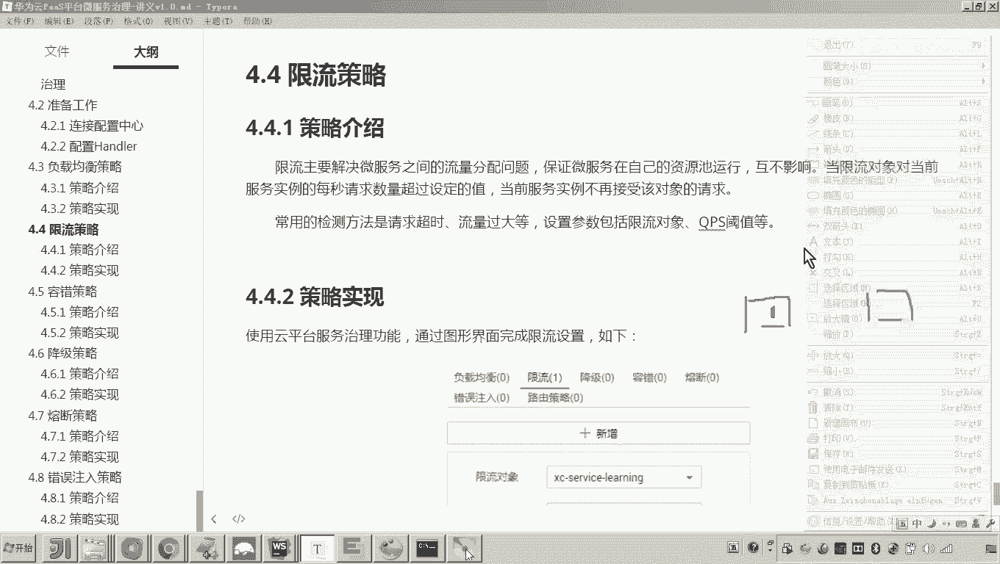

那就不是平衡分配资源了啊，我就是干脆把你关掉得了。😡，那为啥关掉你啊？因为你这个服务有问题哎，并且这个服务当前不是很重要。我举个场景啊，比如说现在双十一。😊，你也知道双十一上来之后，各位呃。

我们说用的最多的应该是什么支付，还有什么订单，创建订单下单是不是啊？好，那么我们说当那个还有很多的微服务啊，比如说有一个用户信息修改的服务。那我问你通常情况下，双十一。

那过来之后呢呃一般来说都是这个用户提前放到购物车，然后呢开始频开始狂下单，是不是啊？也就是下单的服务的，它这个这个并发的这个什么呢，这个吞吐量啊，它非常巨大，对不对？压力很大。

而这个时候我完全可以把那些什么呀？比如说修改密码呀？嗯，比如说什么嗯这个这个一些无关紧要的，比如说这个什么用户信息的这个这个查询那或者什么缓存呢？就这些无关紧要的服务啊，我都可以把它干嘛呀？对降级。😊。

有说降级还不简单吗，你就把它关掉就可以了。不是，因为我关掉，意味着我回头还得启动，我怎么弄啊，我这么弄。😡，注意看啊，我这么弄，就这服务还都在运行。😡，假如这还是A。然后现在呢，这个A是不是要请求B嗯。

还要请求什么，还要请求C。😊，啊，A就是我们的网关了啊，网关要请求很多服务是吧？而现在我们说呃当前我要保证B服务的能力。而这个C目前来说是性能差或不重要的。我为了避免C占用资源，我就准备干嘛呀？

对我准备降级。针对C针对A去请求C的时候呢，我要让C降级。😡，有人说什么叫降级啊？那干脆我就关掉A这个C对外提供服务。A当去请求C的时候呢，那他已经请求不到了。😡。

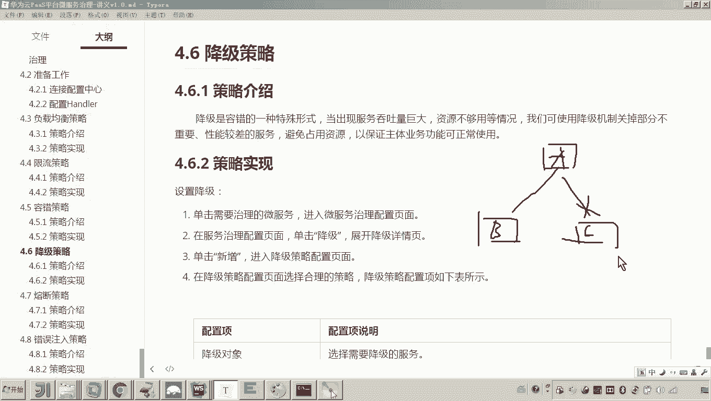

也就是彻底给你关掉了。😡，那这怎么做到的呢？看好这个服务。目前大家来看现在是不是都还运行了。😊。

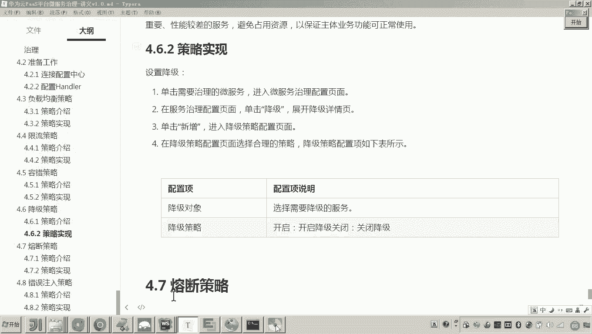

并且各位我这个接口，咱看它是不是还是正常刷新，对吧？而现在哎我说这个portal view这个服务呢，对无关紧要了。我想对它进行降级，那怎么降级呢？😊。

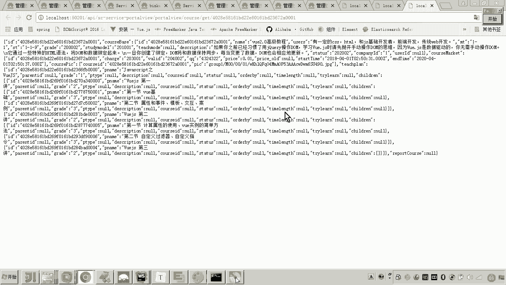

对，怎么降级的？我们点击降级，然后点击新增，然后怎么弄啊？选择portle view。对，针对portal view的所有方法，还是某一个方法，你不准备哎不准备这个让他提供服务了，那怎么办？

那我比如说我就针备所有方法了啊，开启。这个时候就是当哎当网关去请求portal view。那这个时候那么。😡，port头 view的所有方法。都请求不到了。你说啥意思啊？那你可以试一下。

比如说现在网关请求port6，那我们刷新。😡。

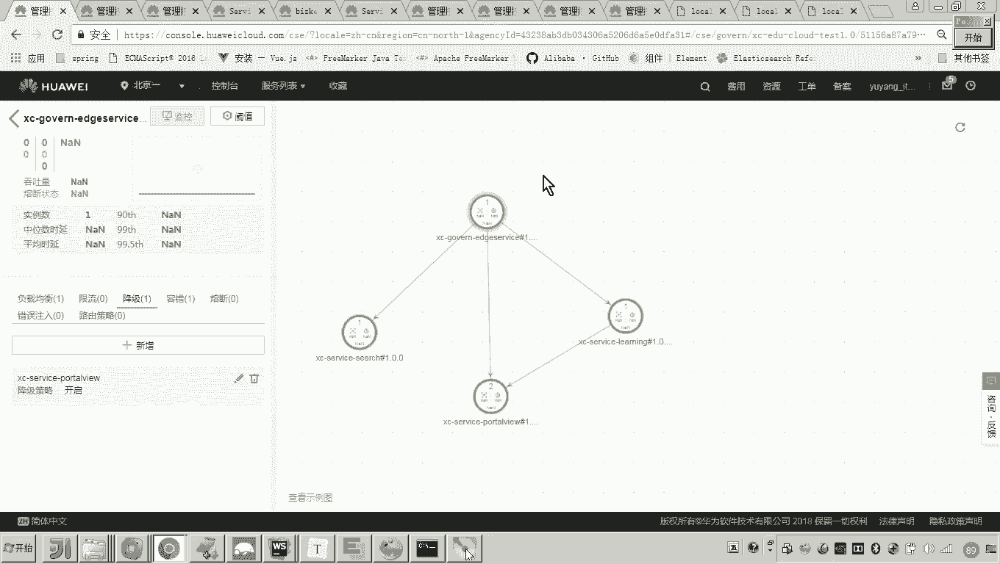

各位是不是就没有了？对。那就说老师这个没有了，那你其他的还有吗？你比如说这个他还有吗？他还有啊。😡，为啥？因为我刚才设计的就是说什么呀？是网关去请都portto view。

我这个降级的策略是不是在我们这个服务的消费方？😡。

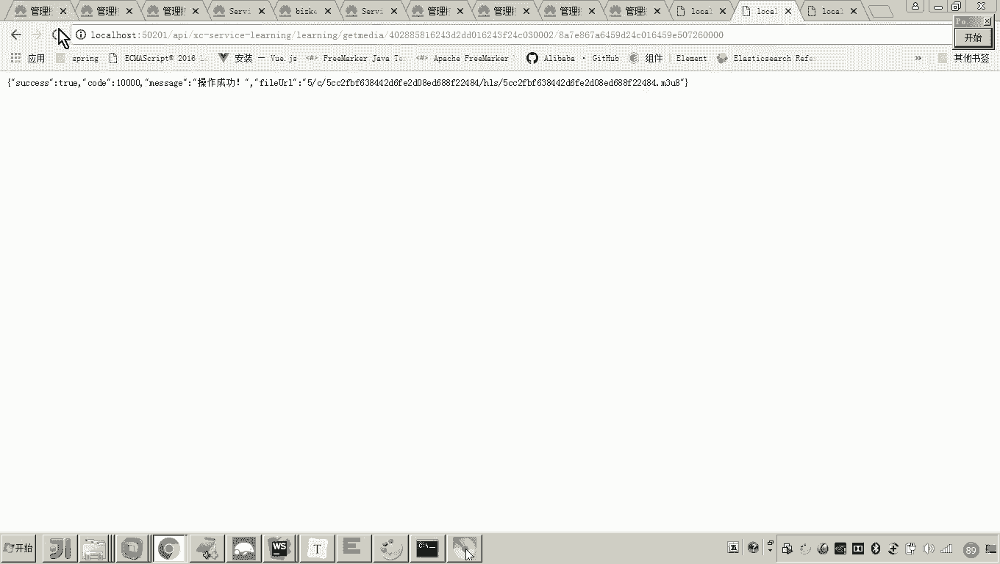

懂我意思吧？对，所以说也就是说。😡，对于网关的请求这一块，这条链路，各位这一条链路现在我不让他通了，而其他的链路正常是不是可以通，就表示我这个portal view，它是不是还是正常的？😡，懂我意思吧？

所以现在这个降级的策略还是在这个服务的消费方来设置。所以你会发现这个链路已经被降级了。但是你看其他的。😊。

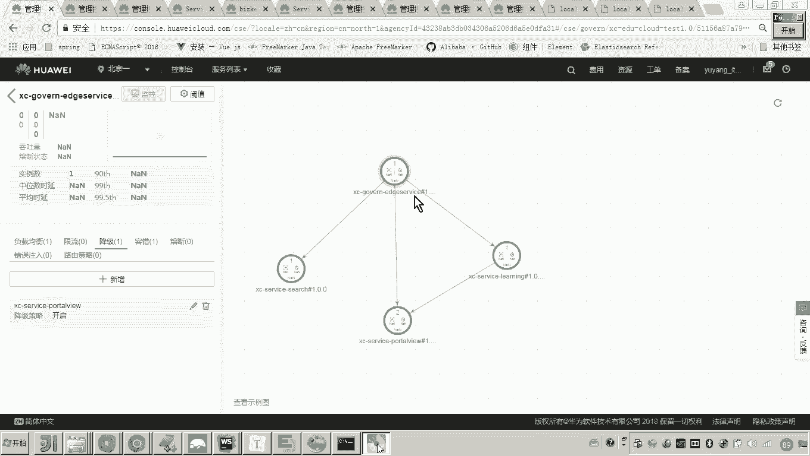

还都正常。看懂了吗？哎，所以这就是我们说的什么降级啊，这个降级策略设计起来就比较呃简单啊，怎么怎么个意思，也就是说你可以设置啊，针对它的某一个什么方法。哎。

比如说我现在我我就针对这个什么针对这个哎fin by ID的方法，哎，我不准备让他这个调用了，那你就可以选择这个方法，你要是针对所有方法，你就选择所有方法。对，如果所有方法的话。

你就整个整个这个链路已经应该都不通了。如果你是针对某一个方法，哎，某一个方法。那这里边呢这个链路还通啊，只是说调用这个方法不通。😊。

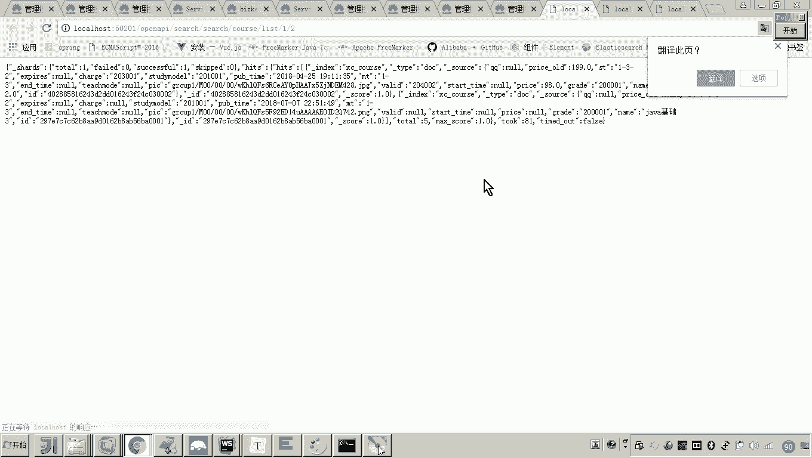

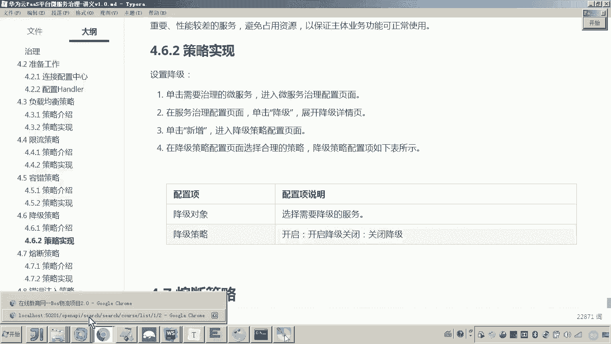

懂我意思吧？好，那这个就是我们说的降级策略。好，那这个降级策略呢，通常呢呃就是在我们说的嗯特殊的这个场景下啊，为了保障我们系统的资源，把一些暂时不用的这些呃这个接口呢，我们把它暂时关掉。嗯，好。😊。

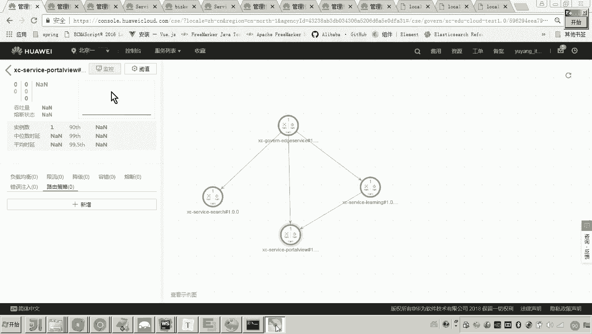

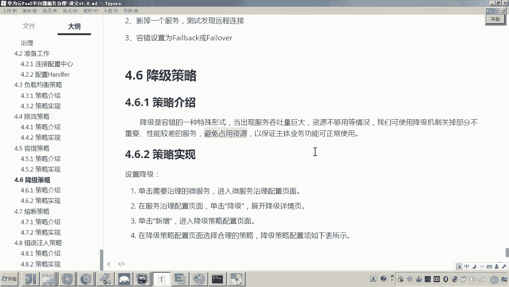