# 华为云PaaS微服务治理技术：P135：13-微服务治理-降级策略 🛡️

在本节课中，我们将要学习微服务治理中的降级策略。降级是一种重要的容错机制，用于在系统资源紧张时，通过暂时关闭非核心服务来保障核心业务的稳定运行。

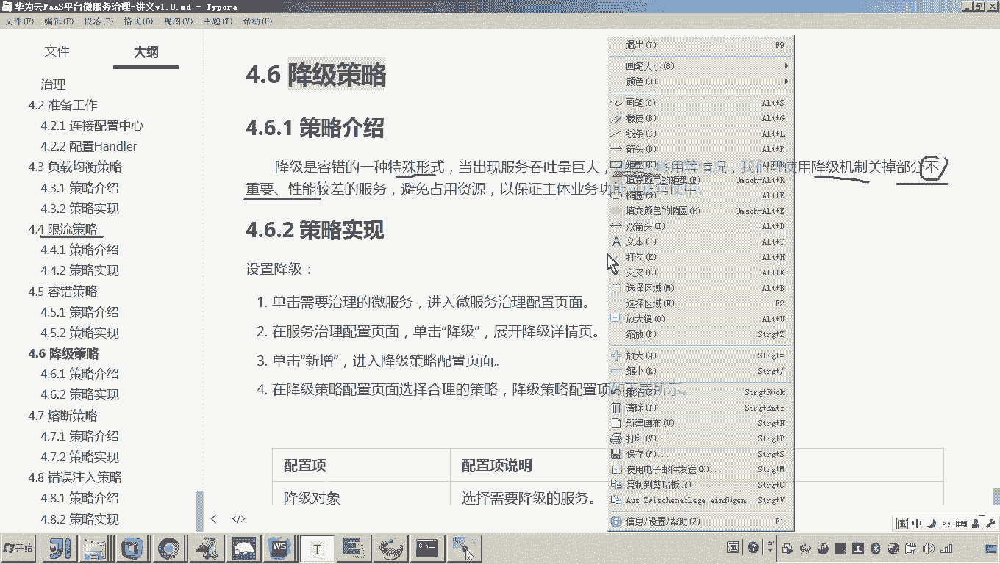

## 概述

降级策略是容错的一种特殊形式。当服务吞吐量巨大，导致系统资源不足时，我们可以使用降级机制来关闭一部分不重要的、性能较差的服务，从而避免它们占用宝贵的系统资源。

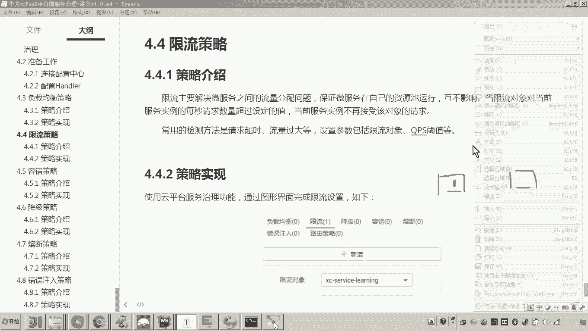

上一节我们介绍了限流策略，它旨在平衡地分配资源。本节中我们来看看降级策略，它与限流不同，其核心思想是在必要时直接“关掉”某些服务。

## 降级策略的应用场景

为了更好地理解降级，我们可以设想一个具体的场景：例如在“双十一”购物节期间，系统的核心压力集中在支付、创建订单等关键服务上。此时，像“修改用户密码”、“查询用户信息”这类非核心服务的并发请求相对较少，但其运行仍会占用系统资源（如CPU、内存、线程池）。

为了确保核心服务（如下单、支付）的稳定和高可用，我们可以选择将这些非核心服务进行降级处理。

## 降级的工作原理

降级并非简单地停止服务进程。其核心原理是在服务的**消费方**（例如API网关或调用者）进行配置，切断对特定服务或方法的调用链路，而服务提供方本身可能仍在正常运行。

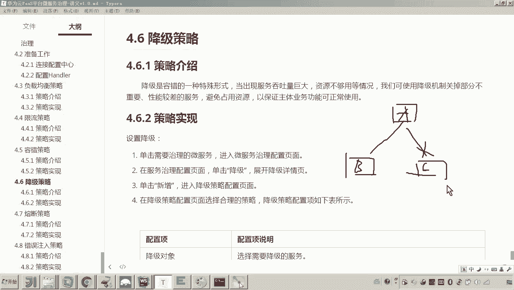

假设我们有服务A（网关）、服务B（核心订单服务）和服务C（非核心用户信息服务）。当决定对服务C进行降级时，我们会在服务A的配置中设置规则：当A尝试调用C时，直接阻断该调用，并可能返回一个预设的降级响应（如错误提示或默认值）。

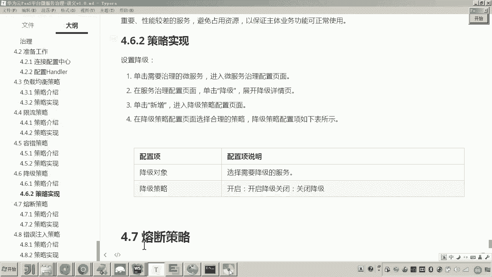

以下是降级策略生效的示意图：

```
服务A (网关) ---(正常调用)---> 服务B (核心服务)
服务A (网关) -x-(调用被阻断)-> 服务C (已降级服务)
```

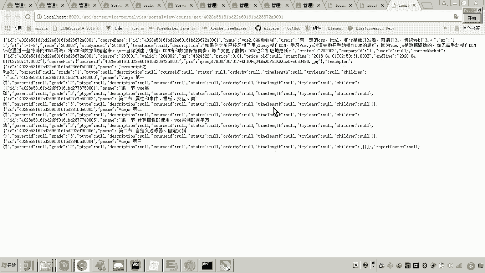

这意味着，服务C本身并未下线，只是对于来自服务A的请求不再响应。其他可能调用服务C的链路（如果存在）则不受影响。

## 如何在华为云PaaS平台配置降级

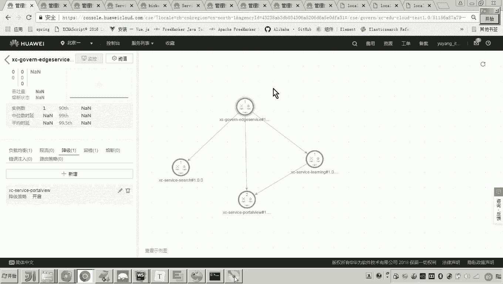

在华为云微服务治理平台中，配置降级策略是一个直观的过程。以下是配置步骤：

1.  在治理控制台找到需要设置降级的服务（消费方）。
2.  进入“降级”管理页面，点击“新增”规则。
3.  选择目标服务（提供方）以及需要降级的具体方法。您可以选择针对该服务的**所有方法**，也可以仅选择**某一个特定方法**。
4.  启用该降级规则。

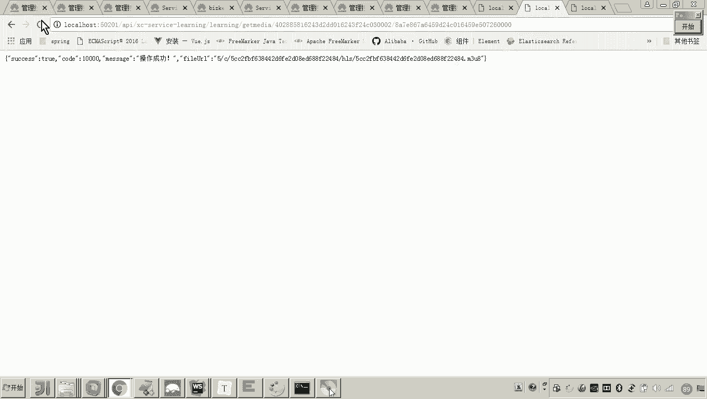

配置完成后，当消费方调用已被降级的服务或方法时，调用将失败，从而释放出该调用链路上所占用的资源，保障其他核心链路的畅通。

## 降级与限流的区别

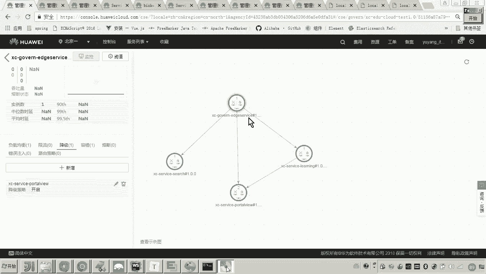

理解降级与限流的区别有助于在正确场景下应用正确的策略：

*   **限流**：目标是**平衡**资源分配，防止单一服务过度消耗资源。它通过限制单位时间内的请求数量来实现，被限流的请求可能会被延迟处理或拒绝。
*   **降级**：目标是**牺牲**非核心功能，**保全**核心功能。它直接关闭或简化对非关键服务的访问，是一种更主动的资源释放手段。

简单来说，限流是“大家都少用点”，而降级是“不重要的先别用了”。

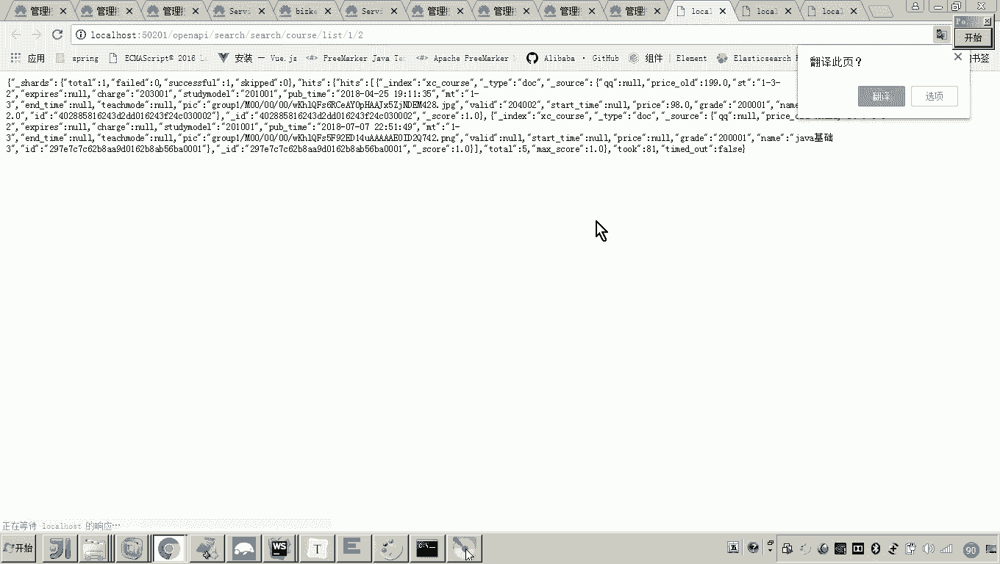

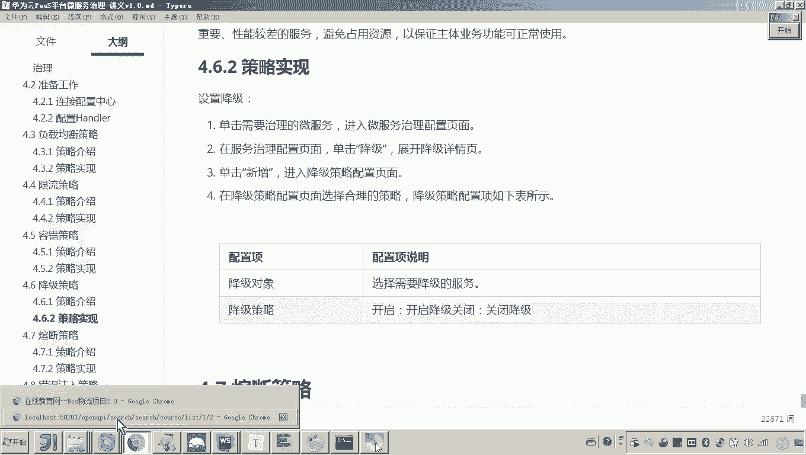

## 总结

本节课中我们一起学习了微服务治理中的降级策略。降级是一种在系统资源不足时，通过主动关闭非核心服务来确保核心业务可用的容错机制。它的配置通常在服务消费方进行，可以针对整个服务或单个方法生效。与旨在平衡资源的限流不同，降级策略的核心思想是“弃卒保帅”，在极端场景下保障系统的整体稳定。

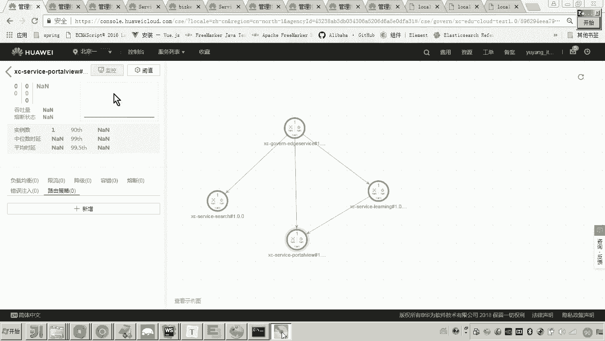

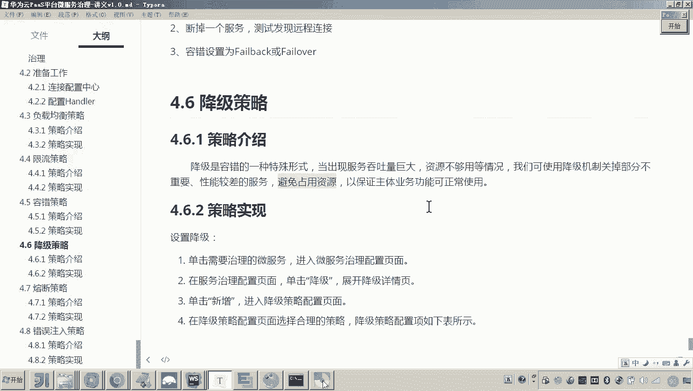

通过合理运用降级策略，我们可以在流量高峰或部分服务异常时，有效保护系统核心链路，提升微服务架构的韧性。