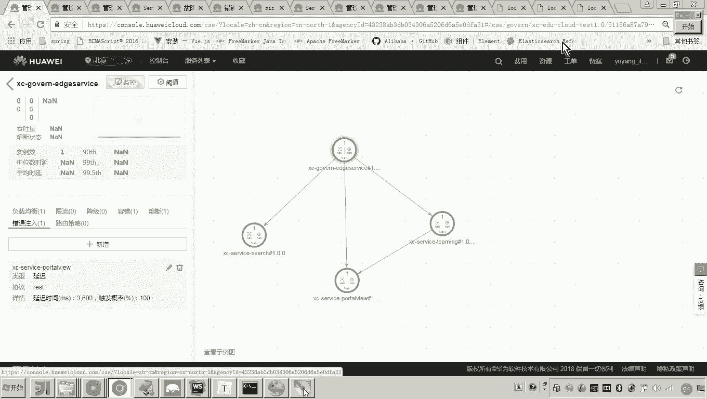
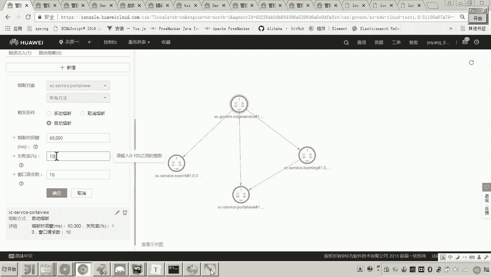

# 华为云PaaS微服务治理技术 - P136：14-微服务治理-熔断策略和错误注入 - 开源之家 - BV1wm4y1M7m5

好，那么接下来呢我们再介绍一种服务治理的策略啊，就是熔断。那什么是熔断呢？我们来解释一下啊。呃，当我们由于某些原因导致服务出现过载现象。为了避免整个系统故障，那我们要进行熔断保护。呃，什么意思呢？

大家来看，比如说这是服务消费方。嗯，现在呢这里边有一个什么有一个B，这里边有C啊，当然还有很多啊还有D。😊，注意。那现在的话我们看到呃这三个应该是比如说在一个服务器啊，A现在来调用B了。那么这个时候呢。

我们发现啊呃不光A来调用B啊，很多的啊很多的服务都来调用B。这个时候B的这个就出现了一个过载现象。😊，那各位你想啊你想这个C也可能来调用B，对不对？但当B出现问题的情况下，当B出现了问题。

那这个时候C是不是也可能会出现问题？😊，对不对？为什么？因为C调用B调用调用调调用不到C可能就在等待B，对吧？那C有问题，是不是可能会影响这个B有问题，可能会影响C。😊。

而如果此时这个D也是调用C的那这个时候C有问题，也可能会影响D。😊，那这样的话就会发现呃，由于一个服务存在了问题。那么可能会导致所有系统都瘫痪了。那这个呃我们把它叫做一种叫做血崩效应，对吧？好了。

那么我们说如何来解决这个血崩效应呢？那我们就可以采用熔断，那怎么采用熔断呢？当A去调用B啊，发现调用异常。这个时候这个熔断的框架就起到作用了。这里边我们讲了一个框架啊。

这个在spring cloud框架当中呢呃也用到了这个high strict这个熔断的框架。那这个熔断的框架它会怎么弄啊？它就会认为这个B这个服务呢是无法提供服务的。

所以啊这个时候A如果调用B发现调用不到。这个时候呢，这个框架熔断的框架呢，就会把这个链路呢给它断掉。而这个链路断掉之后呢，其实我们说这个熔断的框架，它会把这个结果呢直接给A去返回。😊，哎。

这个时候就是熔断框架，它哎所起的作用。但是话又说回来了，如果B啊如果B又活了呢，那这个时候呢对这个时候AA去调用B的这个链路呢，应该再次被打开，也就是恢复A调用B的链路。😊，好。

这就是我们说的这个熔断啊熔断。好了，那现在这个熔断的呃策略我们怎么去实现呢？😊，啊，因为我们还是说现在我们要在这个服务的消费方上，我们来做文章啊。好，那现在我们在服务消费方上看怎么来设置这个熔断啊。

怎么设置。😊。

呃，首先呢我们来看在在哪里啊，在这里。点击点击这个服务消费方。那点击这个网关吧，网关点了之后呢，再熔断这边，我们点新增。好，点击这个port view。😊，好，针对port view的请求呢。

这里边我们设置熔断策略啊，针对所有方法啊，我们我们都要让它这个这里边有是不是有三种触发条件，手动熔断，手动熔断啥意思？只要你确定手动熔断了。好，那就相当于降级了。😊，什么意思呀？也就是说现在呃。

通过网关到portto view的这条链路已经不通了。😡，啊，这就是触发了熔断嘛，手动触发熔断了嘛。那其实这时候你可以刷新。😊。

你看它是不是已经报错了。对，那这个时候熔断框这个错误应该是熔断框架给你返回的，就是已经错了。好了，那现在呢各位呃，我们把它干嘛呀？哎，我们把它修改一下，嗯，修改取消熔断。😊。

那这个熔断如果一旦取消的话，是不是就是这个链路又通啊啊，那链路通的情况下，那你再访问它是不是就又可以了。哎，好了，那现在呢我们说呃那么我们平常用的是什么呀？手动熔断是吗？对，除非紧急情况，哎。

我们手动赶紧把这个链路给它干嘛呢？给它断掉，对不对？但是一般情况下我们都需要用自动熔断啊，什么是自动熔断呢？这个自动熔断，就是我设置一些触发条件。哎，什么样子呢？比如举个例子，哎，比如说呃我请求10次。

😊。

假如说我请求十次，有10%的失败率。😡，啊，说明啥意思啊？只要有一次是不是就开始触发熔断了。但是你触发熔断了之后，呃，你经过多长时间呃，这个这个熔断的框架再去看一看它能否链入呃，这个这个B。

刚才我画了一张图啊，这个这个这个这个。😊，服务提供方是否又可以正常提供服务了呢？那就是这个熔断的时间框。😊。

在我的这个讲义上像呃在这里写的很非常清楚啊，什么意思啊？这个熔断的时间时间窗指的就是熔断的持续时间。就这个呃如果一旦这个链路被切断。那么它将持续多长时间这个时间一过啊。

那这个时候呢熔断的框架呢再去看一看啊，那这个服务提供方是否可以正常的提供服务，如果可以，那这个链路再去啊正常给它打这个合上就可以了。这其实就相当于什么？相当于一个开关是吧？对，原来原来是通的是吧？

那如果一旦熔断了，哎，就把它开关打开。哎，如果现在呢发现哎都可以正常了，那就把开关干嘛呀？合上。好，呃，来我们再回到这个这个界面上来在这个里头啊，在这个里头。😊。

熔断的这个呃时间窗呢呃来看最大是不是0到这是多少呀？哇，挺挺长，这但是这个在这个单位是不是毫秒呀是吧？毫秒啊0到呃5个9。嗯，呃也就是说是99秒，也就是呃那我怎么弄啊，我设置一个。😊，我设置一个多少嘞？

2分钟吧。呃，2分钟我就设置20秒吧，我就设置20秒。呃，我设置20秒的目的。嗯，我想想我再我再大一些，30秒，我设置30秒是什么呢？😊，就是说我现在就是想人为的来造这个熔断，哎，人为的制造这个熔断。

😡，60秒。我说你到底设设置多少，反正我这个时间不能太少，为啥？😊，因为我要人为的把这个熔断呢给它造出来，哎，让它触发熔断。一旦触发熔断了。那么哎当过了60秒之后，这个是不是才能恢复呀？

这是不是就是熔断，我就把它这个功能给测试出来了呀？对。😡，那怎么测试呢？对我我得我得请求10次，其中只要有一次失败就可以了。那怎么做呀？😡。

很简单吧，我们怎么弄啊？😊，我们把这个服务给他当掉不就行了吗？各位，你说此时我们再来刷新。😡。

看。哎，是不是就请求不了了，请求不了，我点10次啊，只要其中有一次只要点10次啊，多点点，只要其中有一次它就触发熔断。😊，好了，那么这个时候注意注意看啊，注意看啊，我怎么弄啊，我把它再起来。😊。

我起我就把它起来。

那你说老师你想怎么测？我起来之后，按照正常情况下，我再一点，它是不是应该就通啊？但是你刚才设的熔断的这个什么熔断的这个熔断时间窗是60秒，所以我得等什么？等一分钟。😡。

哎，对，大家可以看到现在它是不是已经起来了，但是现在你再去刷，我问你他能行吗？它不行，对他得等60秒，这就给你测试出来了这个什么熔断。哎，这这个熔断是不是就测试出来了。对你等等哎，有有人说倒没到，对。

还没到得等。嗯，好了，所以说这里边呢我们刚才就测试了这个熔断，对吧？熔断哎。😊。

还不行是吧，那等一会儿吧。好，这就是我们说的这个熔断的这个测试啊啊，回过来我们看一下啊，这里边说手动熔断，其实手动熔断就相当于这个降级了。😊。

取消熔断就是就是相当于删除熔断了哎，就是让让让这个干嘛呀，让这个链路呢再重新合上啊啊，然后呢，我们刚才测试的是不是就是这个自动熔断呀啊自动熔断。😊。

呃，怎么弄啊？我现在刷新一下吧，应该可以了吧，时间到了啊。😊，看是不是就可以了，说明这个熔断的这个时间已经过了。过了之后呢，这个熔断框架一检测发现哎，可以了，又通了。这个时候开关就又合上了。😊。

大家可以理解这个熔断吧哎。😊，好了，那现在呢各位啊，我最后一个内容呢叫做错误注入。😊，嗯，这个错误注入，我介绍一下错误注入是什么意思呢？是用于测试微服务的容错能力。😊，呃。通过错误注入呢。

可以通过延时错误等方式来供用户测试微服务的容错能力。这啥意思呀？啊，我给大家解释一下错误注入嘛，就是注入错误嘛，说白了更更更这个白话一些，那就是人为的来造错啊，制造错误。😊，那这个有啥好处呢？😡。

这好处是不是就刚才各位我在造错的话，是不是特别难做，特别难造。我是不是把微服务给它给它停掉了，是不是？那这个错误注入的方式呢，就可以你不用停微服务，我也可以把这个错误给你造出来。😡，对。

有说老师那怎么造呢？看好，咱们先看这个错误注入，它怎么造错。哎，你到这里头我们来看。😡。

这里边还是当前这个网关啊，你看这里边是不是有所有维服，针对什么？针对port view的请求。哎，针对它的请求，这里边你看它是不是有延迟有错误，看见吗？哎，假如说我我选个错误，哎。

你看报1个404页面找不到，是不是？你看假如说我这个错误率是100，看好，我现在再来请求。😊。

等一会儿。哎，这这这怎么没有反应呢？哎，这个是就是我要说明了这个错误注入啊，我们在测试微服务治理的时候，我们当时是不是配置了这个handler，是不是配置了几个标准的handler？😊。

但如果你要想测试错误注入。通过测试注通过这个错误注入，我们来制造一些错误，那你必须得干嘛呀？要人为的再加一个handler，哎，这是错误注入的handler。😡，那这个错误注入我们应该加在哪呢？

加在消费哎，加在服务的消费方。好，现在我们测的这个接口是不是通过网关来访问哎，我们说的这个port头port view啊，所以这个消费方就是网关嘛。所以你要把这个错误注入啊。

配置在这个什么网关当中看好啊，我们找找找找到网关，我们来配一下。😊。

好，我的目的就是现在要人为的造错，然后来来测试熔断。因为熔断刚才我是不是已经测通了，我现在还想再测一种。好，看好，我是不是把它配上去了吧，配上去之后呢，给把它给给干嘛呀？给哎不是停这个停这个网关停掉哎。

停掉好，停掉了之后呢，先别着急啊，啊，先别着急，然后我们把它启动了，别着急，看一下啊，我们把它启动起来之后那这个时候各位它是不是就可以实现。😊。

这个错误注入了。怎么落入啊？啊。你看都已经错了。啥意思？我刚才是不是就人为造了这个错呀，让他让他报1个404嘛，对不对？那你说你说我想把它删掉。😡。

删掉删掉之后，我问你，我跟你说，他就可以好了。😡。

看见吧，这就是错误主。那有人说老师，这和你刚才讲的这个熔断有啥联系吗？我完全可以通过错误注入来触发熔断，那怎么触发呢？😡，看好啊看好我的思路是这样的。😊，我通过注入哎触发消费方请求延时。啥意思？😡。

因为我们知道网关是不是请求port view，对不对？呃，我准备让他延时。😡。

怎么个延时法？😡，呃，就是我这里边呃新增，然后呢，请求port头 view，我不让他报404了，我延时。😊，针对rs的接口呢延迟延迟多长时间呢？单位是毫秒，延迟我准备让你延迟多少呀？呃，我我我大点，哎。

好像不能，你看这是写个啥，必须在0。3600毫秒之间，那好了，我就最大了3600毫秒。😊，处罚条件百之100%。嗯，好。看看看见了吗？现在他是不是就开始触发岩时了。

那触发岩时注意我的目的是不是通过错误注入，让它触发熔断呀？我是不是为了这个人为的造一个岩时的这个错误，然后呢触发熔断，对不对？那怎么才能触发熔断呢？一定是报告异常了，才能触发熔断，没错吧？

所以我准备这么说。😡。

这个错误呢，这个延时呢我准备让他延迟3600毫秒，哎，就是网关请求port view，让他延迟36003600毫秒。但是我准备在网关那，我设置一个消费超时时间，而这个超时时间一定是小于3600毫秒。

什么意思？当网关请求port头 view，我这个错误注入，是不是让他延迟3600毫秒啊，但是我在网关那边我设置一个超时时间，只要超过2秒，我就让他报错。那你我问你一旦报错哎。😡，达到一定的错误数量。

这个熔断是不是就触发了。所以我的思路就是通过错误错误注入来测试熔断。看好啊，咱看看能能不能成。然后我们在哪里呀，就在网关这边我们加一个什么加一个延迟，嗯，那这怎么加呢？啊，加到hand栏下边吧。好。😊。

啊，这个呢我们就加上了，这个就是一个消费者的超时时间，就是网关去消费这个什么呀port头 view的方法的时候，只要这个延迟超过2秒，它就报错了。看懂了吧？好，这个时候注意看啊，我们把它给它重启一下。

把网关。😊。

好，那么我们继续回过来。😊，那这个时候呢呃我刚才是不是设置了这个什么呀？这个熔断的呃时间，设了多长时间呀？我熔断的时间是不是设了60秒呀，对不对？如果一旦触发熔断，各位这个时候我把错误注入，我把它干掉。

照理说我把错误注入这个这个这个这个设置取消的话，那么是不是立马这个错误就没有了。但是由于你刚才触发了熔断，所以你必须至少等待60秒。😡。

懂我的意思吧？好了，我现在给你演示一遍，你大概就知道如何使用错误注入啊，来测试我们说的这个微服务的这些啊熔断呀、容错呀等等这些功能。看怎么做。首先各位现在他是不是起来了，起来了之后。

我现在由于我这个错误注入已经注入了一个延迟3600毫秒的这么一个错误。所以现在我要让他请求，一请求他就请求不动了。而请求不动。由于网关那边的超时时间设成了是2秒，所以就导致了什么结果。对。

就导致了他这个请求。😊。

啊，这太慢了是吧？为啥了？你看我这个熔断，我设置的是不是。😊。

得请求10次，有一次。得请求10次，有一次失败才行啊。😊。

那就如说我刚才是不是请求了这个什么失败了，但是我告诉你他没有触发熔断啊，为啥？因为我要告诉你的是，这两个条件必须都满足才能触发熔断。也就是说你窗户的请求数写的是10次，你必须至少请求10次。

并且十次当中有一次失败，这时候才触发熔断。所以我这么弄，我把它设的非常小。😡。

就是我请求一次啊，失败率1%，也基本上我就是请求个两三次就就OK了，就熔断了。好了，看好啊，我们来造一下啊来。😊。

你看现在是不是还延迟啊，因为你这个错误注入是3600毫秒，而你这个网关设的超时时间是不是2秒。那你这个超时时间小于303600毫秒嘛，所以现在就导致了什么结果。对，导致了现在熔断已经触发了。

你看见它也不延时了，熔断了，已经熔断了，对不对？而现在呢我们怎么弄啊，你把这个错误的这个注入删掉。😊。

删掉了吧，照理说现在是不是应该好了，是不是？对，那你等吧，那现在已经触发熔断了，是不是？😡。

嗯，我们已经应该删错了吧。我们应该删错删错啥了。因为这个熔断嘛。😡，看好啊，自动熔断字，我写的是60。

呃，111对吧？刚才是这样吧，我得把错误注入删掉，错误注入一旦删掉的话，呃，如果熔断没有触发，只要错误注入删入呃，删错，那呃怎么弄啊，它是不是就好了，但是现在不行。😊。

对，现在由于熔断触发。

懂我意思吧？哎，所以你得等了。😡，你等什么呀？等这个呃过去这个60秒之后，然后我们说这个熔断才能解除。

所以说这个错误注入的意思呀，就是说你不用去啊像我第一次来测试这个熔断的时候呢，我把这个服务呢给它当掉，然后呢来造错。那现在呢我们通过错误注入呢，就可以非常方便的来哎通过这个云平台呢来制造错误。嗯，好。

我们来刷新。你看是不是就好了。好，所以说刚才这个测试呢呃我希望大家呃理解一下，就是错误注入的方式来测试这个熔断。嗯，好。😊。

