# 华为云PaaS微服务治理技术 - P137：15-微服务治理-APM-APM介绍 - 开源之家 - BV1wm4y1M7m5

好，下边呢我们来讲解一下华为云应用性能管理服务啊，叫APM。那么呃那这个和我们微服务治理有什么关系呢？哎，在前边我们讲了微服务的治理策略，哎，我们讲了有什么限流啊、容错、熔断、降级等。

这些是不是都可以对呃微服务的运行过程进行一个控制？好了，那那这个微服务到什么时候该控制哎，到什么时候该治理？其实我们应该说要对微服务的运行进行什么监控，对吧？对我们要监控呃监控微服务的运行的状态。

那么哎我们只有拿到了它的监控的数据，知道了哎微服务运行过程当中的一些问题，我们是不是才会对微服务进行一个治理，对吧？所以这个APM平台。哎，这个APM哎，稍后我会介绍APM是什么啊，它呢就是用来解决哎。

我们应用监控哎，解决啊如何对我们这个应用呃，分布式架构下的所有的这个应用的问题进行定位。嗯，好了，那我们来先介绍一下APM啊。😊，呃，那么各位知道，哎，在当前呢我们说这个互联网应用当中呃。

以用户体验的这个什么呃用户体验已成为应用的核心竞争力，对吧？那但是有个问题啊，因为应用现在是越来越大，因为原来是单体应用，现在是不是变成了分布式应用。哎，那么我们在做分布式系统开发的时候呢。

我们是不是采用微服务架构。😊，那你想微服务的数量非常多。如果现在哎出现了一个问题啊，比如说某一个比如说用户创建下下订单出现了错误，哎，或者说这个用户播放视频出现错误。

那这时候我们怎么样去对问题进行快速的定位呢？对，这个应该说是现在我们进行系统运维的时候，一个哎巨大的挑战。哎，原因为啥是说是巨大的挑战，就是因为我们现在这个微服务的数量太多了，用户的数量也太多了。

就是我们的系统非常庞大。那我们怎么样来监控我们应用的呃这个运行的状态。😊，哎，我们找到了这个呃监控的这个什么呀？这个问题了，我们是不是才会哎才能对这个应用，才能对我们的微服务进行一个治理。对。

所以这个APM就是用来解决来，大家看下面啊，这个APM是什么呢？啊，它叫做它是华为云性能应用性能管理服务。它是用来实时监控并管理云应用的性能故障的一个云服务。也就是华为云平台的一个云提供的一个云服务。

它用来监控我们应用的啊运行的性能啊，以及故障的这么一个服务。😊，好了，那么这个APM性能应用性能管理服务。它是用来监控哎，我们应用的运行的状态，运行的性能以及故障。它具体包括哪些内容呢？

下面我给大家介绍一下。😡。

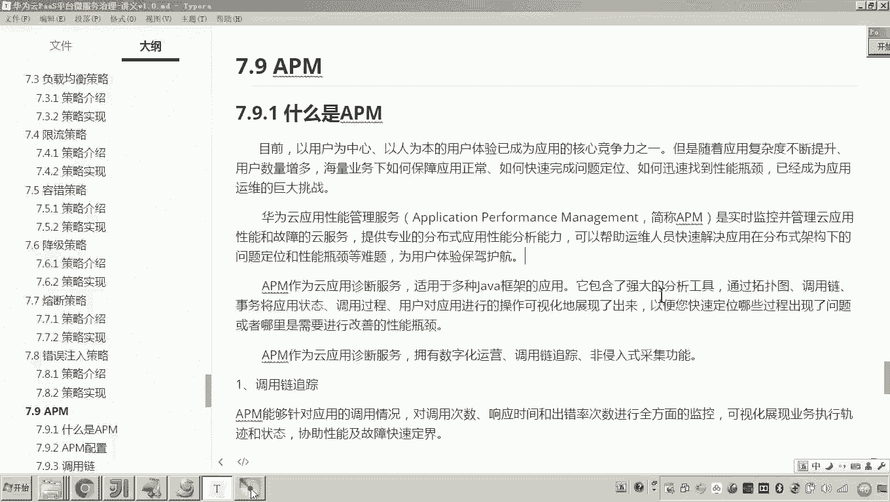

那首先呢各位这些是很多文字，对吧？呃，我们先进到这个画面啊，进到它这个什么呀？它这个应用管理的这个服务的画面。呃，你点击服务列表。

在这个应用服务这儿有一个叫做应用性能管理APM大家可以看到我鼠标在这儿晃的这儿是吧？哎，点大家看到这就进到了我们的什么应用啊，性能管理这个界面。对，那在这个界面呢，大家先不要看这个什么灰了是吧？

大家看跟着我的这个鼠标的走啊，在左侧是不是就是列了我们这个APM应用性能管理的所有菜单，大家可以看见对吧？而这些菜单。😊，就是APM应用性能管理的这个内容啊，它的功能。

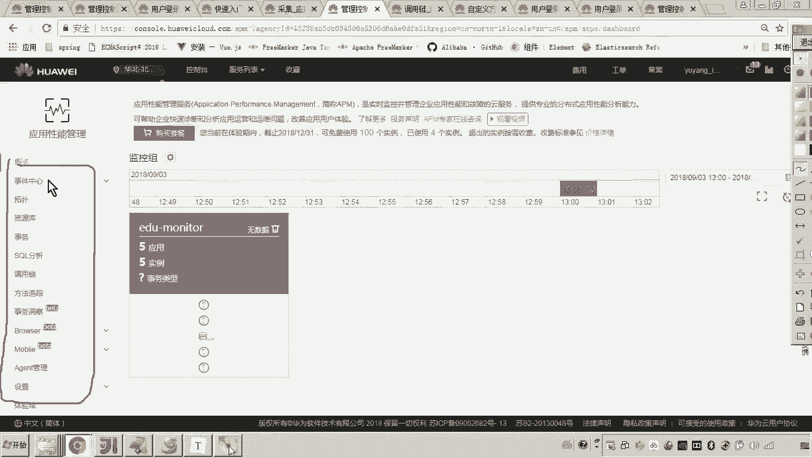

好了，那我们看着这个画面呢，我们来进行介绍。哎，首先第一个哎叫做调用链追踪。嗯，当然我这里面列的第一个并没有按照这个菜单的顺序列啊，我是按照这个什么呀？哎这个这个呃非常核心的功能，重要的功能呢。

我都把它摆到前边了，大家看到有一个叫调用链追踪调用链追踪在这可以可以看到是不是在这这个菜单对吧？那么在这个里头大家可以看到现在在这个画面当中啊，因为哎我已经把咱们学生在线项目呢。

哎已经把它加入到哎采用APM的这个性能管理这个服务呢来进行监控了。所以大家可以看到前边上边的一步是不是报了成成功，下边是不是报失败，对吧？那这是什么意思呢？就是说咱们这个项目在运行的时候。

那我们说用户他是不是会去操作我们的项目，对吧？你看比如说这个他是不是要进行在线看视频，对吧？好了。😊。

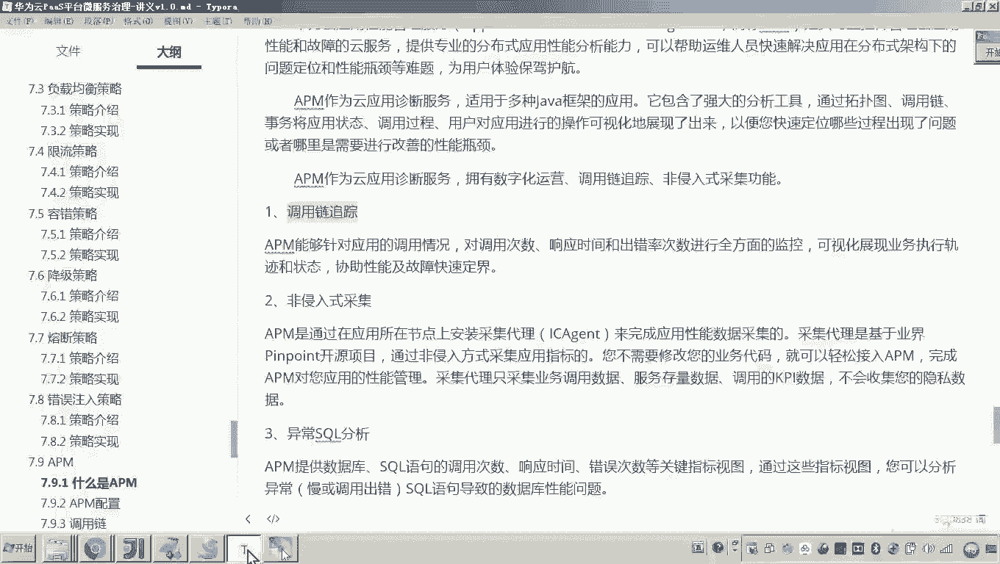

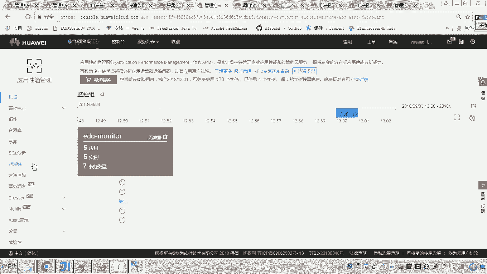

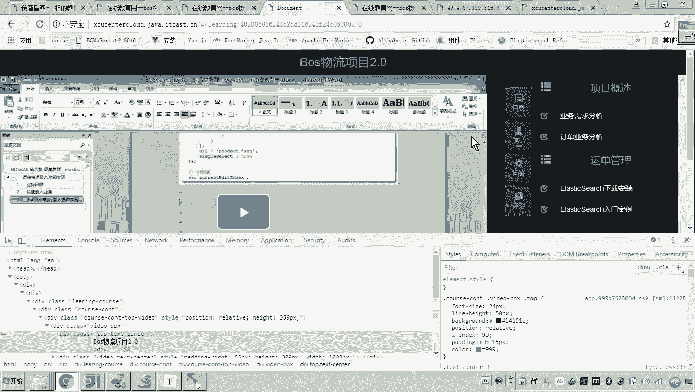

那么他在操作的过程当中，哎，像这种打对勾的那就是操作成功了。打叉的就是失败了，就是你请求失败了或者处理失败了。哎，但那哪一点失败了，那么这个调用链跟踪就是来跟踪具体哪一个位置失败了。

所以你想呀我们的微服务那么多？那我现在要请求一个操作，嗯，你怎么知道哪里错了呢？你怎么如何去排错呢？所以调用链跟踪哎，应该说是APM里面的一个非常核心的功能。😊，还有什么呢？还有。😡，叫做非侵入式采集。

啥意思？就是各位就说这些跟踪，它肯定得有什么得有原始数据。哎，对比如说举个例子，你看这个调用链跟踪的它的基本原理是什么呢？就是在调用最初它会生成一个chice ID哎，那这个这个ID呢会随着这个调用。

假如说举个例子，我现在哎我现在一次操作，我需要调用什么，我需要调用两个微服哎，调用一个微服再调用一个微服。也就是在刚开始触发调用的时候，这儿就已经生成了一个chice ID了。它会在整个调用过程当中。

把这个ID呢全部往下哎带带带一直带到最后。😡，但是你各位你想呀，我这个ID在哪一个步骤失败了。那你说这个时候是不是得我们把数据得采集到我们这个APM平台APM这个这个这个云平台上面。

它是不是才可以去得出一结论，说哎哪里出问题了。所以这儿就是有一个叫做什么数据采集的问题。但是数据采集。有人说老师是不是要改代码呢？你看我这个标题叫做非侵入式采集，就表示啥意思呀？

就表示我们这个项目我们这个系统哎接入华为云平台就可以不用改代码的情况下，就完成我们数据的这个采集性能数据的采集了。嗯那这里面呢他也提供了一些这个什么呀？这个ent就是一些客户端来进行采集。

而这些客户端呢不需要你去开发。😡，还有第三点叫做异常circle分析，这是啥意思呀？这个我觉得大家应该能猜得到吧。也就是说我们这个项目会去操作数据库，对吧？那各位操作数据库。

它是不是会发起circle语句啊？那这个circle语句，对这个circle语句有什么问题。那么在这个异常circle分析当中呢，都会出现。比如说有些circle执行的时间很长。

那么在这个异常circle分析的这个画面当中呢，它就会给你抓取到哪些circle执行有错误，哪些circle执行时间很长。那么这样的话，我们是不是就可以有针对性的对这个cirl语句进行分析啊？😊。

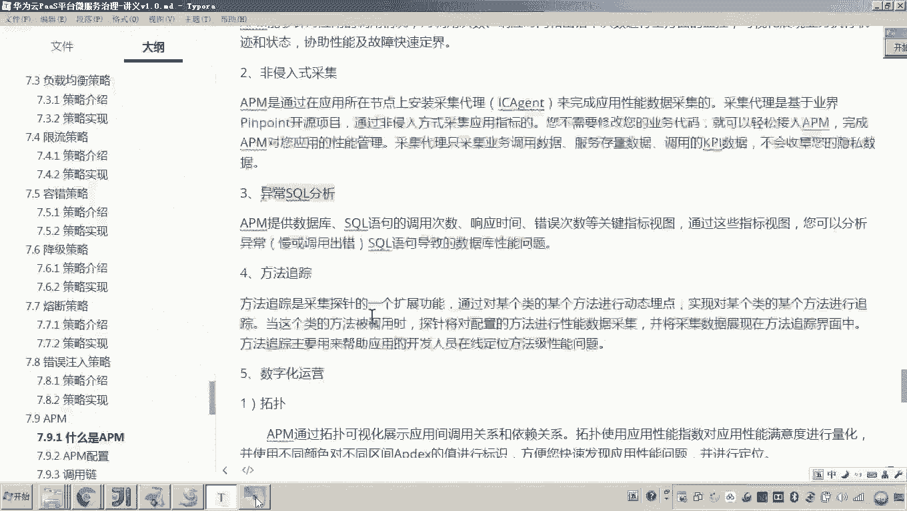

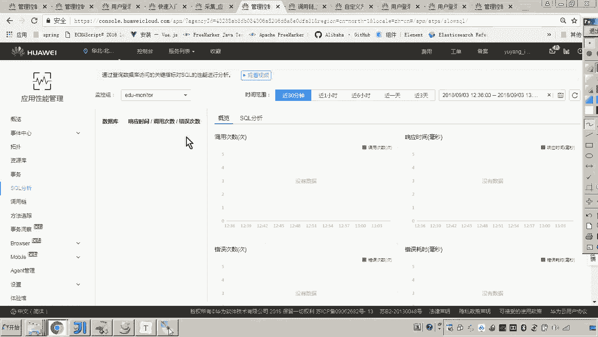

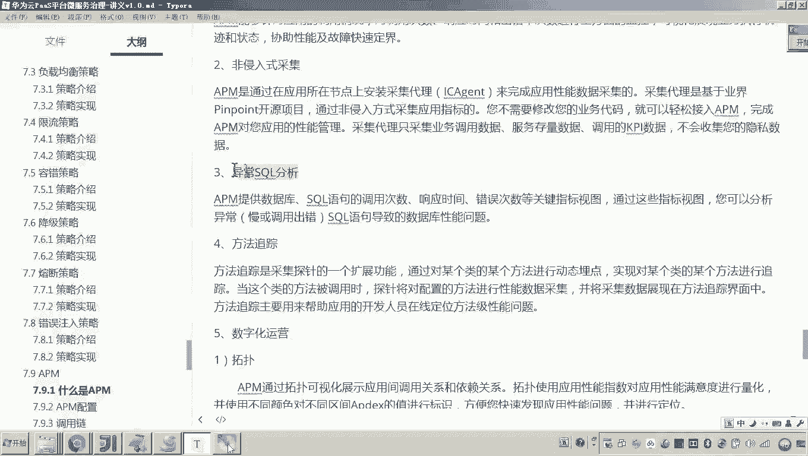

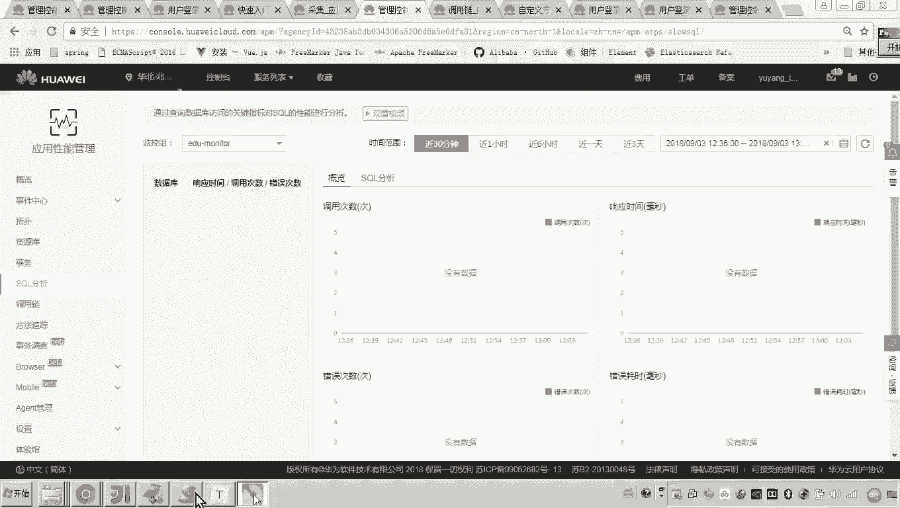

好，还有什么东西呢？还有叫做呃方法跟踪啊，这个方法跟踪也是非常有用的啊。一会儿我要给你演示一下什么意思呢？比如说我们在调用链的这里，比如我们在调用链，这里大家可以看到是不是有一个失败，对吧？好了。

那么失败了呃，到底哪一点失败了，到底调用哪一个方法失败了。各位我们就可以在方法跟踪当中去添加一个买点。对，什么意思啊？什么叫买点。你看这里边说什么方法跟踪是一个采集探针的一个扩展功能。

它可以针对某个类某个方法进行动态买点。也就是说我想针对某一个类，某一个方法监控，到底这个方法到底成功还是不成功有什么问题。好，我就可以我就可以干嘛呀？我就可以在这里啊，在这里添加一个买点。对。

在这里你把类名和方法指定。好，然后呢，你告诉他你给我跟踪多长时间，他就可以帮你来跟。😊。

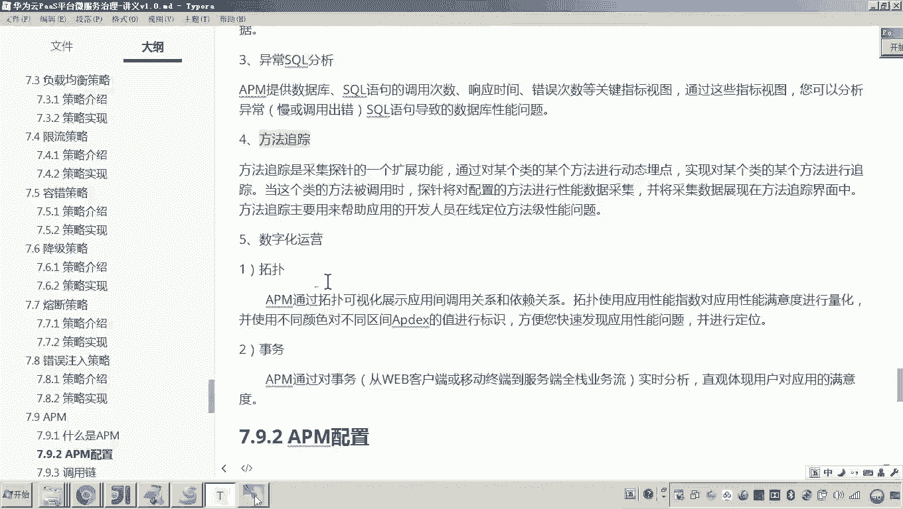

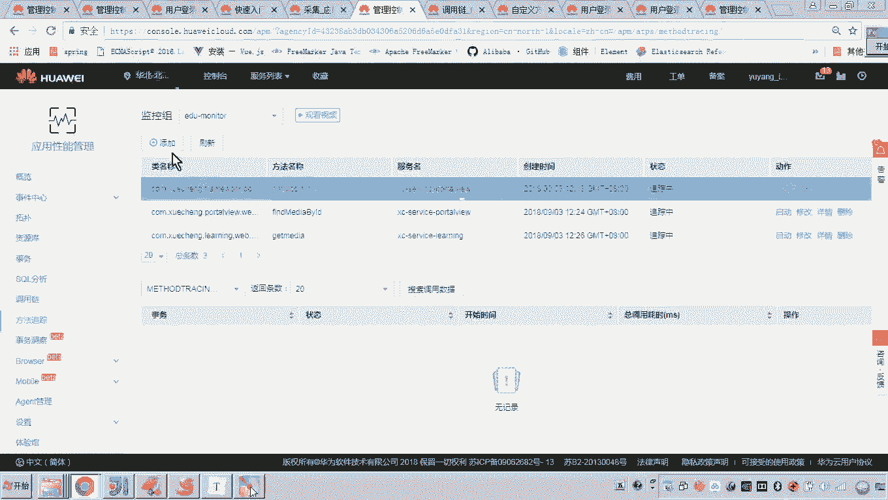

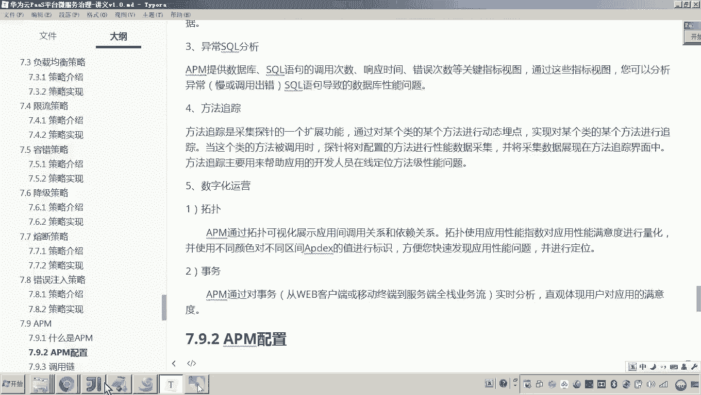

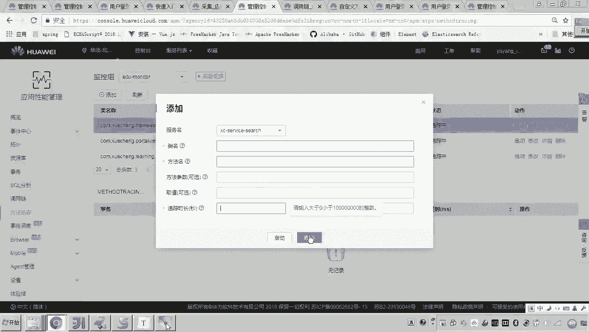

中这个具体的这个什么呀这个方法的执行的一个情况。还有最后一点就是数字化运营啊，有拓扑有事务，这是啥意思呀？哎就是说各位你可以看到这里面是不是有一个拓扑啊？

对那这个拓扑呢是不是就是类似于这种以图形化的界面哎，这个这个好业有点不太显示了啊，因为我这些数据没有啊，也就是说这个呃数字化运运营嘛。就是它可以通过一个图形化的界面呢，可以比如说拓扑图这一块。

可以通过图形化界面呢，让你看到整个应用啊内部的一些调用的一个非常直观的啊一个调用关系啊，也可以去干嘛呢？设置一些指标啊，来呃监控啊，来这个如果出现这个这个这个指标的这个什么呀问题，它会进行告警。😊。

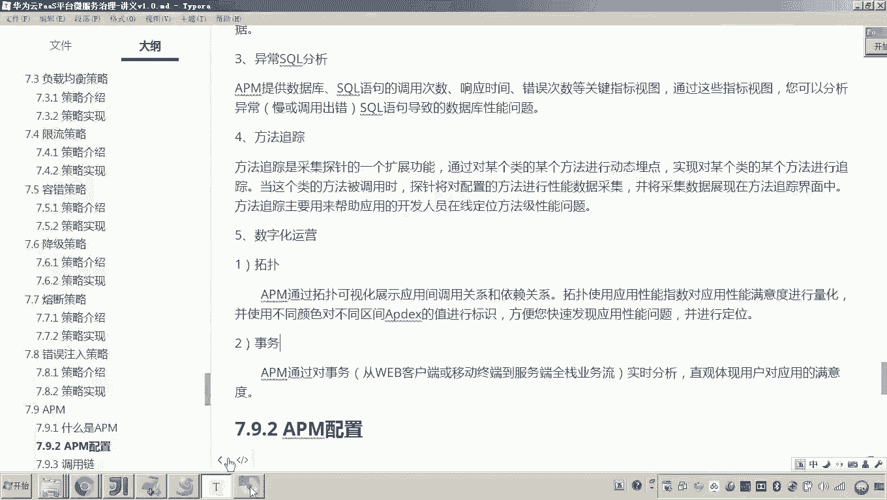

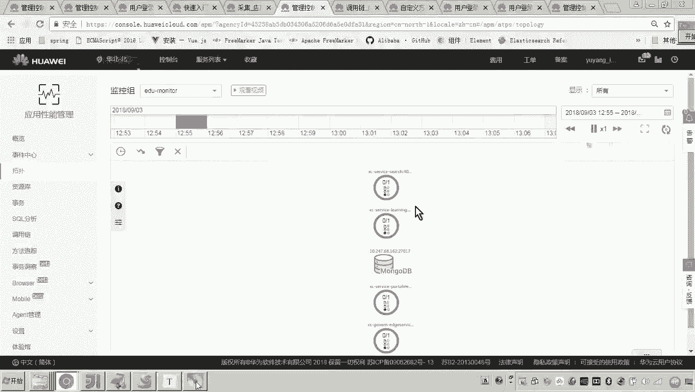

这是数字化运营这一块啊，一会呢我们去演示一下好。那以上呢我们就介绍了什么是APM呢？其实就是啊我们说要对我们这个应用啊进行一个监控，哎，要对我们的应用的性能啊、故障啊进行监控。啊。

这里面呢华为云提供了一个性能管理服务叫APM那我们这个项目呢呃怎么让怎么样让这个APM监控呢啊，就发现它其实呃非侵入式呃，也就是说不用改我们的代码。那这个APM呢就可以采集到我们系统运行的数据啊。

然后呢我们可以实施调用链的最终异常思cle的分析等这些非常核心的这种APM的性能管理功能来帮助我们快速的去排除问题啊，排除故障。好，那APM的介绍呢啊，我就先介绍到这里。😊。

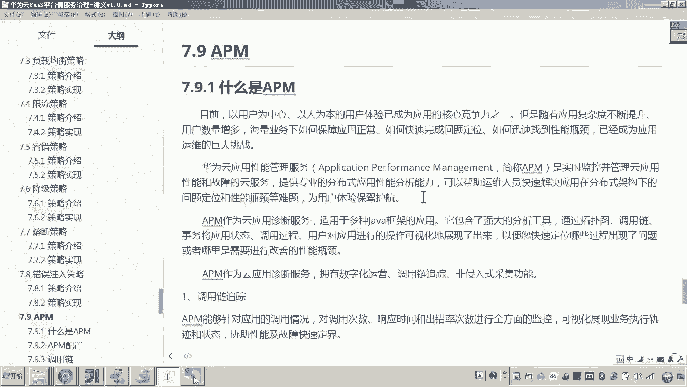