# 华为云PaaS微服务治理技术：P137：15-微服务治理-APM-APM介绍 🚀

在本节课中，我们将要学习华为云的应用性能管理服务——APM。我们将了解APM是什么，它与微服务治理的关系，以及它如何帮助我们监控和定位分布式应用中的问题。

## 概述

在前面的课程中，我们讲解了微服务的治理策略，例如限流、容错、熔断和降级。这些策略用于控制微服务的运行过程。然而，我们何时需要应用这些控制策略呢？这取决于对微服务运行状态的监控。只有通过监控获取数据，了解微服务运行过程中的问题，我们才能进行有效的治理。APM平台正是用来解决应用监控问题的工具，它帮助我们在分布式架构下定位所有应用的问题。

## 什么是APM？🔍

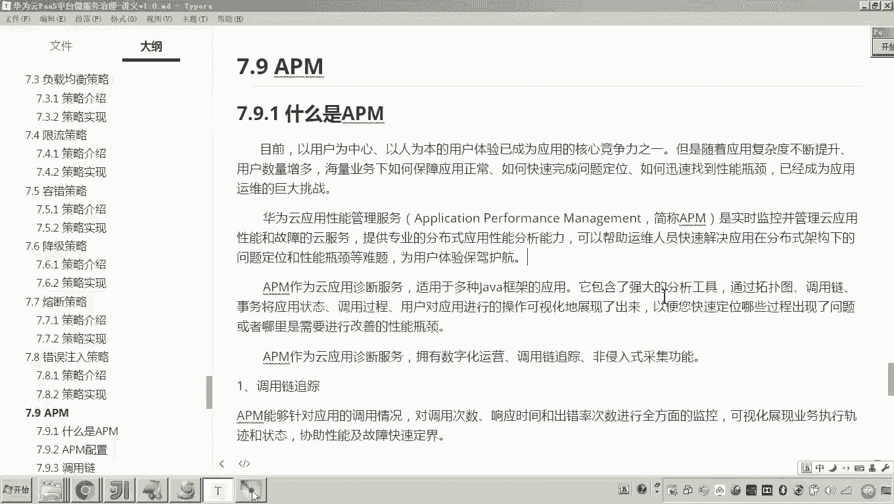

在当前互联网应用中，用户体验已成为应用的核心竞争力。然而，随着应用从单体架构演变为分布式架构，系统变得日益庞大和复杂。在采用微服务架构进行开发时，微服务数量众多。当出现问题时，例如用户下单失败或视频播放错误，如何快速定位问题成为系统运维的巨大挑战。原因在于微服务数量多、用户量大，系统非常庞大。

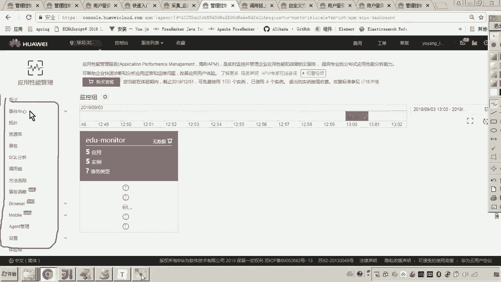

APM，即应用性能管理服务，是华为云提供的一项云服务。它用于实时监控并管理云应用的性能和故障。通过监控应用的运行状态、性能和故障，APM为我们提供了治理微服务所需的数据基础。

## APM的核心功能

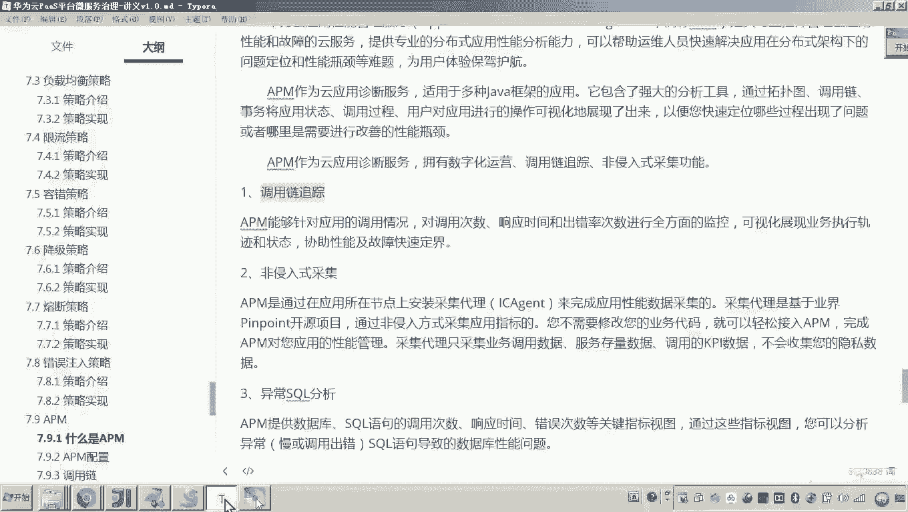

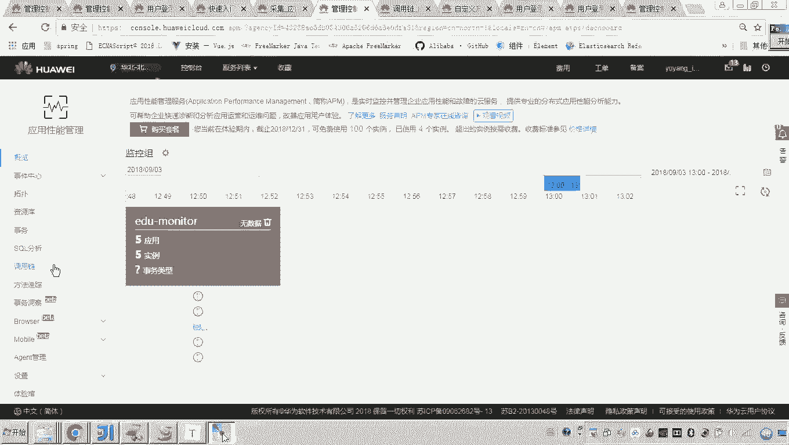

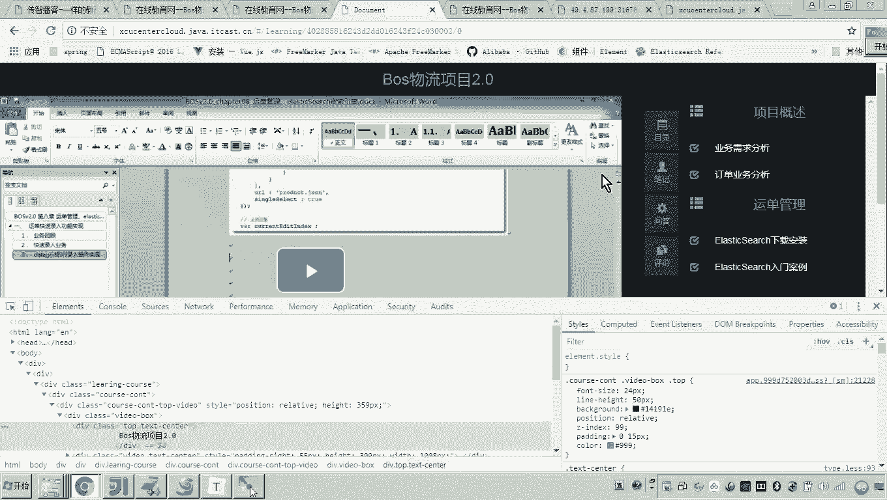

以下是APM应用性能管理服务的核心功能列表，这些功能帮助我们全面监控和分析应用。

### 1. 调用链追踪 🕵️‍♂️

调用链追踪是APM的一个核心功能。在我们的项目中，用户操作可能成功也可能失败。调用链跟踪用于追踪具体是哪个环节导致了失败。其基本原理是在调用开始时生成一个唯一的 **`trace ID`**。这个ID会随着调用链在微服务之间传递。通过追踪这个ID，APM可以清晰地展示一次完整请求所经过的所有服务节点及其状态，从而快速定位故障点。

### 2. 非侵入式采集 📊

要进行跟踪和分析，首先需要采集原始数据。非侵入式采集意味着项目接入华为云APM平台时，**无需修改代码**即可完成性能数据的采集。APM平台提供了现成的客户端（Agent）来负责数据采集工作，这大大降低了接入和使用的复杂度。

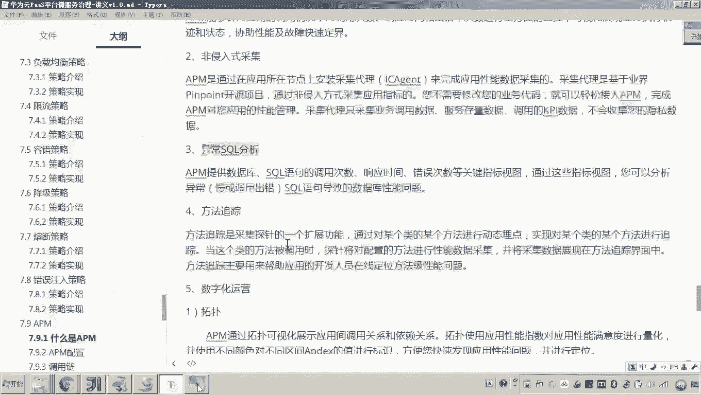

### 3. 异常SQL分析 🗃️

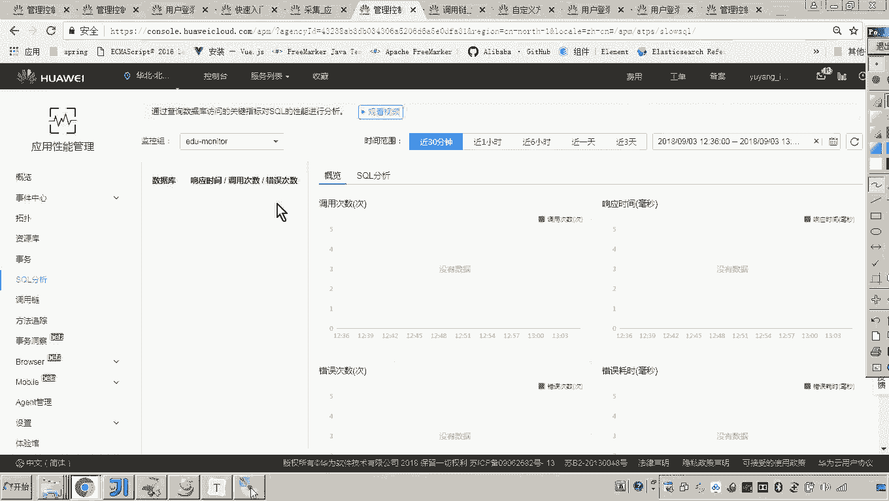

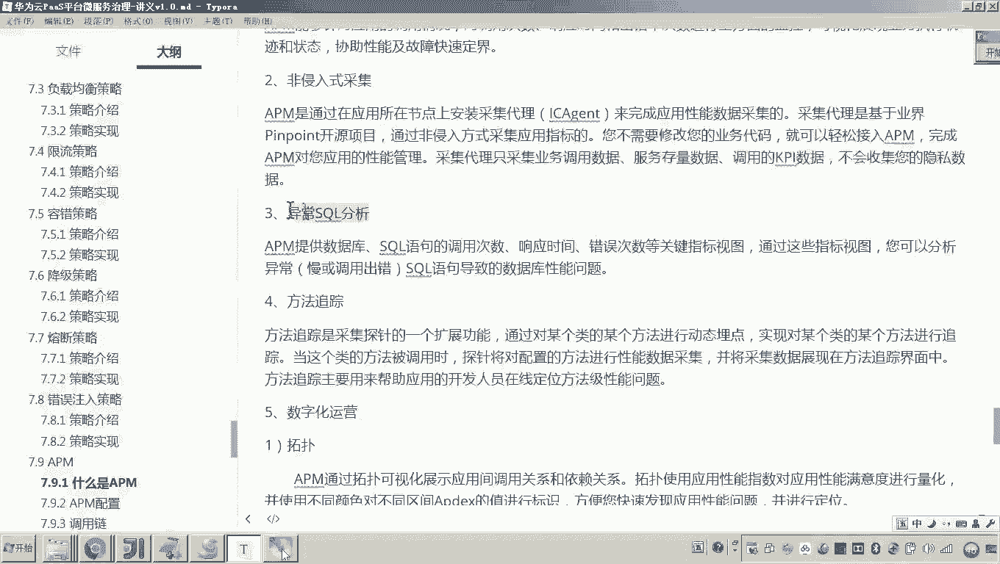

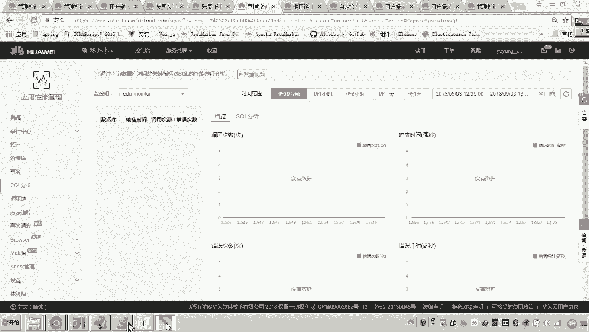

我们的应用在运行时会操作数据库，执行SQL语句。异常SQL分析功能可以抓取执行有误或执行时间过长的SQL语句。通过这个功能，我们可以有针对性地对低效或错误的SQL进行优化和分析，从而提升数据库操作性能。

### 4. 方法跟踪 🔬

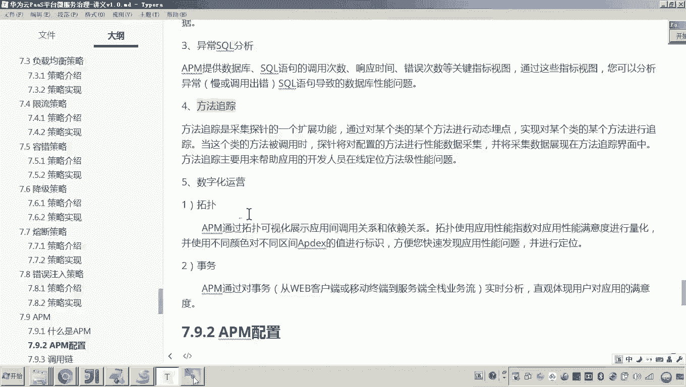

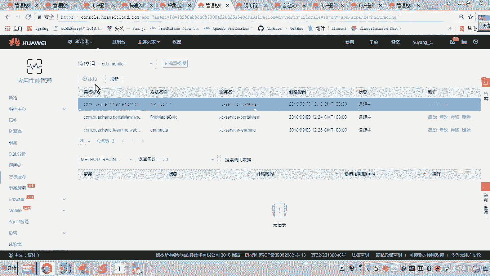

方法跟踪是采集探针的一个扩展功能，它允许我们针对特定的类和方法进行动态“埋点”。例如，在调用链中发现某个环节失败后，我们可以通过方法跟踪功能，指定监控某个类中的某个方法。APM会在一段时间内跟踪该方法的执行情况，帮助我们深入定位代码层面的问题。

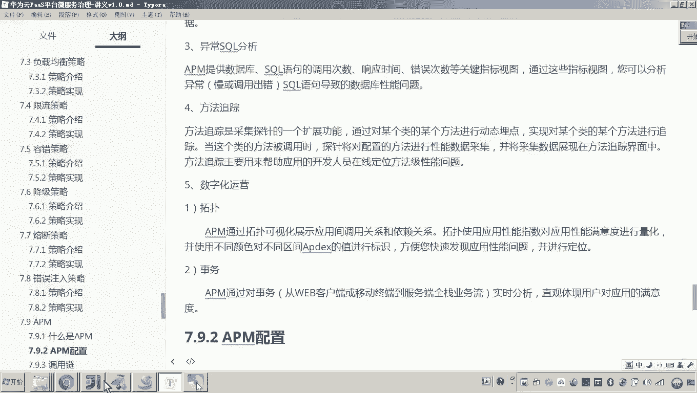

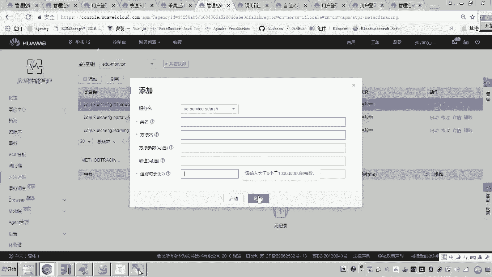

### 5. 数字化运营 📈

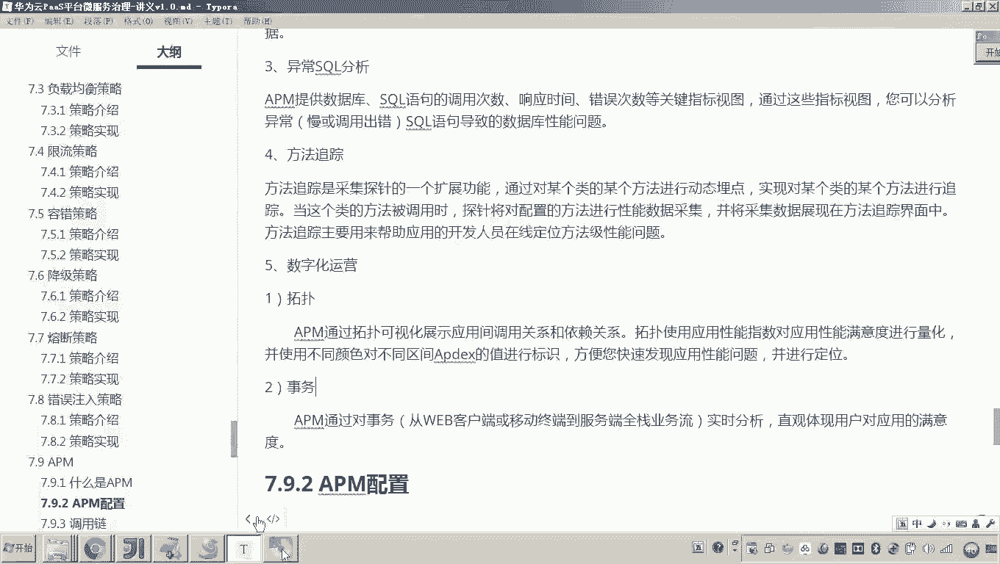

数字化运营功能提供了图形化的监控界面，主要包括拓扑图和事务监控。
*   **拓扑图**：以图形化方式直观展示应用内部各服务之间的调用关系和依赖。
*   **事务与指标**：可以设置关键性能指标（KPI），当指标出现异常时，系统会触发告警，便于我们及时响应。

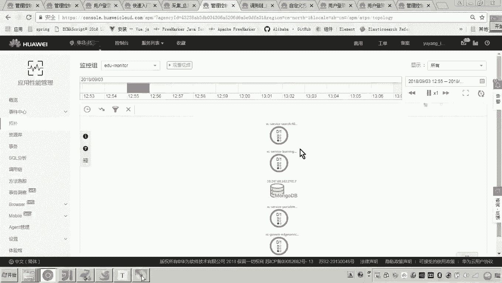

## 总结

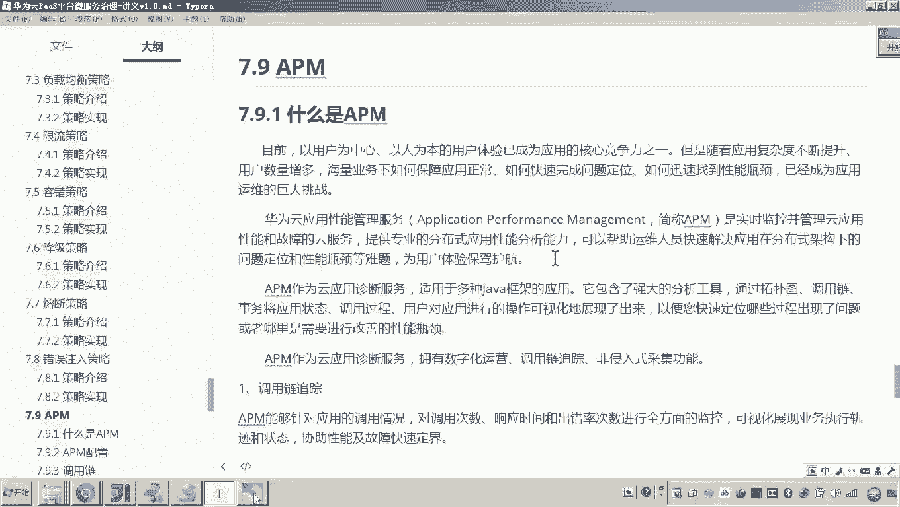

本节课我们一起学习了华为云的应用性能管理服务APM。APM的核心作用是对应用的性能与故障进行监控。它通过非侵入式的方式采集系统运行数据，无需修改代码即可接入。借助调用链追踪、异常SQL分析、方法跟踪等核心功能，APM能帮助我们快速定位和排除分布式应用中的问题，为微服务的有效治理提供了坚实的数据支撑。