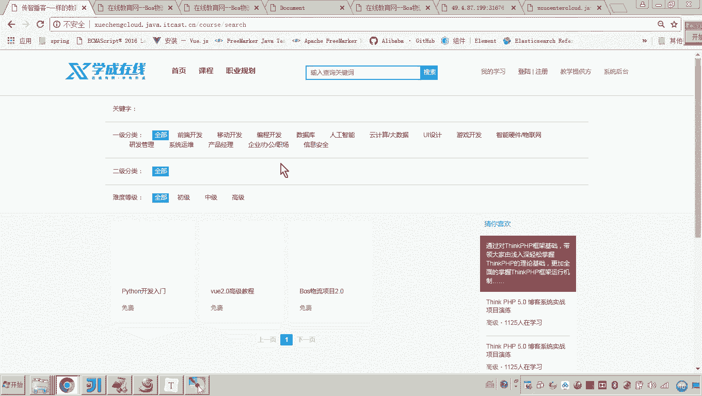
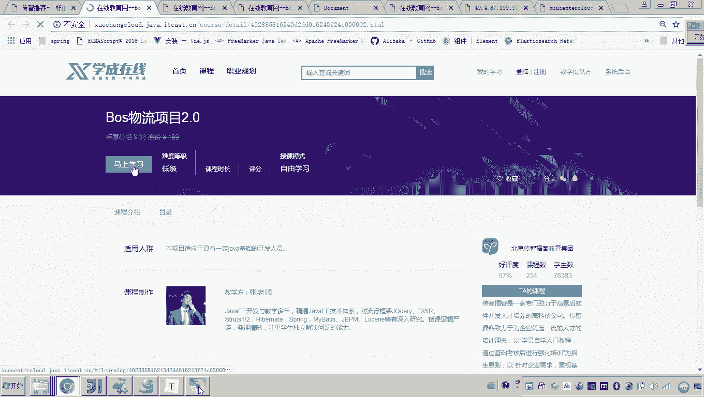
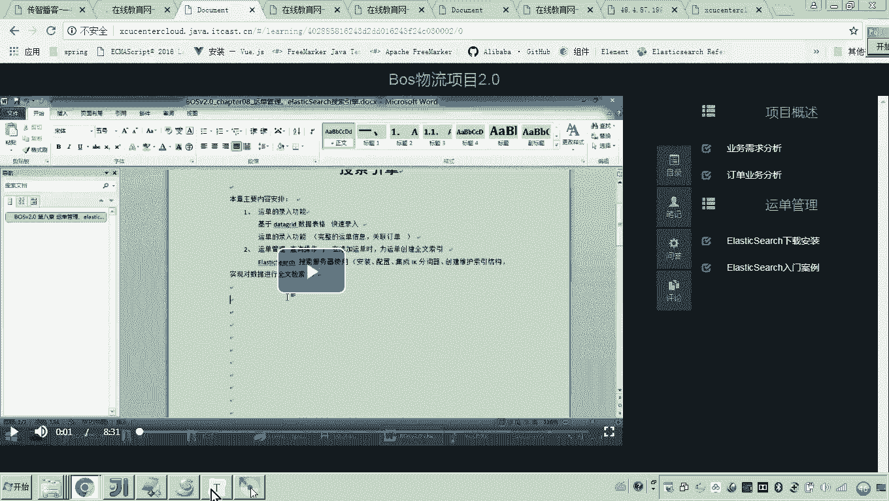
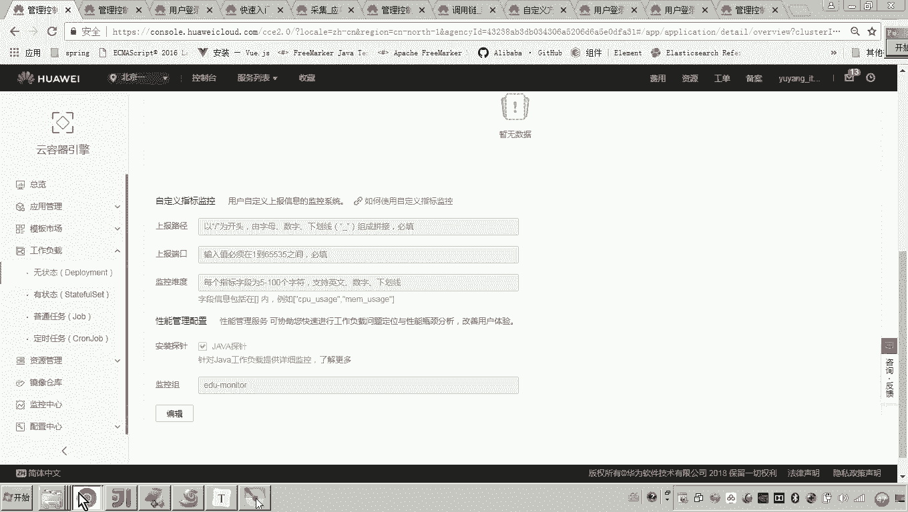
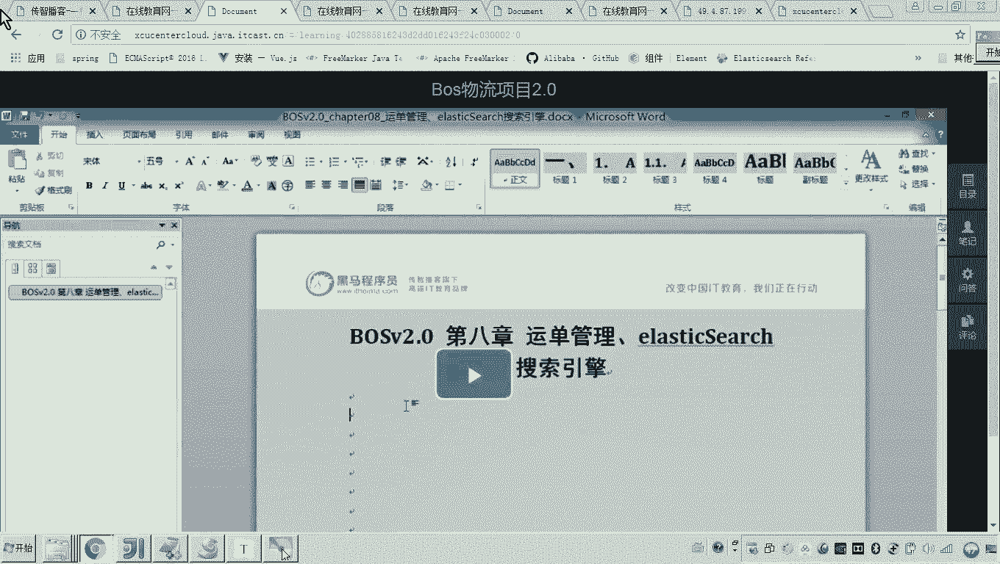
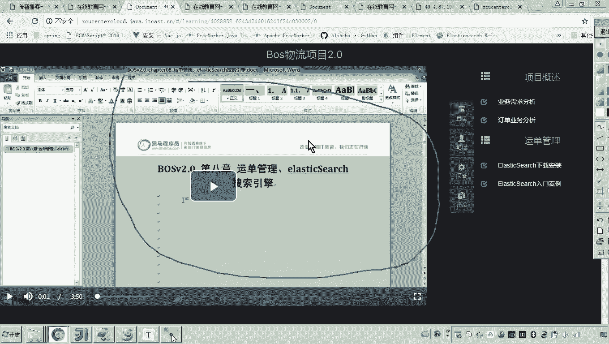
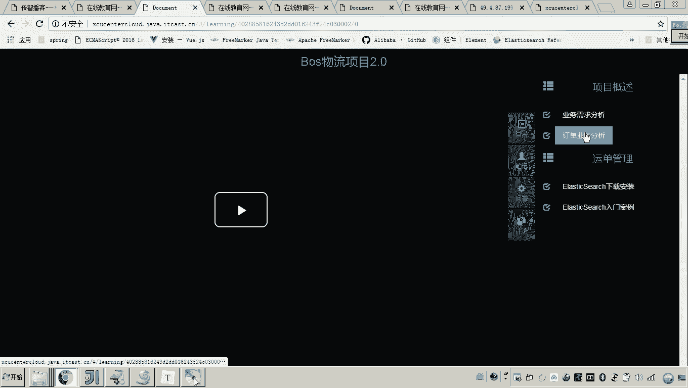
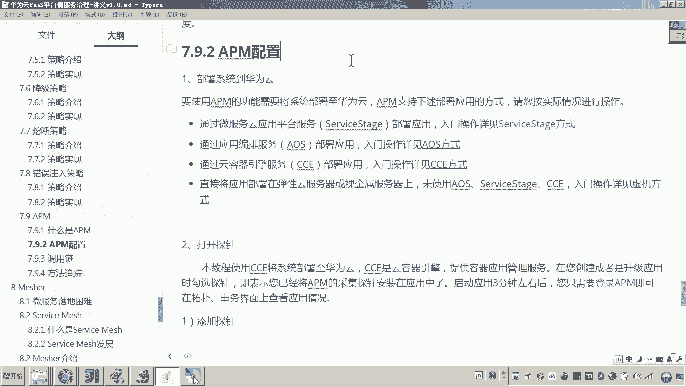

# 华为云PaaS微服务治理技术 - P138：16-微服务治理-APM-APM配置 - 开源之家 - BV1wm4y1M7m5

好，那下边呢我们就配置APM啊，然后我们采用APM呢来监控我们这个项目的运行。好，那首先呢呃如果要使用APM性能管理服务呢，首先要把我们这个系统呢部署到华为云。啊，并且呢我们现在来看啊。

我们部署到云平台之后呢，我们需要把集群、服务器等啊全部齐起来。好，那大家来看啊，那么我们是不是在呃当初我们这个部署的方法是采用什么方法？大家还有印象吗？来，我登录一下这个云平台啊。😊。

当初我们讲学生在线项目部署到这个华为云，我们是不是采用了什么呀？是不是叫云容器引擎CCE对吧？那各位来看一下。那这那这里头这里头我们部署的当时我们还有印象嘛？是是部署了一个叫XCEDU02这个集群。

对吧？好了，那么我们当时已经在这个什么这个集群下边部署了很多的这种工作负载，有无状态的和有状态的。好，那么这里呢我们要采用APM进行这个性能管理性能监控，我们首先需要把我们这个项目部署到这个华为云平台。

然后呢，把我们这个刚才你看到的这个什么呀？这个集群把它齐起来。嗯，这个集群起起来。因为我为什么说这一点呢？呃，因为我们这个部署华这个学生在线部署到云平台这个这段课程呢，应该是在前边都已经讲过了。

有些同学应该已经部署成功了。所以现在你要学习这个APM如何监控的话，你。😊，需要在这里啊把这个集群呢给它唤醒一下。好，另外呢你还需要在这个弹性云服务器当中，把你这个呃集群的这个服务器呢给它砌起来。😊。

这样的话各位呃，我们起起来之后呢，我们是不是就可以来看一下呃，他是不是就工作负载。这里你查看一下是不是都已经运行起来了。😊，呃，光运行起来还不行。

你是不是还要看一下咱们这个呃系统是不是就可以正常的来访问，对吧？呃，大家可以看到呃，这是我们的首页。哎哎，当初我们是不是采用了一个呃域名啊啊，我们当时是在这个house的这个文件当中配置这个域名。

那前面的这个是不是就是我们当初申请的这个弹性负载均衡的外网IP地址哎，这个也是云平台的这个弹性负载均衡的外网IP。😊，好，那现在呢大家可以看到这个系统呢应该是可以正式呃可以正常的使用了，对吧？

可以正常的使用了。呃，然后呢，你这里边点击这个某一个课程，然后呢，点击马上学习。这里边大家可以看到是不是就可以正常的来学习，对吧？也就是说我把这个集群起起来之后，这个项目是正常的好了。😊。

那现在也就是说第一点啊，要把系统部署到华为云，我们已经完成了。😊。

那么在官方给你说的是，如果你采用APM的话，你要把系统部署到华为云啊，那么有几种部署的方式呢，我们的课程当中只讲只讲了一种采用云容器引擎CCE对吧？

那其实在华为云平台当中还有一些其他的方式来部署啊那么比如说它有一个叫做service啊，那这个呢叫做云平台的一个呃它是一个什么呀呃是一个华为云哎提供了一个的一个智能的管理平台啊。

其实你你回头用这个service stage也可以来把我们这个项目呢部署这个华为云啊有人说老师咱们是不是没有讲过这个service其实你可以看一下啊，因为你会发现啊。

你们会发现啊这个service其实和这个CCE的功能，有一部分是重复的对那里边呢你大家可以看到这里边是不是有创建集群，我们讲E的时候是不是也讲了创建集群对吧？你看它这里要先让你创建集群。😊，啊。

然后呢创建完集群之后，哎，你说呃我我是不是可以进行开发呀？那service stage呢它有个好处是什么呢？就可以呃就是你把代码哎通过service stage呢进行托管。

然后呢直接啊在这个呃这个什么呢？这个云平台上就可以把代码打包。而我们当时采用CCE是不是在线下打包，然后呢上传啊上传到这个云平台，把那个什么呀，把那个镜像，对吧？

而这个service stage呢就可以全部在公有云上面来做嗯。😊，这是service stage。但是它的很大的一部分功能呢都是和这个CCE呢部署这一块的功能都是重复的。

还有一个应用编排服务AOS大家可以了解一下。好了，那么这几种部署的方式呢，呃都是都是采用这种都是把我们的项目呢部署到这个华为云上的方式啊。

都可以采用这几种部署方式都可以来使用APM对我们的这个部署到云上的这些系统呢进行呃性能监控。好，这第一步呢，我们应该已经做过了，哎，当初我们是不是采用CCE来进行部署的对吧？那第二步要干嘛呢？

因为刚才我说到这个APM介绍的时候，是不是说了就是呃无嵌入式的一个采集，对吧？也就是说我们这个项目一旦部署到云平台了，那么我说想采用想使用这个APM的这个应用性能管理服务来监控我们的微服务了。

那怎么办呢？你不用改代码，你只要打开一个探针就可以了。有人说老师这这又是啥东西啊，好了，很简单。😊，这样做。打开我们的这个云平台。哎，我们当初是不是采用的这个CCE啊哎，就是微云容器引擎。

你打开工作负载这，对吧？现在呃我们想对我们的这个所有微服务啊，哎，包括网关都要进行性能管理，那怎么办呢？你点击这个网关点击点击完了之后呢，在这个工作负载运维这里往下点往下往下，这里边是不是有一个叫探针。

那你你那儿的你要是没有添加这个探针的话，这个勾是没有勾的，包括这个监控组也是没有的那有说老师没有呢，怎么办呢？灰了，对吧？你点编辑，你点编辑。这时候各位你那儿的情况是不是就相当于是这样一个这样一个样子。

对吧？你点编辑之后，各位你把它勾上，然后这里边呢你输入一个监控的组名哎，叫EDU monitor啊，随便起个名就可以啊，啊，这个表示我们这个教育系统啊，在线教育这个学生在线的一个监控。😊。

比如说老师这个可以随便起吧，中文可以吗？你注意我建议你全部取成什么英文啊，然后这个名字你给我记住哎，不要乱记。比如说现在因为我们是不是要把工作负载所有的这种微服务都要添加探针呢？

所以你这里面我这里边再我先把这个网关添加探针的话，我这里面是不是添了一个叫EDU啊。那我现在接下来再添加另外的这个微服务的探针，那方法和刚才一样，也是点开它哎，然后呢，这里面怎么弄啊。

编辑勾上输入输入这个监控组的名字和刚才你添加的哎网关的那个探针的那个名字一样，保持一致。😊，哎，也就是说我们这个学生在线项目添加这个java探针的这个监控组名啊，保持一致。好，然后一点重启实例就可以了。

这样的话，其实各位我们就会发现我们哎一个啊1234，我们要把这4个微幅啊都要添加java探针。😊，有如说老师这个探针到底是啥呢？探针就是用来采集数据的。你懂我的意思吧？就是用来采集数据的。

因为刚才我们说呃，它是无侵入式来采集，对吧？那你说他是不是要最终在你的这个什么，你的你的这个服务器上是部署一个A进的客户端来采你的数据啊，那你让不让他采，哎，这里边我们就要配置探针，你配了探针。

他就去采了。😡，好了，那现在呢这几个微服务呢，我都配了探针。大家可以看到是不是这里边是不是都。😊，配了是吧？哎，然后呢，注意你那么你刚开始配置的时候呢，你是不是勾上，然后呢，输入一个名字。

是不是重启实例，对不对？一重启实例，你会发现这儿就相当于就是呃不会立即变成不会立即变成这个画面。😡，就是你重启完实例，勾上输入名字之后，不会立即变成这个画面。😡，那那有说老师这是为啥呢？

因为你勾上之后呢，他要去给你去安装这个A的客户端呃，来采集数据，等这一系列工作全部就绪了。那这个探针才是真正打开。😡，所以说你刚开始勾上了之后呢，一点重启实力，发现哎回到这个界面，这儿又是没有勾选。

那你不要着急，过一会儿你再来看，它就已经勾选了。😊，要记住这一点。好了，那现在呢我们说你配置APM的方式呢，第一就是要把系统部署到华为云。第二就是要把你的啊。😡，呃。

让APM来监控的哪些的这些微服务呢呃，全部的来添加探针。😡，好了，那么我们把它添加完探针了之后呢，哎应该是2到3分钟的时间。哎，我们这个时候呢各位我们就可以来去操作我们这个什么项目了。😊。

啊，因为什么？因为你要一操作它的话，那这个数据它是不是才能采集到呀？😡，对吧也正常情况下是不是也是正常情况下，你添加了探针之后呢，那个其他的这个用户是不是也在正在使用你的这个项目，没错吧？哎。

所以说其实我们可以因为测试嘛，你可以随便点击点击这些链接。因为现在我们测的就是一个呃在线学习的这个业务流程啊，这个在线学习业务流程是大家应该还有印象吧？就是这个在线学习的这个前端页面。

它是不是会请求我们后端的这个什么微服务吧，通过网关请求微服务来获取这些数据，对吧？包括这个视频的播放地址，是不是都是通过微服务获取的数据，对吧？所以说这个过程呢需要你来回操作一下，然后呢。

这样我们就可以去干嘛呀，去让他给我们采集我们整个运行过程当中的这么数据了。😊。

好了，你操作完了之后呢，有人说老师，那我想看一下效果，那这个这个APM到底啥效果呢？对你这个时候就可以进入这个什么呢？这个概览这个页面。对。😊，这个画面就已经出现了。对。

但是但是注意我这儿是不是灰色的对吧？对，等一会儿它的数据来了之后呢，这里边就就点亮了。好，点亮了之后呢，其实在拓扑图当中，这里头其实你应该一会儿呢就能看到这个top扑图了。

因为这个数据采集它需要需要一段时间。😊，对，所以稍稍等一下嗯。所以这个就是我们说的什么呀？就是我们说的APM的配置啊，两点首先把系统部署到华为云。第二点打开探针就可以了。嗯，好，APM的配置呢。

我先来讲到这儿。

