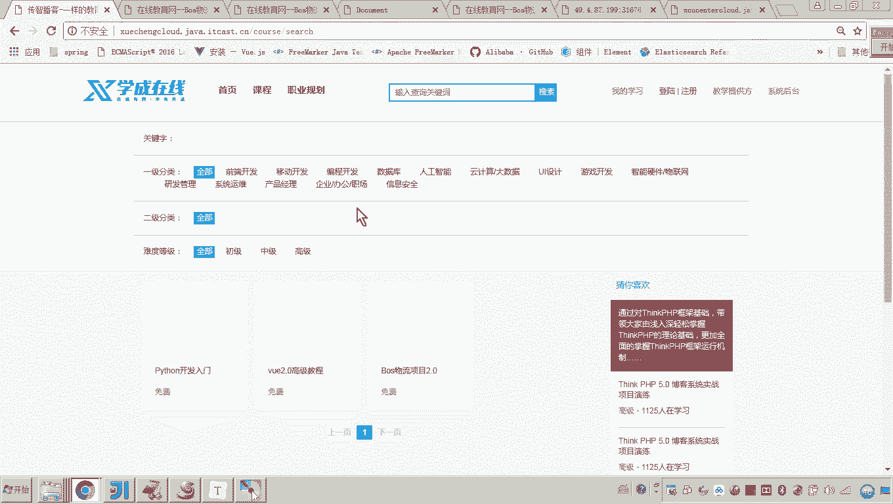
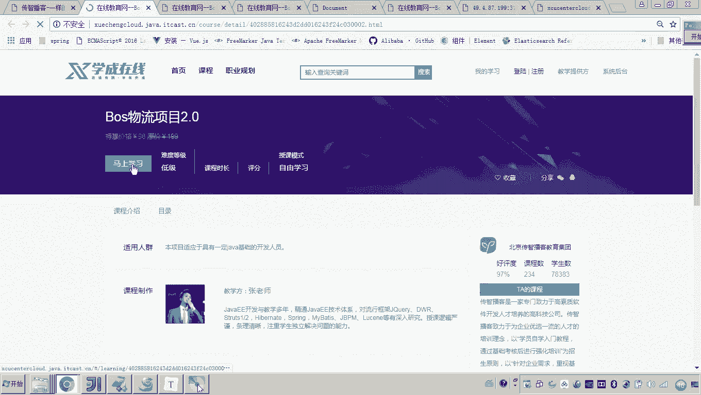
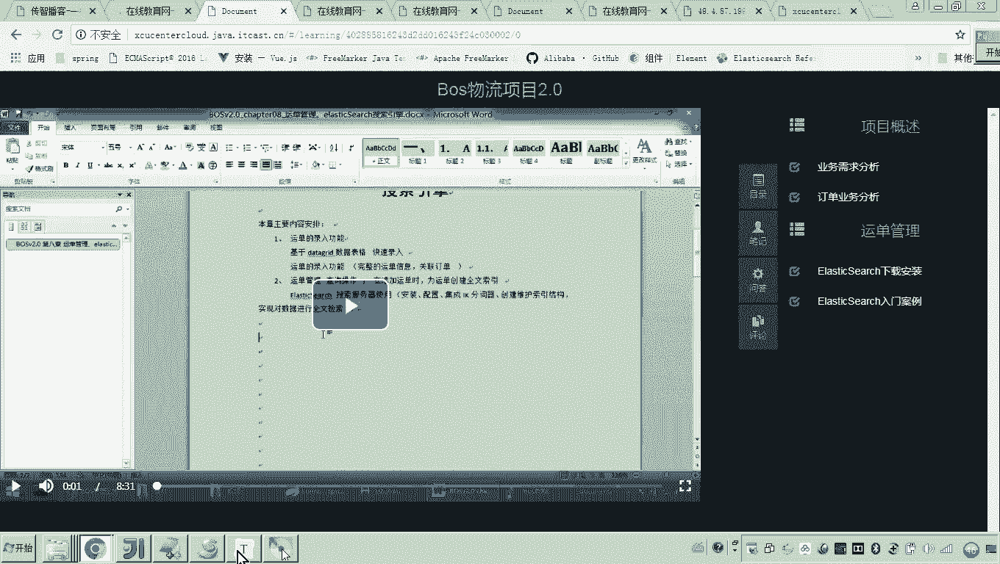
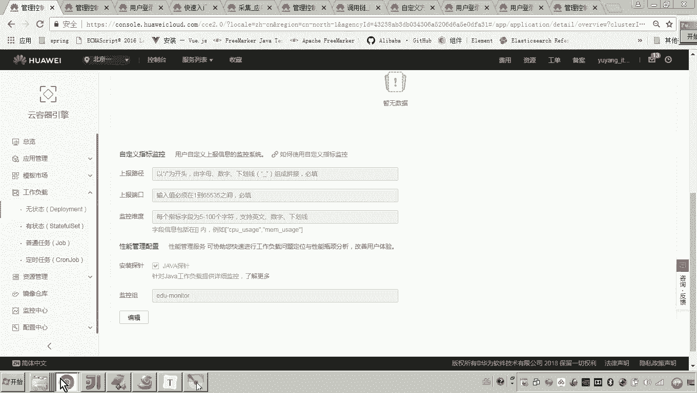
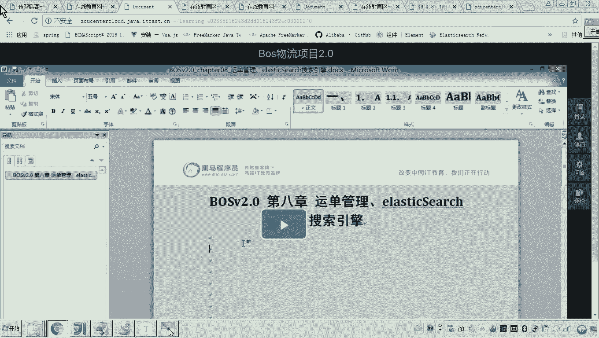
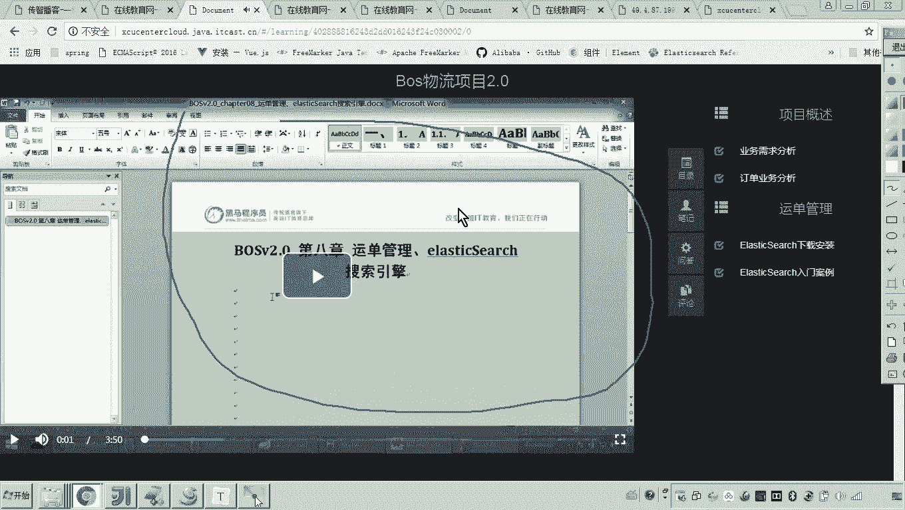
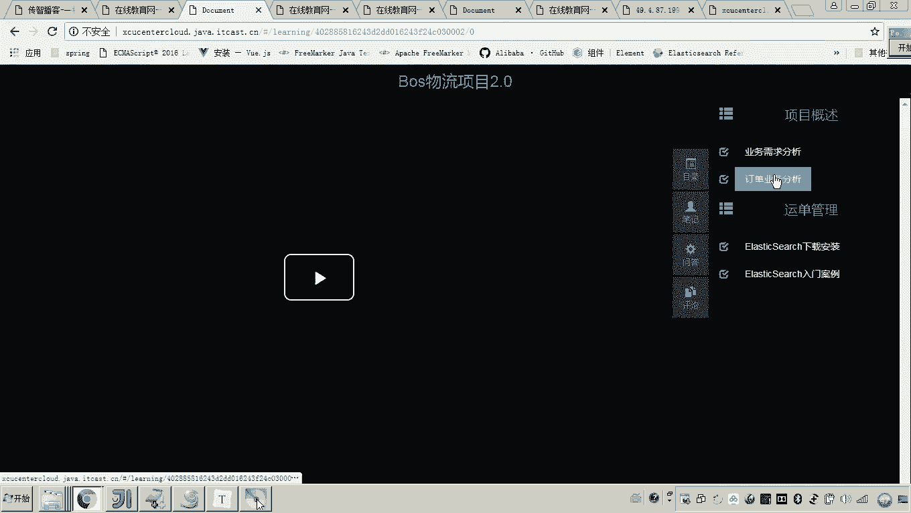
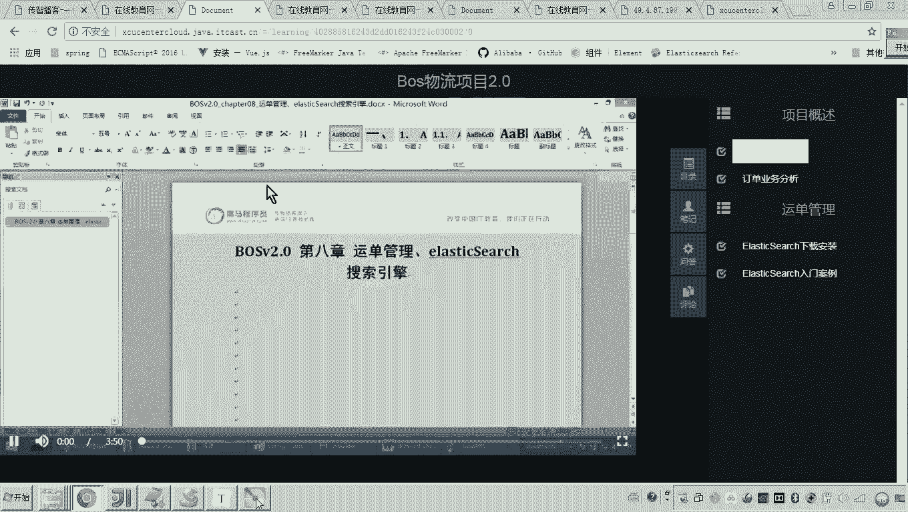
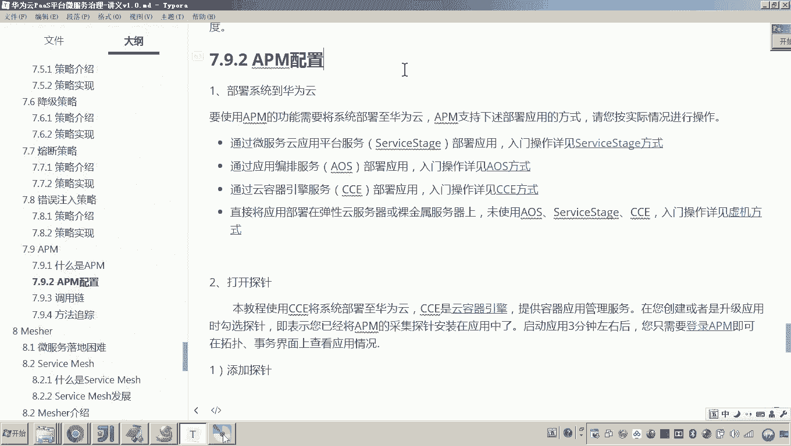

# 华为云PaaS微服务治理技术 - P138：16-微服务治理-APM-APM配置 🛠️

在本节课中，我们将学习如何为部署在华为云上的微服务系统配置应用性能管理服务。通过配置APM，我们可以无侵入式地监控项目的运行状态和性能指标。

## 概述

上一节我们介绍了APM的基本概念与功能。本节中，我们来看看如何具体配置APM来监控我们的“学生在线”项目。配置过程主要分为两个核心步骤：将系统部署到华为云，以及为需要监控的微服务开启数据采集探针。

## 配置步骤详解

### 第一步：将系统部署到华为云

要使用APM性能管理服务，首先需要将我们的系统部署到华为云平台，并确保相关集群和服务器处于运行状态。

回顾我们的部署过程，“学生在线”项目是采用**云容器引擎CCE**进行部署的。具体来说，我们部署在名为 `XCEDU02` 的集群下，该集群下运行着多种无状态和有状态的工作负载。

为了进行APM监控，你需要确保：
1.  相关集群已启动。
2.  弹性云服务器中的集群节点已启动。
3.  所有工作负载均正常运行。
4.  系统可以通过配置的域名或弹性负载均衡的外网IP正常访问和使用。

以下是验证系统运行状态的要点：
*   在CCE控制台查看工作负载状态。
*   通过浏览器访问系统，测试核心业务流程（如浏览课程、点击学习）是否正常。

除了CCE，华为云还提供了其他部署方式，例如 **ServiceStage** 和 **应用编排服务AOS**。这些方式都可以将项目部署到云端，并同样支持使用APM进行监控。我们的课程主要讲解了CCE方式。

### 第二步：为微服务开启APM探针

APM采用无侵入式数据采集，这意味着我们无需修改项目代码。只需在云平台上为需要监控的微服务开启一个“探针”即可。探针的作用是采集微服务运行时的性能数据。

以下是开启探针的具体操作流程：

1.  登录华为云控制台，进入**云容器引擎CCE**服务。
2.  在左侧导航栏选择“工作负载”。
3.  找到需要监控的微服务工作负载（例如网关、课程服务、用户服务等），点击其名称进入详情页。
4.  在详情页切换到“工作负载运维”标签页。
5.  向下滚动找到“探针”配置区域。如果未配置，此处显示为未勾选状态。
6.  点击“编辑”按钮。
7.  勾选“启用APM（应用性能管理）探针”。
8.  在“监控组”输入框中，为整个项目定义一个监控组名，例如 `EDU_monitor`。**请使用英文名称，并确保所有微服务使用相同的监控组名**。
9.  点击“确定”保存配置，系统会提示重启实例以使配置生效。

**重要提示**：
*   你需要为所有希望被监控的微服务（包括网关）重复上述步骤3-9。
*   配置并重启实例后，探针状态不会立即变为已启用。系统需要一些时间来安装和启动数据采集客户端。请等待2-3分钟后再刷新页面查看，届时探针状态应显示为已勾选。

### 第三步：生成监控数据

探针配置并启动后，APM开始采集数据。为了看到监控效果，我们需要让系统产生一些访问流量。

你可以手动操作系统，例如：
*   访问项目首页。
*   点击课程，进入学习页面。
*   触发各种前端向后端微服务发起的API调用。

这些操作会产生网络请求、方法调用等数据，被APM探针采集。稍等片刻，数据便会在APM控制台中呈现。

## 查看监控效果

操作完系统后，你可以进入华为云**应用性能管理APM**控制台查看监控效果。
*   在“总览”页面，可以查看应用的整体健康状态。
*   在“拓扑图”页面，可以直观地看到微服务之间的调用关系和性能指标。数据采集和呈现可能需要短暂的处理时间。

## 总结

本节课中我们一起学习了华为云APM的配置方法。整个过程非常简单，核心就是两个动作：**部署上云**和**打开探针**。我们首先回顾了通过CCE将系统部署到华为云的前提，然后详细讲解了如何为每个微服务工作负载启用APM探针并设置统一的监控组。最后，通过操作系统生成流量，即可在APM控制台查看丰富的性能监控数据。这种无侵入式的配置方式，使得为现有系统添加深度监控能力变得轻而易举。