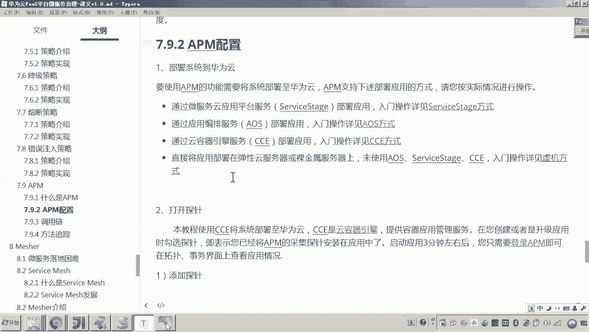
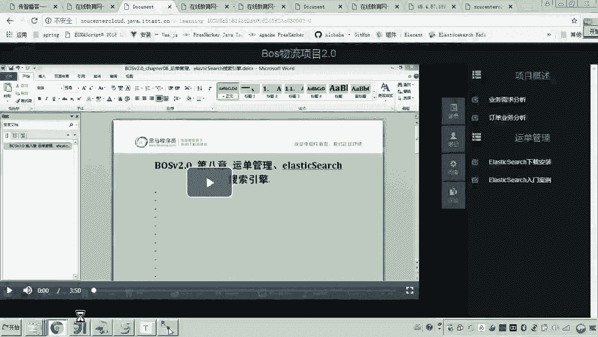
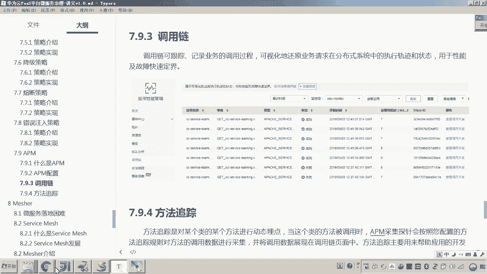
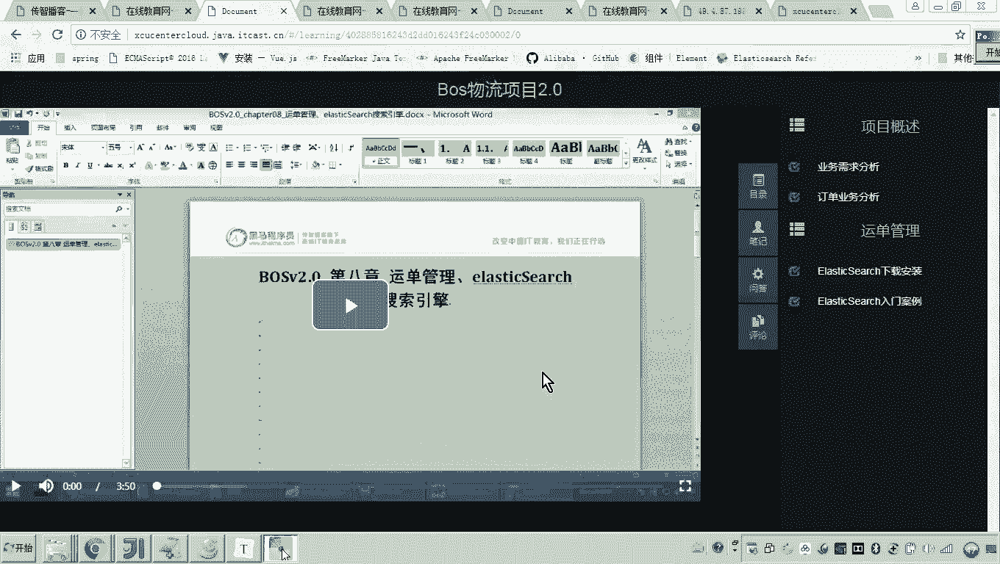
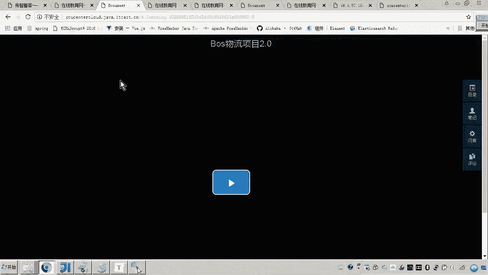
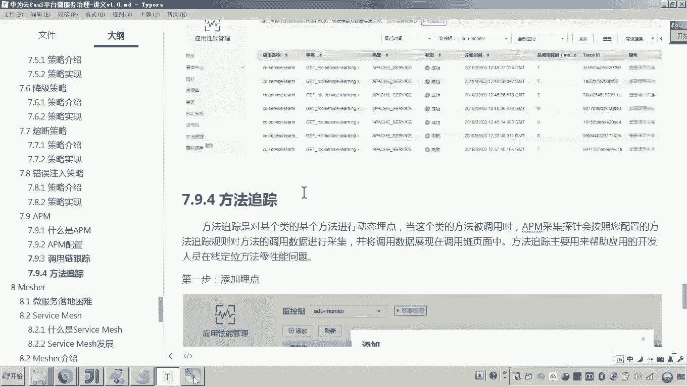

# 华为云PaaS微服务治理技术 - P139：17-微服务治理-APM-介绍调用链跟踪和方法跟踪 - 开源之家 - BV1wm4y1M7m5

好，那么刚才我们是不是讲了APM的配置，对吧？那现在配好了之后呢，应该说数据呃，我们刚才也在操作了这些系统啊，应该过一会儿呢数据已经来了。大家可以看到啊，现在在概览这里头，这是不是就已经点亮了。对。

点亮了之后呢，我们在拓扑图当中，各位可以看到是不是通过一个图形化的界面，哎，可以展示出来你的应用系统内部之间的什么交互的这些哎流程，哎，调用的关系，对吧？嗯，好了，那现在呢我们来看，那接下来要讲什么呢？

呃，这里边我重点讲两个啊，因为这里边大家可以看到它有很多的功能啊，有 circleQ分析呃，有这个什么呢？有这个调用链方法跟踪，还有事物资源库等等啊。那这里边呢我重点讲调用链和方法跟踪。

因为这两个也正是我们在进行微服务治理当中哎，所经常用到的一个功能。😊。

那什么是调用链呢？刚才我们说了的服务很多，现在我请求这个画面，各位就拿这个来例子啊，我请求这个画面。😊。

我请求这个画面，各位，我是不是要获取视频的播放地址，对吧？而视频的播放地址，这个请求的流程大家还有印象吗？是怎么做的？😡，就是这里是我的前端，前端是不是会首先请你到网关，对吧？

而网关这时候又请你到一个微服务，是哪一个微服务呀？😊，是不是就是哎有些同学可能想起来了，是不是就是我们说的那个learning学习服务，对吧？而学习服务接到请求之后。

他是不是会去检测一下学生的这个学习权限。如果有学习权限权限的话，学习服务是不是会最终去请求一个port view来拿到这个视频的播放地址？😊，大家可以看到这是不是就是一个链条？😊，没错吧。

而这个链条怎么样去监控哎，遇到问题，我们怎么知道哪里错了呢？所以这个是我们在因微服务去运维啊，甚至微服务我们去开发的时候呢，去排错啊，那是经常会用到的。😡，好了，那现在呢我们来看吧。

注意这里边呢呃调用链的跟踪。这里边各位你刷一下。😊。

你算一下数据。好，比说刷数据干嘛呀？那你来看刚才你是不是把已把这个探针都已经打开了，并且这个拓扑图这个数据是不是都已经到了。那你点调用链。各位在调用链这里头，你搜索一下。

你可以看到最新最新的这些请求的这些事物都已经在前面。😊，也就是说你每刷新一次它就会干嘛呀？会产生一个trace IDD各位，刚才我是不是说过这个就是他怎么去记录这个调用链的跟踪呢？😡，对啊。

我这个链条后边有很多次调用微服务，他怎么就知道在哪一点有问题呢？就是它在最最初始端会生成一个ch ID就是我这一次的这个什么呀，这次操作。

这次事物的这个ID而这个ID呢会伴随着这个请求一次往下传传到最后边。而这个ID在哪里出了问题呢，它就会采集到。比如说在这里出问题了，它就会把这个问题呢给采集到。对，这样的话。

各位你就知道了这个ID就是这一次操作，对吧？而这一次操作哪里出了问题了，它是不是就可以采集到了。😡，他是不是就就能知道这个链条里边的哪一步出错了。你懂我意思吧？哎，好了，那大家来看，那现在呢各位呃。

大家可以看到这个是不是就是一个成功，对吧？成功那成功有人说老师这是啥成功呀？对，那我们来看一下吧，我觉得大家也能看得懂吧，看好应用名称，这个应用是不是我们的网关服务呀？网关服务请求什么数据。

请求什么发起什么事务了？get。😡，网关是不是发了一个get请求，因为我们前端是不是都是通过网关来获取数据的。get请求后边你看他是请求啥，是不是请求我们的学习服务。

并且请求我们学习服务的get media。😡，因为各位我刚才已经给大家介绍了啊，说在我们的这个前端的这个画面当中，你只要刷新在这里是不是就有一一次请求会请求我们的网关，而网关会请求我们的这个学习服务。

请求学习服务干嘛呀？😡，请求学习服务就是要拿这个。😡，这个这个这个视频的播放地址，而为什么请求学习服务拿视频播放地址呢？因为学习服务掌握了学生的学习数据，他知道这个学生能不能学这个视频。

他会先对这个学生的这个这个学习的这个权限进行校验。如果他通过了，那么学习服务就要调用port头 view来最终拿这个视频的播放地址。因为portal6而因为portal view这个服务呢。

专门他就是一个数据视图服务，就是就是用来提供查询数据的。😡，你懂我意思吧？所以在这里边大家可以看到来打开。那么这个就是咱们刚才在学习话唉学习的这个界面当中刷新，然后他来取这个视频播放地址的一次请求。

对吧？而这一次请求的状态是不是就是成功了。那这就说明这一次调用是不是成功了。那有说老师成功了，是不是就不用看了，当然不是啊，你看后边是不是有一个叫查看调用关系啊。那在这个调用关系这里头。

各位就清楚的记记录了什么呀？清楚的记录了，你整个调用过程当中所调用到的什么类和方法。😊，对。那有说老师你调用的类和方法，难道就就这几个呗？😡，对你可以看到这这是啥，我们简单看一下吧。😡。

首先最初是不是到晚湾？😡，网关是不是在次请求learning学习服务，学习服务是不是最后请求portto view。各位，我说的没错吧，所以你会发现这个链条从这个从这个从上到下的顺序。

你会发现这个这个调用的顺序是不是就是这样调用的。哎，而最后一步我觉得大家你也能看得懂吧。最后一个是啥？😡，最后一个是不是就是查询数据库了？😡，并且查询的这个数据库是什么数据库？😡，mongoDB。

因为我们知道portto view是不是连接mongoDB来查询数据库的，对不对？对，所以说最后一个你看是不是就是mongodB的这个什么数据库吧哎。😡。

所以这上边的这个就是我们说的这个整个的这个呃调用链，你可以简单的先呃初步了解一下。哎，并且你这里边你看它还有堆栈信息，比如这个get media方法，那这个方法内部它到底底调用了多少类，多少方法。

看这里边显示的非常清楚。😡，没错吧，哎，这就是调用链，这就是调用链。对，嗯，好了，那么这个调用链有人有人说老师，那其他的所有的所有的这个调用的过程，它这它它这个层次，比如说举个例子，你看你看这儿。😊。

好啊。也就是说他有很多这个方法，哎，他有很多个层次的调用。那那到底他会把沿途经过的所有类方法都在这里显示吗？那我这里边回答你不是。😡，如果你想让他显示，如果让他你想让他跟踪哪些方法。

哪些类那就是哪些类的哪些方法。那么你要在方法跟踪里头去干嘛去添加。所以大家来看啊，我这个讲义这里边写了有7。9。3章节是调用链哎，调用链跟踪。😊，而下边有一个叫方法跟踪，我告诉你啊。

他俩是一块儿来操作的。就说你想跟踪详细的这个调用链里边所经过的具体的这个类和方法。那么你要在方法追踪里边要把这些类这些经过的这些类和方法。假如说比如说举个例子，嗯，我想跟踪什么呀？😡，你打开代码。

对我想跟踪portal view这个类。😡，这个类是不是就是portto view的接口类啊？而这个类下边的哪个方法呢？我就想跟踪这个方法。对，那我就要怎么怎么弄啊，添加了，看好复制它的权限定名类路径。

然后呢，在哪里呀，在这里添加。😡，哎，这里边选择port头啊啊添加这个方法名，是不是就选择你刚才假如说我想我想跟踪这个方法，那你就选择这个方法。😡，看懂了吧？对，这样的话，哎。

这就相相当于跟踪这个方法了。然后这里边呃这个方法参数啊，这个取值啊，咱们先暂时不管它，你先追踪时长，假如说我想让他给我跟踪这个方法的执行，追踪时长，哎，我就我就让他跟踪100秒，对吧啊，太太短了。

我担心问题发现不了是吧？好了，我让他给我跟踪一小时。😊，看懂啥意思吧？对，那么呃追踪的最大次数就是我我让他给我跟踪多少次，采集多少次数据。对，所以这里面你就可以输。😡，懂我的意思吧？所以这样的话。

你会发现你想详细的跟踪某一个类某一个方法，你要把这个类核方法都添加进去。对，这样的话大家可以看到我是不是把这些类这些方法，我沿途经过的这些类核这些方法填进去了。对，添进去之后了。

各位在这个调用链调用链跟踪这里头呢，你就可以对非常详细的能够跟踪到这个方法，跟踪到这个方法。😡，你懂我意思吧？哎，好了，那这个呢我们先干嘛呀？先简单的去呃了解一下啊。因为现在我还没有给大家测试啊。

只是看到数据是有了。但是有人说老师我并不知道怎么用啊。对我们先了解一下什么是调用链跟踪这个方法跟踪，我们怎么配置这个方法跟踪。好。😊。

