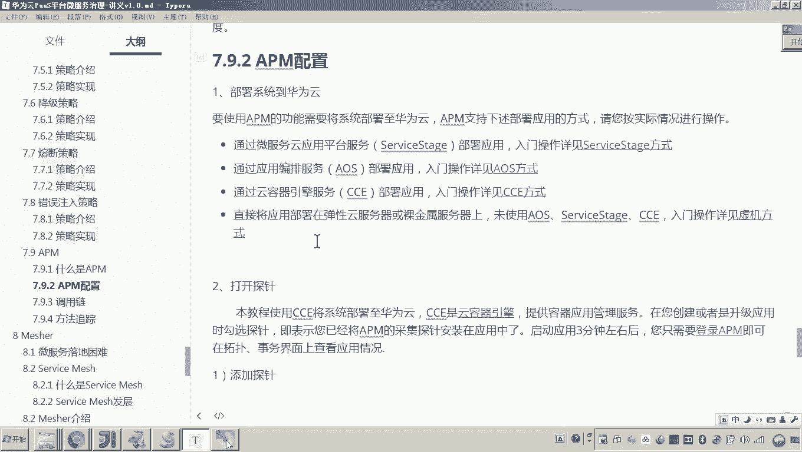
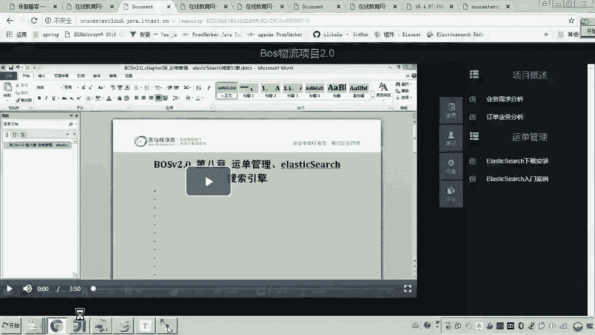
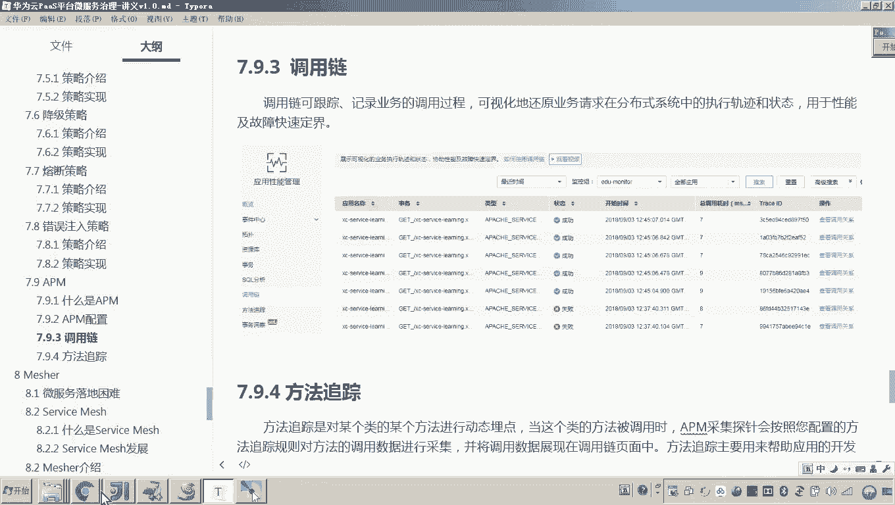
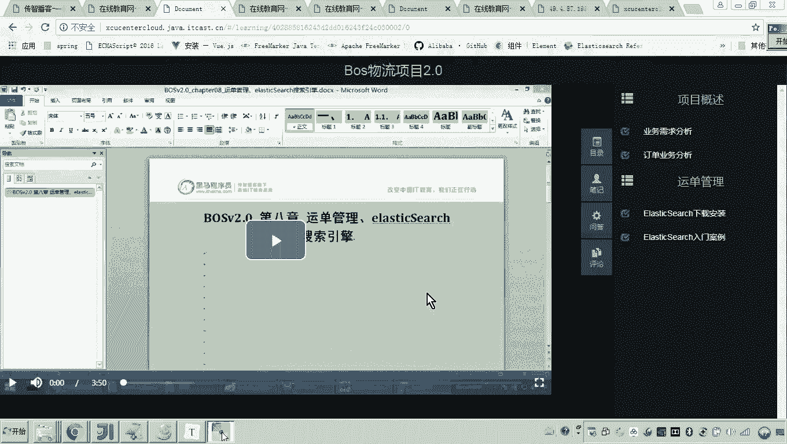
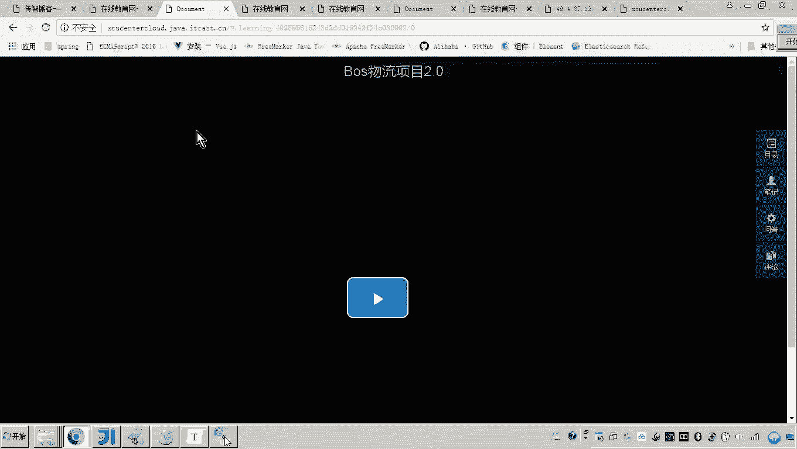
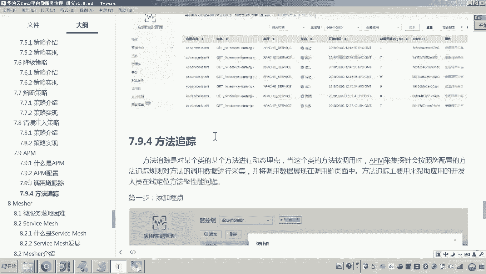

# 华为云PaaS微服务治理技术 - P139：17-微服务治理-APM-介绍调用链跟踪和方法跟踪

在本节课中，我们将要学习华为云APM（应用性能管理）中的两个核心功能：调用链跟踪和方法跟踪。这两个功能是微服务治理中进行问题排查和性能分析的重要工具。

上一节我们介绍了APM的基本配置，并观察到数据已开始上报。本节中我们来看看如何利用这些数据，通过图形化界面深入分析服务间的调用关系与内部方法执行情况。

## 调用链跟踪

什么是调用链？在微服务架构中，一个用户请求往往会触发多个服务间的连续调用。例如，请求一个视频播放页面，其流程可能如下：前端请求网关，网关请求学习服务，学习服务在验证权限后，最终请求门户视图服务以获取视频地址。这一系列调用形成了一个链条。

调用链跟踪的目的，就是完整记录并可视化这个链条，以便在出现问题时快速定位错误发生在哪个环节。其核心原理是：在请求的初始端生成一个唯一的**Trace ID**，该ID会随着请求在服务间传递。APM探针在每个服务节点采集数据时，都会关联这个Trace ID，从而将分散的调用信息串联成完整的链路。

以下是查看调用链的步骤：

1.  在APM控制台的“拓扑图”确认服务间连接已建立后，切换到“调用链”页面。
2.  页面会列出最近的请求事务，每个事务对应一个Trace ID。
3.  点击一个成功的事务，可以查看其详细的调用关系图。

例如，一次成功的视频地址请求，其调用链会清晰显示从网关服务（发起GET请求）到学习服务（调用`getMedia`方法），再到门户视图服务的完整路径，最终末端会显示对MongoDB数据库的查询操作。通过展开每个节点，还能看到具体的类、方法及堆栈信息。

## 方法跟踪

调用链展示了服务间的宏观调用关系，但如果我们想深入了解某个特定方法内部的执行细节（例如，它又调用了哪些其他类和方法），就需要用到“方法跟踪”功能。

方法跟踪允许我们配置需要深入监控的具体类和方法。APM会对此方法的每次调用进行采样，记录其执行时间、参数等详细信息，并集成到调用链展示中，使得链路分析更加深入。

以下是配置方法跟踪的步骤：

1.  在APM控制台找到“方法跟踪”功能页面。
2.  点击“添加”按钮，新建一个跟踪任务。
3.  在配置中，需要指定要跟踪的类的**全限定名**（完整包路径和类名）以及具体的**方法名**。
4.  此外，可以设置跟踪的持续时间（例如1小时）和最大采样次数，以控制数据采集的范围。

例如，如果我们想跟踪门户视图服务中某个接口方法的内部执行情况，只需将其类名和方法名添加到跟踪列表中。配置完成后，在调用链详情中查看经过该方法的请求时，就能看到该方法内部更细粒度的调用层次和执行耗时。

本节课中我们一起学习了APM的调用链跟踪与方法跟踪。调用链跟踪帮助我们纵览请求在微服务间的流转路径，快速定位故障点；而方法跟踪则让我们能够深入代码内部，分析特定方法的性能瓶颈。两者结合使用，构成了微服务性能监控与问题排查的强大工具箱。