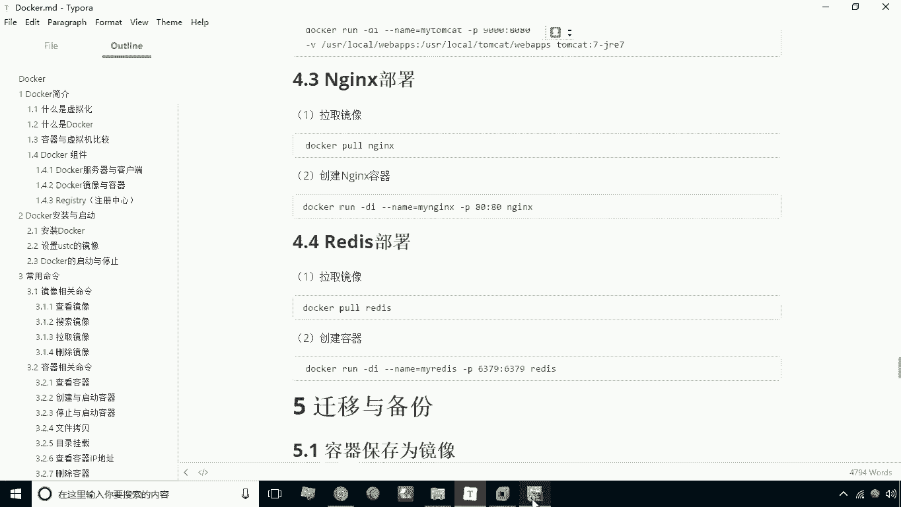
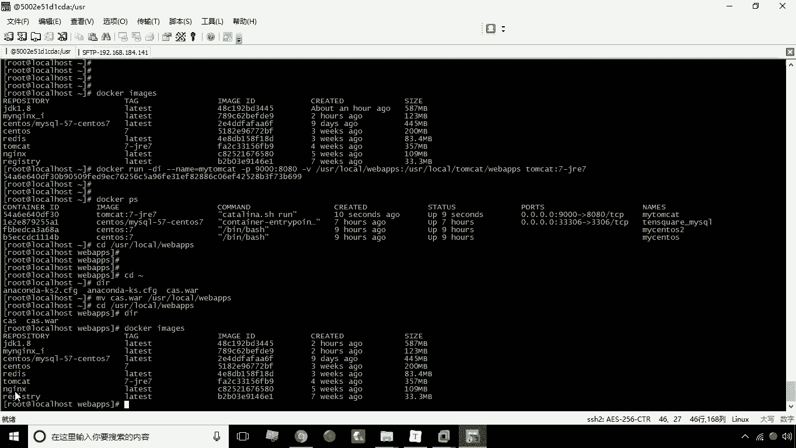
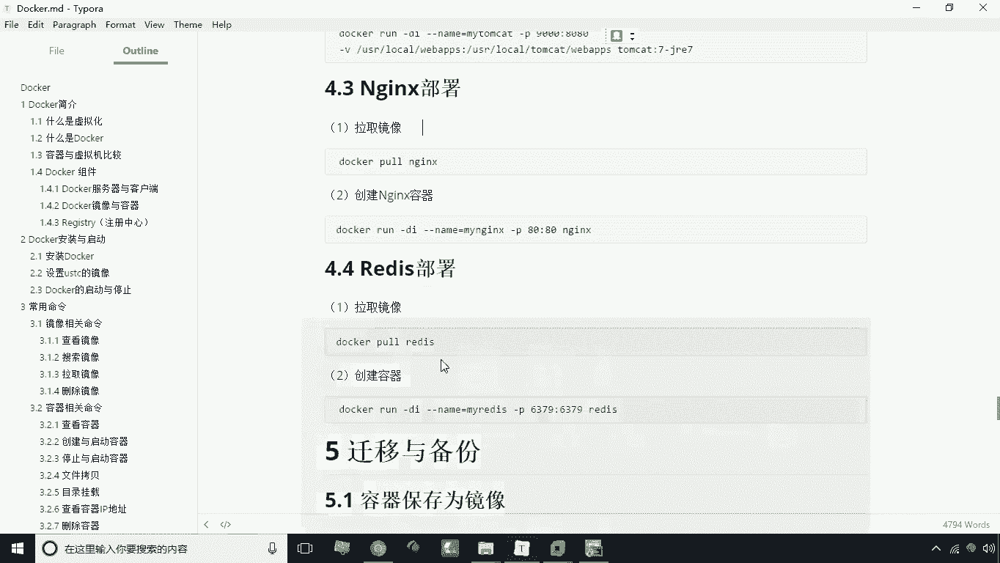
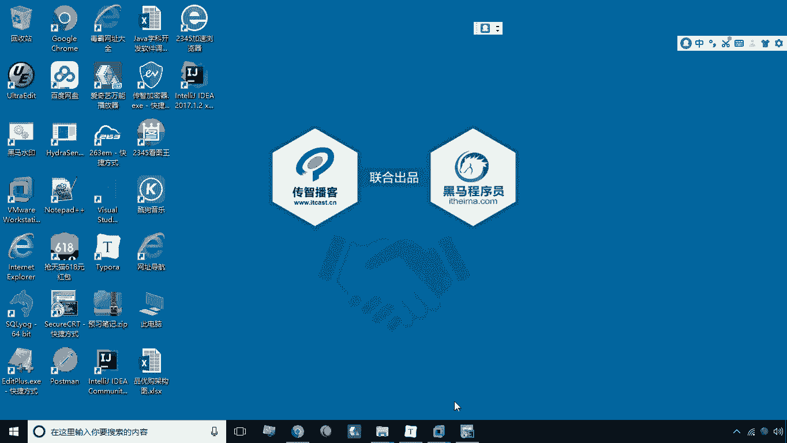
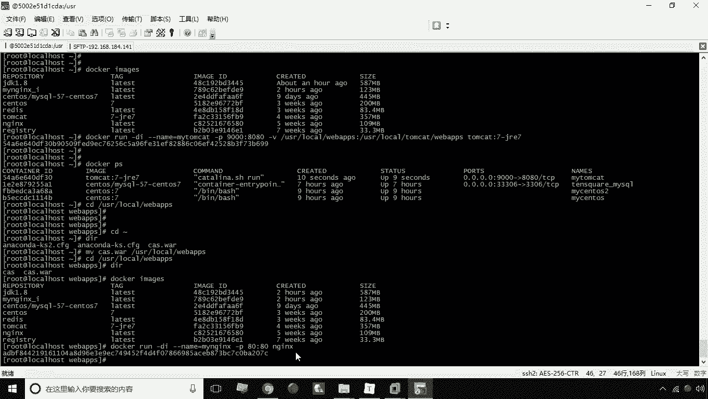
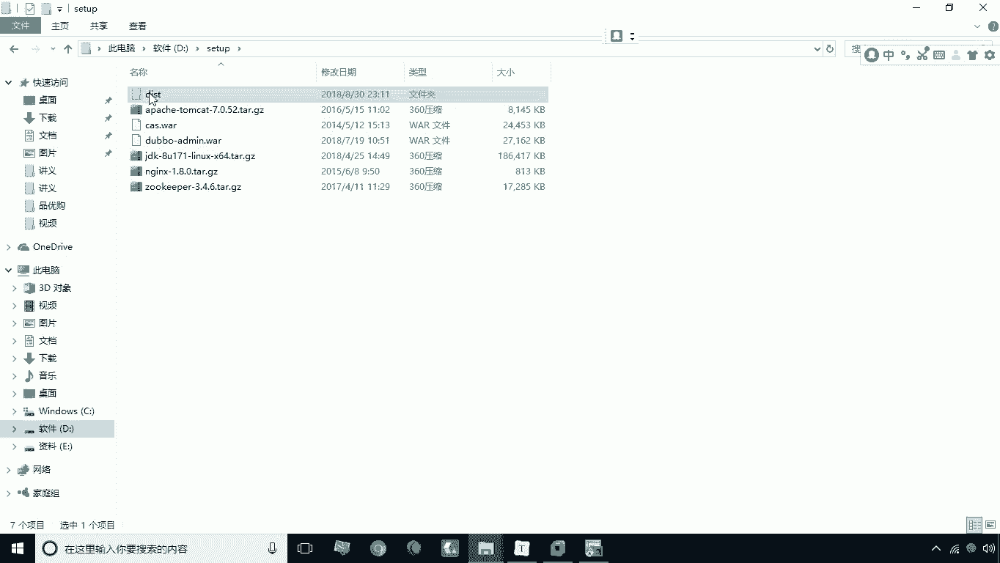
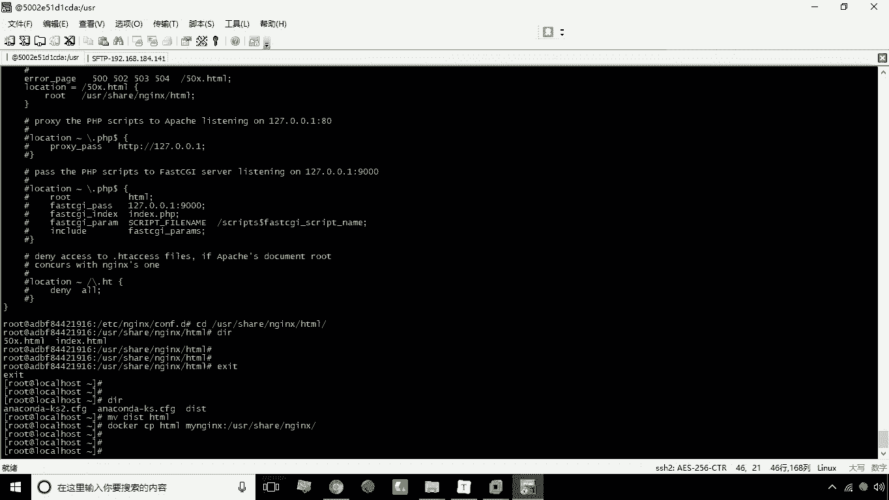
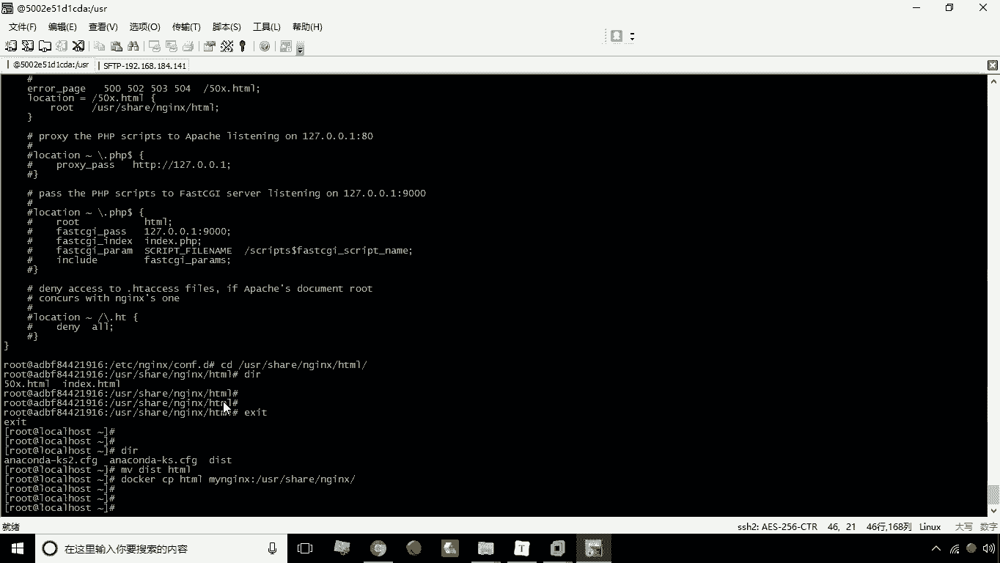
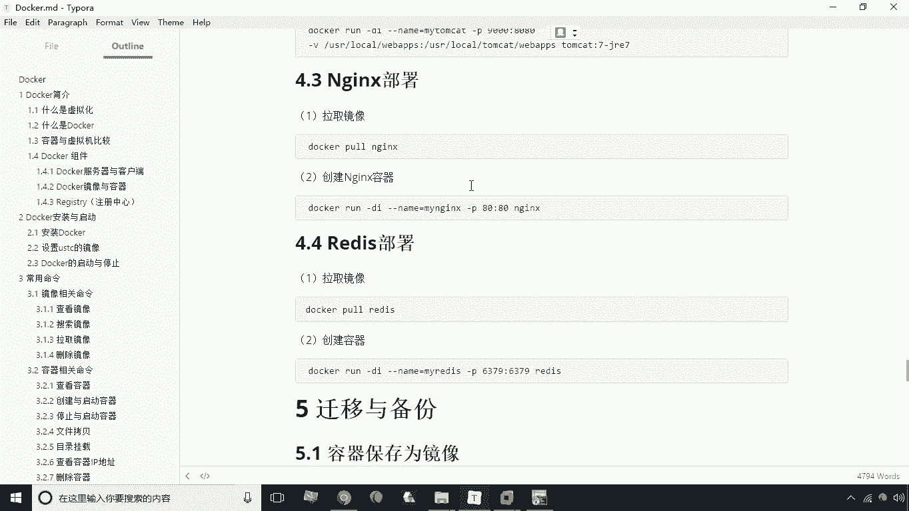

# 华为云PaaS微服务治理技术 - P13：13.nginx部署 - 开源之家 - BV1wm4y1M7m5

接下来呢我们来讲解如何用docker来搭建和部署NGINX，首先我们第一步应该拉取这个NG镜像，NG镜像，这一步就是docker pull nginx，这一步呢我们是可以省略的啊。

啊因为我给大家提供的镜像，已经提供了这个NGX的镜像了，大家可以直接的去使用这个NGINX可以了啊。

那么这个NGX这个镜像拿过来之后，下载完成之后。

那接下来我们就来开始创建一个NGX容器。

RUDI杠杠name等于买NGINX，My nginx，然后这个映射端口八零冒号八零啊啊，后面那写NGINX，这是我们的这个镜像名称，好回车，那我们在这一句这个这一句创建的时候呢。

我们并没有像上面他们cat部署tomcat一样，我们去这个呃做这种这个这个目录的映射对吧，那么这种墙我要想部署，是不是得用CP命令，将我们的静态页面拷贝到我们的NGX里对吧。

唉就是说这时候我们部署就需要拷贝了。

呃，我们现在把这个容器创建好之后呢，接下来我们可以测试一下，这时候我们会发现啊，我们能看到这个index一个欢迎页面是吧，哎这就表示我们NGX容器已经安装成功了，那么接下来我们要考虑这个问题。

就是我怎么样才能把我们的静态页面部署到N，这个四零啊，静态页面部署的engines，我们现在给大家提供一套测试用的静态页面啊，啊在这儿有一个DI，这里有一个十次方的这么一个。

整个网站的这么一个这么一个页面啊，我现在就想把这个页面给他传上去，那么怎么做呢，首先我们应该把DISS的这个呃。

这个整个这个目录上传到我们的这个速度机上，因为是传一个目录，所以说我要写杠二地盘set up下的dust好，好现在已经上传成功了，我们来看一下啊，看一下，现在已经有这个文件夹了，那么有这个文件夹之后。

那么问题来了，我怎么样才能把这个文件夹，拷贝到哪一个目录下呢，这时候我们就得需要去进到容器里去看一下，是吧，哎进到容器里看一下，那这时候就是ESEC杠T，然后接下来就是买BGX。

杠B杠bash好计算容器之后呢，我们来看一下现在这个这个结构，我现在可以告诉大家在哪儿啊，在这个这个NG安装的etc目录下了，我们可以看到etc etc，那么etc目录呢这里头有一个NGINX，看了吧。

这个是它安装到这个位置了，Ngx，那么NGX，下面大家看是不是就是一个N这个表，典型的一个结构啊，那我们先来看这里有一个N这个点CONFIG，那么很显然它是什么，它是我们N这个的N这个它的一个配置文件。

我们用cat命令，然后呢把它打开啊，来查看一下内容，这时候就会发现这个内容实际上是什么呢，是只是配置基本的一些配置，然后这里有一句叫include啥意思导入，也就是说他这里头需要导入。

另外的一些配置文件，那配置文件的支持etc下的N这个下载CONFIG，点D下载新点CONFIG，也就是说我们可以把配置写的分别写的不同，很多配置文件中通过这个音刻录的导入，这样呢可以实现我们配置文件啊。

就是也可以实现配置文件的一个模块化，方便之后的维护啊，那么所以说咱们现在要做的事，就是要怎么进到CONFIG点D这个文件夹，看一下，这里头有一个default点CONFIG，我们看一下。

这里其实就是配置了一个server对吧，配置这个server，那么我们从这个配置中很容易就能找到什么，找到我们这里的一个目录root啊，root root是usr share下的NGINX下的HML啊。

我们现在呢就可以看一下啊，这个是不是我们的，我们会找到那个回应页面的那个目录，这里有两个文件，一个是index HTML，一个是五零差点HTML，就是我们所看到的这个换一页啊，好了。

那么把这个我们也知道了，说这个具体的位置是在这个位置啊，那怎么办呢，我现在退出退出之后，我们需要把这个dist文件夹下的所有内容，都拷贝到我们的HTML这个目录，那这时候我应该怎么办呢。

我告诉大家最好的方式是这样写，就是我们可以先把这个DI改个名改成HTM，这时候我们可以把HTML目录拷贝到这一级目录，就拷贝到USUS2share n这个字目录下。

这样一来不就把这个HML目录整个覆盖了吗，唉那这时候我们就写命令CP什么CPHTML，然后呢就是我们的满NGINX冒号usr share nginx回城好，那么经过这样一个拷贝。

这时候我们就把这个HL整个考，考到这个这个NGX目录下了啊，就会把它原来的覆盖覆盖之后。

咱们现在呢再次来进行测试，来看一下到底能不能显示出来啊，大家看一下啊。

我们现在已经把这个这个整个的这套，静态原型啊。

就给部署到我们的这个NT0了啊，这是我们说的这个NGX啊。

这个环节这个环节呢主要是啊练习端口映射啊，以及我们的CP这个命令的使用，这是关于NGX部署。

