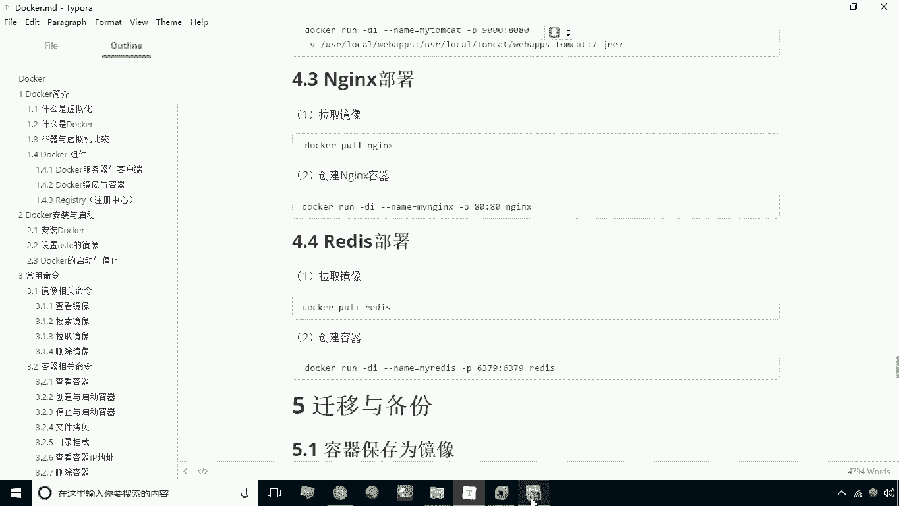
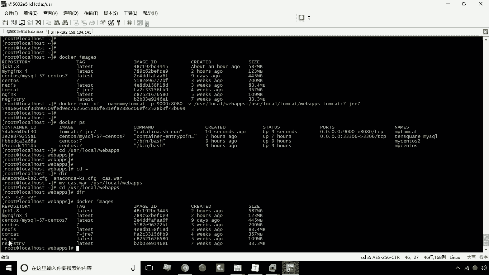
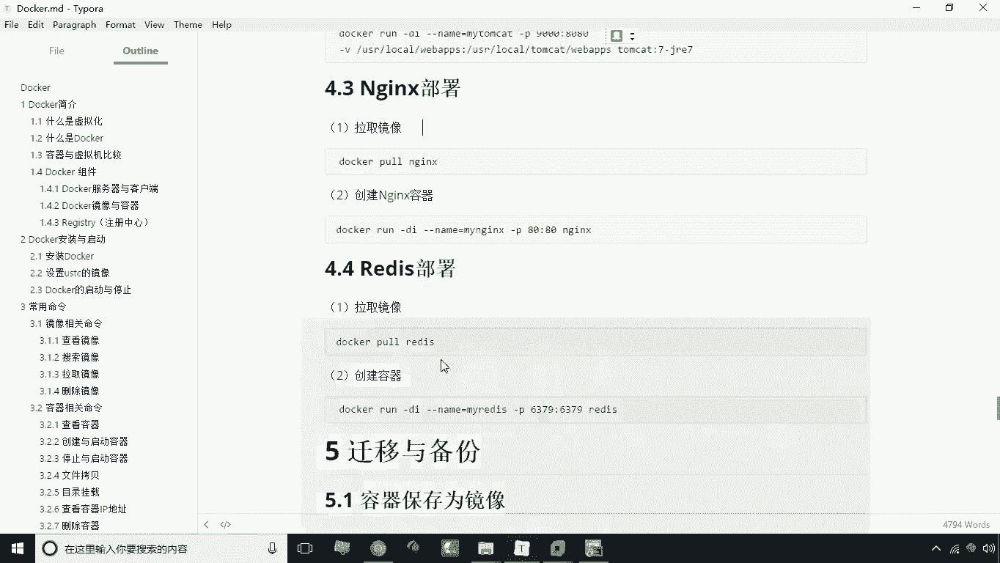
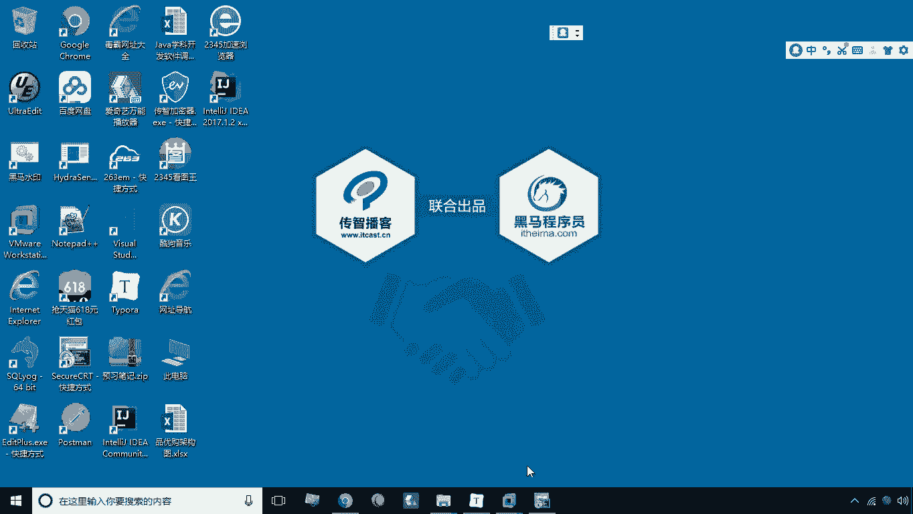
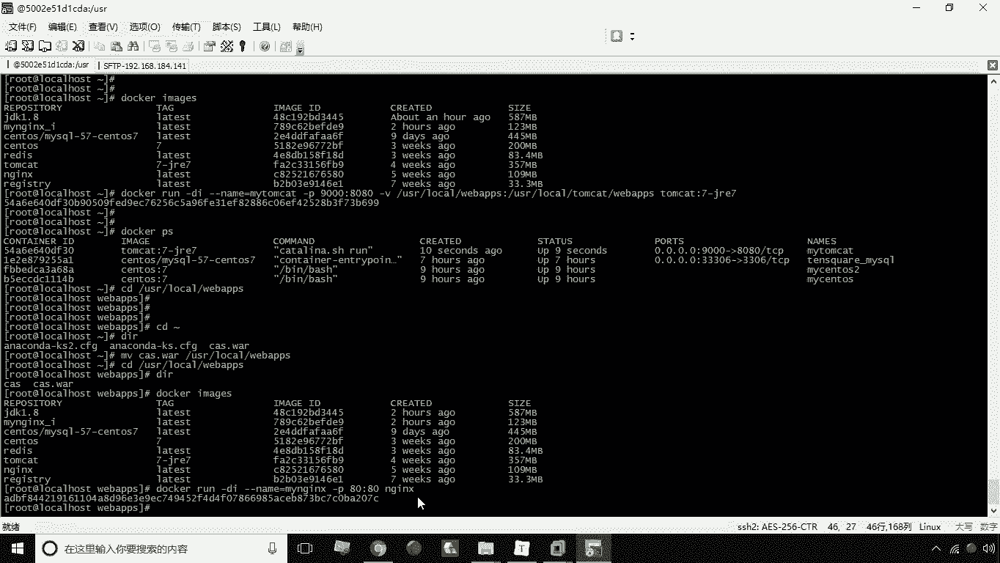
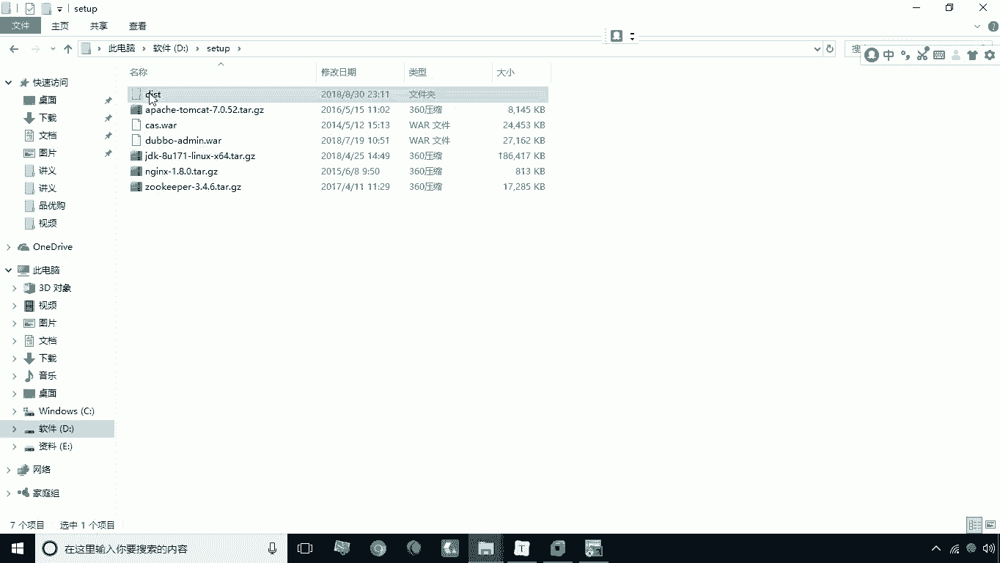
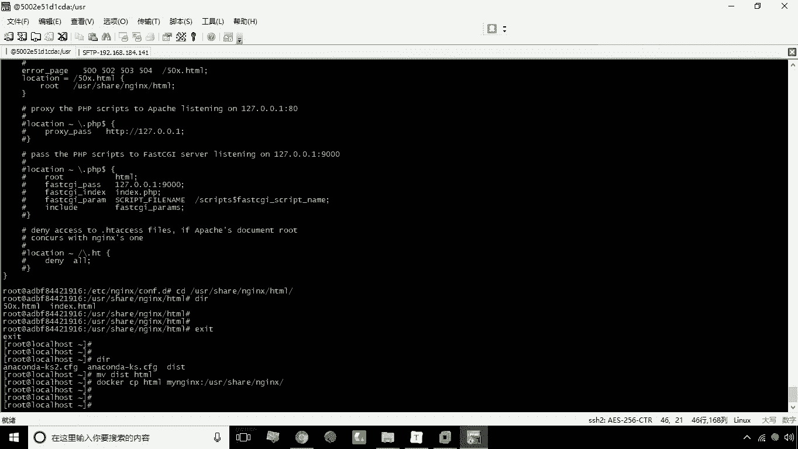
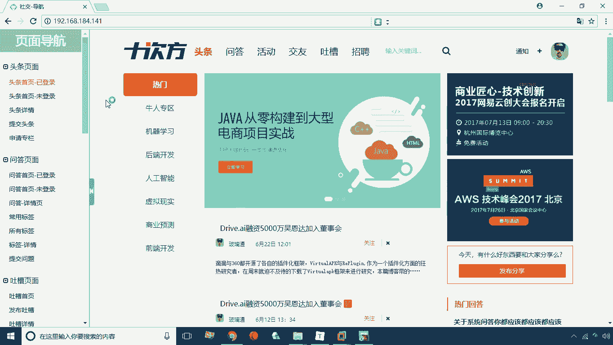
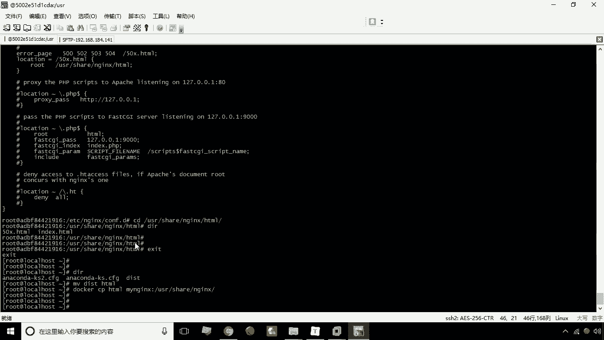
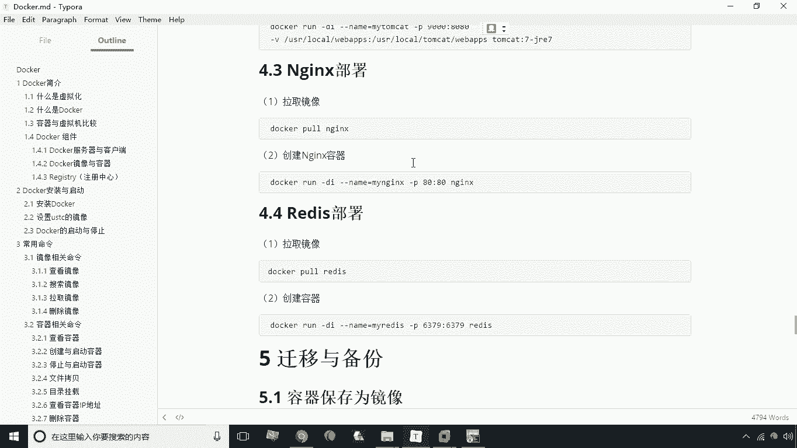

# 华为云PaaS微服务治理技术 - P13：13.nginx部署 🚀

在本节课中，我们将学习如何使用 Docker 来搭建和部署 Nginx 服务器，并将一个静态网站部署到 Nginx 容器中。整个过程将涵盖拉取镜像、创建容器、文件拷贝和配置查看等关键步骤。



---



## 拉取 Nginx 镜像

首先，我们需要从 Docker Hub 拉取官方的 Nginx 镜像。执行以下命令：



```bash
docker pull nginx
```



这一步可以省略，因为课程提供的镜像已经包含了 Nginx，可以直接使用。

---

## 创建 Nginx 容器

上一节我们拉取了镜像，本节中我们来看看如何创建并运行一个 Nginx 容器。



使用以下命令创建一个名为 `mynginx` 的容器，并将宿主机的 80 端口映射到容器的 80 端口：

```bash
docker run --name mynginx -p 80:80 -d nginx
```

与之前部署 Tomcat 不同，此命令没有进行目录映射。这意味着后续部署静态页面时，需要使用 `docker cp` 命令将文件拷贝到容器内部。

创建完成后，可以通过浏览器访问宿主机的 IP 地址来测试。如果看到 Nginx 的默认欢迎页面，说明容器已成功运行。



---

## 准备静态网站文件

接下来，我们需要将一个静态网站部署到 Nginx 中。课程提供了一个名为 `dist` 的测试网站目录。

首先，需要将这个 `dist` 目录上传到宿主机。假设上传到了 `/root/setup/` 路径下。

---

## 定位 Nginx 容器内的网站根目录

为了将文件拷贝到正确的位置，我们需要先进入容器内部，查看 Nginx 的配置和默认网站根目录。

使用以下命令进入容器的交互式终端：

```bash
docker exec -it mynginx /bin/bash
```

进入容器后，Nginx 的主要配置文件通常位于 `/etc/nginx/nginx.conf`。查看该文件：

```bash
cat /etc/nginx/nginx.conf
```

可以发现，该文件通过 `include` 指令导入了 `/etc/nginx/conf.d/*.conf` 目录下的其他配置文件。接着，查看默认的服务器配置文件：

```bash
cat /etc/nginx/conf.d/default.conf
```

在这个配置文件中，可以找到 `root` 指令，它定义了网站的根目录，通常是 `/usr/share/nginx/html`。确认该目录下存在 `index.html` 文件（即欢迎页面）后，退出容器。

---

## 部署静态网站到容器

现在我们已经知道了目标目录，接下来将宿主机上的静态网站文件部署到容器中。

一个有效的方法是，先将宿主机上的 `dist` 目录重命名为 `html`，然后将其整个拷贝到容器的 `/usr/share/nginx/` 目录下，覆盖原有的 `html` 目录。

执行以下命令：

```bash
# 在宿主机上，进入 dist 目录所在位置
cd /root/setup/
mv dist html
# 将 html 目录拷贝到容器内
docker cp html mynginx:/usr/share/nginx/
```



拷贝完成后，Nginx 容器的网站根目录内容已被替换。

---



## 验证部署结果


最后，我们再次通过浏览器访问宿主机的 IP 地址。



如果部署成功，浏览器将不再显示 Nginx 的默认欢迎页，而是展示我们上传的静态网站内容。

---



本节课中我们一起学习了使用 Docker 部署 Nginx 并发布静态网站的全过程。核心环节包括**端口映射**（`-p 80:80`）和 **Docker 文件拷贝命令**（`docker cp`）的使用。通过这个练习，你可以掌握将本地应用快速部署到容器化环境的基本方法。