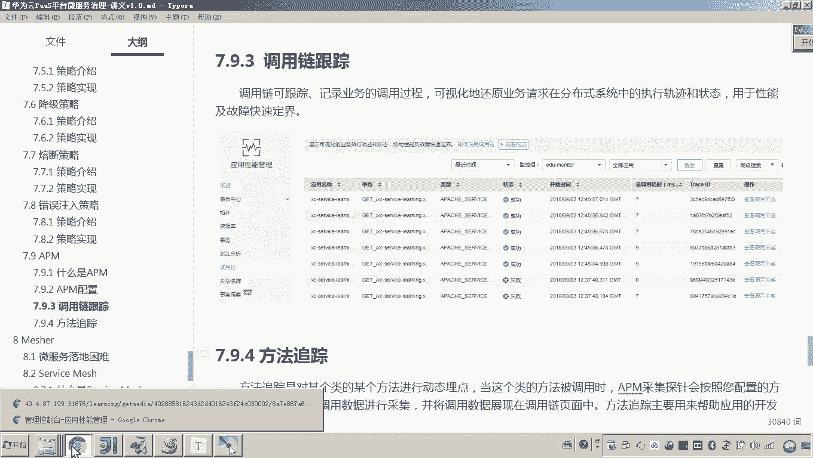

# 华为云PaaS微服务治理技术 - P140：18-微服务治理-APM-测试调用链跟踪和方法跟踪 - 开源之家 - BV1wm4y1M7m5

好，那下边呢我们就来测试一下调用链的跟踪和方法的跟踪。那这里边我们怎么测试呢？呃，我们主要是来模拟一个异常来测试，对吧？好，首先呢我们先来看这个环境我们准备好没有啊。

因为刚才我们是不是讲了这个APM的配置，对吧？好，那这里这里来看一下啊，首先这里边我要去测这个调用链的话，呃，我是不是我我想我测试什么流程啊？😊。

我想测试这个流程，大家看啊，就是还是我们说的这个在线视频的这个播放。而在这个播放页面，大家还有印象吗？他是怎么做的，是不是在前端它会请求我们的什么网关吧，而网关是不是会请求我们的学习服务。

学习服务最终会请求port view，最终拿什么拿视频的播放地址，这个是不是就是我们刚才介绍的这个调用链了，对吧？好了，那这个流程呢，各位我们已经清楚了。呃，那你这里边我们就可以来刷一刷。

各位可以看一下，这是不是就是一个操作，对吧？而这些操作完了之后，刚才我们也看到了，它这个数据其实在这个调用链跟踪这里头都已经有了。😊。

啊，搜索一下，你看这里面是不是就是成功，对吧？成功。好，呃，那么那现在那各位我们说这个成功是成功了。我们说我想哎跟踪这个详细的这个呃调用链过程当中行跟踪详细的这些类和方法的这些调用过程，那怎么办呢？

那那我们就需要在这里头添加哎添加某一个类和某一个方法。刚才添加方法我也介绍过了。那现在大家来看呃，我这里边添加了这个以下几个类的几个方法啊，注意看啊，那我给你打开看一下。😊。

你看呃，首先这个这是我们说的这个learning学习服务。哎，他那个controller。😊，呃呃，哪一个呢？我们打开代码可以看一下啊，是这个。😊。

然后呃你请求的这个get media呃，这个这个方法拿的是不是就是拿某一个课程，某一个教学计划下边的这个播放地址了，对吧？而在这个service当中，就这一行代码当中，它会去调用port view啊。

它调用port view调用port view的哪一个类呢？这个类。😊。

就是这个will course media。的这个方法叫getmedia UL。你会发现我是不是把关键的这些类和方法都添加进去了。并且此时你会发现这里边是不是就显示跟踪中是吧？也就是正在跟踪，对吧？

好了，那各位呃，现在呢各位我们来刷新一下。刚才我是不是也已经在这个页面当中也已经刷新了，对吧？已经刷新的情况下，因为是正常的嘛？大家你也看到了刚才数据是不是已经正常拿拿过来了。所以你在方法跟踪这里边。

你打开调用关系，其实这里边你会发现啊，这个界面和刚才这个这个调用链的这个那个那个那个调用关系的界面是一样的。😊，也就就是说什么呢？调用链跟踪这里头你查看调用关系。

你会发现对你会发现这个界面和方法跟踪里边，你打开这个调用关系这个界面你看是不是一样。对，所以这个就是我我刚才说的这个调用链需要依赖方法跟踪里边的一些类和方法的设置，可以详细的对类方法啊进行跟踪。😊。

那这里边在整个的这个这个界面当中，你可以清楚的看到呃哪些类方法被调用了，并且状态是成功了，对吧？那现在我想模拟一下失败。哎，我想看一下，哎，这个过程哪里出现失败了。😊。

好，那怎么模拟呢？😡，这么弄。在这个呃前端的这个播放页面，你刷新一下各位，他是不是会请求很多的这个。

URL啊。对吧其中有1个URL一定是这个前端请求我们说网关啊，网关请求学习服务来拿这个播放视频地址了。所以你看点击。😊，哎，点击不是这个啊，我给你找一下。点这个诶，也不是这个。点这个你看是这个。

因为这个你可以看一下响应的信息，这是不是就是视频播放的地址。所以这个就是我们说的那个对那个请求视频播放地址的UL。但这个UL当当初各位还有印象吗？这一点是不是就是我们说的那个恩克斯的那个。😊。

杠API是不是走N尼了？😡，所以这里边呢呃你这么测也行啊。呃，我我我教你一种非常直接的方法，就是我想测一下这个这个这个微服务到底能不能通呃，你我可以对我可以为了避免说由于N的问题导致的什么什么原因。

那好了，那我就直接请求我直接请求微服务就可以了。😡，行不行？所以我就直接请求微服务了。那我直接请求微服务的话，它的地址是啥呢？那这个地址大家应该知道吧，这是微服务的一个访问方式。

外网的呃我们的这个外网IP的一个访问方式。微那个工作负载的访问方式之前我在部署的时候，我都介绍过了啊，这里边我就不说了哎，然后呢通过这个就可以访问到这个学习服务的这个地址，就get media看懂了吗？

所以这里边大家可以看到对我是不是就没有走。那这样的话是不是就排除了这个的问题啊。😡，也就是说我因为你各位你要知道啊，你经过的东西越多，它可能出你经过的步骤越多。

经过的这个这个这个这个呃进程或者经过的这个软件越多，那你是不是就发现呃，可能如果有错了，不好排除啊。所以我建议你你就直接你在排错的时候，直接访问微服务来排除。这样的话，一旦有错了吧。

应该说就是微服务的问题。对好了，那现在呢我们就通过微服务的地址来访问，访问之后，这里边是不是就正常。那现在我想模拟模拟什么模拟不正常。那我就输入，我就随便输随便输入的话，各位因为这个ID的不存在嘛？

在数据库，所以他这是不是就报错了。😡，对，报一个什么CSE的这个内部错误是吧？那这个CSE内部错误报出来之后，在我们说的这个调用关系调用链当中，我们来看一下他这你看是不是有失败了。😡。

但是到底是哪一步失败了，我也不知道，所以我就查看调用关系。我来看好，通过这个调用关系你就可以知道来，你来看一下。😡，在学习服务这里头，在学习服务哦，我知道了，原来是学习服务往下掉。

我问你portto view失败了吗？😊，po萄费失败了吗？就是整个调链的时候，port view是一定是都是成功的。你看port view是不是正常了？😡，对不对？而这个learning出错了。

就在哪一步？就在这一步出错了。这这个出错的代码的位置在哪呢？就这个get me。😡，这个get密要具体的代码的位置在哪呢？点击对栈跟踪。😡，各位，你看详细非常详细，这里边列出了哪一行代码报的错。😡。

大家看懂了吗？对，这就是我说的调用链跟踪。明白吧？所以来我再给你总结一下啊，就是说在我们说的这个调用链和方法跟踪具体是怎么配合试实用了？你现在先先要搞清楚一点，你想跟踪哪一个链条。😡，你要确定这个链条。

假如说我刚才我要跟踪的是什么呀？是这个呃在线视频播放。😡，这个。在线视频播放这个这个这个业务。而这个业务当中，我想跟踪这一个链条就是用来去呃根据请求学习服务。

根据课程ID和这个教学计划的ID来查询它的对应的视频播放地址。我就想跟踪这个链条，那怎么办呢？那你得知道它调用的是哪些微服务，你详细的把那些微服务的详细的这个重要的核心的这些类方法。你在哪里呀。

你在这个呃来，我打开啊，在这个。😊。

在这个方法跟踪当中，要把它添进去。你懂吧？在方法跟踪当中要把它添进去。好，这个这个筛选过期了啊啊登录一下。嗯。然后然后点点击什么呀，调用链。对吧点击调用链。然后呢，你说我想跟踪具体的呃，我想看一下。

可能是这个类这个方法有问题。那就在这儿把那个类核方法填进去啊，然后追踪时长呢尽量稍微长一些啊。好了，也就是说你添加完成了之后，这个时候你再进入调用链。当他一旦报错。

你可以查看他们的什么他们之间的调用关系。通过调用关系，你清楚的可以看到下边这个微服务，就是这个被调用方的，就是学习服务不是要调用port view嘛？而这个port view这里边是没有报错的。

看懂了吗？它是正常的。而真正报错的是上面这一点，而具体上面这一点呃哪一行代码报错了，你在堆暂跟踪这里边可以清楚的看到第37行。😊。

大家懂这意思了吧？好，那以上呢就是我们说的APM调用链跟踪和方法跟踪。那至于呃我们看到这个M里边是不是还有cirl分析啊？对大家可以看到，因为我我刚才的整个的这个调用链的这个过程中。

这个这个业务流程中啊，它其实并没有用到myql数据库。那你可以测试一下对测一个业务流程，看一下，让他用l数据库，你就在这里边就可以能够跟踪到所有请求数据库的sr语句的这些监控的指标。嗯，好呃。

那么以上呢就是我们说是采用APM来监控我们微服务的运行的状态以及问题的跟踪方法。好。😊。

