# 华为云PaaS微服务治理技术 - P140：18-微服务治理-APM-测试调用链跟踪和方法跟踪 🎯

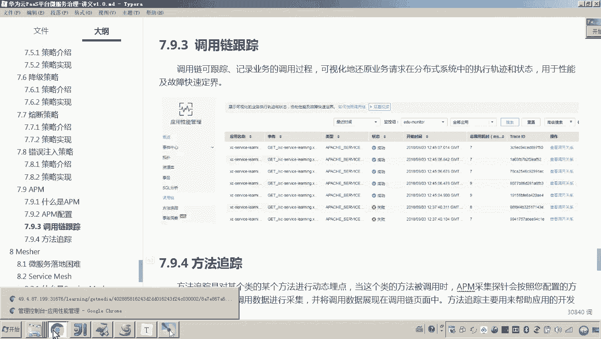

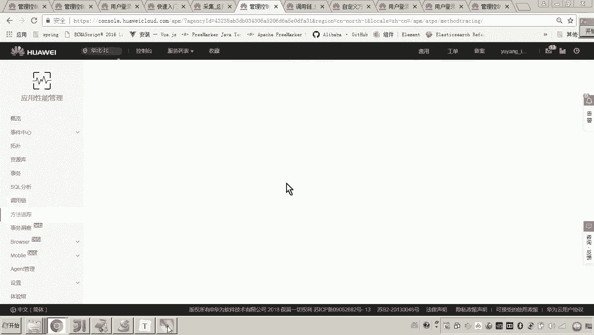

在本节课中，我们将学习如何测试华为云APM（应用性能管理）的调用链跟踪和方法跟踪功能。我们将通过模拟一个异常场景，来演示如何定位微服务调用链路中的问题，并查看详细的代码级错误信息。

## 概述

上一节我们介绍了APM的基本配置。本节中，我们来看看如何实际运用调用链跟踪和方法跟踪来诊断微服务中的问题。我们将模拟一个在线视频播放的业务流程，并故意制造一个错误，以观察APM如何帮助我们定位问题根源。

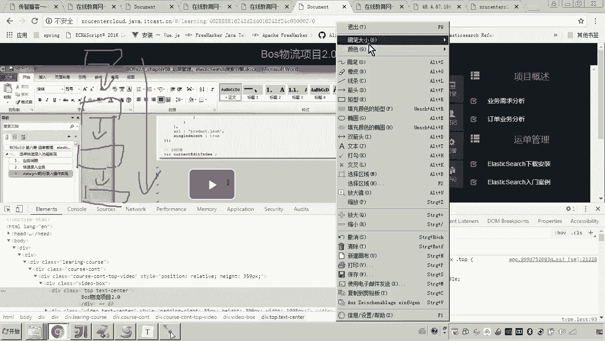

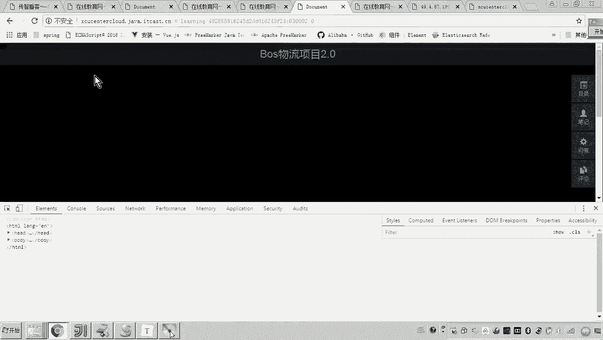

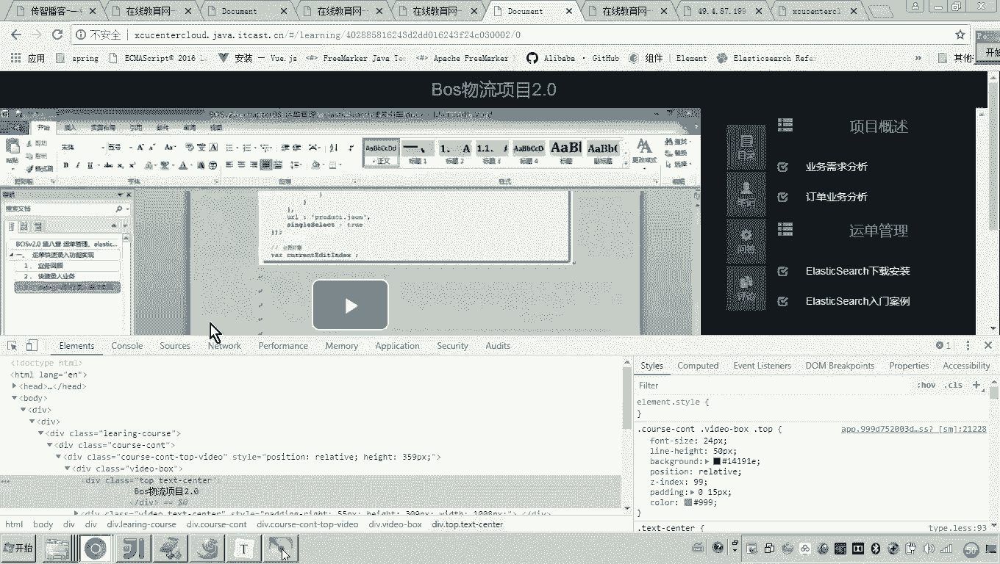

## 测试环境与流程确认

首先，我们需要确认测试环境已准备就绪。我们将测试“在线视频播放”这个业务流程。

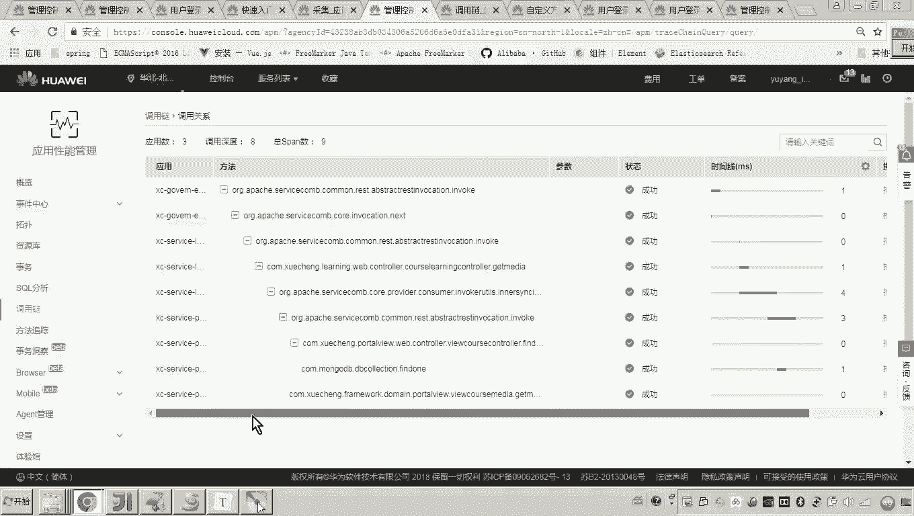

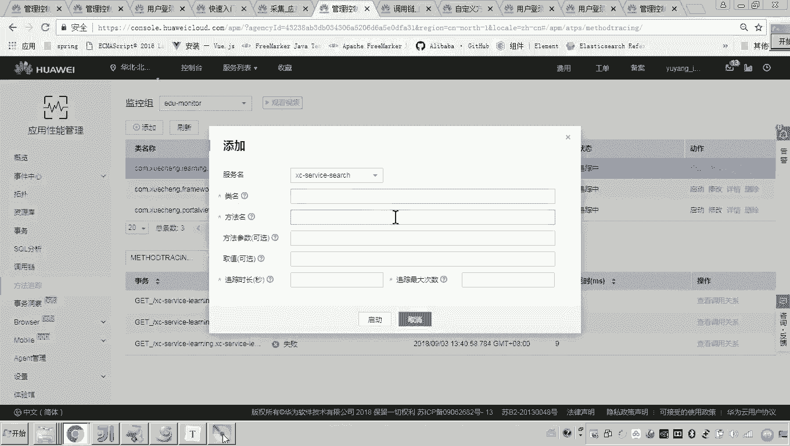

该流程如下：
1.  前端请求网关。
2.  网关请求学习服务。
3.  学习服务请求 `port view` 服务。
4.  `port view` 服务返回视频播放地址。

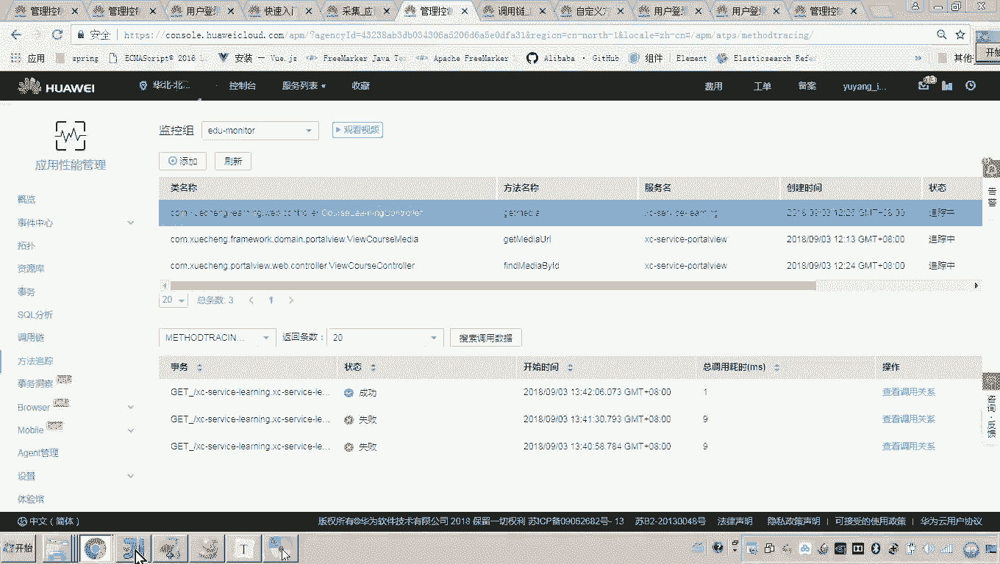

这个流程正是我们之前介绍的调用链。我们已经清楚了这个流程，现在可以开始操作。

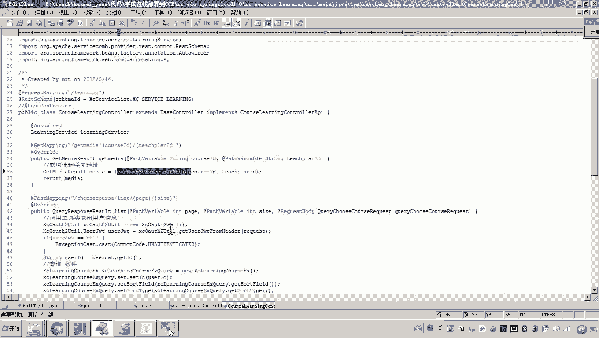

## 配置方法跟踪

成功调用后，数据会出现在调用链跟踪列表中。但如果我们想跟踪调用过程中具体的类和方法调用详情，就需要配置方法跟踪。

以下是需要添加跟踪的关键类和方法：

*   **学习服务 (`learning`)**:
    *   **类**: `MediaController`
    *   **方法**: `getMedia`
    *   **说明**: 该方法用于获取指定课程和教学计划下的播放地址。在其Service层代码中，会调用 `port view` 服务。
*   **`port view` 服务**:
    *   **类**: `TeachplanMediaController`
    *   **方法**: `getmediaUrl`
    *   **说明**: 这是学习服务调用的下游方法，用于获取最终的媒体URL。

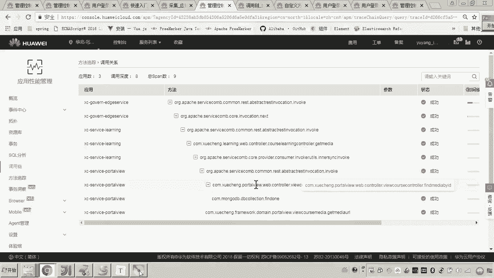

将这些类和方法添加到APM的“方法跟踪”配置后，其状态会显示为“跟踪中”。

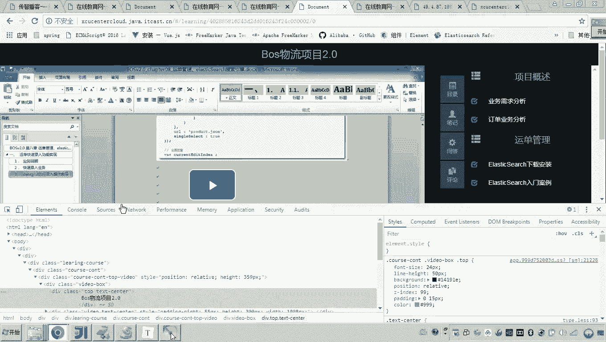

## 观察正常调用链

配置完成后，我们刷新视频播放页面。由于一切正常，数据可以成功获取。

此时，在APM控制台中：
*   在“调用链跟踪”中查看调用关系图。
*   在“方法跟踪”中查看调用关系图。

你会发现这两个界面展示的调用关系图是**一样**的。这说明调用链的详细展示依赖于方法跟踪中配置的类和方法。通过方法跟踪，我们可以对关键的业务方法进行细粒度监控。

在调用关系图中，可以清晰地看到哪些类和方法被调用，并且状态均为“成功”。

## 模拟异常并定位问题

现在，我们想模拟一个失败场景，看看问题出在哪里。

为了更直接地定位问题，避免网关或Nginx等中间组件带来的干扰，我们选择直接访问学习服务的微服务端点。其访问地址格式通常为：`http://{微服务外网IP}:{端口}/api/learning/getmedia/{courseId}/{teachplanId}`。

通过正确的参数访问，接口正常返回。为了制造异常，我们传入一个数据库中不存在的ID。此时，接口会返回一个错误（例如“CSE内部错误”）。

在APM的“调用链跟踪”列表中，可以看到这次调用状态变为“失败”。点击“查看调用关系”。

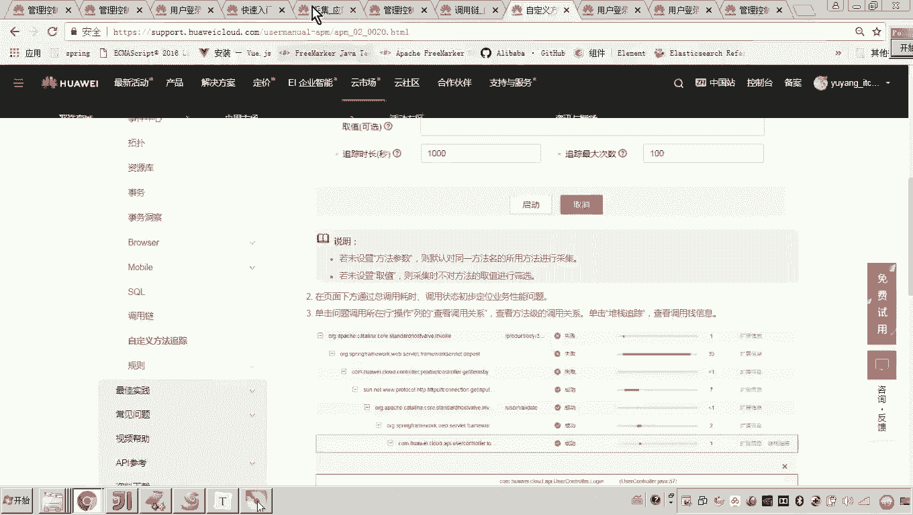

在调用关系图中，我们可以清晰地看到：
1.  `port view` 服务的调用是**成功**的（绿色）。
2.  问题出在**学习服务**（`learning`）调用 `port view` 之前的那一步。
3.  具体是 `getMedia` 方法报错。

要查看更详细的错误信息，点击学习服务节点上的“栈跟踪”。APM会列出详细的错误堆栈信息，并**精确指出是哪一行代码发生了错误**（例如，第37行）。

## 核心操作总结

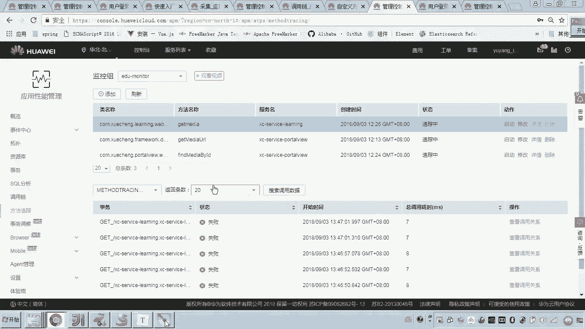

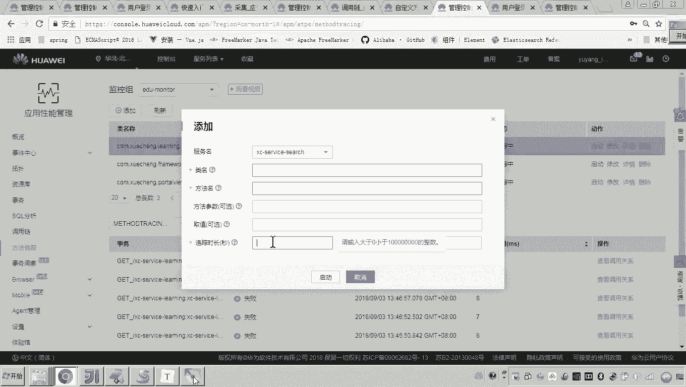

本节课中我们一起学习了APM调用链跟踪与方法跟踪的配合使用方式。以下是关键步骤总结：

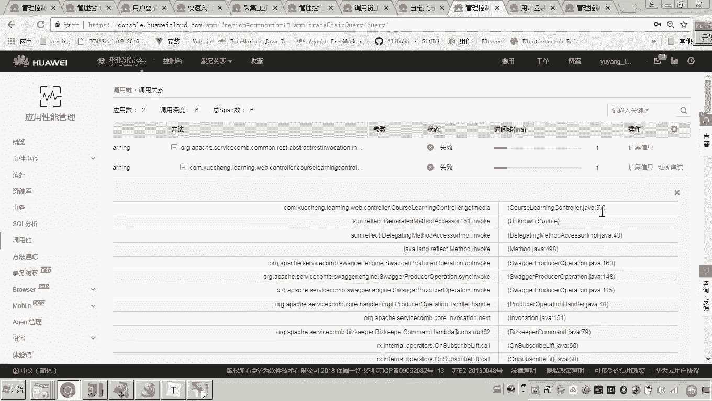

1.  **确定跟踪链条**：明确你要监控的业务流程（例如：在线视频播放地址查询）。
2.  **配置方法跟踪**：在APM的“方法跟踪”功能中，将该业务流程涉及的所有微服务的**核心类与方法**添加进去。
3.  **触发与观察**：执行业务操作。如果发生错误，在“调用链跟踪”中查看失败的记录。
4.  **诊断问题**：
    *   通过“查看调用关系”图，快速定位是哪个微服务环节出现了问题。
    *   点击出错的服务节点，查看“栈跟踪”，获取具体的代码行级错误信息，从而精准定位故障点。

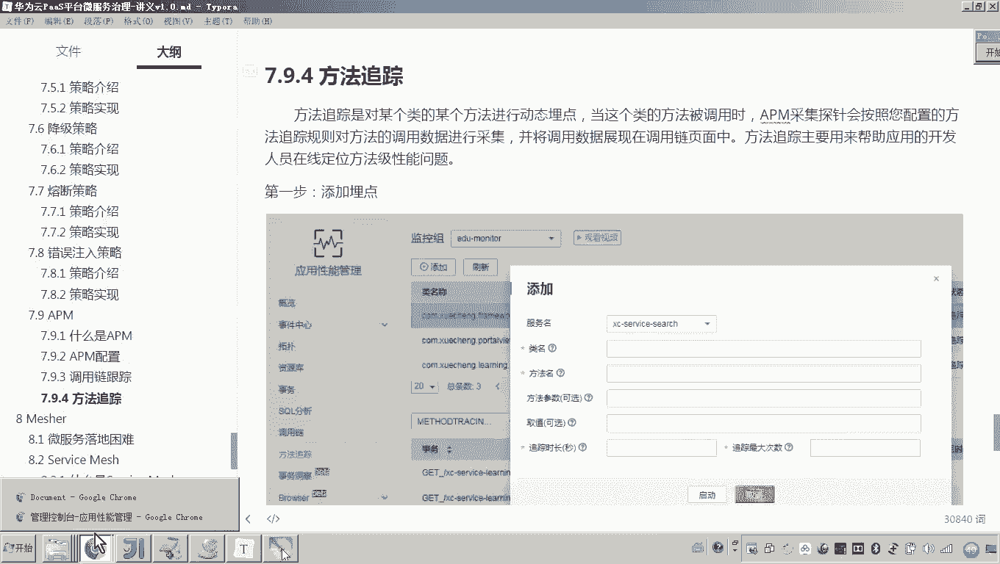

此外，APM还提供SQL分析等功能。如果你的业务流程中包含数据库操作，APM同样可以跟踪并监控所有SQL语句的执行情况。

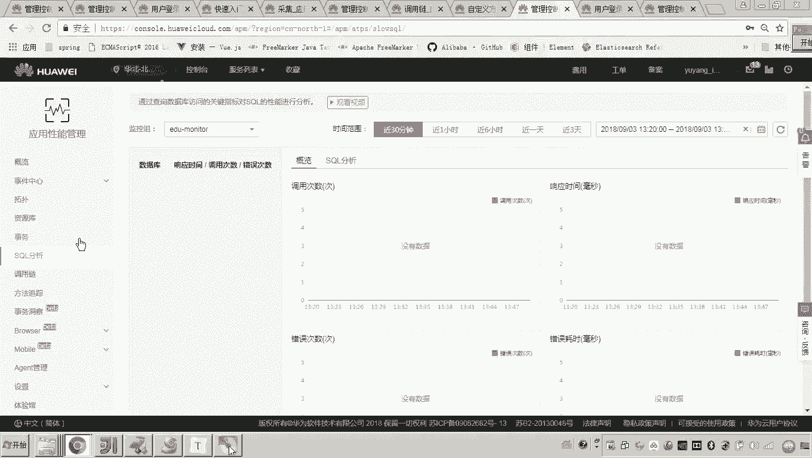

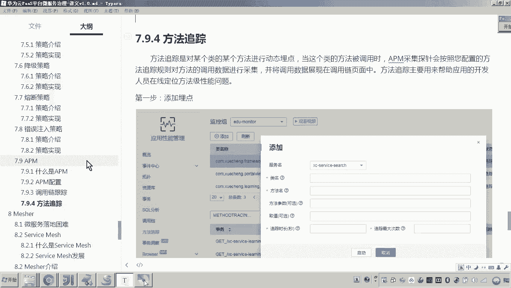

以上便是利用华为云APM监控微服务运行状态及进行问题跟踪的完整方法。