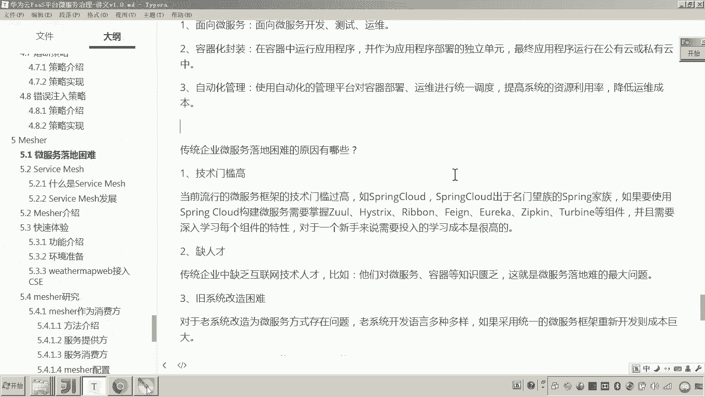

# 华为云PaaS微服务治理技术 - P141：01.mesher介绍-微服务落地困难 - 开源之家 - BV1wm4y1M7m5

好，那么下边呢我们进入另外一个知识点，叫measure。好，那么我们在介绍measure是什么？哎，在学习measure之前呢，我们先了解当前的哎一个现状啊，什么现状呢？

大家看这个标题啊叫微服务落地困难。哎，我们来先了解一下什么是微服。嗯，有说老师这微服务不是老生常谈的嘛？我们用的这个我们学习这个学生在线这个项目，他是不是用的架构就是微服务架构呀。

用的spring cloud对。😊，啊，其实微服务呢是随着互联网移动互联网的发展呢其慢慢兴起的。呃，在国内2015年呢就兴起了。1718年这两年微服务是非常热，可能有些同学就跟风嘛，说微服务呢就流行了。

我们就学这个技术啊，其实你要呃没事的，你可以去慢慢想一想啊，就是这个微服务到底有啥好处？有些同学可能感觉这开发起来呢写那么多工程，对吧？啊，因为服务的拆分的这个力度非常小，写的工呃。

这个编写的工程比较多嘛，所以这个维护起来呢就感觉很麻烦，对，这些都是问题，对吧？啊，但是它有好处啊，什么好处呢？😊，这个采用微服务的技术架构去开发。各位就是原来啊我们是不是一个完整的系统。

就是一个单体应用，对吧？原来你也知道我们写单体应用怎么写的，我们这里边是不是会写很多的呃service。😊，service接口对吧？但是这一堆的service接口，我问你是不是都被都被放在了一个工程中。

而现在如果采用微服务的这种架构去构建的话，它是怎么做的？它会把业务后边的业务处理部分的，全部拆成无数个若干个这种细小的服务。所谓服务是可以独立的对外提供这个用户访问的这个能力，对吧？所以这个这个服务呢。

其实哎我们当初学习学生在线。你也知道每一个服务，我们是不是都把它构建成一个工程，并且这个工程用户是不是都可以通过什么HTTP进行访问，对吧？对。😊，呃，所以大家想那这种有什么好处呢？😊。

他进行AHTTP进行访问，说明这个服务是不是就独立去处理这个用户请求的能力，对吧？😡，关键点不在这儿，关键点在于这个服务拆分的力度非常小。力度小了，这个服务他的这个职责是不是就更单一了？😊。

职责更更单一了。我能那我问你他的这个高内聚的这个特性是不是就更强？😡，对吧因为你想啊我们当初我们一直学软件开发，我们追求的是什么呢？叫高内聚低耦合，对吧？所以因为服务的这个呃力度猜的很小。

它的功能更单一，所以它高内聚性更强。😊，那你讲高内距更高，那那这个耦合性是不是就更低了？也就是服务与服务之间，对服务与服务之间的这种联系可能更少了。所以这就是微服务的好处。哎，就高内聚低耦合。

那高内聚低耦合给我们这个系统软件系统带来什么样的好处呢？那你想呀。假如说有一天你你的老板说哎你再给我增加一个功能吧，对，增加一个什么功能呢？增加一个什么这个积分兑换礼品的功能了。

那原来你是不是做过用户管理，你也做过充值系统，对吧？那你现你现在要做的是不是就是哎我我能不能做一个用户用户信息里头有积分，然后充值也有了。那现在哎我能不能把这个用户的这个积分给它兑换成钱，对吧？

那完成一个自动的充值，行不行？所以你会发现你现在在写起这个服务来的话，他这个呃你去扩展这个系统的这个能力呢，就这个这个速度呢，就大大提高？😊，是不是效率更高了？这样高内聚低耦合的这个系统呢。

给我们这个整个平台带来的好处就是什么？系统可扩展性非常强。😊，对，这就是我们说的这个微服务的好处，对吧？说了这么多，可能有的同学也没思考这个事儿是吧？其实你慢慢想一想的话呃。😊，的确是非常有好处。

再给大家举个例子，你也知道啊。😊，呃，现在我们说移动互联网，为啥说移动互联网的发展，为服务呢就发展越来越越热呢？因为你也知道移动互联网前边的这个客户端是不是多种多样，对吧？😊。

而你不能因为前边的这个客户端变化了，导致下边的这个服务层来回变。那我问你这个系统的开发成本是不是太高了？😡，所以如果我们采用微服务的架构，那么这个服务层这一块如果一旦设计好了，统意了。

那么我问你前端的客户端，不管怎么变，服务层是不是都不用变？😡，对不对？这是不是就更加增强了我们系统的这种稳定性啊哎。😡，所以这些都是微服务的好处。嗯，高内聚低耦合，提高我们系统的可扩展性。

所以现在很多的这种企业呀开始向这种呃高级的互联网的技术呢去转型。😊，那这里面呢我所说的企业特质就是传统企业，就是没有采用互联网这些呃类似于什么分布式系统啊，微服务技术这些开发的哎。

这些系这些企业呢它慢慢慢慢的朝这些技术去转型了。😊，而在转型过程当中，刚才我所说的微服务其实就是技术转型的核心。😊，但是微服务哎微服务在落地的时候遇到了很大的问题。困难。

那有人有人说就是老师微服务落地又是啥意思，对吧？很通俗的一句说法。那我给你讲一下啊，微服务落地是啥意思？就是原来系统开发软件没有采用微服务框架，微服务技术去开发。而现在落地了。

就是让你的企业的这些软件呢要采用微服务技术去构建了。😊，最终的目标是要把它开发成什么云原生应用。注意啊，你不要看到一个非常普通的词叫微服落地。有人说微服落地不就是采用微服框架开发嘛。

但但是我后边这一句最终要开发成为云原生应用，这也是我们微服落地的一个最终目标。😡，懂吧，好了，那现在有人不知道什么叫云原生应用。那我现在给你解释一下，什么叫云原生应用呢？😊。

这里边我要说起一个组织叫做什么叫CNCF的1个linux基金会的组织。这个组织它就是专门用来推进这种微服务落地的，就是用来推进云端原生应用和服务的开发的。😡。

说白了就是刚才传统企业是不是要向互联网技术转型啊？😡，对你要想转型的话，你是不是要把你的这个软件采用微服务技术构建呢？对啊，那你用什么技术呢？好了，这个组织嗯他在研究这一块。

对我要帮助企业呢哎进行进行这种什么微服务的这个落地。要把你的这个软件系统呢开发成云原生应用。😡，啊，那到底什么是云原生应用呢？刚才我只是说了这个组织，这个组织非常强大。现在这个成员有100多家。

并且呢你你你看一下都是大咖，嗯，有googleIBM国内的有阿里巴巴、华为、思科等，对吧？阿里巴巴、华为。😡，哎，还有等等很多。所以各位。呃，这个微服务落地，这里边我们强调的目标是要开发成云原生应用。

而云原生应用它有一个组织叫开源linux基金会，它来进行推进。😮，对吧那但这个云原生应用到底目标是啥呢？听我说有三个特征，我要做成三个特征，这个云原生应用就开发成了。第一，采用微服务技术开发测试运维。

😡，也就是你要用微服务的框架技术。第二，你把项目开发完了之后呢，我要采用容器化的技术进行封装部署。😡，并且最终要将我的应用程序部署在公有云或私有云上。就这叫云原生应用的开发，对吧？开发完了。

你知要部署吧，采用容器化技术把它布到云上。第三，自动化管理。😡，哎，使用自动化的管理平台，对刚才咱们说的部署的那些容器进行运维，进行监控。😡，哎，目的只有一个降低后期我们软件运维的成本。

这就是云原生应用。

好了，注意我讲我讲了这么多呢，我给你串一下啊，别看就是一个小小的问题啊。因为我们今天学习的这个measure，如果你你不知道它用在哪，你可能学的非常晕乎。😊，朱玉清。

就是微服务呢给我们企业带来非常大的好处，可以使我们的软件系统高内聚低耦合。所以很多企业呢都在向微服务转型。😊。

哎，那么怎么转型呢？哎，首先呢你要采用微服务的技术进行开发。哎，其次呢你要采用容器化的技术进行部署，然后把它布到云上。

最后呢，我们运维要采用自动化的管理平台进行运维，降低我们的运维的成本。而这一切我们叫做云原生应用的开发。刚才说的三个特征。那么有一个组织哎，叫CNCF一个开源的linux基金会。

它就是在推进这个语原生应用落地的。好了。比如说老师，你看有这么有有这么多公司在同时做这个事儿推进这个落地，那应该是不是就很容易就落地了。你注意没有那么简单，因为这个组织它只是研发了很多的产品，哎。

来帮助企业进行微服务落地。但是真正的企业在微服务落地的时候呢，他遇到了一些问题，啥问题呢？第一技术门槛非常高。😊。

什么门槛，因为我要采用微服务的框架去开发，我是不是就得让我的开发人员去学习。比如说spring cloud。😡，对不对？有如说老师我们这个学生在线就是采用spring cloud我就学会了。

但你要注意啊，spring cloud你知道它是包括非常多的组件，有ru has stricts ribbon eureka zipkin等等这些组件，这些组件每一个如果你真正的要在生产上是去使用的话。

我告诉你，你都要深入的去研究去测试。😊，你明白吧？所以。😡，我们学成在线项目，包括你去你的企业啊初次采用的一个使用spring cloud的哎进行架构的一个项目。你开发完成之后，那你只能说你入门了。

如果你说我要呃对精通了啊，有经验了，那我跟你说你得等一段时间。😊，所以这个技术门槛非常高，因为它包括的这这个这个微服务框架包括的东西太多了。对于每一个新手来说，学习成本都非常高。这个企业他是吃不消的啊。

😊，那还有一个原因呢，就是就是缺人才呗，没人呢但如果我这里边有几个高手呢学习起来呢也也也很快，对吧？但是现在主要是缺人，那传统企业当中就是缺乏互联网技术人才。😡，这是这是第二点。第三点呢。

就是你也知道传统企业它是不是有很多的老系统，就是那些没有采用微服务构建的系统。那那各位想我现在还想去把它改造成微服务，而现在我原来的老系统都已经开发好了。

没有用spring cloud这些这些微服务框架，那我怎么改造呢？难道你要我重新开发一遍吗？所以这也是对于老系统改造成微服务方式，存在一个非常大的问题。😡，你懂我意思吧？这就是三点哎。好了，那我问你。

你要是企业老板，现在我说哎，你把这个三点想办法解决一下，你怎么办？😊，啊。对啊，有人有人就来想招了嘛，有人说。😊，那简单呀，我们我们不会技术，对吧？不会技术，我们聘请一些培训公司给我们培训培训，对吧？

😡，哎，有人说那行，我们我们公司有钱，我们可以干嘛呀？挖人呢，对不对？😊。

我们可以外包啊。😡，对你说的没错。刚才我列举的这几点，我跟你说，都是我们企业在解决上述问题所采用的方法。😡。

我对员工进行培训。😡，但是我告诉你，培训呢培训他的成本依然很高。你啥意思啊？因为你想呀我培训，我是不是得请老师给你培训呀？培训完了之后，我问你培训完了之后，你都全会了吗？你是不是得自己还是刚才我说的。

你是不是要重新的去看一下，学一下。然后呢，你这个经验积累的过程。😡，就是成本。😡，挖人对吧互联网公司做事的态度就是干嘛呀？挖人财大气粗嘛，我有钱啊，对我刚融过资嘛。😡，是吧那你呢？😡，你不财大气。

你是一个传统企业呀，我现在要挖人了。对啊，你你公司没钱，你怎么挖人？😡，啊。还有外包。那我问你，你你公司有100多个项目，你现在第一个项目，你说我外包，那我问你第二个项目呢，第三个项目呢。

你难道还外包吗？😡，对不对？你作为一个软件公司，你采用外包的方式来解决这个问题。那我问你后边的项目，在前面的项目做完了，后面一项怎么办？所以你没有技术积累，这不行，因为技术对于一个软件企业来说。

就是它的什么竞争力嘛。对，所以上述解决这个问题的方案，我跟你说都不是最直接的方案。😡。

那那那那有啥方法呀？一会儿我给你讲。😡。

好了，那现在这一节啊这一节可能有些同学听着说哎，老师这一节你怎么一点也没有说起这个measure说微服务落地困难啊，微服务是个好东西，企业呢想想用微服务技术开发，想最终做成云原生应用。

但是呢遇到了很多的问题，哎，啥问题呢？技术门槛很高，哎，成本很高。哎，这个这个老系统改造非常困难。对，解决起来非常麻烦。那怎么办呢？哎，那其实我告诉你啊。

咱们今天讲的measure就可以解决微服务落地困难，这个问题。😊，好，那么这一节呢我们先到这儿啊，我们先了解一下当前微服务落地困难的这个现状。然后呢，稍后我们再学习meer，你就知道它的用武之地了。好。

😊。

