# 华为云PaaS微服务治理技术 - P141：01.mesher介绍-微服务落地困难

在本节课中，我们将要学习微服务架构的优势以及企业在实际落地微服务时面临的挑战。理解这些背景知识，有助于我们后续更好地理解Mesher这一解决方案的价值所在。

## 微服务架构的优势

上一节我们介绍了课程背景，本节中我们来看看什么是微服务。微服务是随着互联网和移动互联网发展而兴起的一种架构风格。它通过将单体应用拆分为多个细小的、独立的服务来构建系统。

采用微服务架构进行开发，意味着将原本集中在一个工程中的业务处理逻辑，拆分为若干个可以独立对外提供访问能力的细小服务。每个服务都可以通过HTTP等协议独立处理用户请求。

这种架构的核心优势在于，由于服务拆分力度小，每个服务的职责更加单一。这带来了以下好处：

*   **高内聚**：服务功能单一，内部逻辑紧密相关。
*   **低耦合**：服务与服务之间的联系减少，依赖性降低。

高内聚、低耦合的特性为软件系统带来了显著的好处，即**系统的可扩展性大大增强**。当需要增加新功能时，可以快速开发或组合现有服务，而无需大规模修改原有系统。

此外，在移动互联网时代，客户端形态多样（如App、小程序、网页）。采用微服务架构后，服务层一旦设计并稳定下来，前端客户端的任何变化都不需要服务层做出相应调整，从而**增强了系统的稳定性**。

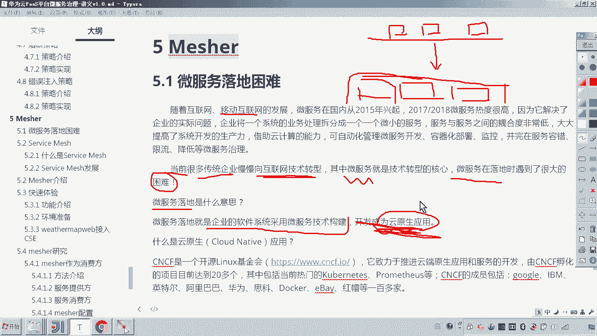

## 微服务转型的目标：云原生应用

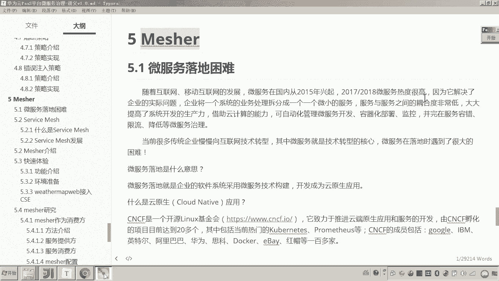

正因为微服务有诸多优势，许多传统企业开始向互联网技术转型，而微服务正是转型的核心技术。这里涉及一个关键概念：**微服务落地**。

微服务落地是指企业将其软件系统从非微服务架构改造为采用微服务技术构建的过程。其最终目标是开发成为**云原生应用**。

云原生应用由CNCF（云原生计算基金会，一个Linux基金会旗下的组织）倡导和推进，其成员包括Google、IBM、阿里巴巴、华为等众多顶尖公司。一个真正的云原生应用具备以下三个特征：

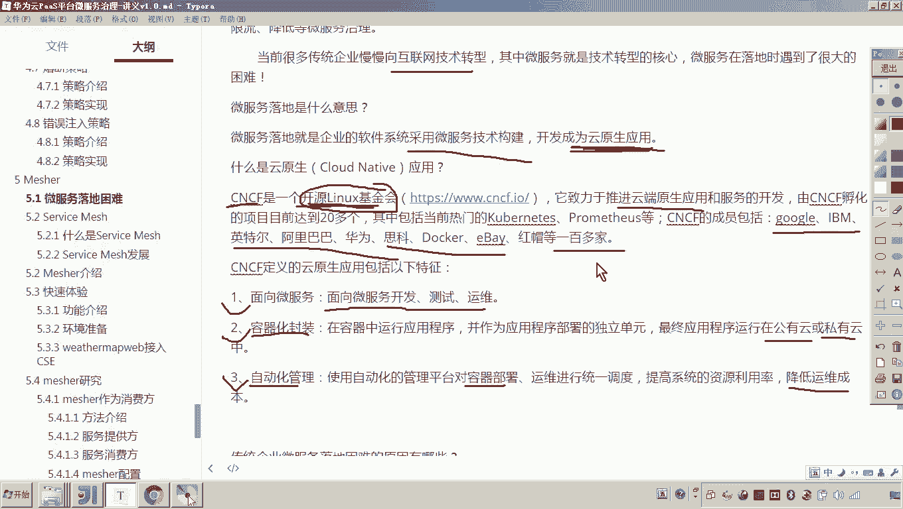

1.  **采用微服务技术**：使用微服务框架进行开发、测试和运维。
2.  **容器化部署**：使用容器化技术（如Docker）对应用进行封装和部署，并最终运行在公有云或私有云上。
3.  **自动化管理**：使用自动化的管理平台（如Kubernetes）对容器进行运维和监控，旨在降低后期软件运维的成本。

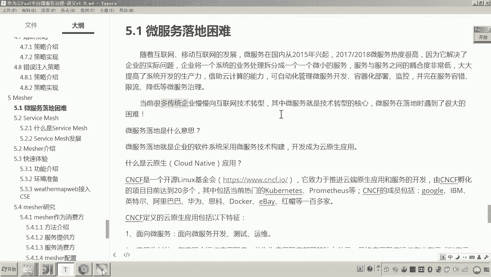

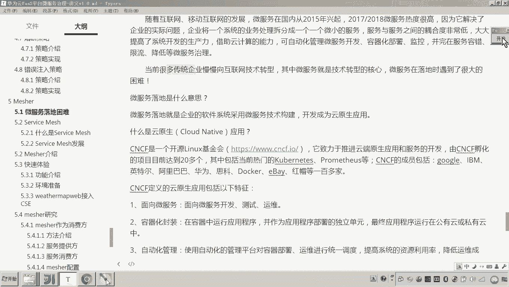

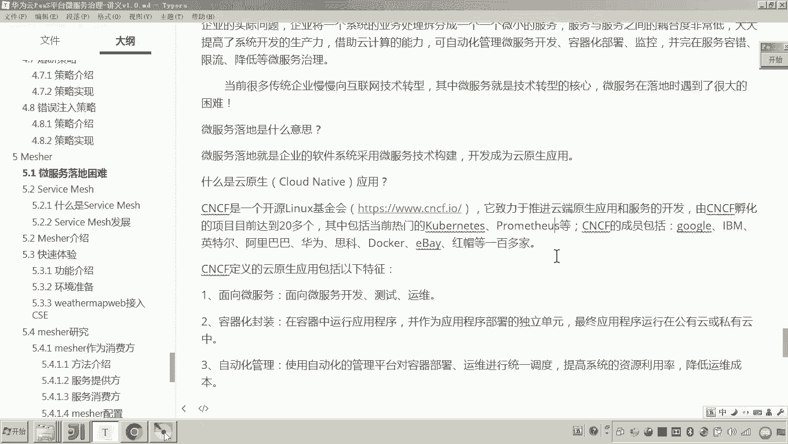

简单来说，微服务落地就是通过微服务技术开发，结合容器化部署和自动化运维，最终构建出云原生应用。

## 微服务落地面临的困难

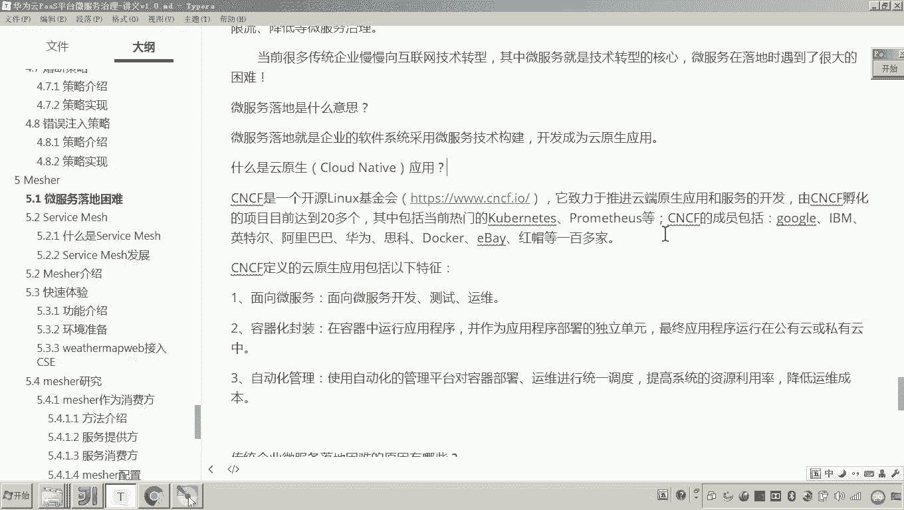

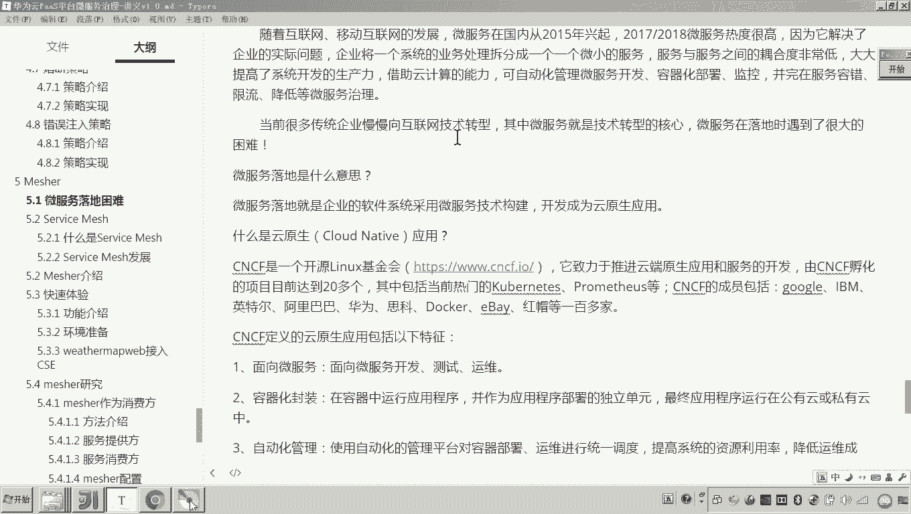

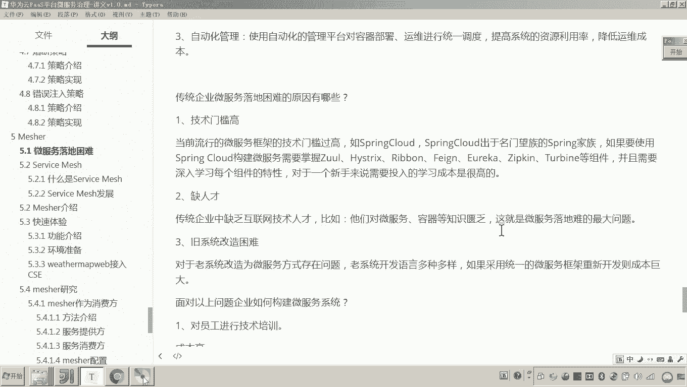

尽管有CNCF这样的组织在推进，并且云原生应用前景广阔，但企业在实际落地微服务时仍然面临巨大挑战。

以下是企业微服务落地的主要困难：

*   **技术门槛高**：微服务框架（如Spring Cloud）包含大量组件（Eureka, Ribbon, Zipkin等）。要真正在生产环境中熟练使用，需要对每个组件进行深入研究和测试，学习成本非常高。
*   **缺乏互联网技术人才**：传统企业内部往往缺乏精通微服务、容器化等互联网技术的开发与运维人员。
*   **遗留系统改造困难**：企业存在大量未采用微服务架构的老系统。将这些系统改造成微服务架构非常棘手，几乎等同于重新开发，成本高昂。

面对这些困难，企业通常会考虑一些常规解决方案，但各有局限：

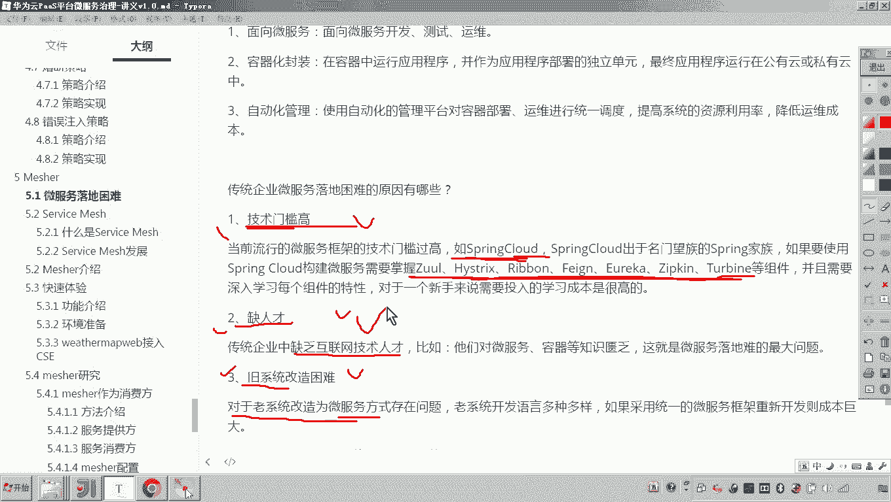

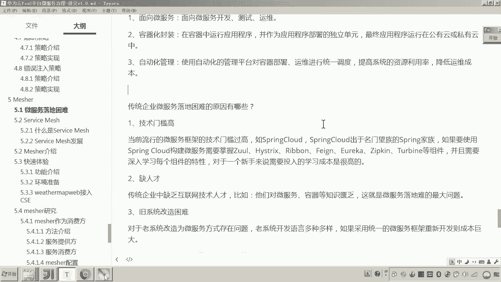

*   **内部培训**：成本高，员工从学习到积累实践经验需要漫长过程。
*   **高薪挖人**：对于资金并不充裕的传统企业而言，财力难以支撑。
*   **项目外包**：无法形成企业的核心技术积累，从长远看削弱了企业的竞争力。

综上所述，这些方案都不是解决微服务落地困难最直接、最有效的办法。

## 本节总结

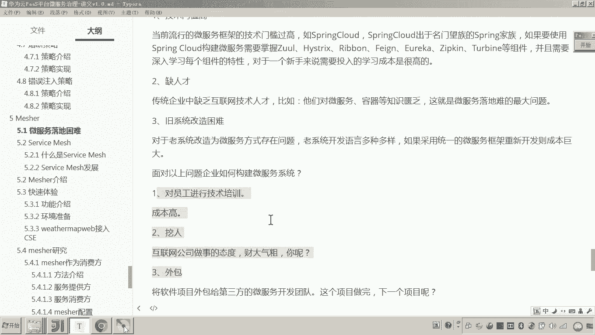

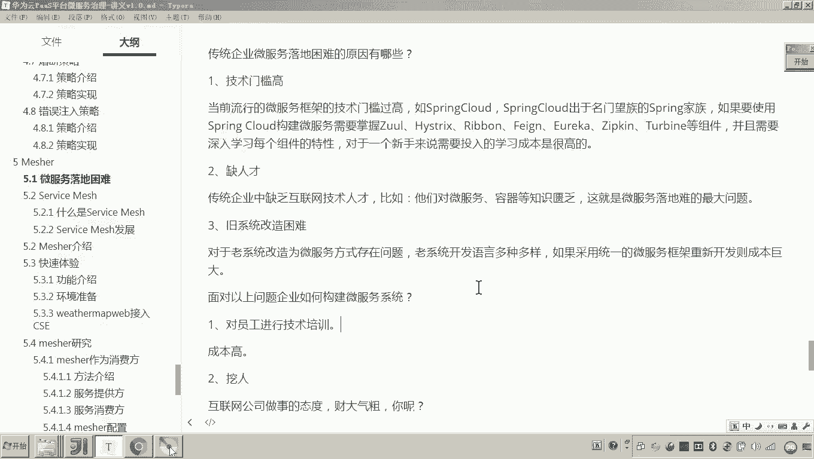

本节课中我们一起学习了微服务的核心优势（高内聚、低耦合、高可扩展性）以及企业微服务转型的最终目标——构建云原生应用。同时，我们也详细分析了企业在微服务落地过程中遇到的三重主要困难：技术门槛高、人才缺乏、老系统改造难。

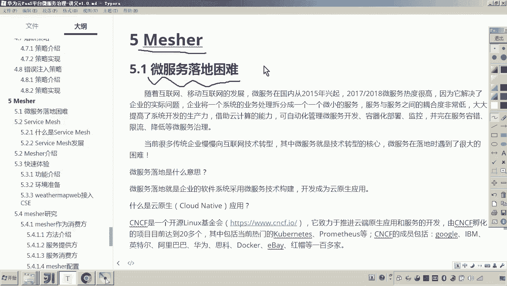

理解这些现状和挑战至关重要，因为我们接下来要介绍的**Mesher**，正是为了解决这些微服务落地困难而生的解决方案。在下一节中，我们将具体学习Mesher如何帮助企业跨越这些障碍。