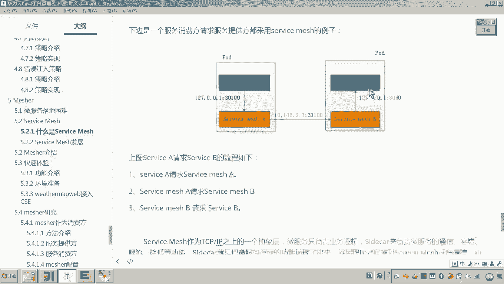

# 华为云PaaS微服务治理技术 - P142：02.mesher介绍-service mesh介绍 - 开源之家 - BV1wm4y1M7m5

好，那下边呢我们继续来介绍measure。

刚才我们了解了微服务落地困难的一些现状啊啊，那么当前公司在进行呃微服务落地啊，进行云原生应用开发的时候呢，他遇到了一些问题啊，因为这些呃问题呢有什么有技术门槛比较高啊，缺人才啊等等啊。好。

那么解决这些问题呢，无非是采用这种技术培训啊，招人啊，包括这个项目外包等这些方法。呃，那这些方法呢，其实刚才我们也分析了这个成本呢应该说还是很高的啊。😊，呃，那怎么办呢？啊，这这那怎么办呢？

就是大家还有还有印象吗？就是我们说有一个专门来推进云原生应用开发的这这个这个组织，对吧？这个组织有100多家公司，对吧？啊，包括呢他啊这个组织呢也开发了很多的这种好的产品啊，来推进这个微服的落地啊。😊。

那下边呢我们介绍一个叫做service matchsh啊，那它呢其实就是来彻底的改变这种现状。那servicemat是什么呢？它翻译过来呢叫服务网格。哎，它是一种微服务开发的理念啊，注意它只是个理念啊。

它不是一些什么具体的框架，或者说什么技术啊。😊，那么他到底是什么理念来解决这个微服务落地这个问题呢？微服务的开发大家知道啊，现在这个企业呀要将它很多的这种系统呢呃把它改造成微服务。啊。

这些系统呢可能就是我们说的老系统了啊，里面呢这个系统已经在运行了啊，那这个这个代码呢呃已经已经开发完成啊，已经上线。😊，那现在我如果采用这种传统的方法，采用微服务框架。比如说spring cloud。

把这个项目呢重新写一遍。呃，那这样的话成本是不是比较高。哎，我们我们的目的是不是就是让我们这个我们我们用微服务的架构啊，让我们的这个原来的这些软件系用项目啊，采用微服务的架构去做啊。

使它具有服务的这种功能，对吧？微服务的功能。啊，那怎么做呢？那怎么办呢？这个servface match这个开发理念呢，它就支持什么啊零代码侵入啊，就是他就在想啊，如果想推进这个微服务的落地啊。

想加快的这个呃速度。那应该说啊对于微服务的开发。我们应该从根本上去变怎么变呢？就这个代码呀，我无需你改变，我就可以让你把你的这个服务呢变成微服务。嗯，变成微服务，怎怎么变成微服务呢？

对它采用一种叫做side card的这种边车模式。s card翻译过来叫边车模式。什么叫编车模式呢？你注意啊，你现在心里有一个目标，就是这个service match它所倡导的就是代码不用改。

我就让你变成微服。那它怎么做呢？它采用s card模式，s card上边车模式，下面这张图呢非常形象啊，就是呃原来这这这是一个摩托车，啊。

现在呢我是不是在加装了一个什么加装了一个这个摩托车旁边我加装了一个座椅吧。那这样的话。

他有他和原来有啥不同的？😡，啊，各各各位可以想一下，原来只有一个摩托车的时候，假如说现在这个人他在开车，那我问你他在开车的时候，他能去。😊，拍视频照相吗。啥意思？就是现在。我加装了一个座椅。

那现在我问你，我这是不是可是不是可以还坐一个人。那这个人哎开车这个人负责专心开车。哎，在座椅上坐这个人呢，他是不是就可以进行这个风风工这个照相啊？😊，啊，把周边的这个风景呢就把它拍下来。

那我问你这个摩托车所带来的这个什么功能是不是就增强了？对不对？他是不是就增强了哎，所以就是因为他加装了这么一个摩托车的座椅，那这个他就增强了。😡，哎，这就叫做鞭车模式。那和我们现在要聊的。

怎么样使我们的这个服务不改代码就变成微服务呢？就具备这个微服务的这些特性呢啊，微服务有啥特性啊？我们前面学的是不是很多微服务治理的特性啊？哎，比如说我们微服务，我们想去访问另外的服务。

那他他是不是要从这个什么注册中心来拿服务地址呀？访问的方式是不是这么做呀？😡，另外，服务区访问服务，我是不是可以通过负载均衡，然后走这个什么呢？呃让它启动这个降级，还有熔断容错等等这些措施。

所以这些都是微服务的功能，对吧？那我们就在想你原来的代码，你还不让去改，哎，不让采用微服务的这种框架去改造，你怎么样让原来的系统具有微服务的功能呢。那好了，干脆我就像这个上面这个图这个摩托车一样，哎。

我给你加装一边，哎，我我我给你加装一块增强的这个功能，那这样的话，你整个的这个服务，它这个功能是不是就增强了。😊，那怎么加装呢？😡。

看好，我有一个例子。这就是我原来的哎不是哎不具备微服务功能的这个服务。而这个服务想具备微服务的功能。那怎么具备微服务功能？你也知道啊，看好啊，我给你介绍一下service A是一个普通的服务。

不具备微服务的功能。而这个serviceB呢，它就是微服务。😡，所有的微服务各位，咱们是不是都把它注册到这个注册中心了？懂我意思吗？这注册中心里面是不是有很多的服务的这个信息和地址啊？

那你说我们微服务之间要进行访问，是不是都是通过注册中心拿到服务的地址。而现在这个service A如果想要访问这个注册中心，我问你他的代码是不是得改了？😡，你现在的目标是不改代码。

就能让他具备微服务的这种能力怎么办？这种思路肯定行不通吧，那怎么做呢？干脆我给你加一个代理，而这个代理就是咱们所说的service match。😡，这个servicemat呢，它可以访问注册中心。

它就是一个固定的程序。这个servicemat呢就具备了微服务的所有能力。😡，而service A不具备微服务的能力，你可以通过servface matchsh具备微服务的能力。😡，那好有一个例子。

这个service A呢想访问微这个服务注册中心的这个service B以及servfaceice C怎么访问的？service A如果你要从服务中心去拿service B和service C的地址。

那我问你你这个servface A的代码就要改造好了，干脆我把微服务这一块的功能呢，我全部抽取到servface matchservice A先请求servface match由service match从服务注册中心拿到服务地址。

然后由servicemat来调用service Bservice match把调用service B的结果再给service A回去回应。那我问你这个过程service A的代码根本就没有改。😡。

对他的代码没有改。那。😡，主要是因为什么呀？是不是我在servfaceice A的这个同一个机器下边，我部署了一个什么一个service match。那这个是不是就是一个代理了？对。

那我们上面所说的这个side car，这是不是就是一个代理？😡，理解我意思吧，这个是不是就是我们们摩托车旁边加装的那个什么？😡，那个那个那个那个座椅是吧，对。

而这个serviceA是不是就是原来的摩托车了？😡，各位，你你说他俩放在一块儿，它的功能是不是就增强了？那增强在哪里？是不是就是微，它具备了微服务的能力？😡，对，这个portd是啥呢？

这个pa这个pa的意思是呃，它是kuubernetes的一个概念。哎，它指的是什么呃，一个容器环境下的逻辑主机。就是大家知道啊，这个云原生应用最终是不是要把我们的项目呢。

把我们的这个服务呢采用容器化技术去进行部署啊。😊，那这个pad呢就是相当于是对大家可以看到这个方块，就是一个pa，它就是一个什么逻辑的主机。你可以理解为一个计算机。

那你那我那你告诉我计算机计算机之间是不是可以通过内网访问。所以service A和service match之间的访问都是通过这个这个这个什么这个内网这个它的这个呃127。0。01啊这个。😊。

本机这个IP来进行访问。也就是说不走网络，对吧？而servicemat通过网络去访问其他微服务。😡，看见看见吗？你看他们的IP地址是不是就变了。对，所以这就是servface match它的作用。哎。

就是在计算机内哎，对他这个计算机里边的这个某一个服务呢进行代理，使这个服务具备什么？具备微服务的能力。😊，好了。

那我问你注意这个service A调用最终实现的是不是就是servfaceiceA调用servfaceice B了？虽然service A是不是通过servface麦序来调用B了。

最终实现的功能是不是就相当于A调B，对不对？😊，那我问你A调用BA是不是就相当于消费方？是吧所以service match和serv A属他们应该是一体的。😡。

那这个下面这个图是不是就是表示的一个服务消费方采用的是servface match的例子，就是servface match，是不是相当于服务消费方。😊，但是你也知道微服务微服务与微服务之间访问微服务。

它可以是消费方，是不是也可以是提供方？好了，那你再看一个图，看这个图。😊，那我问你这个图就变了。😡，这个A呢还是一个普通的服务，它不是微服务。但是呢外边的这个微服务想来访问A怎么办？😡，好了，看好。

我们说服务微服务之间访问永远是通过注册中心来做，是吧？😊，但是A它不是一个微服务呀，他他也不会把自己注册到注册中心呀，那怎么办呢？谁来帮他呀？

servicemeservicem会把service A的信息注册到这个注册中心。😡，懂吗？而service B呢本身它就是一个微服务，所以它可以来访问注册中心，拿到service A它的地址。😡。

sice那这个这个过程，这是不是就是service match，是不是相当于一个服务提供方了？😡，他是不是被调用了被调用是不是就是提供方，所以serviceb作为一个微服务。

它是一个用微服务框架所开发的微服务啊，它可以去访问服务注册中心。它先拿到什么拿到serv的地址注意其实他拿到的就是serv的地址。因为什么？因为外部微服务与微服务之间的交互都是通过serv。

就是service a想交互想请求其他服务是通过serv。同样其他服务想请求service a也是通过serv。所以serv其实是将自己的哎是将自己的这个地址注册到服务注册中心。

然后呢在服务注册中心有有有什么有具体的这个服务的名称。而其实这个服务的名称我告诉你其实就因为就是代理了serv对不对？他俩是一体的，就是一个人。😊，只是说servfacematch呢具备微服务的功能。

所以这个图的交互方法是这样的。servfaceice B哎，由于它是本身是微服务框架开发，所以它可以访问服务注册中心，拿到服务拿到serviceA的服务地址，其实就是拿到了servfacemat的地址。

然后去请求servfaceicemat。然后servfacemat呢去请求service A。😊，大家懂这意思吧？哎，这就是一个sface match是服务提供方的这么一个例子。😊，但总之什么意思？

有人说老师这个怎么听起来这么绕呢？你你你你记着，如果说如果没有service卖，或者说两个服务本身就是微服务，根本就不需要代理的情况下，我问你两边是不是就可以直接去访问了？😡，就两边访问的话。

这是一个注册中心，他是不是先访问注册中心，然后再去访问，是不是这么做。而现在由于你加了一个什么，加了一个边车，加了一个代理，就是这个serviceme。

那你说所有访问这个他所代理的这个servfaceA的这个服务的这个东西是不是都要通过这个代理？😊，为什么这么做？因为这个设不的卖去具备微服务的能力。😡，因为他会把设iceA的信息注册到服务助中中心。

那其他人呢就可以通过这个设份 match去来访问A。懂我意思吧？那好了，下面再有个例子，我觉得你更加能够体现出来。各位看好啥意思？😊，这个service A呢啊是一个普通服务，它不是微服务。

而这个serviceB呢也是个普通服务，它也不是这个微服务框架所开发的微服务。那他们之间要怎么访问？😊，不可能他们去访问这个服务注册中心。我说了，如果他们去访问服服务注册中心，他是不是就要去改代码了。

所以呢我不想改代码怎么办？好，你通过servicematservice a先访问servicemat。因为你知道他们属于一个一个啥意思，是不是就属于一个计算机啊，他们之间是不是可以走127。00。

1是不是不通过外部网络了，所以serv a通过哎那这个主机内部，然后访问service而servmat哎从这个服务注册中心拿到serviceb的服务地址。

然后servicemat访问另外一个service b的serv它的代理。😊，然后servface match拿到请求，再去访问servface B，这就是整个的访问过程。😊，大家懂了意思吗嗯。

也就是这两个服务都不是为服务框架所开发的服务的时候呢，都要加装这个service match啊，那所有的这种针对这个服务的请求都要通过service match来进行。😊。

嗯这就是我们说的sface卖学的理念。哎，我们再来回顾一下，看好啊。一个servicemat作为一个服务消费方，嗯，他所代理的这个servfaceA啊，它是一个服务消费方。

那他要访问我们说的这个服务注册中心的微服务怎么办呢？他自己不能去访问注册中心，他要通扩他要通过servicemat来访问注册中心。而servicemat从这个注册中心拿到服务地址。

他就开始去访问servfaceB。😊，也也就是说servface A是通过servfacemat来访问外部服务。好，那当facemat哎所代理的这个服务是一个服务提供者的话，外部服务想访问这个服务的话。

那么办呢？对由于由于这个服务，他不可能他没有能力把自己注册到服务注册中心，他必须通过sfacemat把自己注册到服务注册中心。而其他的服务呢，也就是连接服务注册中心。

拿到这个服务的地址其实是拿到了他这个这个facemat的代理的地址。然后呢，他来请求servface，外部服务请求face把请求哎转发给这个face原原来的服务叫servface啊这个。😊。

当两边哎当两方都不是微服务框架开发的服务，他们之间都他们都要去加装servface match，他们之间的通信都通过serv match来进行。你会发现他们之间根本不直接通信。懂我意思吧？哎。

这就是service match，哎，总结一点，servface match就是一种什么代理模式。😡，就是在原有服务的计算机上安装servface match代理。然后这个代理呢就具备微服务的功能啊。

从而就使了这个原来的这个服务具备微服务的能力。😊，好了。嗯，那么刚才说了这这这三个图，大家想必呢应该有点印象。哎，应该说啊这个serviceA呢想访问外部服务，通过servface match啊。

外部服务想访问我这个呃这个这个这个这个服务呢，也是通过servmat。对，就是这样。😊。

那他是怎么做到的呢？其实各位这个servface match呢，它其实就相当于啊在我们的这个应用程序和网络啊和传输层。各位你也知道我们这个网络是不是有有有有什么层啊，物理层网络层啊和传输层，对不对？

那那我问你我们的应用程序写在这儿，应用程序要和应用程序之间进行访问。我们我们现在是不是在中间加了一个servface match是不是代理啊？😊，对，所以说你会发现原来我们的应用程序是这么一个结构。

而现在加装完servicemat之后呢，就变成这么一个结构了。那什么意思呀？就是原来的哎其他的程序，如果再想访问我们这个应用程序的话，都要通过servicemat嗯。😊，好了。😊。

那么这个serv match呢翻译过来叫服务网格。哎，什么为什么叫服务网格呢？😡。

啊，你也知道各位看好我这个哎这个这个这个什么呢画圈的这些都是哎不是微服务开发的这些呃服务。也就是说它不具有微服务的能力是吧？而如果他们哎想具有微服务的能力，各位我们是怎么做到的？

是不是在它的计算机里面部署一个servicematch，我画三角的都是servicematch。😊，那你说这些服务之间的访问是不是都通过这个servicemat这个代理进行访问呢？

所以你会发现service match之间的这种代理。😡，是不是就组成了一个。错综复杂的网络呀。所以这service match其实就是一个什么一个代理的模式，哎。

就是基于一种什么哎代理的模式组成了一个服务的网络。对原始的服务通过代理进行访问哎。😊，好，所以说你可以看到大量的这个微服务部署这个service match。

那你会发现这个servface match是不是就组成了这么一个代理的这种网络呀哎。😊。

好了，说了这么多，想必大家对servicemat呢有点感觉了啊，原来呀它是一种代理的方法，使我们唉不再对原始的这种服务代码进行修改。只要安装一个service match的代理。

就可以使这个原有服务具备微服务的能力。所谓具备微服务的能力，哎，就是可以比如说哎通过这个从注册中心来拿服务地址进行访问微服务，还有哎微服务的进行治理。比如我们前面学的什么降级啊，负载均衡呀，熔断容错呀。

这些都是我们要呃我们要使我们原来的这个服务啊，变成微服务的这个什么呀，这个原因啊，我们要让它具备这种微服务的这种能力啊，好了。😊。

那么往下看啊，为什么要用surface match呢？😡。

啊，说了这么多，你说那为了就是微服务落地嘛，微服务落地太难了。现在我们说这改代码太麻烦呀，我们不想改代码了，能不能怎么办呢？不改代码。好，你在你的本机计算机部署一个s分之麦去代理。然后呢。

这样你这个程序就具备了微服务的功能了。没错，就是为了推进我们微服务落地的这个速度，对不对？哎，那这个分之麦就刚才我们所学过了，它是不是就是把微服务的这些功能给抽取出来了。😡。

就说原来的这个这个这个这个这个服务啊，原来的服务啊，你光关注业务逻辑开发就行了。微服务的那些治理的什么降级熔断容错，你不用管，你只要部署这么一个service麦的代理，他就帮你哎帮你实现了微服务的功能。

它是不是就相当于抽取了微服务的这些通信治理的功能。😡，老系统零代码侵入，改造成微复。还有service的match，负责微服务的通信和治理。这样我们原始的这些服务是不是都可以专注业务开发。

不用管微服务他们之间的这些这个这个这个治理的方法了。😊，对，这就是我们用s份麦去的原因嗯。

好了，servface match是一种微服务开发的技术理念，它不是具体的一个什么落地的一个框架或项目。那servface match它的这个发展呢。

那现在有没有一些呃这个公司所开发的一些servface match相关的产品呢？对它是有的。😡。

注意。业界将spring cloud称为第一代微服务技术啊，那这个第一代微服务技术spring cloud你也知道我们要把原来的系统啊改造为spring cloud来开发。

那我问你是不是就相当于要改我们的代码了，这就叫侵入式微服务框架。而我们刚刚介绍的service match其实是下一代微服务技术，就是不侵入，就不用改代码，你只要部署一个service代理。

就可以使整个服务具备微服务的功能，对吧？那刚才我们说到我们说那有没有这个一些公司开发现成的这种service match的产品呢啊，它有很多的比如这里面我列了几个有什么linkN等等。啊。

国内的有什么呀有华为的measure，还有新浪的。😡，大家可以了解一下，而我们今天学习的哎终于出来了。我们今天学习的就是matature。😡，看懂了吧哎。servicemat起源于2016年，它很年轻。

嗯，2017年越来越多的企业也越来越多的企业才刚刚知道servicemat18年业界称为servicemat的元年。预示着servicemat从18年开始发展。唉，逐渐逐渐的被企业所接受，开始流行。

因为你想呀，其实你想象呀可以想象的通，现在越来越多的公司是不是都开始用这种微服务的架构来开发我们的项目呢？你也知道微服务的特点是不是就是微小啊？那这个服务就特别多，是不是？

那怎么样有一种快速的方法来进行微服务的开发，并且企业里边原有的老系统怎么样把它快速改造成微服务，嗯，这些就是当前要解决的哎最大的问题。所以servicemat它就出现了。😊，好。

以上呢我们就介绍了servurface match，它是一个什么微服务开发的技术理念。它是采用这种sided car编车的模式，在原有的服务的这个计算机上加装servurface match代理。

就可以使哎原有服务具备微服务的能力。好。😊。

