# 华为云PaaS微服务治理技术 - P142：02.mesher介绍-service mesh介绍 🚀

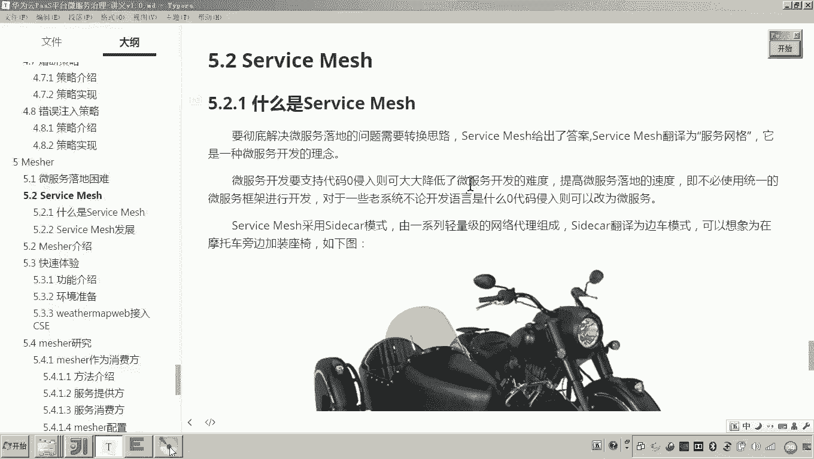

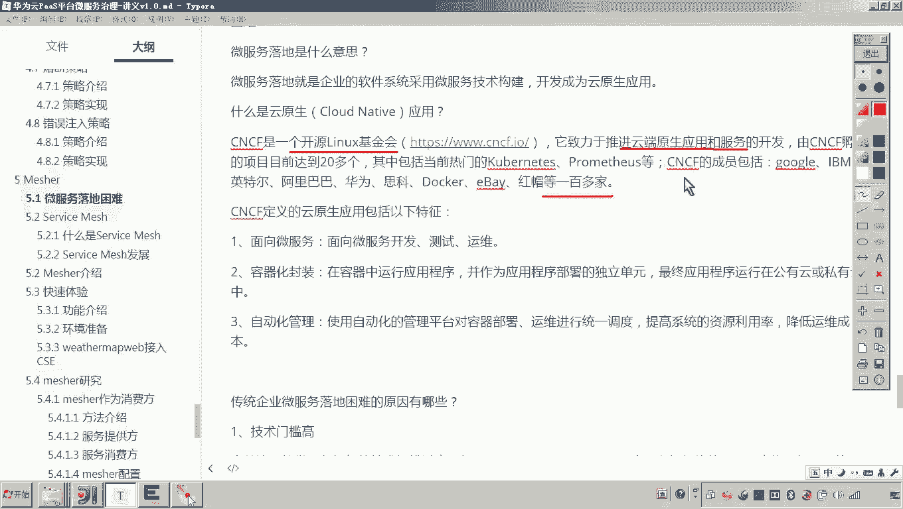

在本节课中，我们将要学习Service Mesh（服务网格）这一核心概念。它是一种旨在解决微服务落地难题的全新开发理念，其核心思想是**零代码侵入**，通过代理模式让现有服务快速具备微服务能力。

上一节我们了解了微服务落地面临的技术门槛高、人才缺乏等困难。本节中我们来看看Service Mesh如何通过创新的架构模式来改变这一现状。

## 什么是Service Mesh？ 🤔

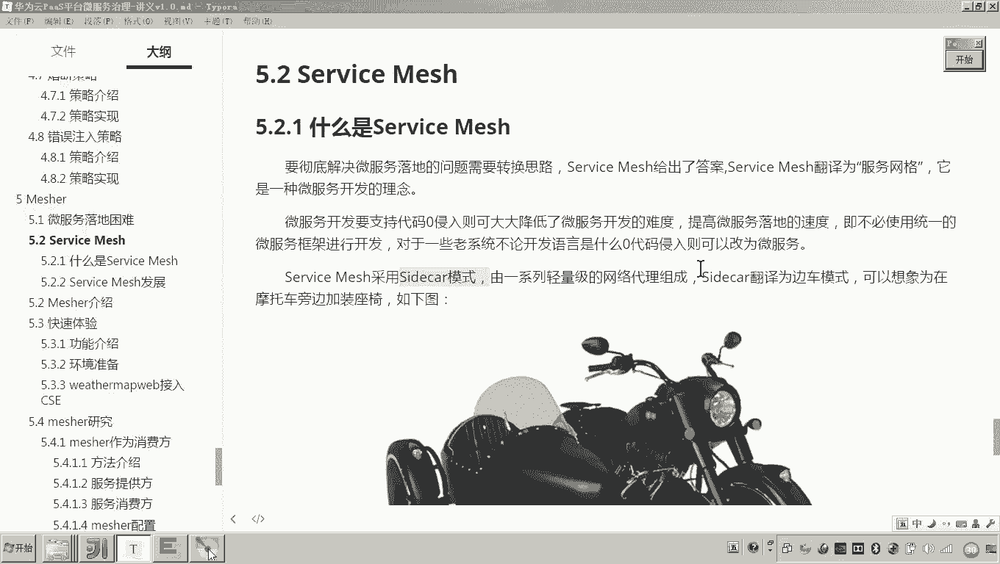

Service Mesh，中文译为服务网格，是一种微服务开发的**理念**，而非具体的框架或技术。它的目标是解决企业将现有系统改造为微服务架构时，因代码侵入式改造带来的高成本问题。

其核心理念是：**无需修改业务代码，即可使服务具备微服务治理能力**。这是如何实现的呢？它借鉴了“边车模式（Sidecar Pattern）”。

## 边车模式（Sidecar Pattern） 🛵

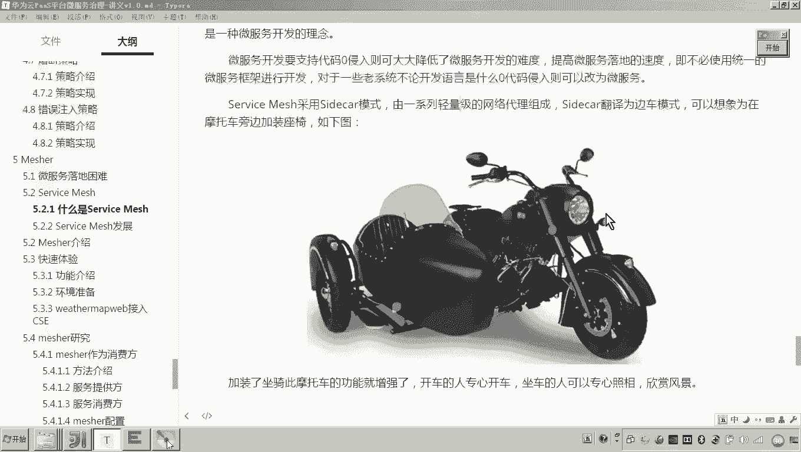

边车模式非常形象。想象一辆摩托车是原有的普通服务，它不具备额外的功能（如拍摄沿途风景）。当我们在摩托车旁加装一个带座椅的边车后，驾驶员可以专心开车，而边车上的乘客则可以负责拍照。整个系统的功能因此得到了增强。

在Service Mesh中，这个“边车”就是一个名为**Service Mesh Proxy**的代理程序。它被部署在原有服务的同一台主机（或Pod）内，负责处理所有微服务相关的通信与治理逻辑。

以下是Service Mesh在不同场景下的工作原理：

### 场景一：作为服务消费者（Consumer）

假设Service A是一个普通服务，它需要调用已注册在服务中心的微服务Service B。

**传统方式**：Service A必须集成微服务客户端SDK，主动从注册中心发现并调用Service B。这需要**修改Service A的代码**。

**Service Mesh方式**：
1.  Service A将请求发送给本地的Service Mesh Proxy。
2.  Proxy从服务注册中心获取Service B的地址。
3.  Proxy代表Service A去调用Service B。
4.  Proxy将结果返回给Service A。

在这个过程中，Service A的代码无需任何改动，它只是向一个“本地代理”发起普通请求。所有微服务治理功能（如负载均衡、熔断）都由Proxy实现。

**关键点**：Service A与Proxy通过本地网络（如`127.0.0.1`）通信，高效且安全。

### 场景二：作为服务提供者（Provider）

假设Service A是普通服务，但外部的微服务Service B需要调用它。

**传统方式**：Service A需要将自己注册到服务中心，这同样需要修改代码。

**Service Mesh方式**：
1.  本地的Service Mesh Proxy将Service A的信息（实际上是Proxy自身的地址）注册到服务注册中心。
2.  Service B从注册中心获取到“Service A”的地址（实为Proxy地址）。
3.  Service B向该地址（Proxy）发起请求。
4.  Proxy将请求转发给本地的Service A，并将响应返回给Service B。

同样，Service A无需感知微服务框架的存在。

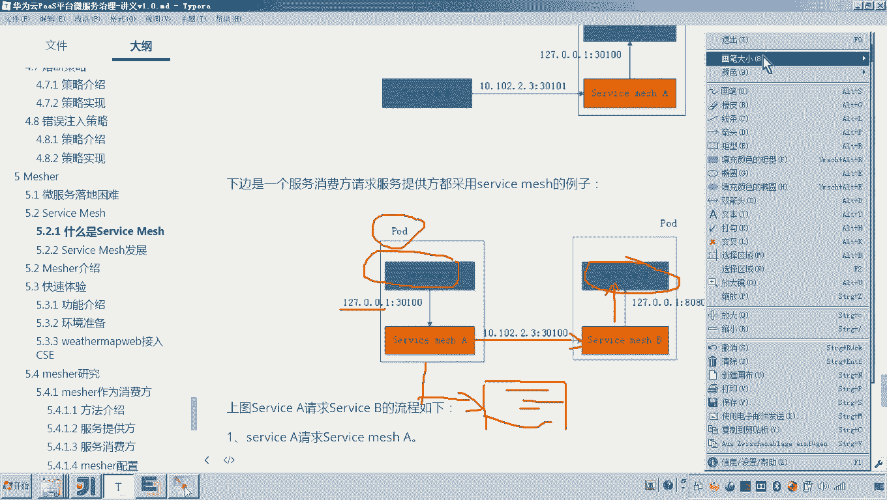

### 场景三：双方均为普通服务

当两个都不是微服务的普通服务（Service A和Service B）需要通信时，只需在双方都部署Service Mesh Proxy。

通信流程变为：`Service A -> 本地Proxy A -> 服务注册中心 -> 远程Proxy B -> Service B`。双方服务都无需进行任何微服务化的代码改造。

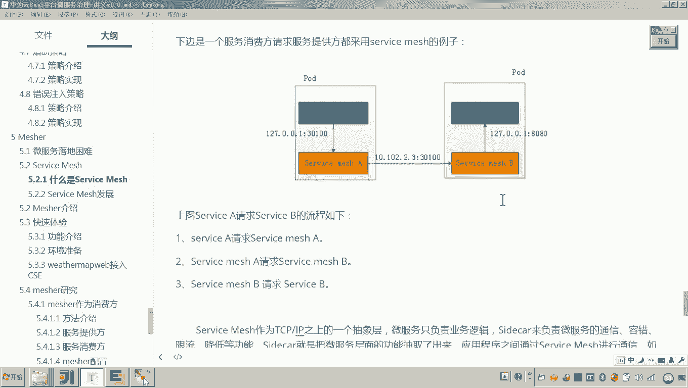

## 为什么叫“服务网格”？ 🌐

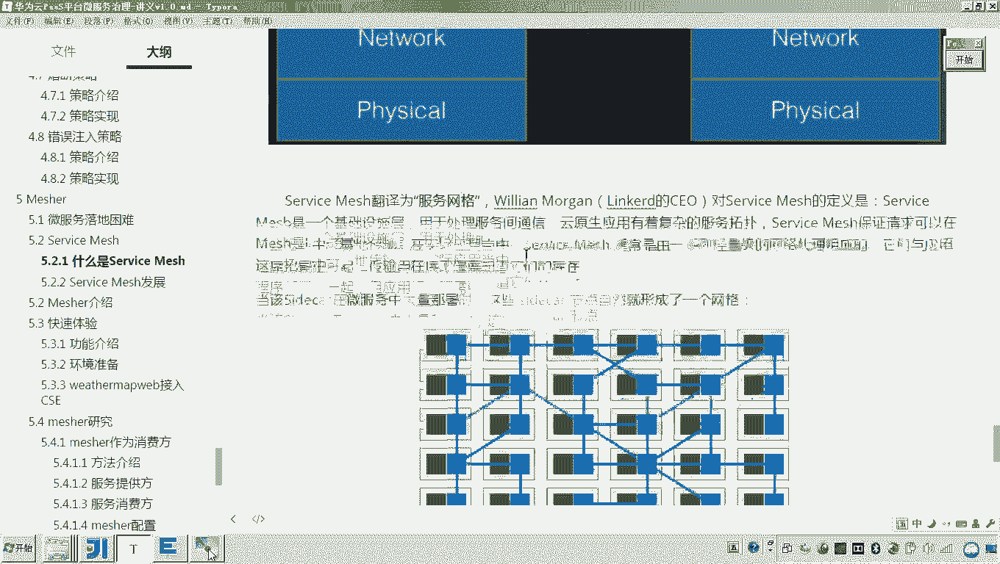

当在一个系统中大规模部署Service Mesh时，每个服务实例都伴随一个Sidecar代理。这些代理之间相互连接，形成了一个负责服务间通信的专用基础设施层。

这个由众多代理节点组成的网络，就像一张覆盖在所有服务之上的“网格”，所有服务间的流量都在这张网格中流转并被治理，因此得名“服务网格”。

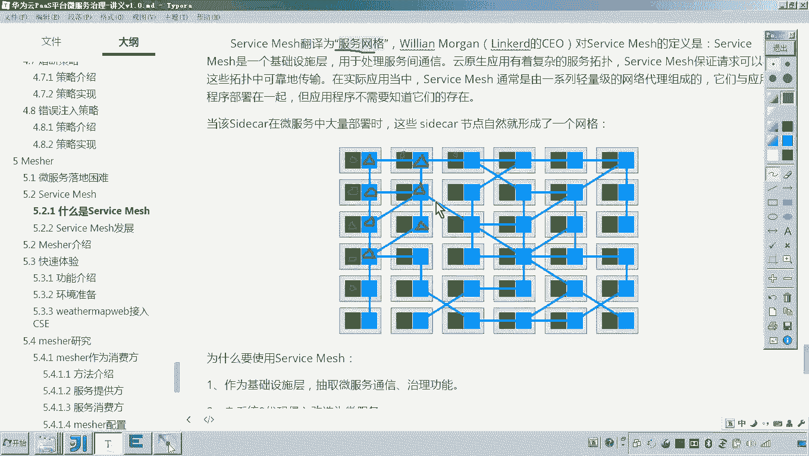

## 为什么需要Service Mesh？ 💡

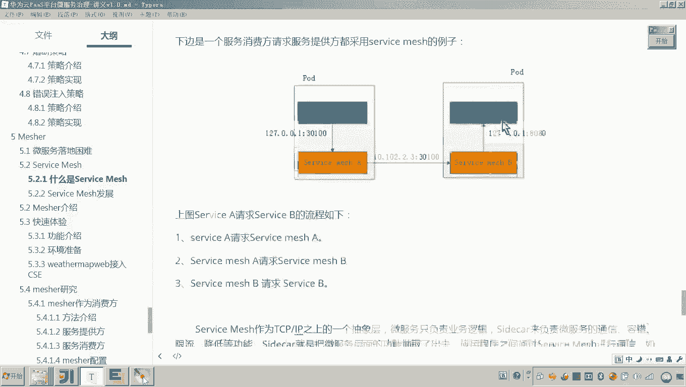

总结来说，Service Mesh的核心价值在于**分离关注点**：
*   **业务开发**：开发者只需关注业务逻辑本身，无需关心复杂的微服务通信、治理逻辑。
*   **基础设施**：Service Mesh代理统一处理服务发现、负载均衡、熔断降级、监控追踪等非功能性需求。

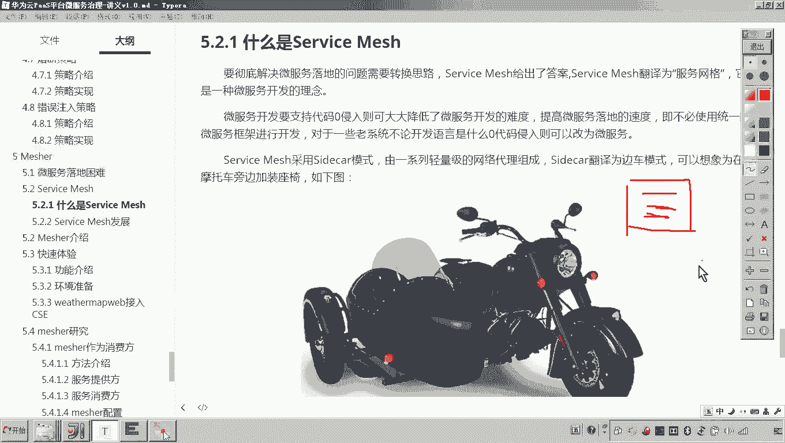

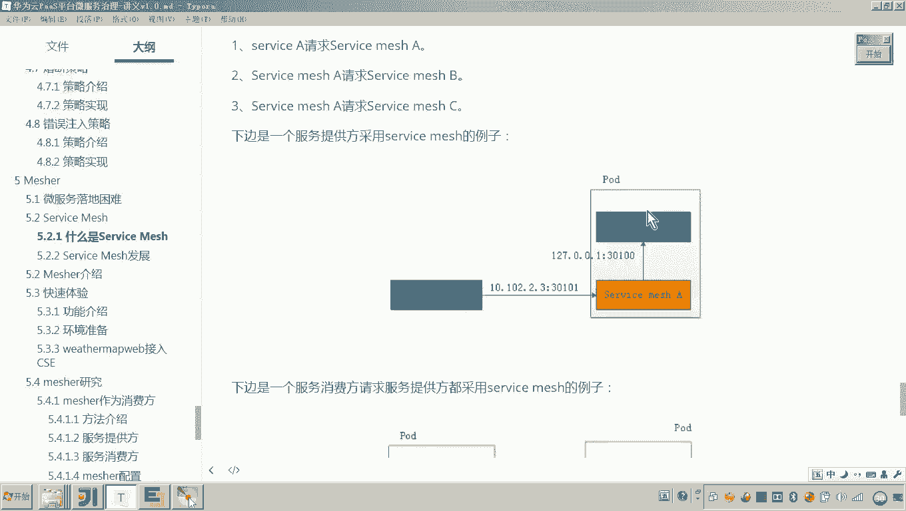

这对于快速将老系统改造为微服务架构（零代码侵入），以及统一管理大规模微服务集群的通信行为具有巨大优势。

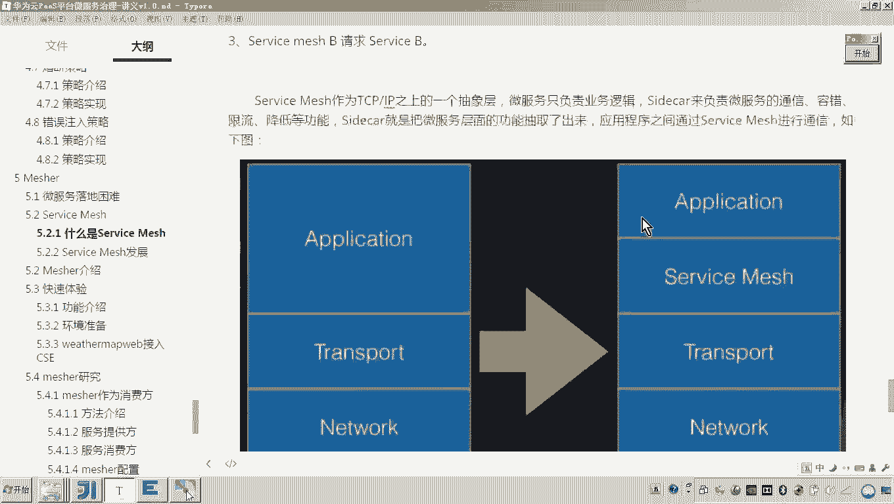

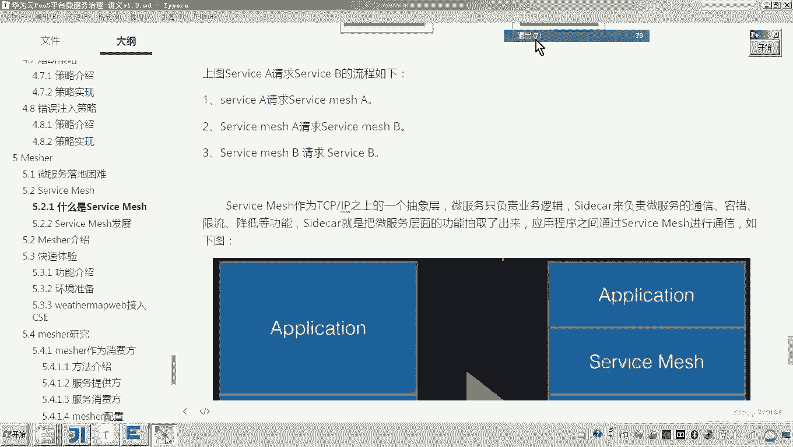

## Service Mesh的发展与产品 🚀

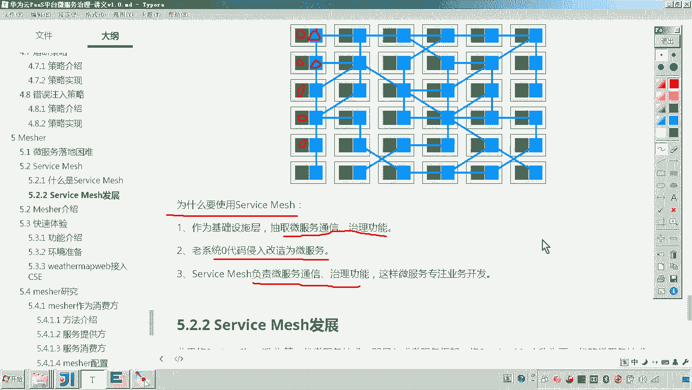

业界通常将Spring Cloud等需要深度集成SDK的框架称为**第一代微服务技术**（侵入式）。而Service Mesh则代表了**下一代微服务技术**（非侵入式）。

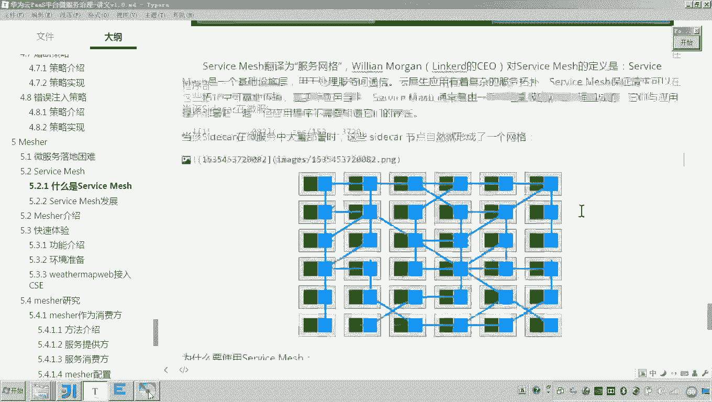

Service Mesh概念在2016年被提出，2018年迎来快速发展。目前已有许多成熟的开源和商业产品，例如：
*   **Istio**：目前最流行的Service Mesh框架之一。
*   **Linkerd**：最早的Service Mesh项目之一。
*   **国内产品**：华为云的**Mesher**、新浪的**Weibo Mesh**等。

我们本课程后续将重点学习的，正是华为云提供的Service Mesh解决方案——**Mesher**。

---

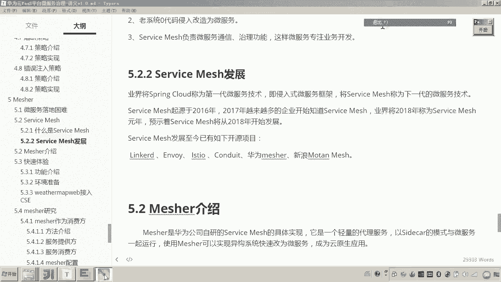

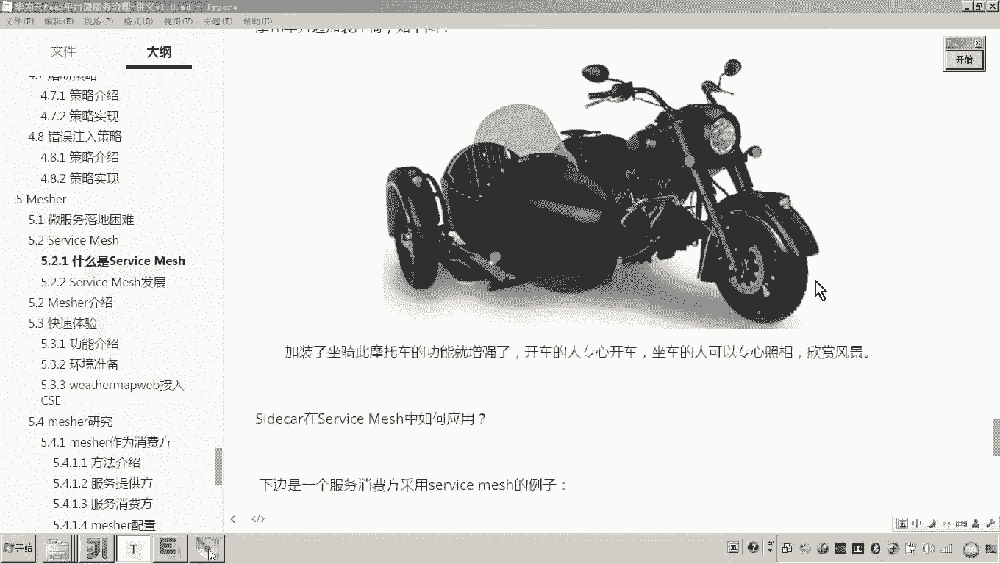

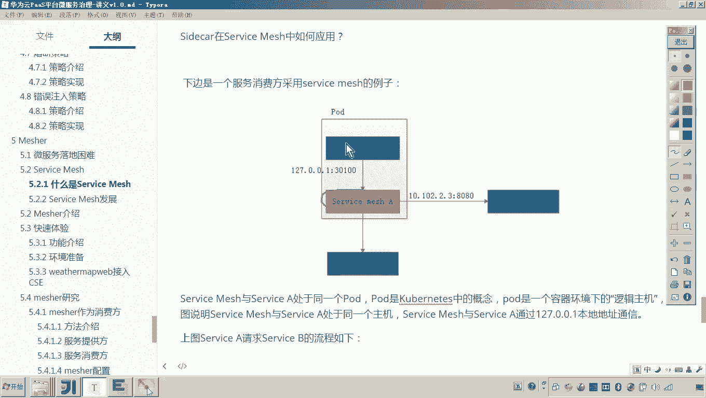

本节课中我们一起学习了Service Mesh（服务网格）的基本概念。我们了解到它是一种通过**边车代理模式**实现**零代码侵入**的微服务架构理念，能够将微服务的通信与治理能力从业务代码中彻底解耦，从而显著降低微服务落地和运维的复杂度。从下一节开始，我们将深入探讨华为云Mesher的具体应用。