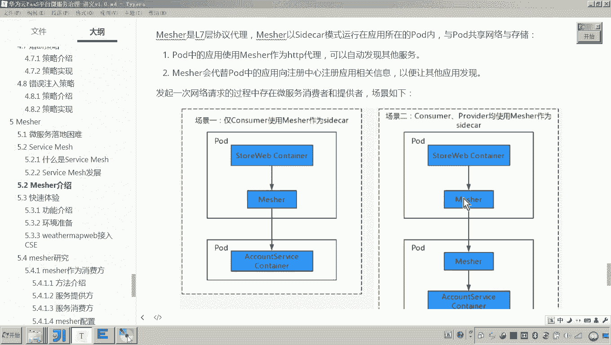
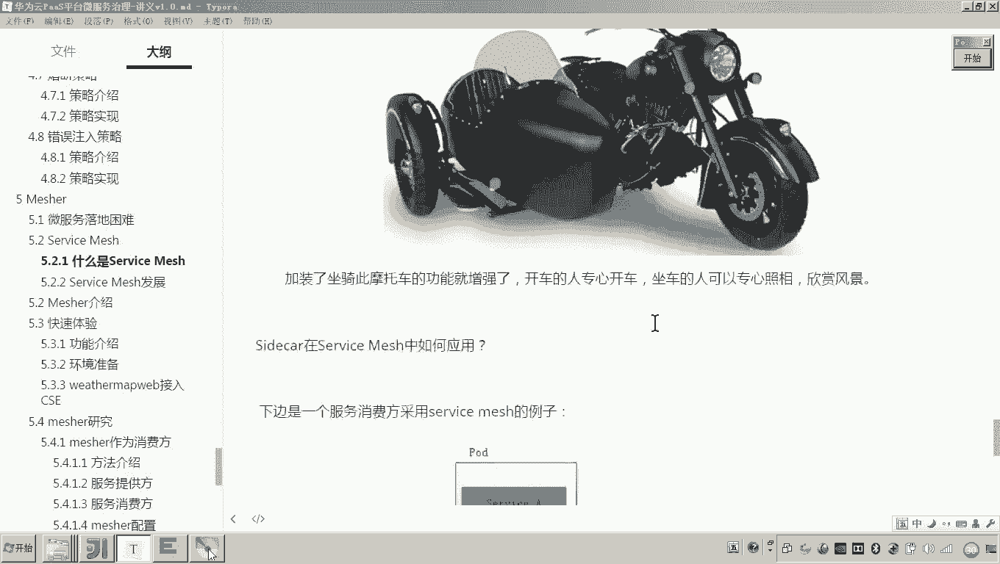

# 华为云PaaS微服务治理技术 - P143：03.mesher介绍-mesher介绍 - 开源之家 - BV1wm4y1M7m5

好，那下边呢我们来介绍一下mesure。那刚才我们介绍了service match啊，那me呢就是service match的一个具体的实现啊，它是华为公司自己研发的，它是一个轻量的代理服务啊。

采用这种sided car这种边车模式呢与微服务一起运行。😊，所以刚才如果你了解了servface match序，他的这种呃工作方式，那想必你对这句话应该呃应该是理解的嗯。使用使用这个measure呢。

可以实现易购系统，快速改为微服务，成为云原生应用，对吧？注意哎，我问大家个问题啊，啥叫云原生应用啊？哎，总共有三个特征，大家有印象吧。云原生应用，第一就是采用微服务的技术去开发，具备微服务的功能。第二。

最终把我们的项目是不是采用云采用容器化的技术进行部署，然后部署到云上。然后第三，采用自动化的这种管理工具，对我们的这种呃我们系统的这个这个容器呢进行进行这个智能的管理，统一管理，对吧？哎。

来减少我们的这个呃维护的成本。😊，所以这就是service match，哎，它的这个什么呀，它的定义啊哎成为啊可以是service呃mesure的一个定义啊。

它是service match的一个具体的实现哎。😊，那具体的话，这个mesure它的是属于这个华为微服务引擎CSE我们之前是不是学了这个CSE啊？哎，它是微服务引擎CSE的一个组件。嗯。

那这个组件各位你看到下面这张图就是servmat和CSE啊，它的一个什么结构图。😊。

那中间你看到的这些服务是不是都加装了measure这个代理看见了吗？啊，那么这些服务在我们说的这个微服务引擎CSE这个平台怎么去进行呃维护运行和管理呢？😊。

首先各位可以看到左侧是不是就是CSE的这个平台呀？对，这里边有service center，是不就是服务注册中心，对吧？第二个是不是就是我们说的什么配置管理中心，对吧嗯。😊，右边是我们说的监控，对吧？

可以对我们说的这个啊measure所代理的这些服务的都进行监控。就是说你只要在你的这个服务上面加装了measure，那这个服务是不是就变成微服务了？那变成微服务了。

是不是就可以被我们这个微服务引擎CSE进行治理啊进行管理了？😊，啊，所以他的你看在这个这个基础设施，这个基础设施是不是就是华为呃华为公司这个云平台提供的对。

所以这个这个measure呢是要配合华为云平台啊来呃对我们这个微服务呢来进行这个呃治理。😊。

好，这就是我们说的这个measure啊，配合华为微服务引擎CSE啊，然后以及华为云平台啊来完成微服务的这个呃接入以及治理。

好。那下边的这几张图呢呃大家应该就比较不陌生了啊，为什么呢？因为刚才我在讲这个service match的时候呃，应该提到过它几个场景啊。那这里面来看啊，mesure呢是呃七层协议代理啊，也就是说各位。

😊，我们说应用层是不是在这个我们说的比如说类似于HTTP呀啊呃，包括其他的一些这个应用层的这个协议这一层，其实measure呢就是封装了什么？哎，封装了这个7层这个协议的代理。它以这个模式来运行啊。

运行在同一个同一个这个pa内啊，那么啥意思呢？各位看到一个pa是不是就相当于一个逻辑主机呀哎，就是相当于一个一个一个计算机。哎，你可以理解为一个计算机啊。

那么看到场景一是啥意思呀场景一是呃将呃这个消费者使用measure来作为s。😊，也就是说，各位。这个服务啊这个这个这个叫做star web这个服务呃，它这个容器啊它就是消费者。

而这个消费者呢嗯它不具备微服务的功能，它是不是就加装了一个measure？😊，啊，加装完matcher之后呢，这个store web它是不是就具备微服务功能了，它是不是就可以访问其他容器的微服务了。

看懂了吧哎。😊，那么场景二是什么呢？场景二是呃消费者和服务提供方都采用mesure。这个我们在学习service match的时候，是不是也了解过，就是这两个服务呢对这两个服务都不是微服务。

他要想具备微服务的功能怎么办呢？你在每一个这个服务所在的容器里头呢去部署match。😊，那这样的话，我们我我我问你他们之间的通信是不是都通过measure来进行访问了？😊，对，所以还有场景一、场景2。

还有场景3啊，场景三这个没有一个图，大家可以看到。😊，场景3，是不是就是提供者使用measure作为提供者使用measure，啥意思？是不是就相当于刚才我讲的这个张图。也就是说啊这是一个服务提供者。

但是他不具备微服务的功能。外部哎外界如果想访问他，是不是要通过serv维m来进行访问？对。😡，好，这就是measure的几种几个场景啊，和我们刚才讲的servmat是一样的啊啊。

只不过现在换了个名字叫measure啊，因为原来我们说servmat只是一种什么技术的呃开发的一些理念和方法。而mat而measure呢就是具体的一个组件啊。

一个什么一个呃供我们开发微服务的一个软件一个框架。😊。

好，那大家来看。😊，那这个是matature的几种场景啊，我是不是就介绍完了matature的性能呢？😊。

它和这个呃现有的一些产品，比如说est still啊、linkD啊，它们的性能比较的，大家看这个图。😊。

这个图呢呃大家来看一下能看懂不能。这啥意思啊？那这个是就是请求的延时，对吧？请求延时。请求延时的话，你看me1。0啊，当然这个这个这个16这个这个版本呢就有点老了啊，现在已经发展到1。0了啊。

这个这个这个图呢可能稍微有些早。但是这个图呢可以说明一些问题。😊，什么问题呢？大家可以看到这个延时延时的话应该mesure是最少的吧。😊，对吧性能是不是比较好？然后TPS这个每秒事务数。

这个你没发现这个mesure应该也是相比其他的这个sme的产品也是最高的对吧？嗯，包括CPU的这个占比。😊，啊，但CPU的占比你们发现这个16应该是还是少一些的。所以综合评定来说。

max的性能还是比较好的。😊。

好，然后往下看啊，然后与这个这这上面的这个性能对比，是不是都是所有的servmat的产品之间进行对比啊？是不是也是一个servmat的产品mesure华为的是不是也是一个serv的产品啊？

那你看它与普通服务的性能对？啥意思？就是说这个这个服务没有使用servmat他们他之前的这个每秒事务数是不是叫1749，而现在这个使用了servmat它这个每秒的事务数是不是叫1496。

我问你是不是就降低了降低了每秒的事务数每秒可以每秒可以处理的这个事物的这个数量是不是减少了减少了是说明性能变差了？没错，的确是包括这个延时没有用serv它这个延时是不是2。8毫秒。

而现在用了serv是不是变成3。34毫秒，这说明加装了加装了sure之后这个性能是不是有所下降？对啊，有人就不可思议了。😊。

有人说啊，这是真的吗？

但其实你也可以想象的通啊，为啥呀？因为原来这两个服务之间直接通信，而现在你中间是不是加了一个代理，对吧？那你说他的性能肯定会有损耗嘛？没错。😡。

但有人说老师为啥性能你用了micsure之后，性能低了，为啥还用啊？你告诉我为啥用啊？😡，啊，我们我们之前都说了，为什么使用service match，咱们是不是之前说过。

为啥使用service match？😡。

我目的是不是就是想让我们的这个系统呢采用微服务开发。对，另外采用service match之后呢，我们是不是就可以让这个service match把这个微服务通信治理的这些功能凑取出来。

我们自己写的服务是不是就不用关注这一块了，不用关注微服务治理这些东西了。😡。

懂我意思吧？所以各位，所以我们这个企业啊在考虑这些问题的时候啊，虽然使用了measure之后，它的性能有所降低，但是相比我们微服务的开发以及运维成本来说，这点性能损耗他们都是可以接受的。😡。

懂了吧？哎，好，那这个就是我们说的measure华为公司自己研发的一个service match的一个具体实现。

好。