# 华为云PaaS微服务治理技术 - P144：04.快速体验-mesher配置 - 开源之家 - BV1wm4y1M7m5

好，那下边呢我们来快速体验一下measure啊，那这个measure呢我们刚才了解过它是serviceme的一个实现。使用measure呢就可以使啊不具备微服务功能的服务呢。

让它接入CSE啊接入啊华为云平台，然后使它具备微服务的功能。好，那现在呢我们给一个需求啊啊在当初我们是不是也是快速体验微服务引擎。我们用的呃给大家演示的这么一个天气预报的系统。

这是华为官方给的一个演示系统啊，大家可以看到啊，那这这个系统呢大家来看啊，我现在把它运行起来啊，我运行起来。😊，怎么运行呢？还跟之前一样啊，这里边我们找到这个系统，然后呢。

我们运行它这个呃star up这个脚本，然后呢，它就可以把这个系统呢给它起起来了。😊。

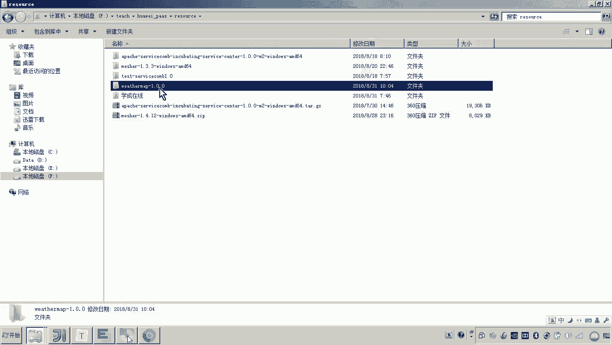

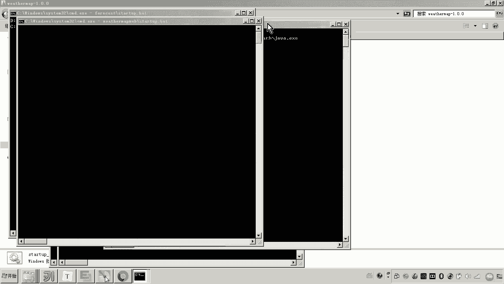

然后呢，起起来之后大家来看啊。呃，我们就进入这个界面来刷新一下。看一下，主要是先让他系统。啊，表示能正常的跑啊。然后这个界面呢呃一旦启动起来，注意这个天气预报的这些微服务呢。

都已经自动的向这个啊这个微服务引擎注册了，嗯，大家可以看到这个界面是不是就是显示了我们看才看到的这个几个微服务呀，对吧？那这几个微服务是不是都是天气预报的这几个微服务啊？😊，对吧并且大家来看啊。

并且来我们把这个界面给它打开啊，这里面有点报错啊。来哎，你看这现在是不是好了，那这里边我们可以输入啊，北北比如说北京好你看是不是就可以在左侧看到当前的这个天气，然后呢，右边是不是未来一段时间的天气情况。

然后在刚才的这个云平台的这个呃微服务引擎这个界面呢，在微服务治理的这个画面当中，大家可以看到啊，你看啊点开啊看到这个画面，大家看到这个画面，这是不是就是呃通过微服务引擎啊来治理我们说的这个微服务啊啊。

但是现在呢我有这样一个需求，有什么需求啊？你看到的这几个啊微服务啊，看到这几个微服务啊，呃，我们呃还想让他把这个什么各位把你现在看到的这个前端，就这个前端呢，大家知道这个天气预报是不是包括有几个工程呀。

😊，啊，还有印象吧，一个是。😊，这个是不是就是一个前端工程啊，基于note GS运行的对吧？而上面这几个是不是都是我们说的啊，现在你看到的这几个微服务啊。😊，哎呃，这个是什么，上边是一个。

未来天气的这个预报，对吧？这个是当前天气的对吧？这是什么？是不是就是一个类似于网关的东西，对吧？所以这几个微服务是不是在各位是不是在这个画面上都看到了。😊，看懂了吗？哎，总共4个。

而现在呢我想将前端这个基于note GS运行的这个。😡，也把它当成一个微服务，也把它注册到CSE怎么办？😡，比如说老师这个这次是啥意思？只要你现在哎我们说说跑起来的这些。服务哎。

这些进程我们都可以把它当成微服务。而现在我要想把这个基于note GS运行的这个程序，也把它注册到微服务引擎，怎么做？😡，就是说现在这个画面各位可以看到是不是没有这个前端。

而我最终把这个前端也把它注册到微服务的这个注册中心。那这个这就是这个前端，这个前端是不是就会在这显示，并且这个前端调用是不是通过这个网关来请求啊？😡，大家看到是不是这样一个画面，来。

你看到我的讲义来看一下。😊，啊，我的讲义嗯打开啊。😊，你看这儿。这个图下边这一部分就是我们说现有的微服务已经注册到这个CSE注册中心的哎服务注册中心的这四个服务。

而现在我想把前端的这个工程也把它注册到CSE怎么办？😡，那有人说老师，那你就用这个什么呀？用这个呃华为的这个微服务框架开发是不是就可以了？😮，但是你要你要注意啊，这个是前端工程。

他所用的技术是不是GS呀？😡，是不是就是基于node GS来运行的？😡，那你我们当初学的这个servicecom也好，包括CSE的这个框架也好，它是不是都是基于java程序来运行的？😡。

对吧所以现在就有这样一个问题。哎，就是我不管这个你是用的其他开发语言，我都可以把你接入微服务。😡，哎，让你变成一个未服。😡，这怎么做呢？哎，有人就犯愁了，所以说老师这个是不是没有讲过，对吧？

我们刚才了解了什么是service match以及measure的介绍，我们应该知道企业是不是有很多老系统。😡，而这些老系统，它的开发语言可不一定是java，有些可能是PPP对吧？

有些可能是donnet等等。😡，所以我们要想这让这些老系统成为微服务，我们是怎么说的，是不是不需改变里边的代码，只要部署一个meature代理，是不是就可以让它变成微服务？😡，所以啊那道理一样。

我要想让这个前端的工程也当成一个微服务，也把它变成微服。我们是不是只要通过measure，就可以把这个前端工程变成什么微服务了？😡，这样的话，我们是不是就可以把这个前端的这个工程也注册到这个微服务引擎。

让它在这个画面上去显示。😡，画面上只要一旦显示出来之后，我问你是不是就可以用这些微服务的治理策略了？😡，懂我意思吗？所以最终的实现的目标，我就想实现这么一个效果。

这上边我圈圈的这一部分就是我们说的前端工程，就是GS写的前端工程。我们要将它也变成微服。😡，由于哎它是一个现成的这个呃用另外其他的开发语言所写的这个程序，并没有用微服务开发框架。我们怎么把它变成微服务。

我们就要用到什么meature。哎，就今天我们讲的measure。😡。

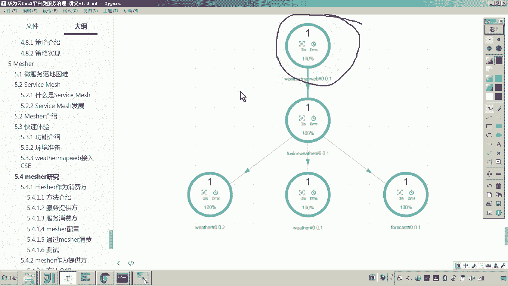

好了，那现在我们就快速体验一下怎么样用measure，让一个不具备微服务能力的这么一个程序，把它变成微服务。😡。

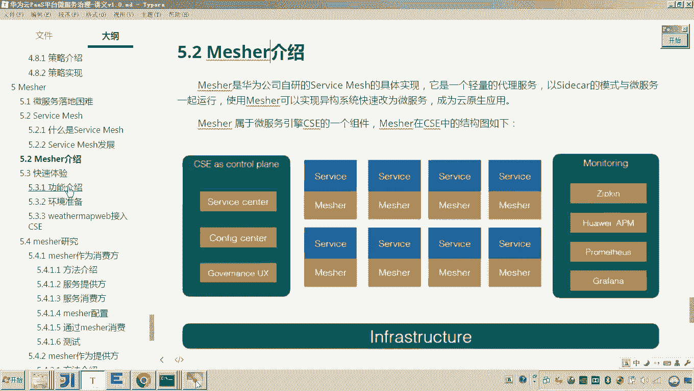

变完微服务之后呢，它的架构就变成这样子了。这就是我们说的那个前端工程。而这个前端工程，他要去访问我们说这个呃微服务的话，那就要通过measure来访问的。😡，各位，我问你。

通过measure访问的意思是啥？是不是这里边有一个服务注册中心，然后呢，由measure去访问注册中心。这个前端是访问measure measuresure去访问注册中心，拿到服务的地址。

然后measure去向服务发起请求。😡，这是不是就是measure的作用啊？那你说这么一做的话，我问你前端工程是不是就具备了微服务的能力了，是不是就间接的具备了微服务的能力了？嗯。

因为measure帮他具备了微服务能力，懂我意思吧？好。😡，那现在我们的需求理解了之后呢，我们现在就来做，那怎么做呢？😡，首先哎我们说那你要用mesure了，那你是不是得干嘛呀？得安装mesure啊？

对，所以这里边我们来看你进到这个界面啊，进到这个呃微服务平台啊，进到微服务平台，在服务列表当中选择里边有一个叫微服务云应用平台servicet，然后点开在这里边是不是有一个叫应用开发，然后点应用开发。

好，点开应用开发之后呢，在这里边就有一个叫做什么呀？叫微服务开发的菜单，里边有一个叫工具下载。😊。

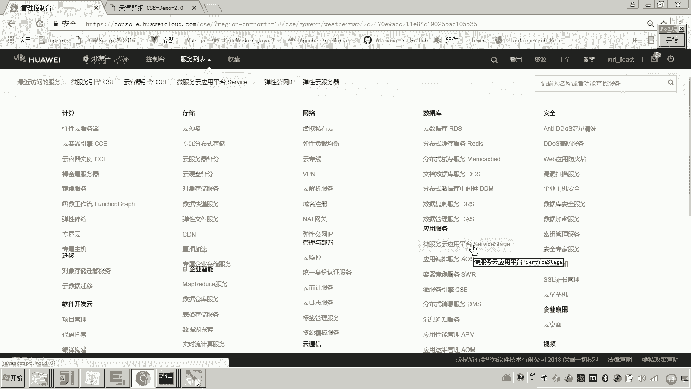

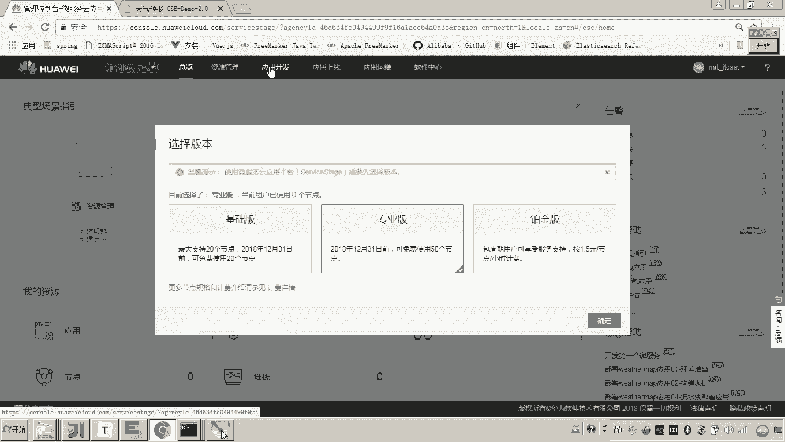

然后点击工具下载，大家可以看到这里边就是所有涉及到的一些什么工具。在第三个有一个叫measure，点measure，这里边就。😊，看到了这里边是不是有下载链接？由于我的开发环境是windows。

所以这里面我们准备用这个链接。😊，叫1。4。12版本的这个measure的下载链接，然后你把measure下载到你的本地。对，下载到你的本地。然后下载完了之后呢，你是不是就可以解压了啊？

那这里边呢呃在我的这个课程资料当中已经给大家啊下载好了。😊，啊，然后在这个里面是不是有一个叫做看是不是有一个叫m小1。4。2啊，然后你把它干嘛呀，解压哎，你把它解压。😊，然后我把它解压开来了之后呢。

大家可以看到啊，注意看啊，这里边这个measure的这个程序是不是就在这儿了。对，就这么一些代码啊。好，那现在我们要做什么呢？😊，因为我现在就要准备环境嘛啊，怎么准备呢？😡，你最终的目的。

各位是不是要通过matature把这个。😡，呃，这个前端工程把它注册到这个服务注册中心呀。所以你现在要确定我要注册的这个服务的什么服务的信息是什么？😡，懂我意思吧？哎，以及你的服务注册中心的地址在哪？

所以这里边有一系列的配置啊，注意听第一，解压measure的安装包。第二，我们配置服务监听以及服务发布的目录在哪里呢？😊，在这个mesure的这个安装的。在mea的安装的这个什么目录当中。

有一个config目录里边找到有一个叫chis，在这啊，打开这个配置文件大家可以看到啊，在这儿。😊，在这儿的话是不是就有呃就有什么大 get是不是有一个叫CSE你看这是当初跟我们配的就差不多呀，是吧？

那这个地址呢就是measure的监听的地址。这个IP地址你要改成什么？你要改成这个呃你的这个计算机的这个。😊，呃，在局域网或公网的这个IP地址。好，你不要写成12700001啊，你改成。

比如说我这里边叫192168。168点1点104。嗯。

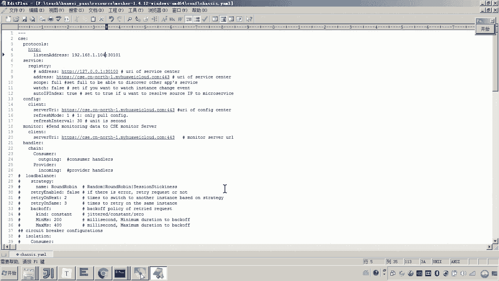

你改成这个地址，你可以看一下啊，我看一下。同。你看一下这里边是不是。叫1。104。

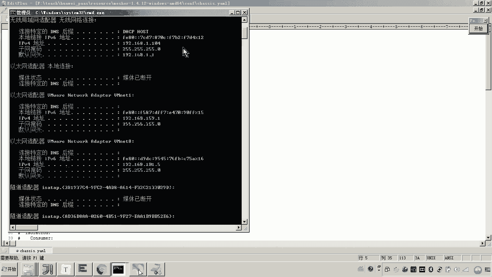

能看到是吧？所以现在你把这个地址呢给它改成我这个计算机在我这个局域网的一个地址啊，你如有公网IP，你就改成公网IP好，那现在大家来看，那下边呢这个是不是就是服务注册中心的地址。

对这个服务注册中心的地址好像不太对啊。呃，我们从原来的我们这个写的这些程序当中，我们找一个地址啊。😊，这个服务注册中心的地址，我们找一个，因为当初我们也配过嘛，这不就是服务注册中心地址吗，你把它改过来。

😊，嗯。对吧然后这个这个是配置中心的地址吧，对，监控的这个先不管它。好，这两个地址先改对啊，包括这个监听。嗯，好，这是不是就搞定了，然后搞定之后呢，各位这是不是就是我们说的呃。

你将来这个measure一旦启动mesure一旦启动各位他是不是要帮助这个前端这个这个工程把他的这个信息注册到服务注注册中心啊。所以刚才我们配置的这一堆就是呃给mesure配置的，要告诉mecher。

你将来向哪个地址把这个服务呢给他注册。懂我意思吧？哎，好，那接下来还有什么配置呢？😊，那你这个配完了之后呢，还要配，就是说你将来要注册哎注册这个微服务到公网的云平台。

你是不是要配这个AKSK的这个这个密钥啊？所以这里边呢我们来看怎么配，点开这个comp pick目录，里边是不是有一个叫做AOTH。😊，这就是一个认证的一个配置文件。在这儿我们是不是把我们的这个密钥呢。

我们把它配上去就可以了。哎，那么配这个的话，各位呃，我和这个什么呀？因为一会儿我要把天气预报的那个程序也注册到这个云平台啊。我这个密钥呢，我从。😊，注意啊，我从这个天气。

我从天气预报的这个程序当中去找一个。因为和他和他都住到一个应影当中，你看好是不是在这儿是吧？来。😊，注意哈，别弄错了。这是空格，有一个空格啊。好，大家来看。测试不就搞定。

这是不是就是这个AKSK的密钥配置啊，就完成了。😊，好，这个密钥配好了之后，接下来再来哎再来。当然这个密钥应该我之前讲过啊，是不是你要根据你的账号从这个云平台去拿呀？啊。

还有这个就是这个confi目录下边还有一个叫做微服务的信息，就是什么意思啊？就是将来这个measure是不是要是不是要帮助这个啊这个we map web这个工程，把它的信息注册到服务注册中心啊。

那刚才我配置的就是服务注册中心的地址，那你最终注册的信息内容是什么呢？对你要去配置一下，哎，在哪里配啊，还是这个measure的安装目录。😊，然后找到measure的安装目录。

找到measure的安装目录，然后在很fi下边是不是有一个叫做microserv。😊，miccroservice这个目录里边来找到大大家可以看到应该是非常熟悉的这是不是就是我们说的应用名，对不对？哎。

然后我们看我们这个应用名呢，和这个天气预报的那个那那几个微服务都是保持一致，都叫做weather map。好，然后呢再有啊这个是这个什么这个这个项目名啊，这个什么这个微服务的名。😊，那这个微服务的名字。

因为meaature是不是帮助这个前端工程哎，向这个服务注册中心注册呀。所以这个measure这个配置文件里边配的这个服务名，一定是他所代理的这个服务的名字。你懂我意思吧？哎，好。

那现在呢我们就把这个也配上去了。😡，好，那配上去之后呢，我们现在来看基本上这个啊measure的配置这一块呢哎都已经完工了。好了，那现在我们做完了之后，有人说老师，那那接下来怎么弄啊？

那我们就可以启动measure。各位，如果我这儿一旦star去启动的话，我问你个问题，我怎么看效果？😊。

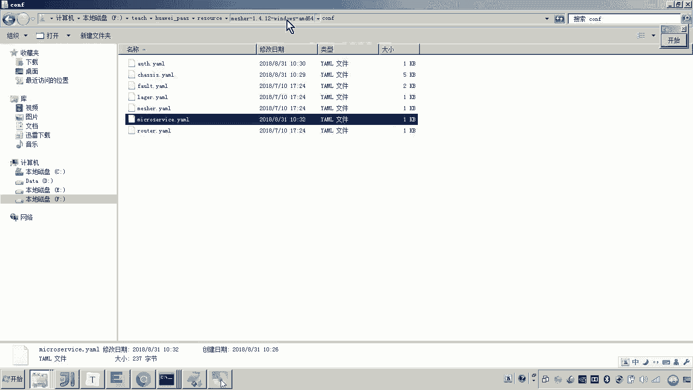

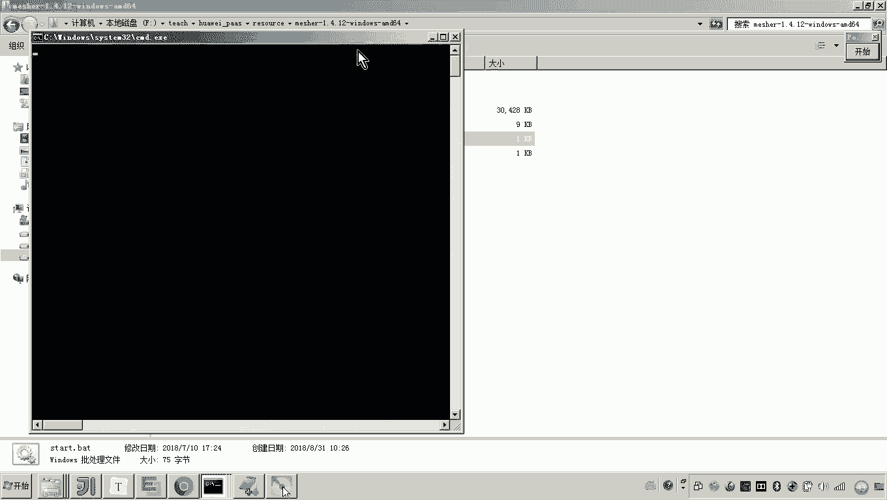

一旦启动这个measure，是不是会把我刚才配的这个微服务的信息，然后把这些信息向哪里注册呀？像我刚才所配置的这个。😡。

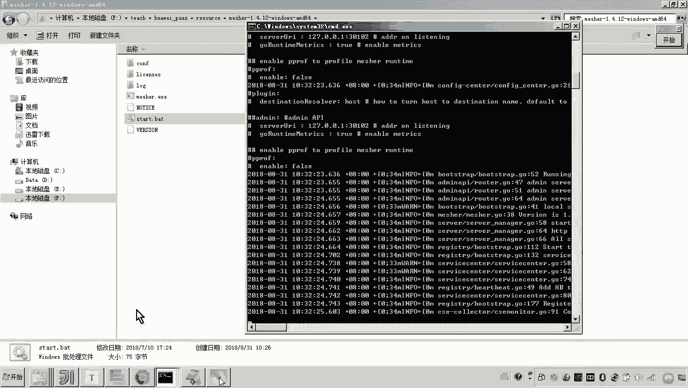

注册中心的这个地址去注册这个地址是不是就是公网云平台的这个地址啊，对吧？所以我们说只要你启动matcher，然后再次进到云平台，然后进入云平台进入云平台在哪里呀？你找到我们最初的那个什么那个应用目录。

我们找到那个什么那个微服务的这个引擎，然后找目录。😡，目录看好，那你现在来看它有没有一个叫做什么呀wether map web的这么一个工程。😡，这是不是就是meature帮助原来的前端工程注册进去了？

😡，懂我意思吧哎。😡，所以到这儿为止，我们这个measure的配置就配置好了。哎，我们回顾一下啊。😡，现在我们想做的一件事啊，就是让measure来帮助啊原来的这个前端工程。哎，然后呢呃把它变成微幅。

那怎么做呢？这里边我们要经过几项配置，第一项配置。😡，哎，首先我们要下载mesure啊，下载完了之后哎，我们说首先要配置啊它的这个什么服务注册中心的地址以及配置管理中心的地址。

这些都是公网的这个啊云平台的地址。😊，另外哎我们还要配什么配他的这个监听的这个地址。配他的监定地址，而这个地址永远记着是将来外部服务所访问这个mecha的地址。😊，嗯，好。

另外还要配这个AKSK这个加密的密钥，用来访问公有云这个呃公网的这个云平台的这些密钥。还有要配置微服务的信息。因为你想你要让我注册微服务，你是不是得把信息告诉matcher，让他注册哎注册什么项目啊。

然后微服务的名称是什么？只要启动现在大家可以看到这儿是不是就是注册成功了，这就是刚刚这个由matature来注册成功的这个微服务信息。😊，好，那么这个呃快速体验当中的这个measure的配置呢。

啊我们呢啊先告一段落。😊。

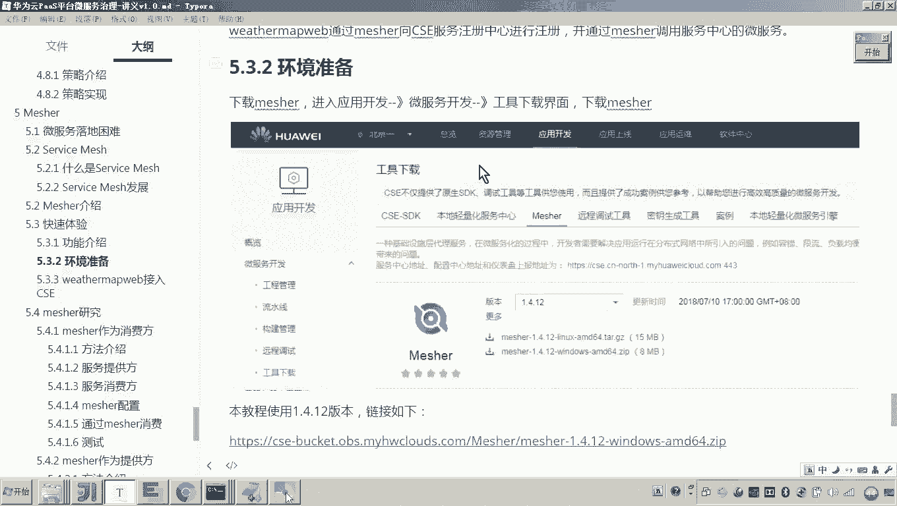