# 华为云PaaS微服务治理技术 - P144：04.快速体验-mesher配置 🚀

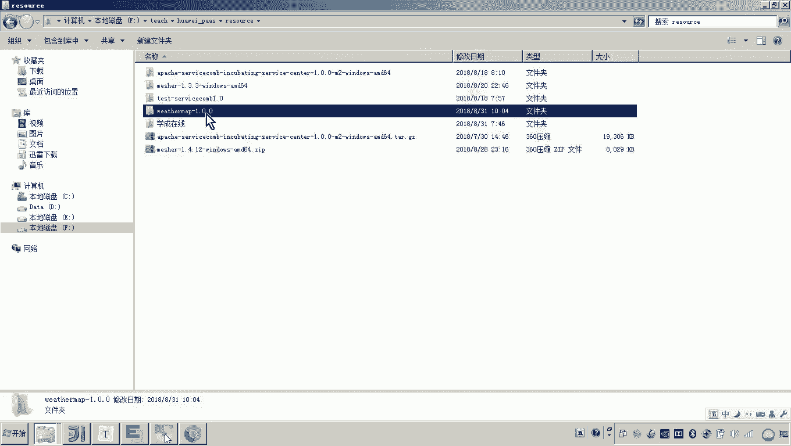

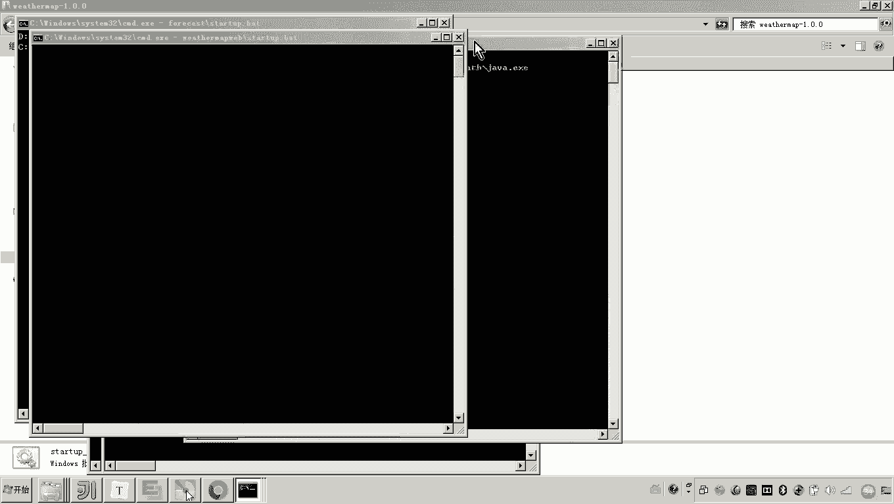

在本节课中，我们将学习如何使用华为云的Mesher组件，将一个非Java语言开发的现有服务（例如一个Node.js前端应用）快速接入微服务引擎，使其具备微服务能力。我们将通过一个天气预报系统的前端应用作为示例，演示完整的配置过程。

上一节我们介绍了Service Mesh和Mesher的基本概念，本节中我们来看看如何具体配置和使用Mesher。

## 需求背景与目标 🎯

我们有一个正在运行的天气预报微服务系统。该系统包含多个基于Java微服务框架开发的后端服务，以及一个基于Node.js运行的前端应用。

目前，在华为云微服务引擎的控制台上，我们可以看到已注册的后端微服务。然而，前端应用并未注册到微服务引擎中。

我们的目标是：**在不修改前端应用原有代码的前提下，通过部署Mesher代理，将Node.js前端应用也注册为微服务**。这样，前端应用就能在微服务引擎的控制台中显示，并能够使用服务发现、治理等微服务功能。

最终的系统架构将变为：前端应用通过Mesher代理访问服务注册中心，Mesher负责服务发现和请求转发，从而使前端应用间接具备了微服务能力。

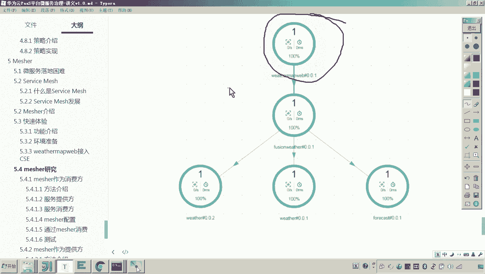

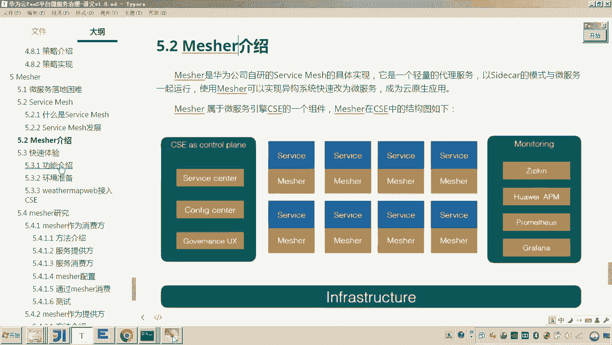

## 配置步骤详解 ⚙️

以下是使用Mesher将现有服务接入微服务引擎的核心步骤。

### 1. 下载与解压Mesher

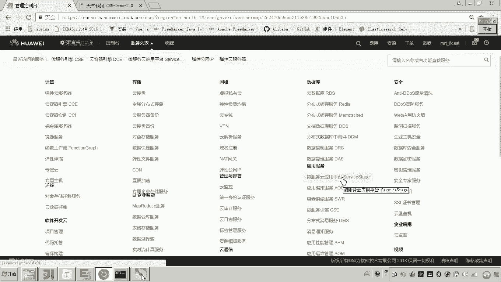

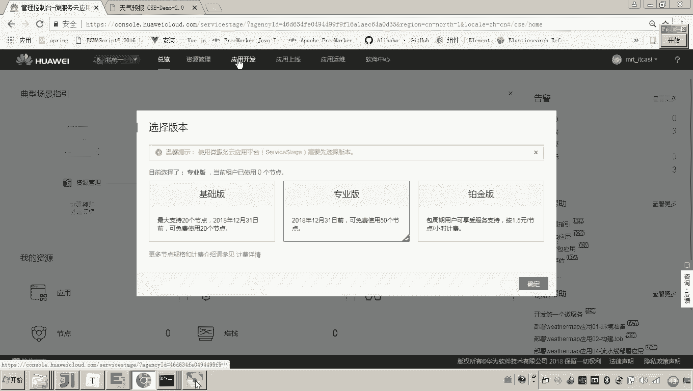

首先，需要获取Mesher的安装包。
*   登录华为云控制台，进入“微服务云应用平台 ServiceStage”。
*   在左侧导航栏选择“应用开发 > 微服务开发 > 工具下载”。
*   在工具列表中找到“Mesher”，根据您的操作系统（如Windows）下载对应版本（例如1.4.12）。
*   将下载的压缩包解压到本地目录。

### 2. 配置服务监听与注册中心地址

接下来，需要配置Mesher自身的监听地址以及它要连接的服务注册中心地址。
*   进入Mesher解压目录下的 `conf` 文件夹。
*   打开 `chassis.yaml` 配置文件。
*   修改 `servicecomb.service.registry.address` 配置项，将其值设置为华为云微服务引擎的注册中心地址（可从您已有的微服务项目配置中获取）。
*   修改 `cse.protocols.rest.listenAddress` 配置项，将其值设置为Mesher代理所在机器的IP地址（非127.0.0.1），例如 `192.168.1.104:8080`。这是外部服务访问Mesher的入口。

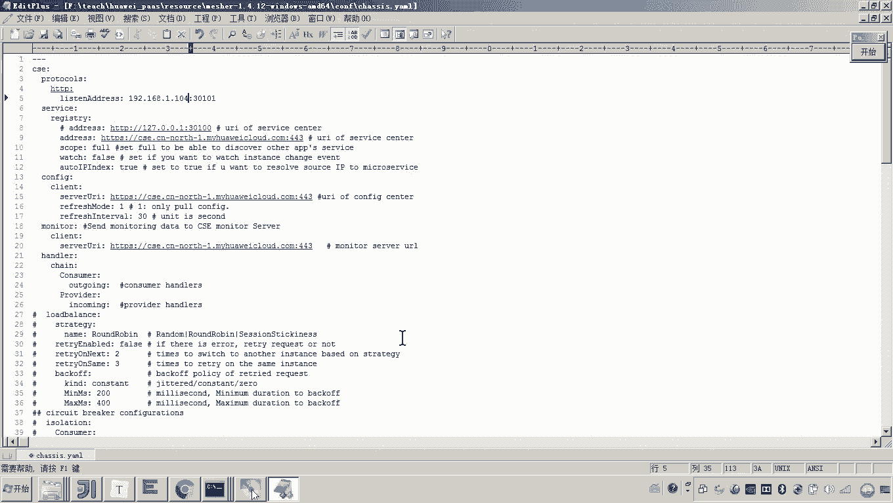

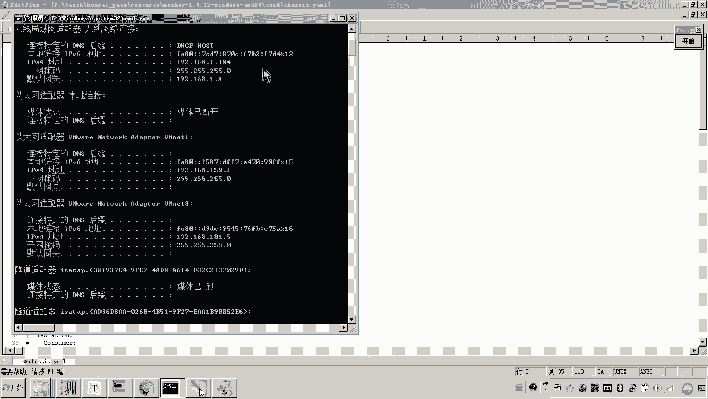

**示例配置片段：**
```yaml
cse:
  protocols:
    rest:
      listenAddress: 192.168.1.104:8080 # Mesher监听地址
  service:
    registry:
      address: https://cse.cn-north-1.myhuaweicloud.com # 服务注册中心地址
```

### 3. 配置访问云平台的认证信息（AK/SK）

为了让Mesher能够将服务注册到公有云平台，需要配置访问密钥。
*   在 `conf` 目录下，打开 `authentication.yaml` 配置文件。
*   将您的华为云账号的AK（Access Key）和SK（Secret Key）填入对应配置项。这些密钥可以从华为云控制台的“我的凭证”中获取。

### 4. 配置待注册的微服务信息

最后，需要告诉Mesher，它要代理并注册的微服务具体信息是什么。
*   进入 `conf/microservice` 目录。
*   打开 `microservice.yaml` 配置文件。
*   配置 `APPLICATION_ID` 和 `service_description.name`。这两个值分别代表应用名称和微服务名称。为了与系统中其他服务保持一致，我们将应用名设为 `weathermap`，微服务名设为 `weathermapweb`。

**示例配置：**
```yaml
APPLICATION_ID: weathermap # 应用名称
service_description:
  name: weathermapweb # 微服务名称
  version: 1.0.0
```

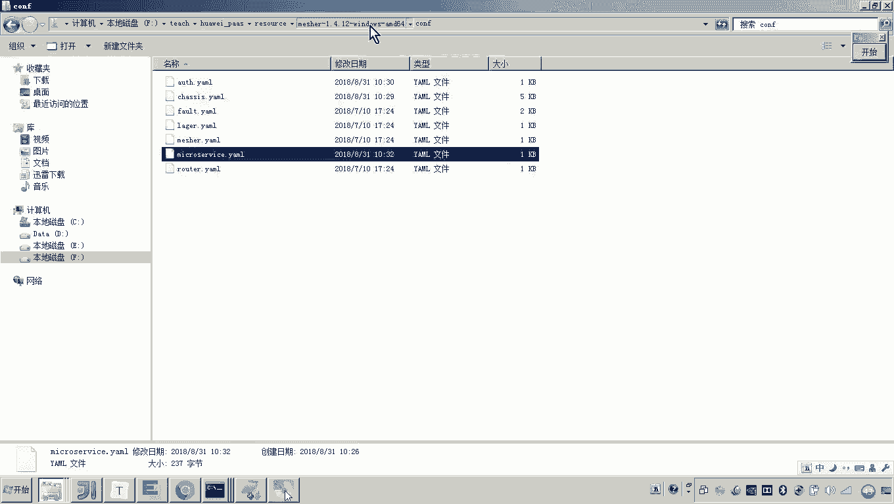

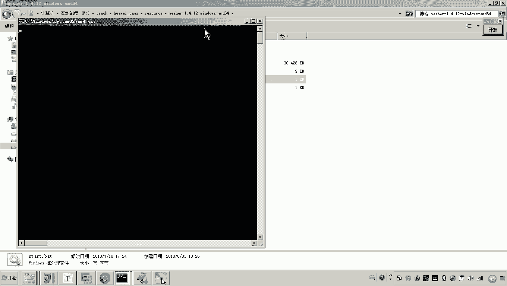

## 验证配置效果 ✅

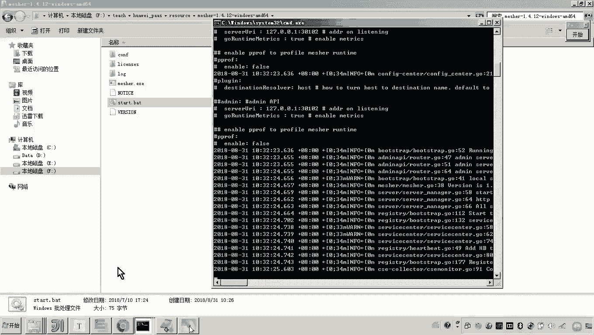

完成以上所有配置后，即可启动Mesher代理程序。启动命令通常为运行解压目录下的 `start` 脚本。

启动成功后，再次登录华为云微服务引擎控制台，进入“服务目录”。您应该能看到一个新的微服务 `weathermapweb` 出现在列表中。这证明Mesher已经成功地将原本不具备微服务能力的Node.js前端应用，注册到了微服务引擎中。

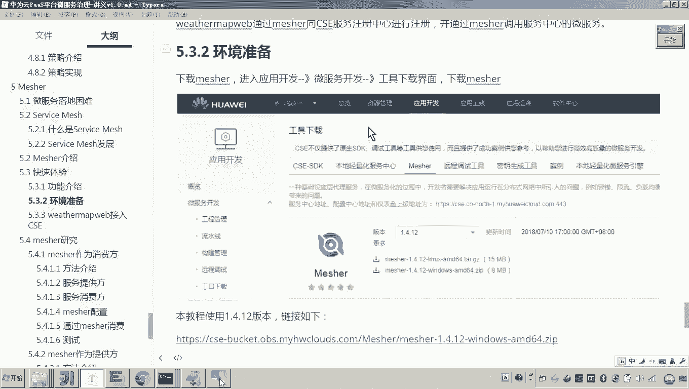

本节课中我们一起学习了如何通过四个关键步骤配置Mesher：下载安装、配置注册中心地址、配置云平台认证、定义微服务信息。通过这一过程，我们实现了让一个非Java的现有服务快速、无侵入地接入华为云微服务治理体系，这正是Service Mesh理念的落地体现。