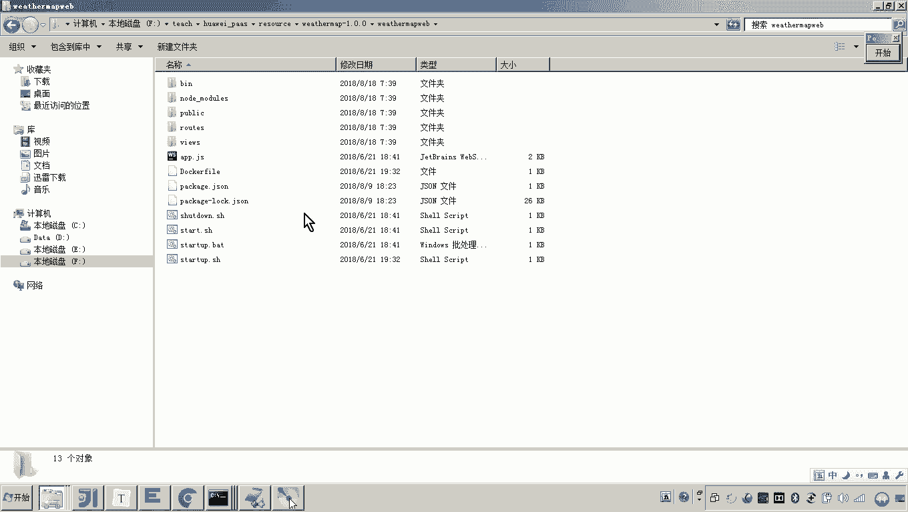
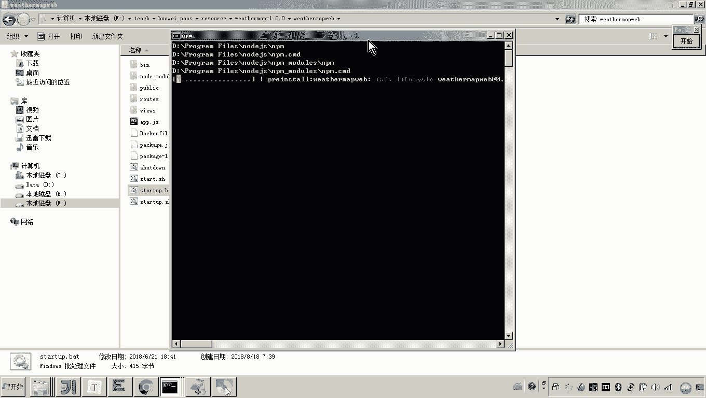
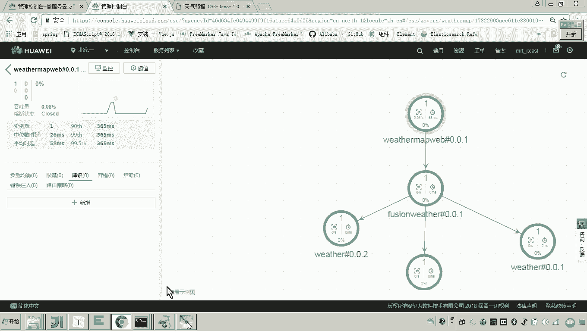
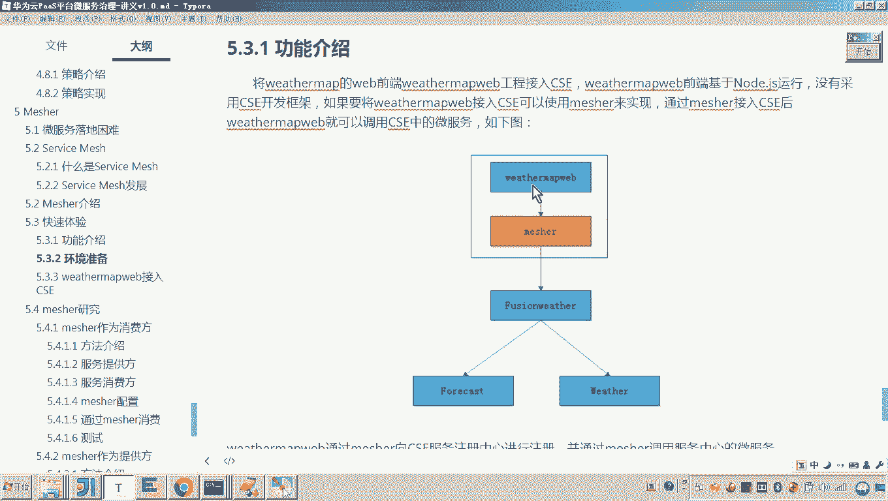

# 华为云PaaS微服务治理技术 - P145：05.快速体验-weathermapweb接入CSE - 开源之家 - BV1wm4y1M7m5

好，那么刚才我们完成了这个mecha的配置。那现在呢我们就准备让我们这个前端工程呢来接入CSE。好，那大家可以看到啊，只要刚才我们按照咱们说的这些配置呢配好了之后呢。

那这个measure其实已经帮助这个前端工程在这个公网的这个云平台的服务注册中心，已经把这个服务注册成功了，对吧？😊，而现在我们想做什么？因为它是一个微服务啊，说它这个前端这个服务如果想访问。😡。

这些微服务怎么做？想访问哪些被服务，因为你也知道原来各位原来我们做的方法是怎么做的？😡，原来我们做的方法就是没有meaature的时候，这个前端工程是不是就直接来请求哎。

我们说的这个这个这个微服务的这个网关，然后由网关来请求这这两个微服务了，我们是不是这么做的？而现在你有了matature之后，各位有了mesure的好处是什么呢？

是不是这个前端工程再去请求这个微服务的话，它是不是就会通过这个什么mesure来进行，而meature本身它是不是就具备微服务的功能。那将来我们是不是就可以去做。比如说这个什么呢？

这个这个服务的治理的一些工作了？😊，你懂我意思吧？所以这个matature有了matature，那这个前端工程就变成了一个微复啊，但是这里边呢，我们说那那那你怎么去干嘛呀。

怎么去访问原来的这这这些工程呢怎么做呢？好了，注意现在我们就要改东西了，我们让这个什么呀，让这个前端工程哎，来请求matature。😡，这样的话，这个micer是不是就是一个代理啊。

那么由miccher来把这个信要把这个信息转发给这个微服。好了，那现在怎么做呀？😊，大家看到呃，你按照我的讲义的这个说法去配置就可以了。因为这个前端工程我们来看打开嗯。😊，打开这个前端工程。哎。

这个前端工程呢在在在这里是吧，里边是不是有一个叫做呃。😊，不是，这叫做。root啊就root在root里边是不是有一个叫做wether map webGS。那么打开，你看原来的代码是咋写的。😊。

原来代码。原来的代码是不是请求127。0。1本地的一个叫做13092的这么一个端口。这个端口是不是就是微服务的这个端口了？对，就是直接他原来是不是直接请求微服务啊，而现在我不让他请求他了。嗯。

我让请求谁呢？看好啊。😊，我让他请求还是本地的，我让他请求30101。啥意思？我让他请求30101的话，30101是谁的端口？😡。

30101是不是刚才我在配置文件当中所配的这个meature的这个地址以及端口。你看matature的端口是不是叫30101啊，而现在你让前端，你修改这个GS文件，你是不是让前端直接请求30101了。

你一请求30101的话，各位。😡，这个卖小是不是就？是不是就开始代理这个前端工程的请求，开始请求微服务了。对，但原来你请求的地址的方式，你看原来请求的方式是不是是这么请求的。

是不是通过这个IP加端口的方式。而现在你通过me去请求的话，meature已经可以连注册中心服务注册中心了。所以你只要把原来的这种IP端口的请求方式，你把它更改为什么呀？对你把它更改为服务名请求的方式。

这就是一个服务名，这服务名从哪里来呢？各位这个名字就和这个名字一样，这是不是就是我的服务名，看懂了吗？所以matature呢就会从这个注册中心找这个服务名。😊，懂我意思吧？所以这里边有两点需要注意。😡。

第一点，我们要把这个什么哎，要把这个IP注意啊，我们要把这个端口号修改为measure所监听的这个端口。哎，记什么呀？记这个30101，就这个端口。

然后将原来的IP port替换为这个叫做fuionweer这个服替换为这个。😡，Fumming。都相当于是什么呢？现在我们说通过matature请求微服务。

那其实就是通过哎就是就是通过什么服务名来进行请求，和原来的那个通过IP和端口的请求方法不一样了。😡，看懂了吗？其他内容不用更改。😡，这样的话我是不是就改了两处。

一个是哎请求的这个端口改成meature的端口。另外一个请求的地址改成什么？改成这个服务名。这样mesure呢就拿到这个请求之后呢，开始拿着这个服务名去这个什么服务注册中心去找这个服务地址。

然后呢由mecher来进行请求。好了，那现在我改完了之后，各位好，我们现在呢我们就可以来尝试去运行一下了。嗯，怎么运行呢？😊，那我是不是就可以。直接刷新可以试一下行不行？好，看好。😊。

是不是是不是效果照样有，对不对？你看搜一下。😡，啊。看来，我们搜一下，看郑州的天气，看大家看这是不是有没有问题。然后这个时候你再回来再回来，回到哪，回到服务治理的这个画面。😊，对吧然后你点开。点了。好。

点开。好，这里呢有点问题啊，注意啊，我把这个什么呃，我把这个。😊，我把这几个这个这个这个这个前端的应用和这个这个我把前端应用重启一下。Yi。😔，因为我刚才改这个前端的代码了吗？

所以我需要把前端的应用重启一下。来，我们找到前端。前端在哪前端在这儿是吧？

现在在这儿的话嗯，我这里边是不是直接双击就可以了？😊。

那可以看一下。啊，我我是不是又把重前端重启了，前端重启了之后呢，我们来刷。因为我刚才改了这个前端的GS啊，好，现在是不是就可以？😊，对，可以之后呢，对我要看什么效果呢？😡。

我要看的效果就是呃看他这个治理的这个什么这个画面。这个自理的画面。一定要有一条线，看见吗？有这条线说明什么？说明这个微服务是不是就在正常的来访问其他的微服务？各位，我这个效果是不是就做出来了，看好了吗？

对。😊，那大家看到了这个画面，各位就是这个前端工程，他去访问原来的这个微服务，是不是就是通过mater。😡，那有时说老师这个matature怎么没有在图上去画出来？

因为matature本身它就是一个代理matature的作用，是不是就是让原来的这个前端的这个服务呢就变成一个微服务了？😡，没错吧，哎，好了，那现在大家可以看到。😊。

那如果现在各位我在这儿一点点击这个前端工程。好，你说我现在想对他进行降级处理。你看他是不是照样都可以对这个前端工程做什么，做这个微服务的处理了。😡，懂我意思吧？哎，所以这时候呢注意你再来刷新。

你可以看一下。😊，你等一下啊，因为这个因为这个降级的这个这个这个处理的这个策略，他是不是要下发到这个meser？😊，对吧下发到micer之后呢，他需要一定的这个时间吧。😊，嗯，稍等一下。

那大家可以看到我现在再刷新一下，它是不是就变成了这个获取数据失败了。对，因为因为因为我在这个治理的这个平台，我是不是把它降级了，对吧？对，如果这儿你把它给把这个降级的策略给它删掉。😊。

你现在针对是不是就是针对这个前端工程做这个什么做这个微服务治理啊，因为本身前端工程他是不是被me通过这个measure把它接入到微服务的这个平台了，是吧？哎，所以这时候再来刷新。😡。

等一会儿这个这个这个数据还是要下发啊，应该是在二三十秒左右。好，所以其实以上我们通过快速体验，我相信大家应该对这个measure的这个使用的流程应该有一个直观的认识了。就是现在我们说原来的这些服务啊。

它不具备微服务的能力。哎，我们说在不更改代码的时候呢，我们就可以通过measure，然后把这个服务呢把它接入我们的这个微服务引擎，让它具备微服务的能力。那其实我跟你说，就是measure呢。

把微服务治理的那些功能给抽取出来。对，它作为一个代理，哎，作为一个什么作为一个set car，然后在这儿存在。那么他们就是一个整体。😊，懂我意思吧？好，那现在呢我们再来刷新。😊，看大家可以看到，没错吧。

所以这个就是我们的快速体验。通过这个matsure啊来将我们的这个应该说是一个node GS的工程呢，把它接入，把它变成微服务，接入我们的微服务引擎啊云平台好。😊。

