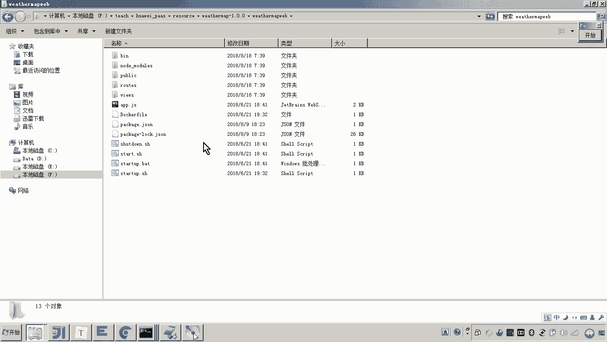
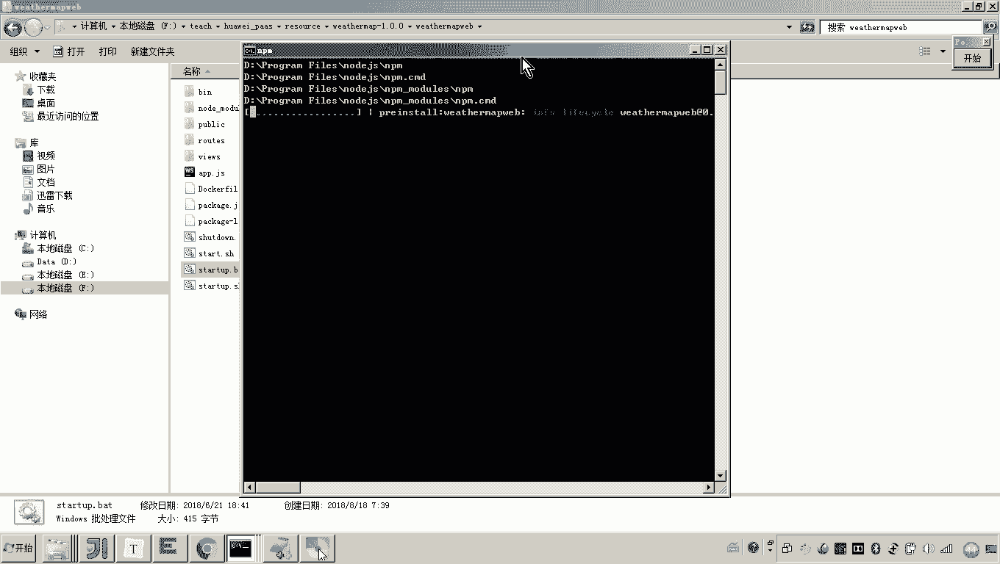
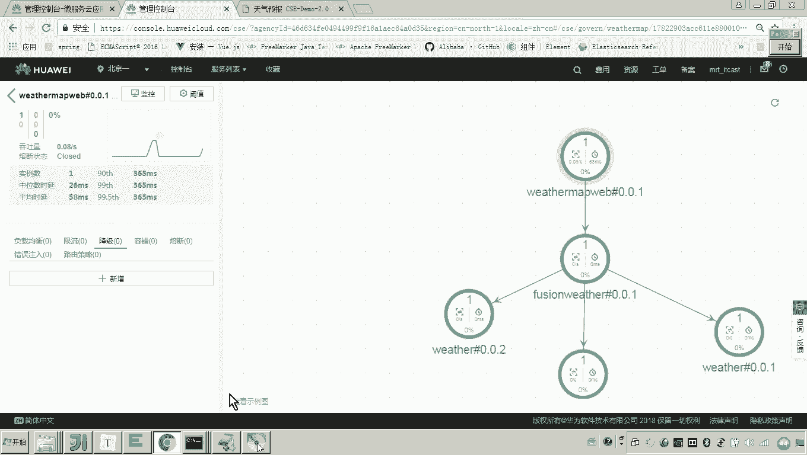
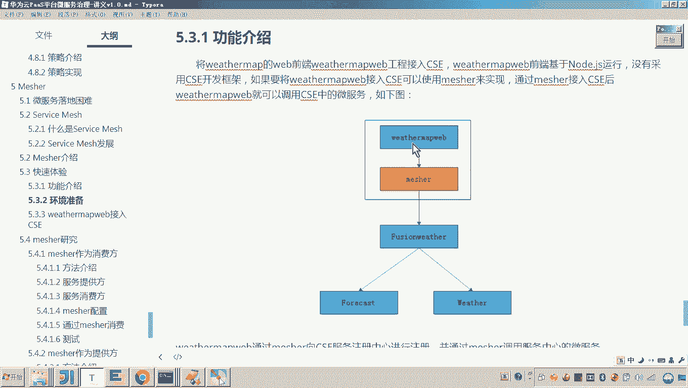

# 华为云PaaS微服务治理技术 - P145：05. 快速体验 - weathermapweb接入CSE 🚀

在本节课中，我们将学习如何将一个前端工程（weathermapweb）通过华为云微服务引擎CSE的ServiceComb Mesher组件接入微服务体系，使其具备微服务治理能力。我们将通过修改前端代码的请求方式，使其通过Mesher代理访问后端微服务，从而实现不修改业务代码即可享受服务治理功能。

上一节我们完成了Mesher的配置，使其能够连接到云平台的服务注册中心。本节中我们来看看如何让前端工程通过Mesher来访问后端微服务。

## 改造前端请求逻辑

原来的前端工程是直接通过IP和端口请求后端微服务网关。接入Mesher后，前端请求将发送给Mesher代理，由Mesher根据服务名从注册中心发现服务并进行转发。以下是改造的核心步骤：

1.  **修改请求目标端口**：将前端请求的目标端口从后端服务的端口（如13092）改为Mesher监听的端口（30101）。
2.  **修改请求地址为服务名**：将原来基于IP地址的请求方式，改为基于服务名的请求方式。Mesher会根据这个服务名去服务注册中心查找对应的服务实例。

## 具体操作步骤

以下是修改前端工程 `weathermapweb` 中 `root/weatherMapWeb.js` 文件的具体操作。

打开 `weatherMapWeb.js` 文件，找到原来直接请求后端服务的代码段。原始代码可能类似于直接请求 `127.0.0.1:13092`。

我们需要进行两处关键修改：

*   **第一处**：将端口号 `13092` 修改为 Mesher 的监听端口 `30101`。
*   **第二处**：将原来的IP地址（如 `127.0.0.1`）替换为要访问的后端微服务的**服务名**，例如 `fusionweather`。

修改后的代码逻辑如下所示：

```javascript
// 修改前：直接请求后端服务IP和端口
// var url = "http://127.0.0.1:13092/weather/..."；

// 修改后：通过Mesher(端口30101)以服务名方式请求
var url = "http://127.0.0.1:30101/fusionweather/weather/..."；
```



**公式解释**：
> 新的请求路径 = `http://` + `Mesher主机地址` + `:` + `Mesher端口` + `/` + `目标服务名` + `/` + `具体API路径`



这样修改后，前端的所有请求都会发送到本地的Mesher代理（`30101`端口）。Mesher接收到请求后，会解析出服务名（`fusionweather`），然后向服务注册中心查询该服务的可用实例地址，并将请求转发过去。

## 验证接入效果

完成代码修改后，需要重启前端应用以使更改生效。

1.  重启 `weathermapweb` 应用。
2.  在浏览器中刷新前端页面，尝试查询天气（例如“郑州”）。如果页面能正常显示天气信息，说明前端通过Mesher访问后端服务的链路是通的。
3.  登录华为云CSE服务治理控制台。在服务依赖拓扑图中，你现在应该能看到代表前端服务的节点（例如 `weathermapweb`）与后端微服务节点（如 `fusionweather`）之间出现了连线。这条连线直观地展示了服务间的调用关系，证明前端已被成功接入微服务治理体系。

## 体验服务治理能力

当前端服务成功接入后，你便可以在治理控制台上对其应用各种治理策略。例如，你可以对 `weathermapweb` 服务到 `fusionweather` 服务的调用配置**降级规则**。

1.  在治理控制台找到 `weathermapweb` 服务，对其设置一个降级策略（如直接返回失败）。
2.  策略下发到Mesher需要短暂时间（通常几十秒）。
3.  策略生效后，再次刷新前端页面进行天气查询，页面可能会显示“获取数据失败”等降级后的响应。

当你删除或禁用该降级策略后，服务调用又会恢复正常。这个过程清晰地展示了如何对通过Mesher接入的非原生微服务应用进行统一的治理管控。





本节课中我们一起学习了如何将 `weathermapweb` 前端工程接入CSE微服务引擎。核心是通过引入ServiceComb Mesher作为代理，并将前端的直接IP端口调用改为通过Mesher的服务名调用。这样，无需修改原有业务代码，就使前端应用具备了微服务身份，并能享受服务注册发现、流量治理、监控拓扑等完整的微服务治理能力。通过快速体验，我们直观地理解了Mesher在异构系统微服务化中的桥梁作用。