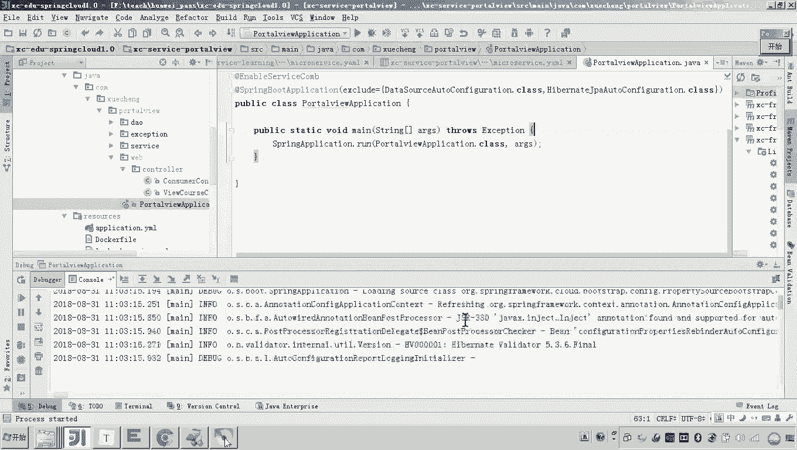
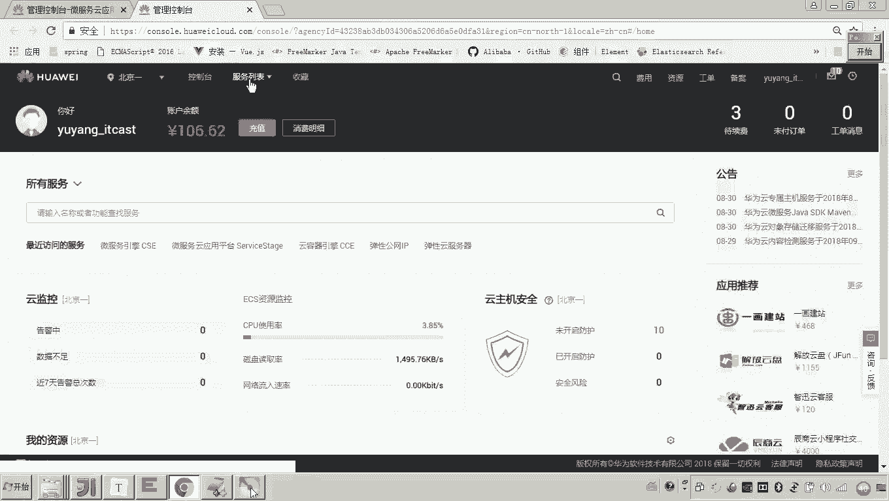
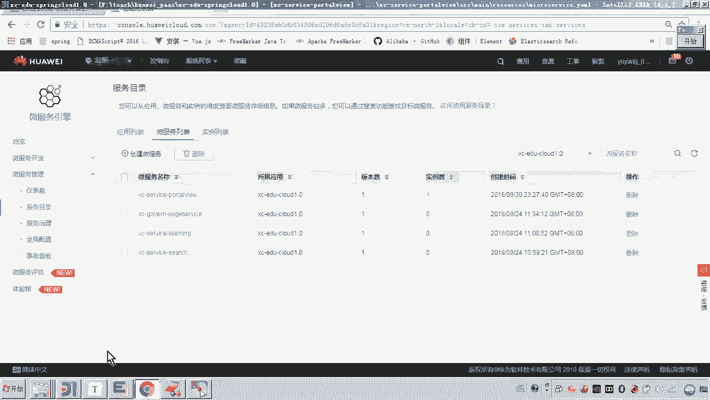
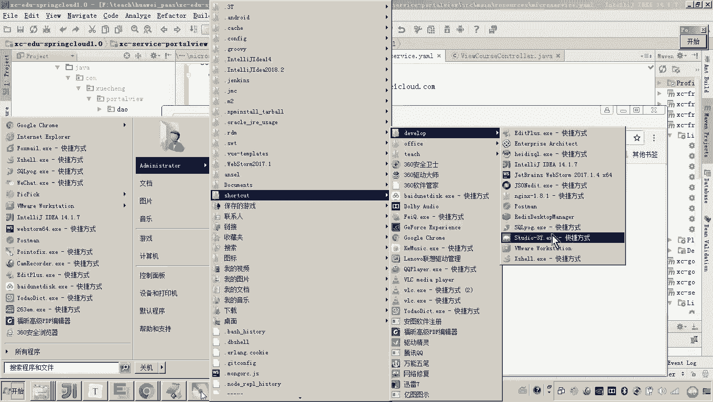
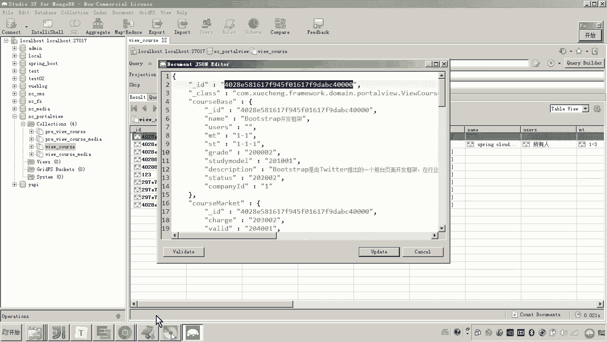
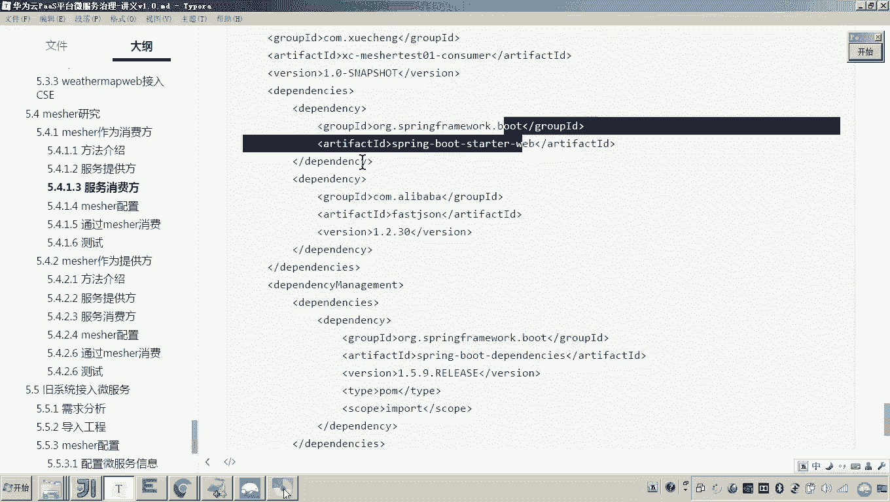
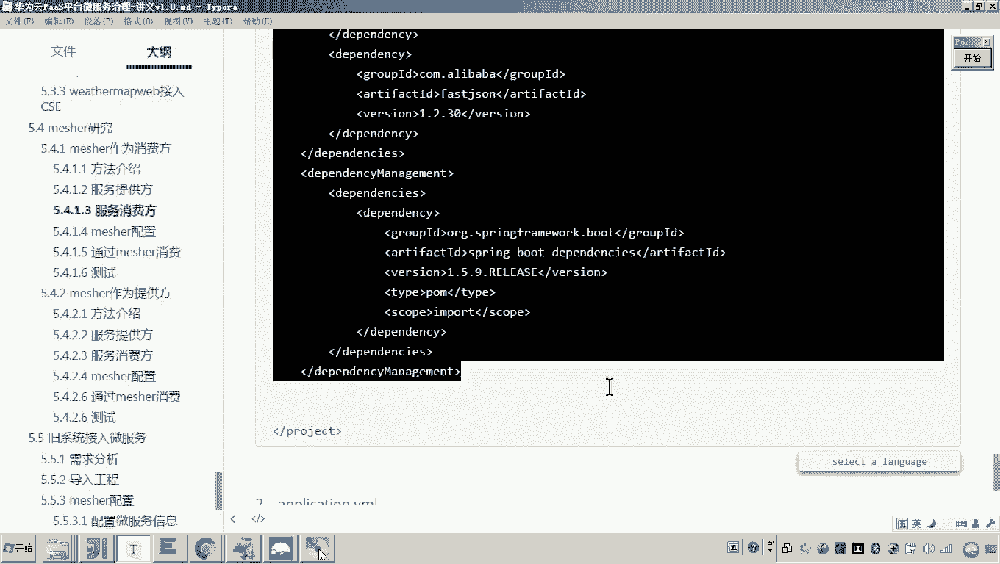
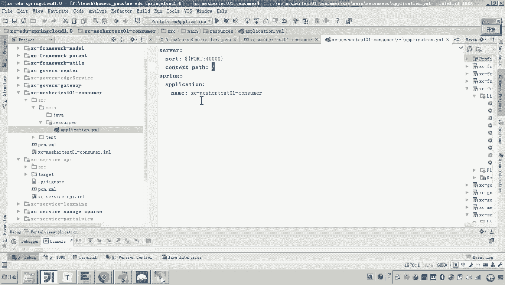
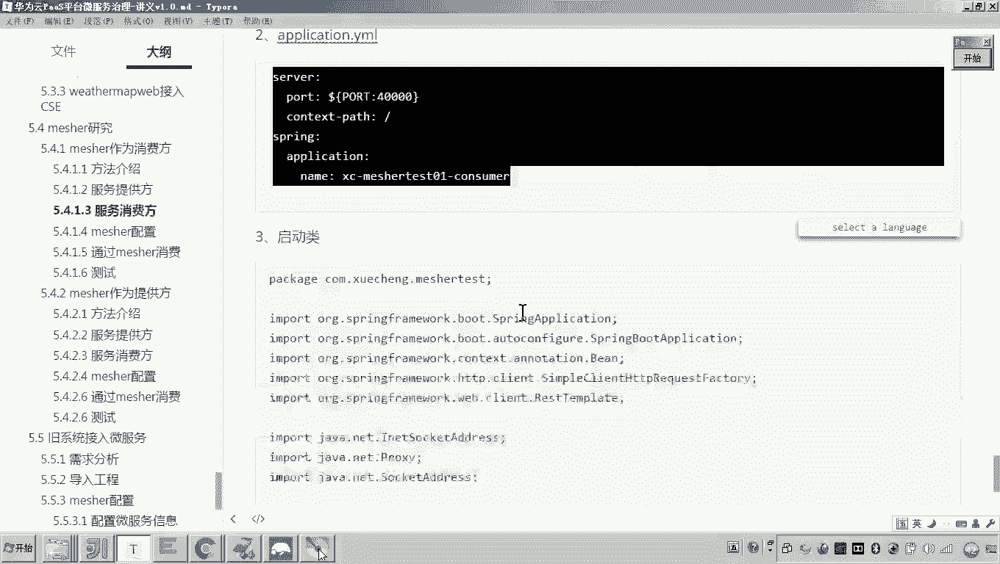
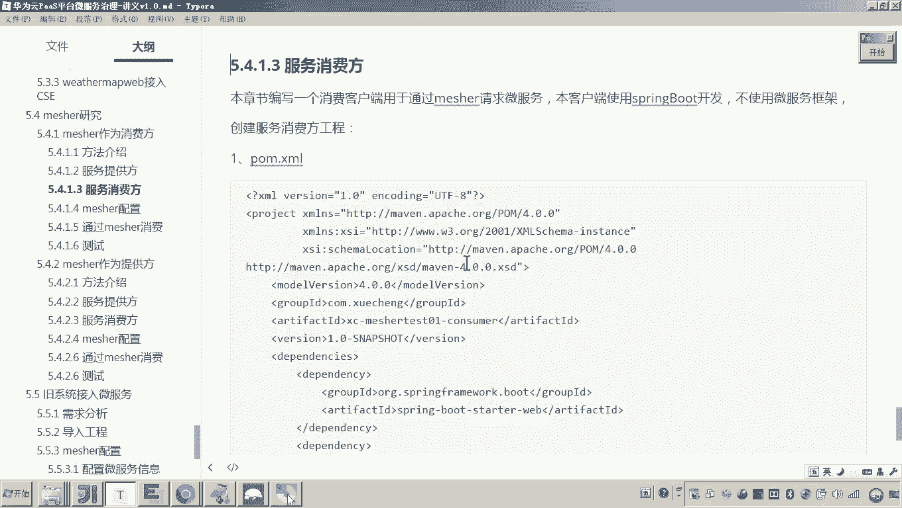

# 华为云PaaS微服务治理技术 - P147：07.mesher研究-mesher作为消费方-服务提供方和消费方工程构建 - 开源之家 - BV1wm4y1M7m5

好，那接下来呢我们就按照刚才measure作为消费方的这个请求流程啊，我们把整个的这个流程呢给它测试一下。首先呢大家可以看到啊呃这里边服务的消费方是不是要请求这个服务的提供方呀？

而这个提供方是不是就具备微服务的能力？哎，那么呃各位这个提供方啊，我这边说一下这个提供方就是我们可以采用那些微服务框架所开发好的这个具备微服务能力的这些服务是吧？

所以这里边呢我们一点点看我们先做服务提供方服务提供方呢，因为当初我们做的很多测试程序，这里边是不都都是微服务呀，并且这些服务是不是都注册到了这个云平台里边了。所以这里面呢我们就随便找一个服务。

比如说这个portview，大家还有印象吧。对当初我们做这个微服务引擎的讲解的时候，我是不是就用这个port view来做的例子？所以这里边呢我们就用这个port view呢来作为服务提供方。

那本身port view它也是可以正常运行的嘛？大家可以看到这个port view你看到你看这是不是都已经接入了这个SE了。哎，所以这个是可以正常运行的一个微服务嗯，好。😊。

现在呢我们就把它给干嘛呀运行起来。看好。然后我们把它熨一下。这就是我们说的服务的提供方。对吧服务的提供方。

好，那现在这个服务的提供方如果一旦运行起来之后呢，他是不是就会注册到云平台了？好，那现在呢我们就进到咱们的这个云平台的服务注册中心。我们来看一下呃，服务的目录。好，那么我们这个应该是用的用哪个。

我看一下。😊。

这个是port view是吧，port view，那你看一下他的这个项目名是哪个，是不是这个。看懂了吗？是这个吧。所以你在这个注册目录里面找到他。嗯，大家可以看到啊，这里边有一些无关紧要的服务。

我先把它删掉啊。😊，好，不要了，我先删掉啊。啊，这是我以前的一些测试。好，大家也可以可以看现在这个port view它是不是有一个实例。😊，啊，这个就是我本地所起的这个potoview服务呢。

已经向这个公网的注册中心已经注册成功了。好，那接下来还要做什么呢？就是服务消费方了。那这个这个这个服务呢，有人说老师提起来他能用吗？😊。

那我们可以测试一下啊。比如这里边呢，我们可以随便测试一下来吧。😊，比如说这里边我们测试哪个呀？说说这个吧，这不这个是干啥，是不是获取课程信息的，是吧？😊，好，它的端口是多少呀？怎么查呀？

它的端口是不是就是40200啊？好，那现在呢来我们再打开一个浏览器。😊，因为这是get请求，我可以直接通过浏览器来测是吧？然后呢，local host叫做什么呀？40200。好，然后portal。

Vi course。get后面我是不是跟1个ID就可以了。😊，对，那这个ID我们得从这个猫go地B的数据库去找。哎，早嗯，我们先连接连接上我们的这个MgoDB啊。😊。

找一个课程ID，然后查看课程信息。这个接口应该大家没事了。呃，如果没有学过学生在线的话，你可以看一下这些代码，应该还是不是很复杂的。因为方便我们去对其他知识的一些学习啊。😊，好，然后呢。

现在呢我们就连上去吧。连上去之后呢，这个课程的这个相关信息呢，port view呢都在这个数据库，然后找到这个vi course。然后这里边我们随便拿一个课程。😊。

然后在在这里我把ID给他输进去。大家可以看到这个数据是不是就有了，所以这个接口是正常的对吧？对，而现在我要做的事儿是什么呢？你回过来回过头来，这个是不是就是我们说的port view？😊。

将来这个消费者。它不具备微服务能力，它是不是要通过measure来调用这个portview，这是不是我们这一次学习的一个目标，对吧？好，那现在服务的提供方我就弄好了。那现在接下来我们是不是要做消费方了？

😊，消费方怎么做呢？消费方我肯定不会采用这个servfacecom或者CSE来进行开发，包括spring cloud我都不会。那我就用一个普通的spring boot工程来开发就行了。😊。

有人说老师为啥呀？😊，因为刚才我说的很清楚，我说这个工程是不具备微服务能力的，它就是一个非常普通的一个工程啊，换句话说，它就是一个老系统。😡，而他想去调用我们的这个呃微服务。

那他是不是要通过mesure来进行了？所以这里边我就故意的把这个服务消费方的这个服务工程呢，就弄成一个非常普通的工程。😡，他就不使用微服务框架，它照样可以具备微服务的这种调用的能力。好。

那现在呢我们就把它创建一下。好，嗯，怎么做呢？😊，这里面呢我就。创建一个工程吧。在哪里呀？在这儿。呃，来看一下啊。电脑上。然后新建。呃，然后因为这个工程是一个什么是一个相对独立一点的工程嘛。

所以呃它的这个负工程呢我就不选了啊，因为我们副工程里边已经把CSE那些包都已经加进来了，所以我这就不选了啊，直接就是一个负工程，就是空了。好往下来。😊，然后这个就是我们的工程名。下来。走。

那现在呢大家可以看到，现在我我把这个工程是不是就快创建好了啊，等等一下啊，创建好了之后呢，各位我是不是要加一些什么依赖吧？😊，那这些依赖的话，各位怎么做？我肯定要加这个什么spring boot吧。

然后再加一个spring boot这个web应用的一个启动包，是不是就完事儿？😊。

其他的像那些什么servicecom和CSE这些包，我肯我肯定都不加了啊，因为它就是一个普通的工程。😊。

好了。各位，这个工程。这个依赖我是不是就搞定了？对吧那个公司在哪呢？在这儿，然后这个消费方哎，这里边我他这个是麻雀虽小，五脏俱全嘛，还是要做一些事儿的啊，就看啊。

我们配配一下它这个因为spring boot，我们这得配一个配置文件啊。😊，好，配置文件好，这个这个配置的过程我就不再详说了啊，因为这些东西都是。😊，我们太熟悉不过的东西了。你把它拿过来。

这个工程的端口是4万啊，这个路径是杠啊，这个跟路径。然后呢，这就是他的这个这个这个工程的名。好。😊。

然后呢，再有我我们现在是不是要做这个启动类呀？😊。

因为sring铺的工程嘛，然后这里边呢我们就做这个启动类吧。好，然后先我们先创建一个什么包吧。😊，包创建好了，然后这里边我再再创建这个什么启动类。😊，好，这个启动类呢，这里边呢我给大家拷过去就就行了啊。

然后这因为这个启动类里边大家可以看到，这里面其实是没有很多新的东西的。😊，它就是一个非常普通的这个spring boot的工程，对吧？好，然后呢，接下来我们还要做什么呢？呃，那你将来要消费吗？

我这个是不是就从浏览器去请求你的一个controller？😡，所以这里边我们是不是可以把这个controller写一个简单的测试的controller放到这？😊，而在在这个controller当中。

我们准备让他去调用微服。懂我意思吧？😡，但是有同学说老师那咋调呀？😡，按照以前学的知识呢，你要是采用servicecom框架，或者说这个sp cloud的框架，那就很容易就就远程调用了，对吧？

而现在在这里。😡，在这里我们就要说了，就要通过什么measure的代理来调用微服。😡，懂我意思，懂我的意思吧？就在这儿这个代码我一会儿要写了。😡，到这儿来说。

这个哎服务的消费方的这个这个工程我是不是就创建好了？只是说现在这个工程是不是还。不能用吧哎，但是这个工程应该说是可以启动起来了。😡，对我们启动一下来运行一下看看。这肯定应该是可以的。啊。

因为运行起来之后，我们一会儿是不是就可以在这个controller里面加代码，让他通过measure来调用微服务了。😊，哎，只不过就调用的方法是需要我们去学习的啊。好，嗯，我们来运行。😊，怎么做？

它是端口，是不是就是几啊4万吧，然后这里边是不是有一个quarry？😊，哎，corrry那那这这是哪个呀？不是这个吧，应该是这个是吧，这个啊。😊，大家可以看到这个是是不是报错了ID。好。

你看这你有时候老师到底运行了吗？你可以打一断点嘛，打一断点来。😊，大家可以看到这是不是正常啊，没错吧。😡，对，这说明这个方法已经被我前面调用了，对吧？而稍后我们就在这个方法当中去写。😡，代码。

然后通过measure来进行代理啊，通过measure代理来调用微服务。好，到这儿我们说的这个服务的提供方以及服务消费方，我们都把它构建完成了。只是现在是不是还没有接入meer？😊。

好。