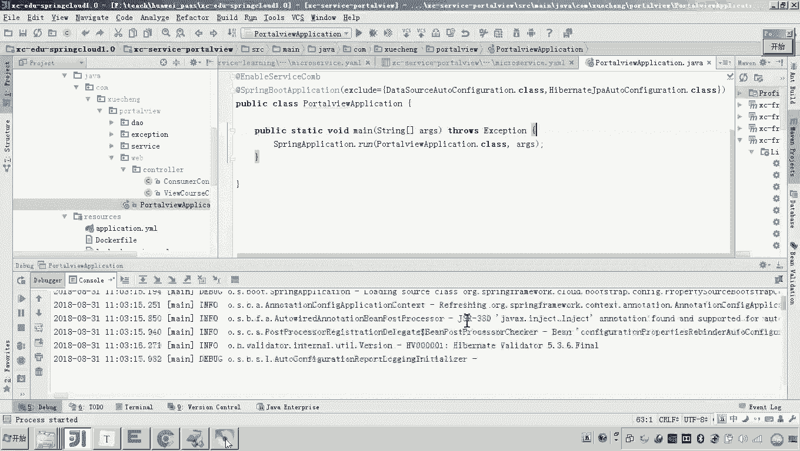
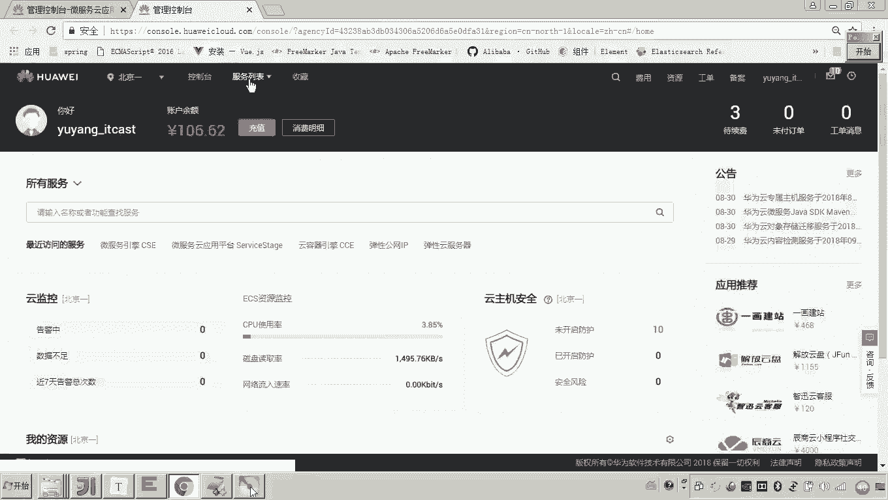
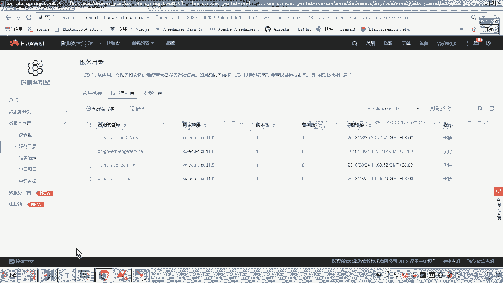
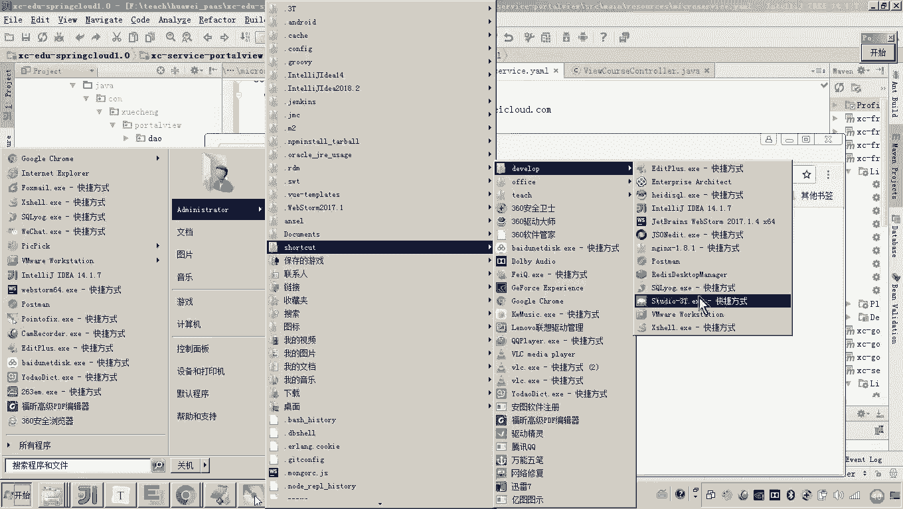
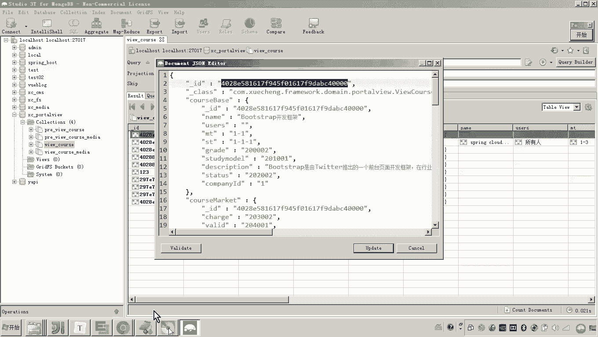
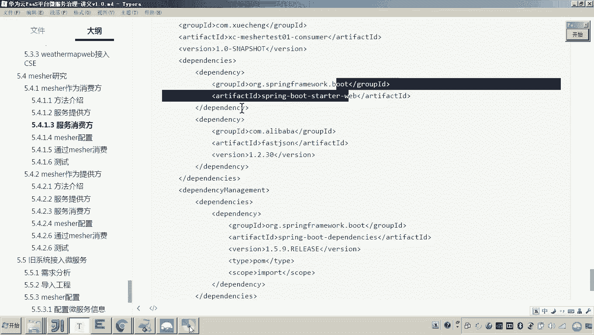
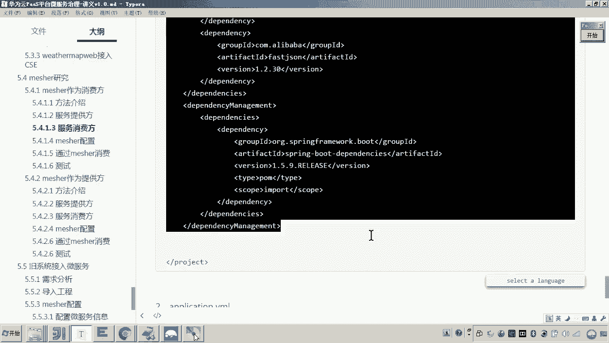
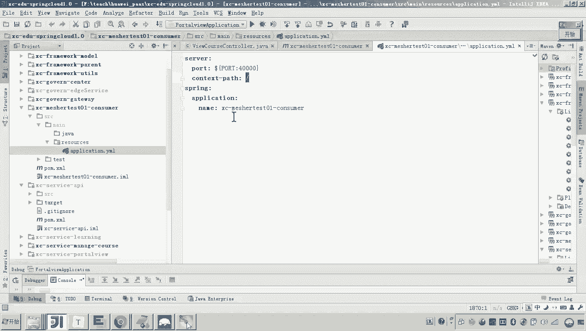
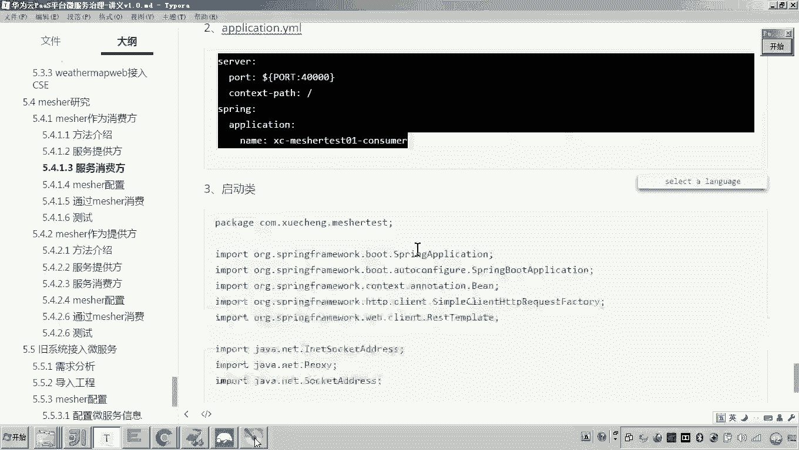
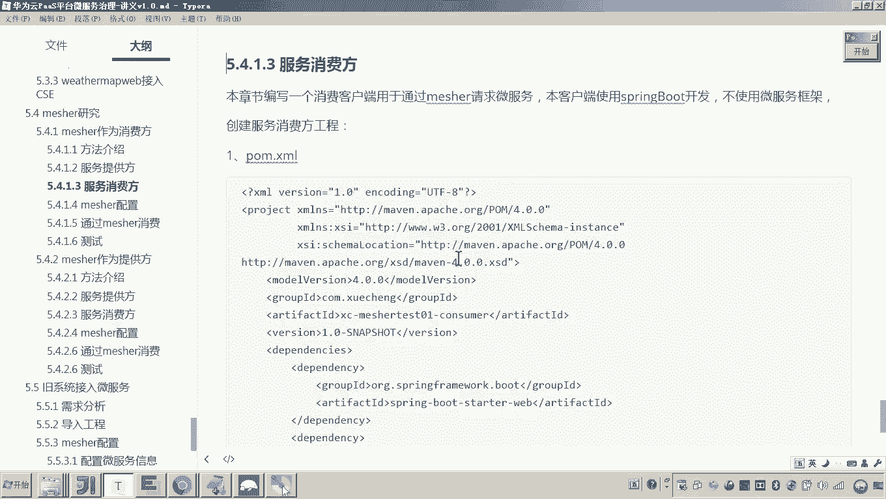

# 华为云PaaS微服务治理技术 - P147：07.mesher研究-mesher作为消费方-服务提供方和消费方工程构建 🛠️

在本节课中，我们将学习如何构建一个服务提供方和一个服务消费方工程，为后续测试Mesher作为消费方的请求流程做准备。我们将使用一个现成的微服务作为提供方，并创建一个普通的Spring Boot工程作为消费方。



## 概述 📋



我们将按照Mesher作为消费方的请求流程进行测试。首先，需要一个具备微服务能力的服务提供方。其次，需要一个不具备微服务能力的普通服务消费方，它将通过Mesher来调用提供方。本节将完成这两个工程的构建和基础配置。



## 构建服务提供方 🏗️



上一节我们介绍了Mesher作为消费方的流程，本节中我们来看看如何构建服务提供方。



服务提供方需要具备微服务能力，并能注册到云平台。我们可以直接使用之前测试中已开发好的微服务。

*   **选择服务**：我们选择 `portview` 服务作为提供方。这是一个在微服务引擎讲解中使用过的例子，已接入ServiceComb引擎（CSE），可以正常运行。
*   **启动服务**：将 `portview` 服务运行起来。
*   **验证注册**：服务启动后，会注册到云平台的服务注册中心。我们可以登录云平台，在服务目录中查看 `portview` 服务是否有一个运行实例，以确认注册成功。
*   **测试接口**：为了确保服务提供方工作正常，我们可以直接测试其接口。例如，通过浏览器访问 `portview` 的课程信息查询接口（如 `localhost:40200/portal/vi-course/get/{id}`），确认能返回正确的数据。

至此，一个可用的服务提供方已准备就绪。

## 构建服务消费方 🏗️





服务提供方已就绪，接下来我们构建服务消费方。此消费方将是一个普通的Spring Boot工程，不具备微服务能力，以模拟需要接入Mesher的“老系统”。

以下是创建服务消费方工程的步骤：





1.  **创建工程**：创建一个新的Maven工程。为了确保其“普通”，不选择包含CSE等微服务依赖的父工程。
2.  **添加依赖**：在 `pom.xml` 中仅添加Spring Boot和Spring Boot Web启动器的依赖，不添加任何微服务框架（如ServiceComb、Spring Cloud）相关的依赖。
    ```xml
    <dependency>
        <groupId>org.springframework.boot</groupId>
        <artifactId>spring-boot-starter-web</artifactId>
    </dependency>
    ```
3.  **配置应用**：创建 `application.yml` 配置文件，设置应用名称、服务器端口（例如 `40000`）和根路径等基础信息。
    ```yaml
    server:
      port: 40000
      servlet:
        context-path: /
    spring:
      application:
        name: consumer-demo
    ```
4.  **创建启动类**：创建标准的Spring Boot应用启动类。
    ```java
    @SpringBootApplication
    public class ConsumerApplication {
        public static void main(String[] args) {
            SpringApplication.run(ConsumerApplication.class, args);
        }
    }
    ```
5.  **创建测试Controller**：创建一个简单的Controller，用于接收请求。稍后我们将在此Controller的方法中编写通过Mesher调用微服务提供方的代码。
    ```java
    @RestController
    @RequestMapping("/test")
    public class TestController {
        @GetMapping("/query")
        public String query() {
            // 后续将在此处添加通过Mesher调用微服务的代码
            return "Consumer is running.";
        }
    }
    ```
6.  **验证启动**：运行此消费方工程，并通过浏览器访问其测试接口（如 `localhost:40000/test/query`），确认工程能正常启动和响应。

现在，服务消费方工程也已构建完成。它目前只是一个普通的Web应用，尚不具备调用微服务的能力。

## 总结 📝

本节课中我们一起学习了如何为测试Mesher作为消费方而构建两个核心工程。
*   **服务提供方**：我们使用了一个已接入CSE的现成微服务（`portview`），并验证了其正常运行和注册状态。
*   **服务消费方**：我们创建了一个普通的Spring Boot工程，它不依赖任何微服务框架，模拟了需要接入服务网格的遗留系统。



目前，两个工程均已就绪，但消费方还无法调用提供方。在接下来的课程中，我们将为消费方接入Mesher，并实现通过Mesher代理调用微服务的能力。