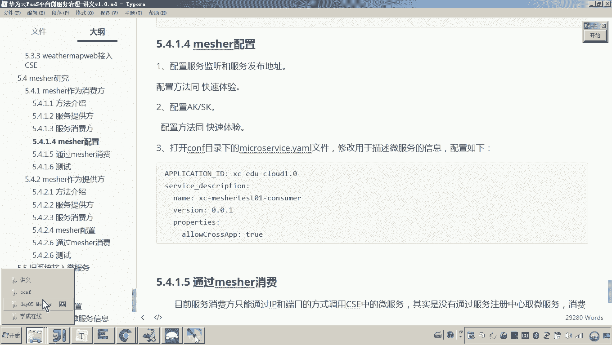
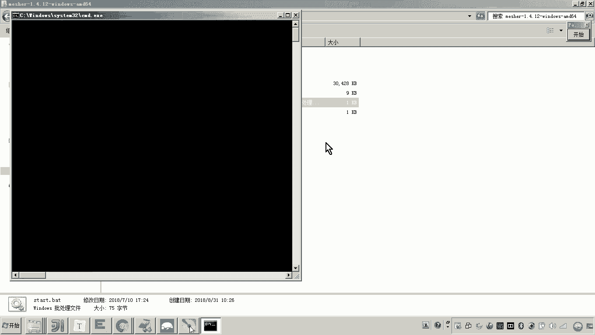
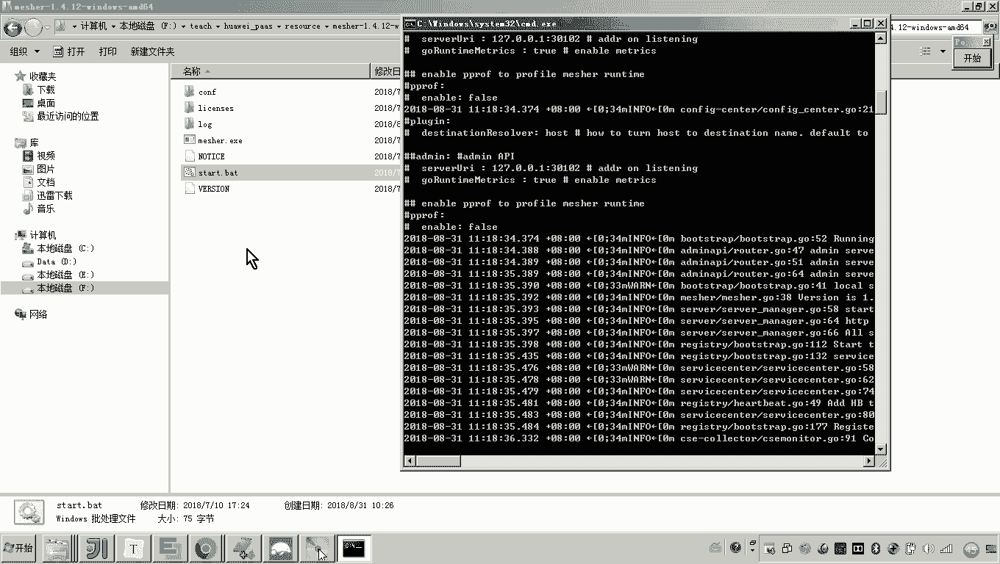
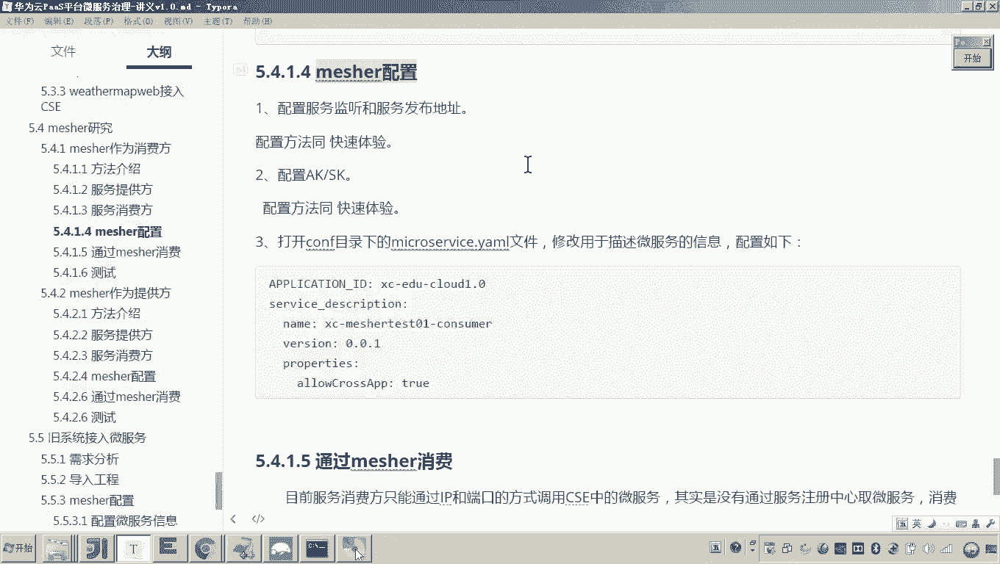

# 华为云PaaS微服务治理技术 - P148：08.mesher研究-mesher作为消费方-mesher配置 - 开源之家 - BV1wm4y1M7m5

好，那接下来呢我们就准备来使用matature来实现我们说的这个消费方来调用我们的这个服务提供方。这个服务提供方刚才我们其实并没有开发，我们是不是用了原来现成的这个port头 view这个这个服务。😊。

对吧而这个port view各位可以看到，现在它是不是已经运行起来了。并且这个port view在我的这个云平台的这个服务注册中心，它这是不是已经注册了？😊，看懂了吧？哎哎，有时候老是不对呀。

你这刷新一下，刚才你的这个微服务叫做啥呀？叫做这个mat test01consumer，他怎么就没有注册到这个注册中心嘞？😮，啊，如果你你你有这么的疑问，我就就说明你没有注意听。😡。

因为刚才的这个服务其实它并不是一个微服务，它就是一个普通的工程。而现在我们的目标是不是就是想借助于measure，让他来调用服务注册中心里边的这些微服务的。😡，你懂我的意思吧。😡。

这些服务是不是就是我们说的老系统，就是我们说他不具备微服务能力的这些服务。我们想让他具备微服务，我们是不是要引入mater？😡，好，那接下来我们就来引入meer。

让measure来帮助这个什么消费方来调用微服务。怎么做？首先我们要配置meer。😊，刚才在快速体验的时候，我们已经配了measure了吧，怎么怎么做的，我们拿过来啊看一下啊。

现在现在这个环境略微有变化啊。呃，来你找到刚才我所配置的这个measure。😊，是不是是不是就这儿，而现在我们想做什么呢？😡，对，首先第一项的配置，各位打开我讲义，配置服务监听和服务发布的地址。

服务监听。😊，在这个。服务监听和服务发布的地址，监听的地址是不是他？也就是说我miccha的端口号是不是叫30101啊，这就是你的端口号啊，有时候老师我不想用这个端口，我想用30102行不行？行。

你就可以改成02。你改成02之后，一会儿你再启动miccha，它的端口就是30102了。😡，懂我意思吧？怎么默认的是30101。好，这就是这个电脑呢在这个网络上的一1个什么IP地址，这里不要配1270。

0。1的那个IP啊，配这个外部的IP你局域网IP或者说这个什么公网IP。😊，然后呢，这个就是服务注册中心的地址，这是不是就是公网的一个地址啊？这个地址只要你注册上来。

你是不是就可以通过这个公网的这个服务目录来查看了。对，还有一个地址呢，这个也要配啊，这个地址就是配置管理中心的。因为当初我们学过微服务治理，这个地址是不是必须配。因为他要去干嘛呀？

去下发或保存一些什么配置信息的啊，要从这个地址去下发保存配置信息。😡，好。所以这几项都要配，配完之后，接下来还要配这个这个什么AKSK啊，这个也要配啊。这个这个配的话，有时候老师这咋配？😡，嗯。😊。

在这个AOTH这个认证的配置文件当中要配。但这个这个这个呃AKSK的这个密钥啊，一定要你不要去抄我的，你要抄我的话，你就把你的服务注册到我的这个服责注服务注册中心了，懂我意思吧？

你要去你的这个根据你的账号去找。对那现在我想把这个我新建的这个什么呀。嗯。😡，我想从这个什么从这个这个服务目录哎来找到微服务。那你得从你这个账号里边来找到这个AKSK。😡，哎。

这个AKSK的获取方式我就不再说了啊，前面我都讲过，然后呢，那你怎么做啊呃，这个这个地这个我我就找port view，他当初用的AKSK不就行了吗？你看原来他用的是是不是这个玩意儿，你复制一下。😊。

你把它贴过来。因为我这也是环境，有好几套环境啊。好，这个AKSK是不是就是对应的大家看到的这个画面的这里边的这个服务目录啊？😊，好。好了，那现在我们是不是就把这个密钥也配了，接下来怎么做。

是不是要配置微服务的信息了？😊，微服务的信息是不是在microservice里头？😡，那我我想配一下怎么配。首先项目名我肯定要和这个portview的这个项目名保持一致了。😡，你说为啥？因为你调他吗？

😡，那当然不是了。因为我这个将来我准备把这个什么，我准备把这个我新写的这个消费方。将来我要是注册的话，我准备也注册到这个服务目录。大家可以看到这个项目名是不是都叫这个项目名啊，你想注册到这个目录上。

你是不是项目名要改成它呀？😡，懂我意思吧？所以这里面嗯你把它复制一下，贴过来，拿到我这个新写的这个消费方案里头。😡，大家听课的时候一定注意啊，听的时候一定注意哎，你要是不注意。

你可能就被这个配置所迷糊了。就是说你你的脑子里边必须得有一个思路。现在我在做的一件事，是不是要做这件事了？mesure的配置了。

而他做他的目的是不是就是准备将来让他来访问我们的这个云平这个这个云平台服务注册目录里边的这个provider的服务啊。😡，并且并且将来将来这个measure。

他是不是还要帮助这个consumer把它也注册到服务注册中心，懂我说的意思吗？所以你现在要做的这个配置是不是就要配这个微服务的信息啊？😡，啊，这个未服的信息。这个微服务的信息我们在哪配。

是不是就在这个measure的这个配置文件里头，然后配项目名，包括这个服务这个名称。比如说这服务的名称叫啥呢？服务的名称你是不是可以和这个名字保持一致。

就是我写的新开发的这个这个这个这个消费者的这个服务啊。😊，懂我意思吧？好，你把它写进去。这是不是就配好了？现在我把这个配好了之后，接下来怎么做呢？看啊这个嗯。😡。

奇迹马上产生。怎么怎么怎么样的奇迹呢？我双击。😡。

我现在是不是启动meer了，我问你，现在我启动完了micsure之后，我现在要从哪里找我这个mic这个这个mesure所注册到服务服务注册中心的服务。😊。

刚才我配了一大堆，包括这个AKSK它是不是这个密钥，是不是就是要向各位看到的我这个画面的这个这个服务目录里边去注册服务啊，所以你刷新。😡，各位。是不是就成了？

而这个信息这个信息是不是就是你在这个measure的目录里边去配的这个microservice这个配置文件，它里边的这个信息，各位看到了吗？这不是这是不是就是服务名称。

这个的这个服务名称是不是和大家看到的，现在这个服务名称是不是保持一致的？😊，各位，这就是我们说的哎用matature哎来将这个消费者呢也注册到服务中心。这是不是就是mcha的配置啊？好。

