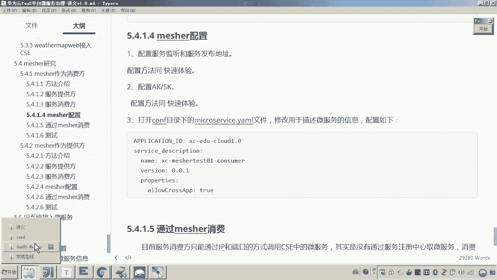
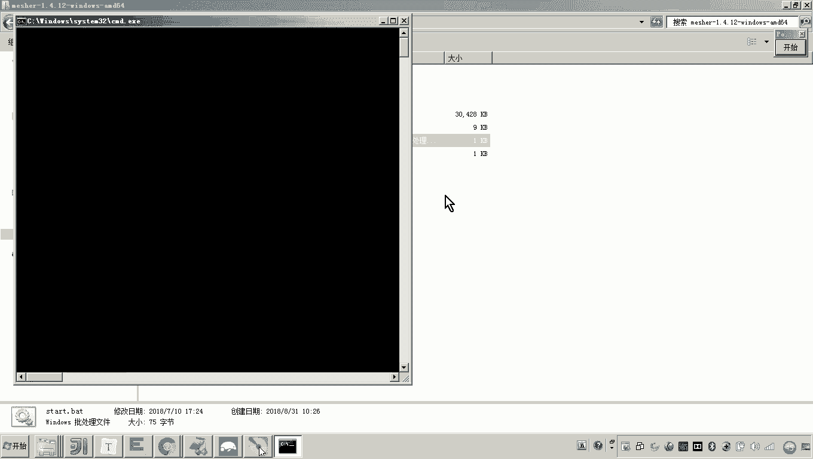
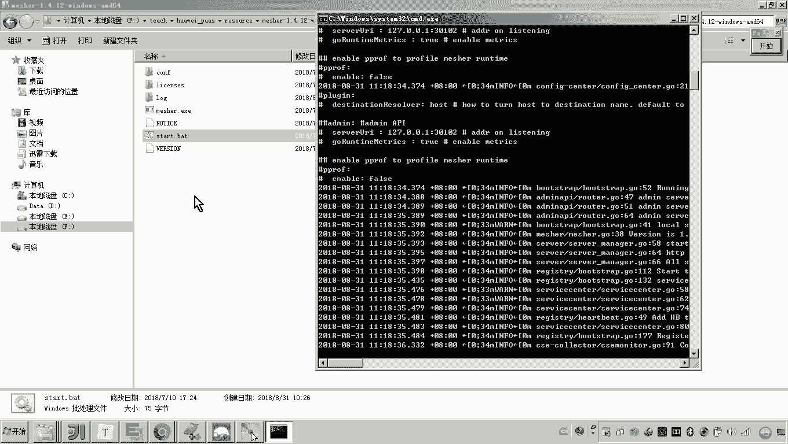
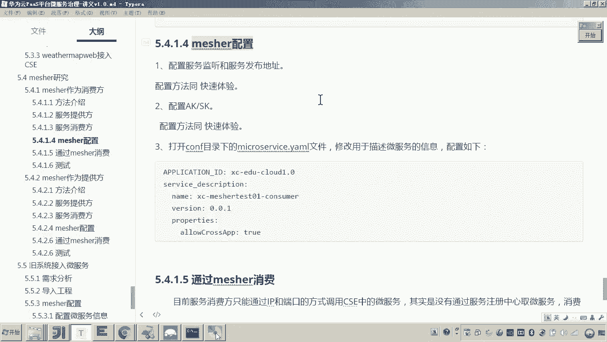

# 华为云PaaS微服务治理技术 - P148：08.mesher研究-mesher作为消费方-mesher配置 🛠️

在本节课中，我们将学习如何配置Mesher，使其作为一个消费方，能够调用已注册在服务注册中心的服务提供方，并将自身也注册到服务中心。

## 概述

上一节我们介绍了Mesher的基本概念。本节中，我们来看看如何具体配置Mesher，使其能够作为服务消费方进行工作。我们将使用一个现成的服务提供方（`portview`服务），并配置Mesher来调用它，同时让Mesher自身也注册到服务注册中心。

## 配置Mesher

首先，我们需要对Mesher进行配置，使其能够连接到服务注册中心并正确工作。

以下是配置Mesher的关键步骤：

### 1. 配置服务监听与注册地址

我们需要在Mesher的配置文件中指定其监听的网络地址以及服务注册中心的地址。

*   **监听地址**：配置Mesher服务监听的IP和端口。例如，端口默认为`30101`，你可以根据需要修改为`30102`等。
*   **注册中心地址**：配置华为云服务注册中心的公网地址，确保Mesher能注册和发现服务。
*   **配置中心地址**：配置配置管理中心的地址，用于下发和保存微服务治理相关的配置信息。

**注意**：监听地址应配置为服务器的局域网IP或公网IP，而非`127.0.0.1`。

### 2. 配置认证信息（AK/SK）

为了让Mesher能够访问你的华为云账号下的服务目录，需要配置对应的访问密钥（AK/SK）。

*   此AK/SK需要从你自己的华为云账号中获取，不能使用他人的，否则服务将注册到他人的服务目录下。
*   配置位置通常在认证相关的配置文件（如`auth.yaml`）中。

### 3. 配置微服务信息

接下来，需要配置Mesher所代理的微服务本身的信息，以便它能将自己注册到服务中心。

*   **项目名**：需要与目标服务注册中心内的项目名称保持一致。例如，如果你希望将消费方服务注册到`portview`服务所在的项目目录下，就需要使用相同的项目名。
*   **服务名称**：为你新开发的消费方服务定义一个名称，例如`mat-test01-consumer`。此名称将显示在服务注册中心。

完成以上配置后，启动Mesher。如果配置正确，你可以在华为云服务注册中心的服务目录中，查看到以你配置的**服务名称**新注册上来的服务。这表明Mesher已成功帮助你的消费方应用具备了微服务能力，并注册到了云端。

## 总结

本节课中我们一起学习了如何为Mesher进行配置，使其能够作为服务消费方工作。我们主要完成了三项配置：服务监听与注册地址、云平台认证信息以及微服务自身信息。正确的配置使得原本不具备微服务能力的普通应用，能够通过Mesher调用云端的微服务，同时自身也能注册到服务注册中心，实现了服务的互联与治理。