# 华为云PaaS微服务治理技术 - P149：09.mesher研究-mesher作为消费方-通过mesher调用测试 - 开源之家 - BV1wm4y1M7m5

好了，那现在呢我们说通过matature哎的配置呢，我们已经呃启动matsure，并且把meature呢呃通过matature呢把我们刚才开发的这个消费者，这个也把它变成了一个微服务呢。

注册到了这个服务注册中心。大家也可以看到在这个服务注册中心里边是不是可以查到。😊。

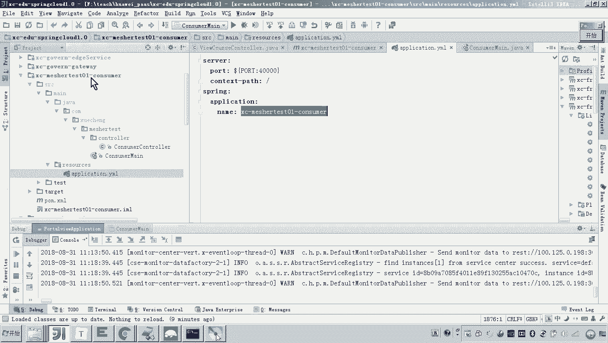

那接下来我要实现的是什么呢？就是啊要让消费者去请求port头 you。😊，微服务与微服务之间请求绝对不是IP端口方式的请求。😡。

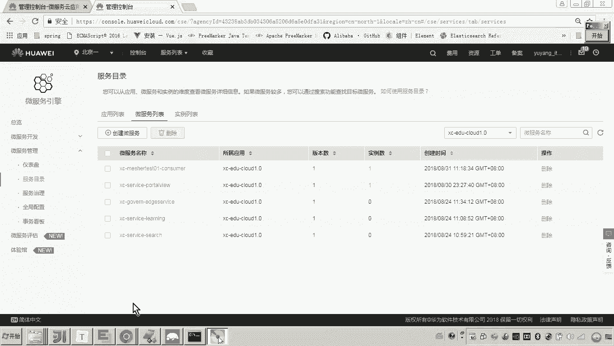

对他怎么做？怎么请求？我你还记得这个这个这个me作为消费方，在测试的时候，在最开始我是不是给大家说了一个步骤？😊，第一步是不是要通过消费方设置HTTP代理，这个代理的地址是不是就是messure的地址？

第二步是不是要通过服务名去请求，对不对？通过服务名去消费。😊，好，那我们现在来做怎么做？😊，首先你要配置HTTP的这个代理啊这个代理怎么配呢？😡，各位。哎，我们。

当初我们知道啊在这个里头在这个里头我们用的最多的一个是不是就是ret template？有印象吗？对不对？而这个res time plate。😡，对他就可以配置代理，他怎么怎么配这个代理呢？😡，对。

这个rs这个res template，我我可以这么做啊，因为是基于spring嘛，我可以定义一个B。😊，在这个嗯因为这个启动文件，每每次是不是都要去启动这个加载这个类啊，所以我就准备在这儿啊。

我们来定义这个病啊，定义这个病怎么怎么定义啊？😊。

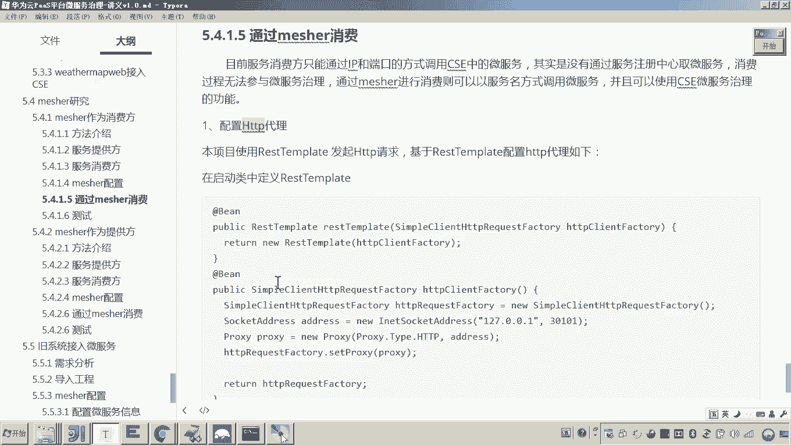

这个过程呢应该大家就比较熟悉了。嗯，在我们学生在线里面，这些代码应该是非常多的啊，就是定义一个什么res template，对吧？但是这里边有一点不一样的地方，就是定义res template。

大家可以看到这里边我就用到了一个叫做。😊。

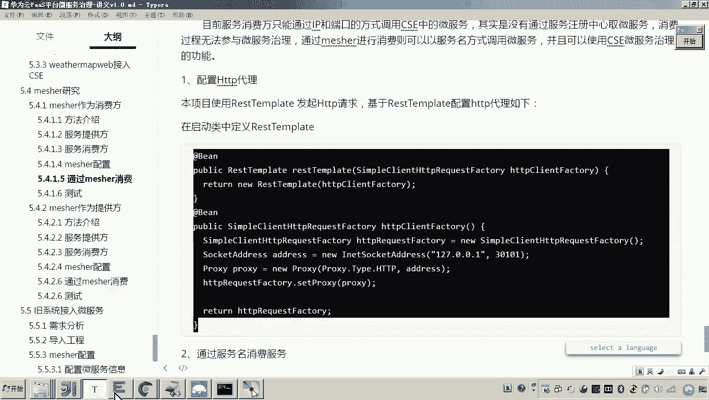

HTTP requestquest factory哎，我用这个目的是啥呢？我给他设置一个怎么呀？对，设置代理。😡，设置代理，而这个代理的这个地址就是measure的地址。😡，而麦秀的地址各位，你看吗？

😡，是不是就是30101啊？😡，对吧有说老师这个127。0。01，你能访问到measure。因为本身各位你一定记着measure和他所代理的服务是在同一台计算机，所以他们之间的访问是通过什么127。0。

0。1这个回还地址来进行访问。😡，懂我意思吧？所以这里面你就写成127。0。0。1就可以了。而有人说老师，那你刚才的那个什么那个地址，这个鉴定地址为啥写成不是127。0。01？

注意这个地址可能为啥这个鉴定地址，我这么写的目的是啥？因为将来外部计算机是不是可能会访问这个麦啊，所以你这儿监听不要写成127。0。0。1。你如果写成127。0。0。1了，那么它只能本机。

就是只能本机的程序来访问麦，你必须写成它在网络上的一个外部的IP地址。😡，懂我意思吧？对。好了，那所以这个这这两个地址呢一定要注意，这是代理的地址啊，配配这个mecha的这个本机的IP就是127。

0001固定的端口，这是什么端口，就是什么端口就可以了。😊，然后配好了之后怎么做呢？配好了之后呢，我在这个conttroroller这里头，各位我是不是就可以怎么样把它注入到我这里头了？😡。

而注入的这个这里边，它是不是就已经配置了mesure的代理了？😡，懂我意思吧？那这个时候我问你他已经配置了代理了，这里时候你你你想一下，只要。😡，通过他。来发起请求，那么他就会使用哎。

通过mattter。来进行代理请求。为啥？因为我在这个类当中已经刚才你看到的这个B当中，我已经配置了这个代理。所以你只要用这个rest time play往外发请求。

它就会通过mesure来进行代理请求。因为刚才你看到这个代理的路径，这个地址是不是就是mesure的地址？😡，懂我意思吧？这就是代理的方法嘛。

就在配置这个这个这个方式是不是就是所有的这个请求都通过这个30101端口发出，就是通过mecha来发出。好。😊，那这里边呢怎么做呢？这里边呢大家可以看到我现在我我现在想请求什么？😡。

我现在想请求就是通过卖票代理来调用调用哪个微服。😡，是不是又调用port头view啊？😡，是不是调用他呀？😡，那所以说那你是不是得看一下这个port view它它的接口是啥呀？

刚才我们这个接口是不是得已经测试测试通了，是不是就是这个接口？😡，懂我意思吧？那现在我们是不是就可以调用了，怎么调用啊？😊，R time。这里面是不是有一个？盖他。😡，看见了吗？是不是有这个方法？😊。

那你是不是就可以用这个方法呀？这里边是不是有1个URL啊，来定1个URL。😡，这UIL怎么写呢？😡，注意了这URL。就是我刚才说的这个第一步配置代理是我讲的这个方法介绍当中的第一步配置代理。第二步。

通过服务名来调用微服务。😡，因为你通过服务名，而不是通过IP来调用。早期我们是不是通过IP然后冒号端口啊，那现在不能通过这种方式，你要通过服务名，通过哪个服务名。

你现在要调用是不是portal view啊？portal view的服务名是啥？😡。

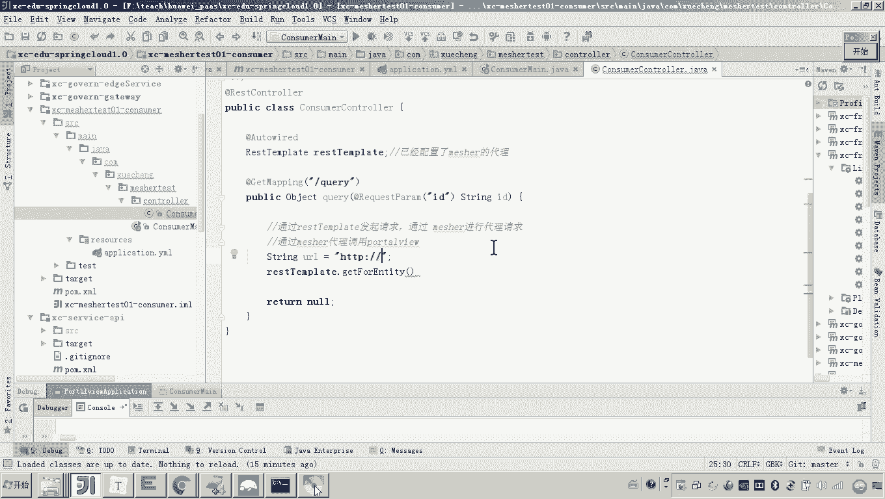

你这不就是他吗？你复制他。😡。

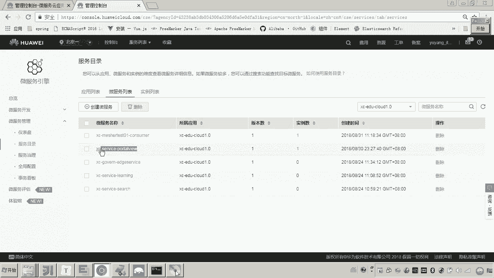

贴过了。对不对？然后后边就是具体的UL了，后面的具体UIL是不是就是这一串啊？😡，看懂了吧？对你把这己串来贴过来。😡，大家看看懂了吧？对，那这个这个ID呢，其实你可以把它变成一个活的。😡，加过来。

这后面这一串是不是就是UL，这是不是就是服务名，这一对是不是就是服务名？😡，所以你把这个拿过来。看懂了吧？然后呢，接下来这里边。😊，那他想去调用嘛，他想去调用的话，那将来你让我返回啥东西啊，哎。

你就给我返回opic他就可以了。😡，嗯。跑。你看这个程序我是不是就写好了？他看懂了吧。😊，对，就这么写。好，那现在我我把这个程序写好了之后，各位怎么弄？我是不是需要把这个port头右重启一下？😡。

这是port view的程序吗？你看清了，这是我写的那个消费者的程序是吧？port view的这个微服务是不是就一直在这跑着，人家是不是就没动啊，所以你把你的消费方来启动。😡，有人说老师他启动完了之后。

我我咋测呀？😊，啊，你只要请求这个que这个方法，它是不是就会这里发起什么远程调用啊？而这里发起远程调用的话，在port view里头，各位我可以打一断点，我来跟踪一下。

因为本身这个port view这个工程是不是也在我这个本级啊，你可以在这打断点吧。来，你试试，看它能不能调到这个步骤。😡，可以吧？好，那现在呢我们来看吧，怎么做。😊，嗯。怎么做？

那我是不是就请求他了ID我就给一个具体的ID值。😡，好，然后注意我这儿复制过去了吧。如果我一回车的话，各位他是不是会请求到我那个消费方里头？😡，是不是这个里头你在这打断点。可以吧。好。

我们来试验一下回车。他是不是就请及到消费方了，请及到消费方了之后，这里边我再往下让他走走到这儿再走一下，你注意看哎，他是不是就远程调用到了port头 view再回来再走完，各位这个过程就完成了。😡。

这个过程是不是就是通过什么通过matature代理来调用我们说的port头 view。懂我意思吧？对，那有说老师这个卖er代理，我怎么就知道通过卖er代理呢？大家可以看到他这里边也打日志呀。😡。

你看你看它里边是不是针对port view，它里边创建了一个客户端去调用了呀？😊，对，如果你要再不相信你可以这么玩，你把measure给他干嘛呀？关了，现在是不是没有measure了，来，你再调用。😡。

看好啊，调用调用了，走，我问你。😡，通吗？不同了吧，就说明现在这个代理是不是已经死掉了？😡，你看这是不是也也也进不去了？😊，你看报错了。在这个过程这个测试是不是就测出来了。对。

所以现在呢你把这个麦线干嘛呀，把它起起来。😡。

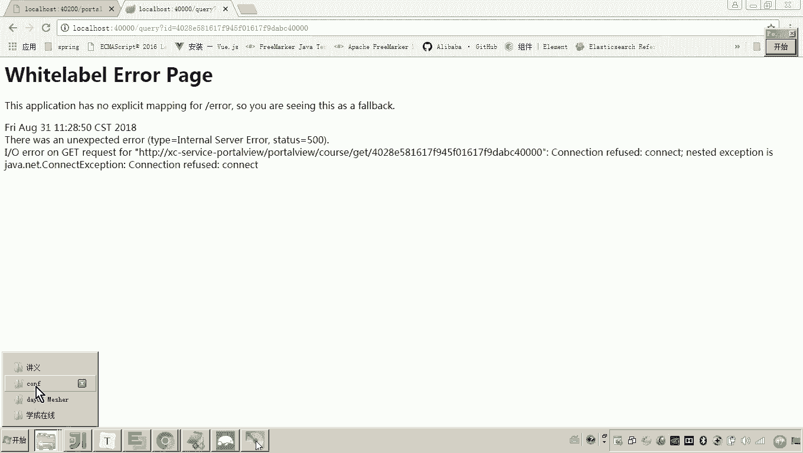

嗯，那现在这个麦上一旦启动，这个代理是不是就又活了。所以这里边呢我们可以再次调用嗯，进来。😊。

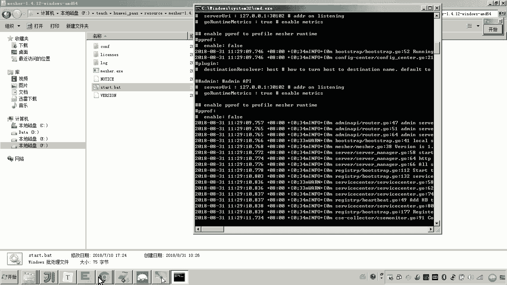

然后走完。你看。没问题吧，这个过程就是我们今天第一个mesure研究的例子，叫mesure作为消费方怎么做？我们来总结一下啊。😡，maature作为消费方，哎。

就是说哎maature要帮助那些不是微服务的哎，这些服务，让他调用我们的微服务。那怎么做呢？第一步。😡，我们要配置在调用的这个里头啊，在这个这个消费方这里头啊，我们要配置这个HTTB代理。嗯，第二步。

我们要通过这个什么调用的这个地址啊，我们要一定要写上服务名。因为你要调用微服务嘛，原来我们说是通过IP端口去调完，现在就是通过微服务了。😊。

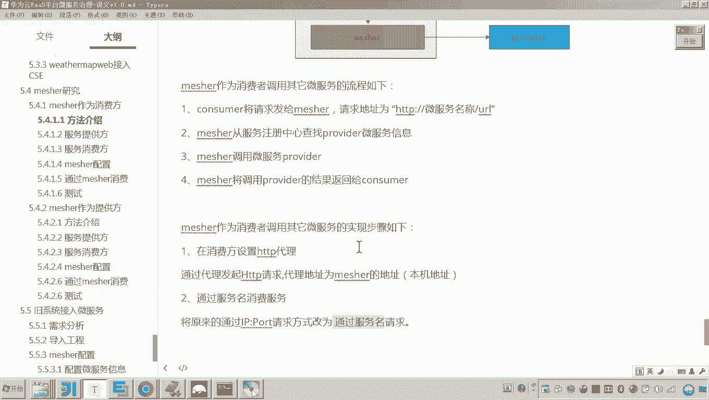

对吧而这个时候其实你在这个管理平台的这个服务目录当中注意看啊，点击服务治理注意其实在这里边都已经显示出来这个微服务的治理的这个图形了。😊，就说咋显示出来的，你看啊。上面这个是不是就是我写的这个消费方。

这是不是就是meature，哎，这是不是就是mesure。而这个mesure哎，他所代理这个服务要调用谁呢？是不是调用这个port view？😡，看懂了吧？

所以我们通过这个图形也能知道他们之间的调用关系。😊。

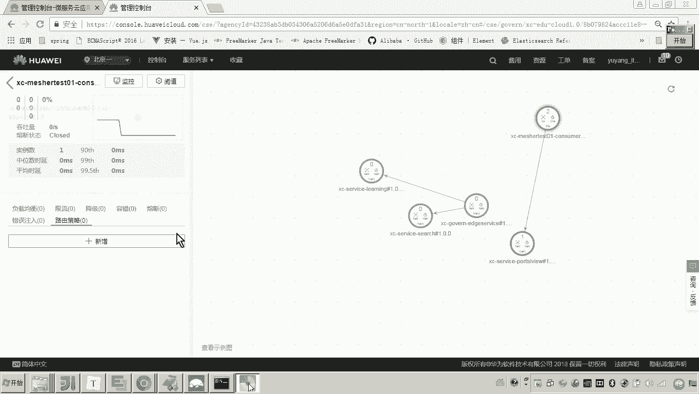

嗯，好，那到这儿呢，我们说measure作为消费方的这个研究，哎，我们就测试完成。

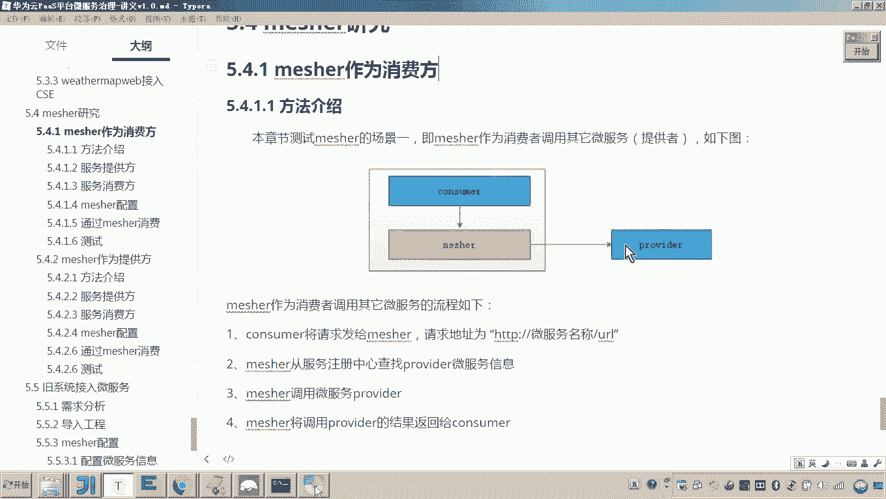