# 华为云PaaS微服务治理技术 - P149：09.mesher研究-mesher作为消费方-通过mesher调用测试 🚀

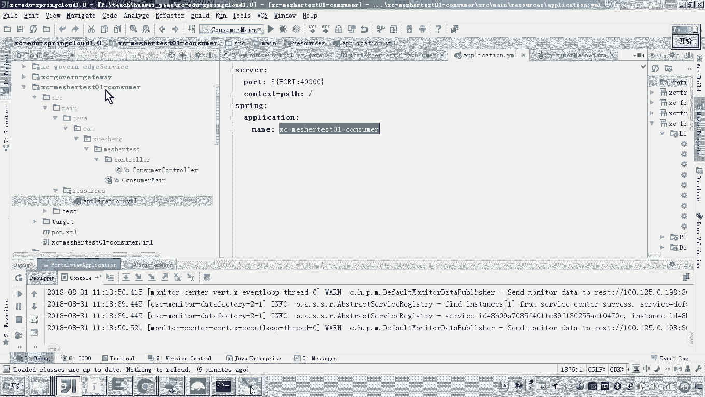

## 概述
在本节课程中，我们将学习如何配置和使用Mesher作为服务消费方。具体来说，我们将把一个普通的消费者应用通过Mesher代理，使其能够以微服务的方式（通过服务名）调用另一个已注册的微服务。我们将通过配置HTTP代理和修改调用地址来实现这一目标。

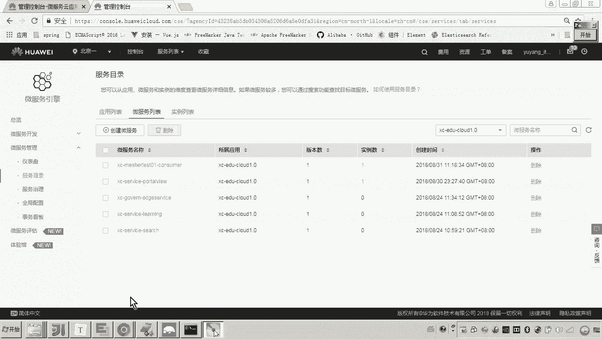

---

## 配置与启动Mesher
上一节我们介绍了如何通过`matature`配置启动Mesher，并将我们开发的消费者应用注册为微服务。现在，我们可以在服务注册中心查看到这个服务。


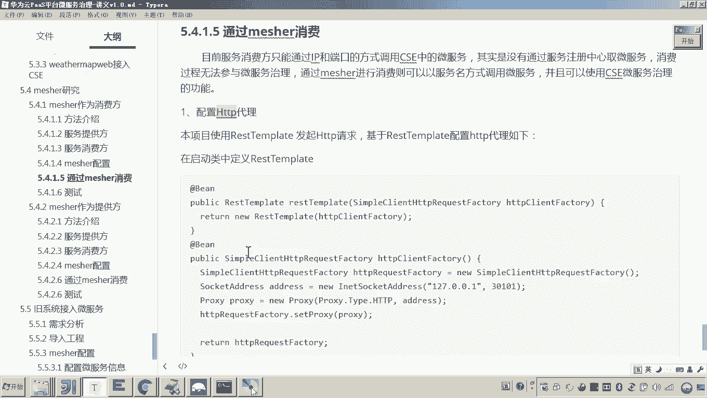

## 实现消费者调用提供者
本节中我们来看看如何让消费者去请求`portalview`微服务。微服务之间的请求绝对不应使用IP端口的方式。

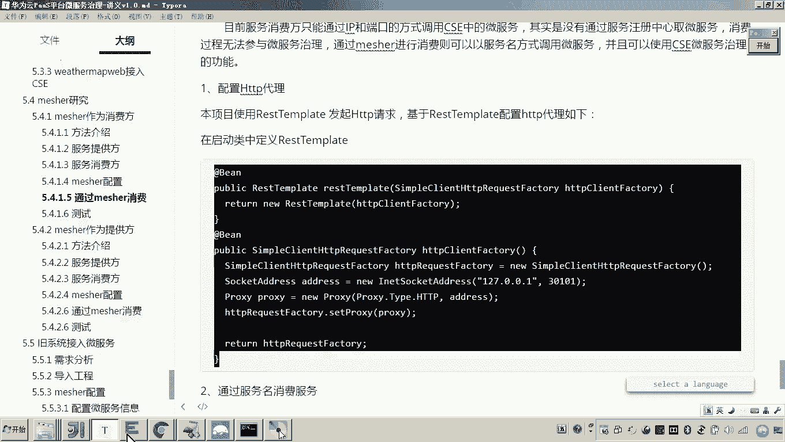


以下是实现此调用的两个核心步骤：
1.  在消费方配置HTTP代理，代理地址指向Mesher。
2.  通过服务名（而非IP地址）发起请求。

### 第一步：配置HTTP代理
我们通常在Spring应用中使用`RestTemplate`发起HTTP请求。因此，我们可以通过定义一个Spring Bean来配置`RestTemplate`的代理。


定义`RestTemplate` Bean的代码如下所示。关键点在于使用`HttpComponentsClientHttpRequestFactory`来设置代理服务器。

```java
@Bean
public RestTemplate restTemplate() {
    HttpComponentsClientHttpRequestFactory factory = new HttpComponentsClientHttpRequestFactory();
    // 设置代理地址为Mesher的地址
    factory.setProxy(new Proxy(Proxy.Type.HTTP, new InetSocketAddress("127.0.0.1", 30101)));
    return new RestTemplate(factory);
}
```
**代码解释**：
*   `"127.0.0.1"`：因为Mesher和它所代理的服务运行在同一台机器上，所以使用本地回环地址访问。
*   `30101`：这是Mesher服务监听的端口。

**注意**：Mesher自身的监听地址（例如配置中的`0.0.0.0:30101`）需要设置为网络可达的IP（如`0.0.0.0`），以便外部计算机能够访问。而这里配置的代理地址是消费方**本地程序**用来连接本地Mesher的地址，因此使用`127.0.0.1`。

### 第二步：通过服务名发起调用
配置好代理后，在Controller中注入配置好的`RestTemplate`。所有通过这个`RestTemplate`发起的请求都会经由Mesher代理。

现在，我们需要调用`portalview`微服务。首先，确认`portalview`的接口地址。假设其提供的一个接口路径为 `/portalview/{id}`。

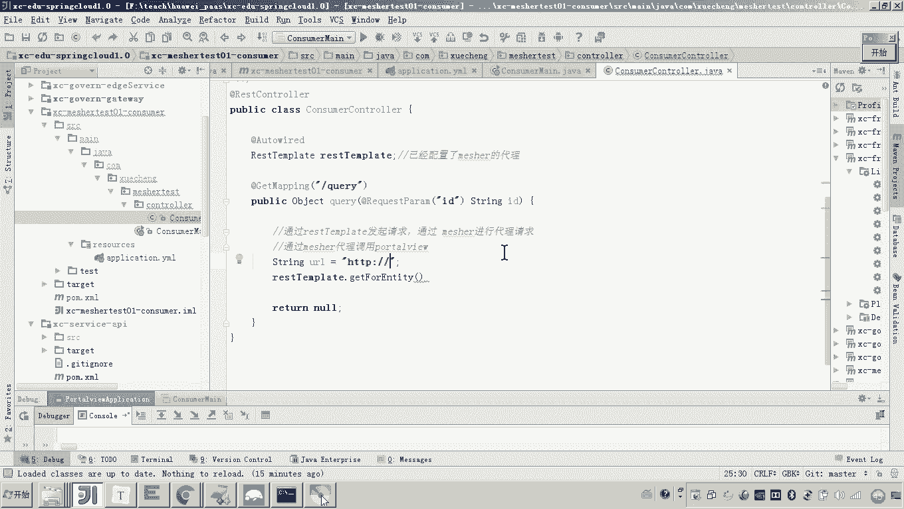


在消费方的Controller中，使用`RestTemplate`发起调用的代码如下：

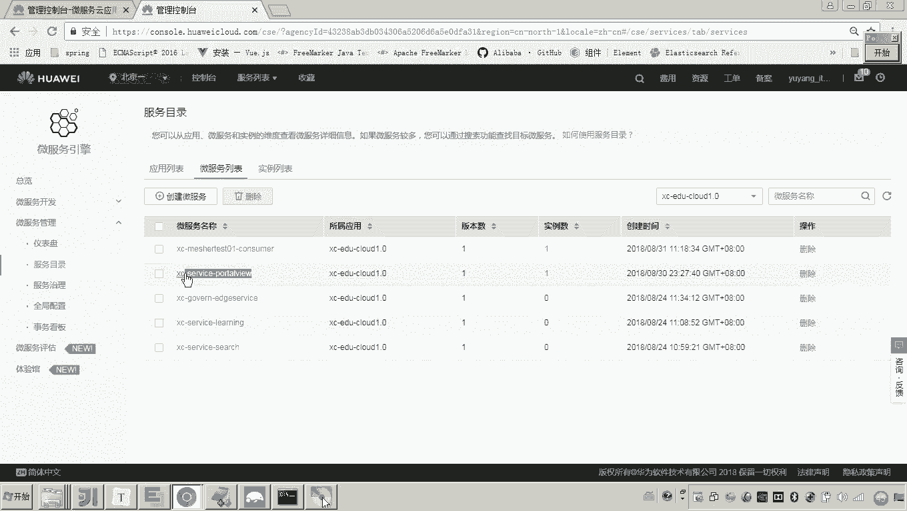

```java
@Autowired
private RestTemplate restTemplate;

@GetMapping("/query/{id}")
public PortalView query(@PathVariable String id) {
    // 通过服务名构造请求URL
    String serviceUrl = "http://portalview/portalview/" + id;
    // 发起远程调用
    PortalView result = restTemplate.getForObject(serviceUrl, PortalView.class);
    return result;
}
```
**代码解释**：
*   `"http://portalview/..."`：这里的`portalview`就是目标微服务在注册中心的服务名，它替代了传统的`IP:端口`。
*   `restTemplate`：使用了之前配置了Mesher代理的Bean。


## 测试调用流程
1.  保持`portalview`微服务运行。
2.  启动配置好的消费者应用。
3.  在`portalview`服务的对应接口处打上断点。
4.  通过浏览器或工具请求消费者的`/query/{id}`接口。
5.  观察请求是否成功经过消费者 -> Mesher -> `portalview`的链路，并能在`portalview`的断点处停下。


**验证Mesher作用**：为了确认调用确实由Mesher代理，可以尝试停止Mesher进程，然后再次发起调用。此时调用会失败，证明代理生效。重新启动Mesher后，调用恢复。

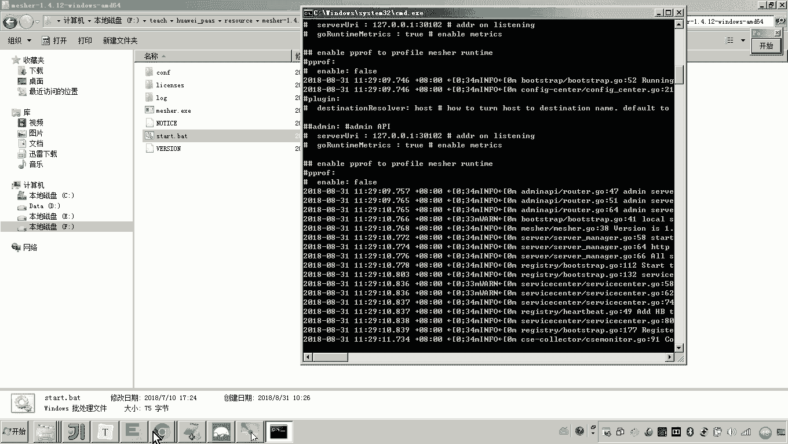

## 在治理平台查看调用关系
调用成功后，可以在微服务治理平台的服务治理页面看到可视化的调用关系图。

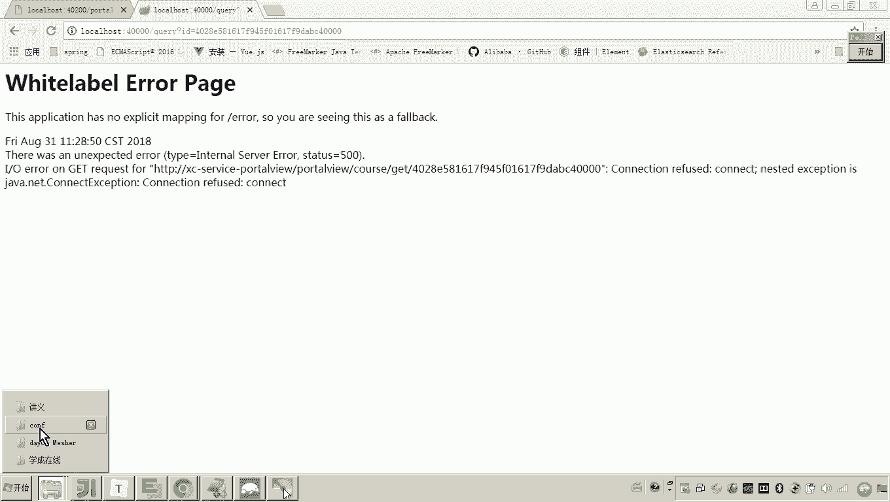


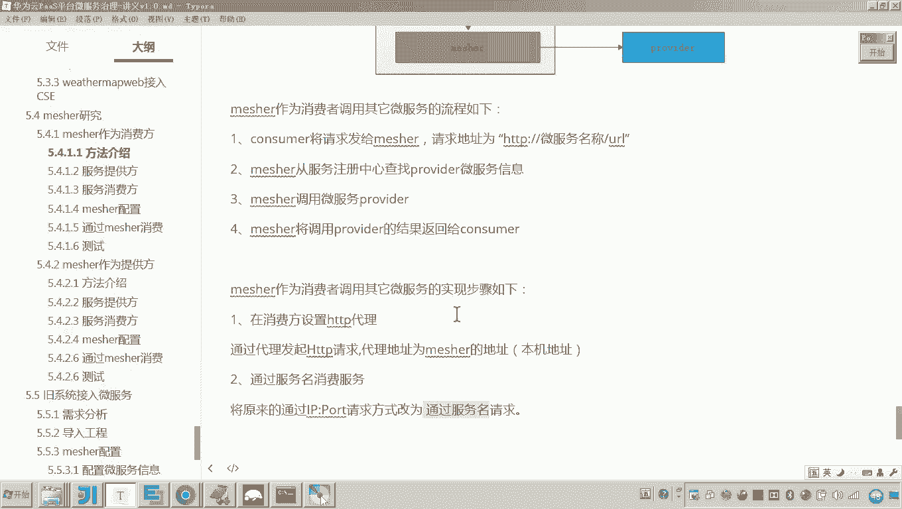

图中清晰地展示了：**消费者应用** -> **Mesher** -> **`portalview`微服务** 的调用依赖关系。

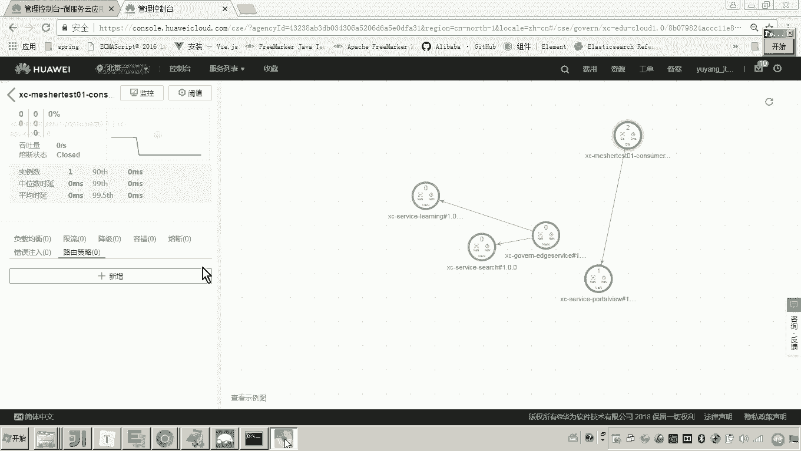


## 总结
本节课中我们一起学习了如何将Mesher配置为服务消费方。核心步骤包括：
1.  **配置代理**：在消费方应用的`RestTemplate`中设置HTTP代理，指向本地的Mesher实例（`127.0.0.1:30101`）。
2.  **服务名调用**：修改消费方的请求URL，将原有的`IP:端口`替换为在服务注册中心注册的**目标微服务名**。

通过这种方式，非微服务架构的应用也能借助Mesher无缝地接入微服务体系，通过服务名发现和调用其他微服务。


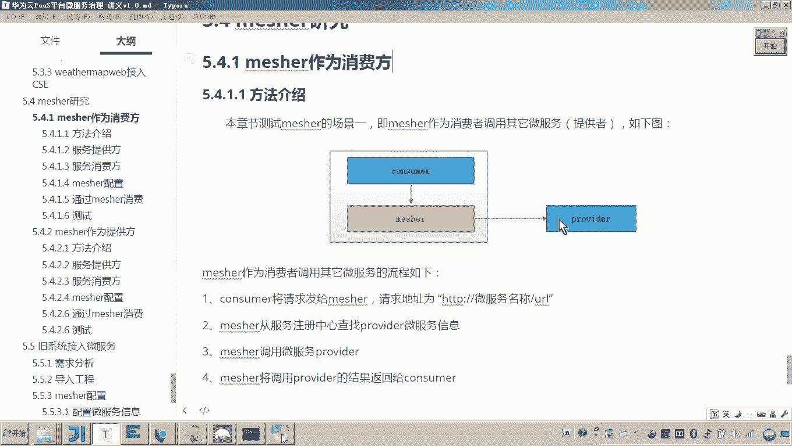

