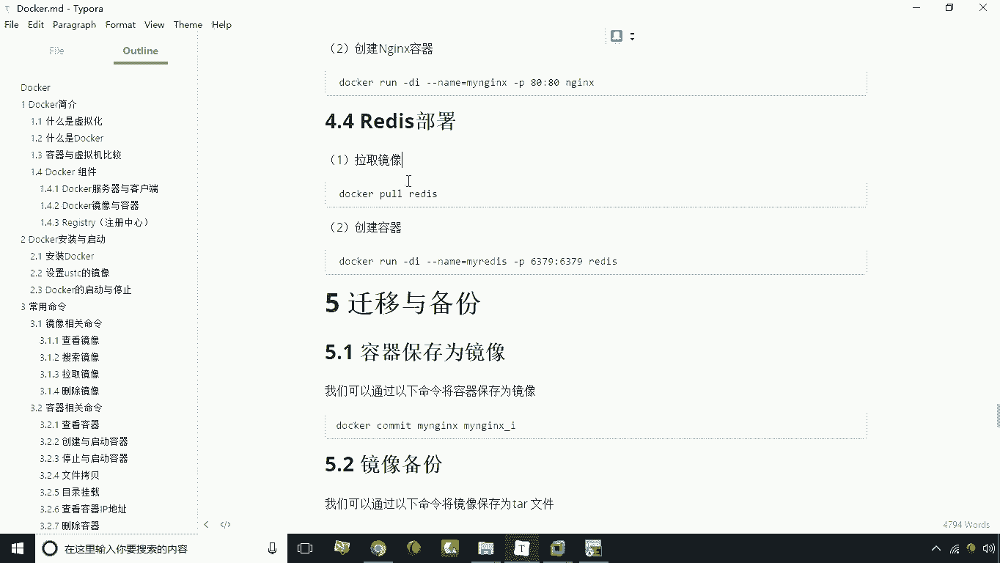
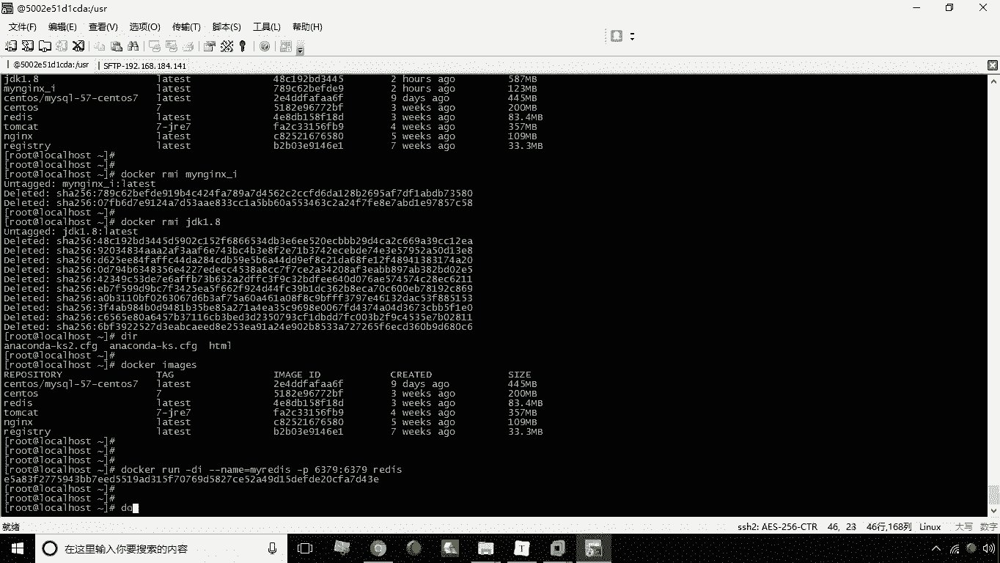
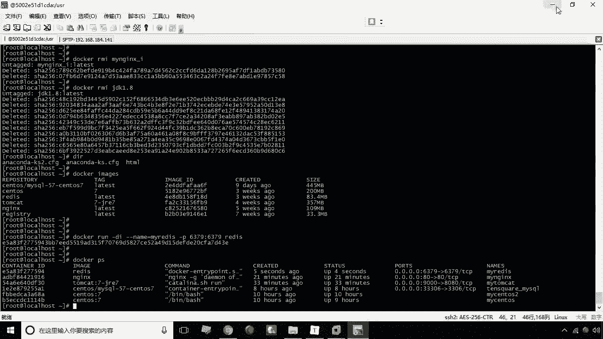
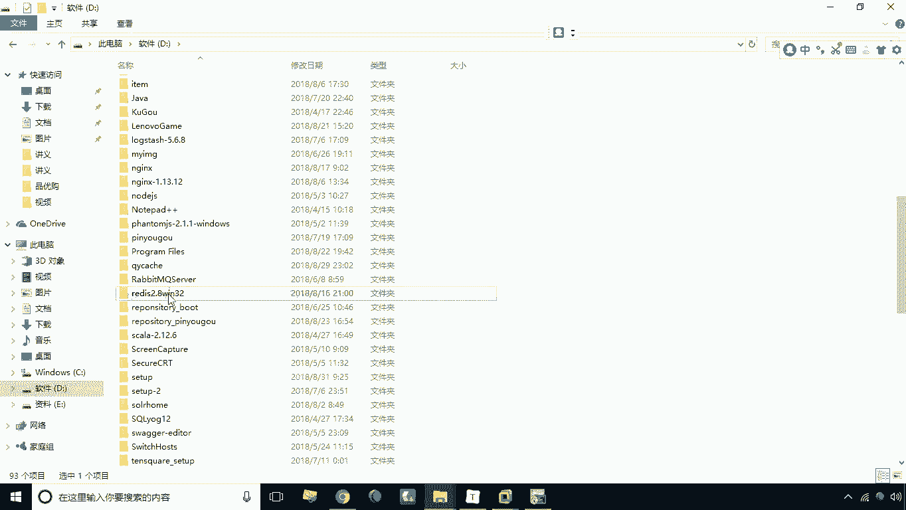
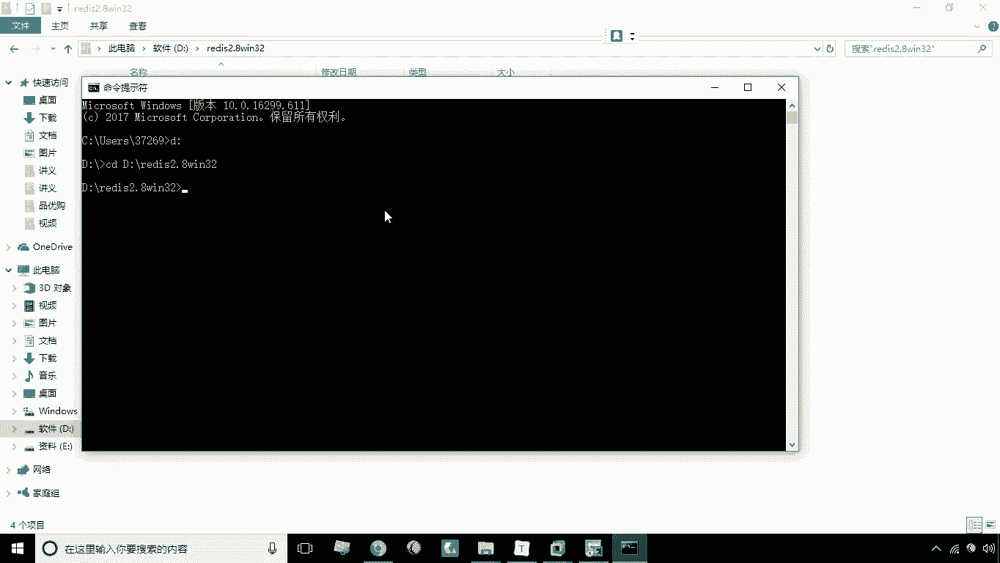
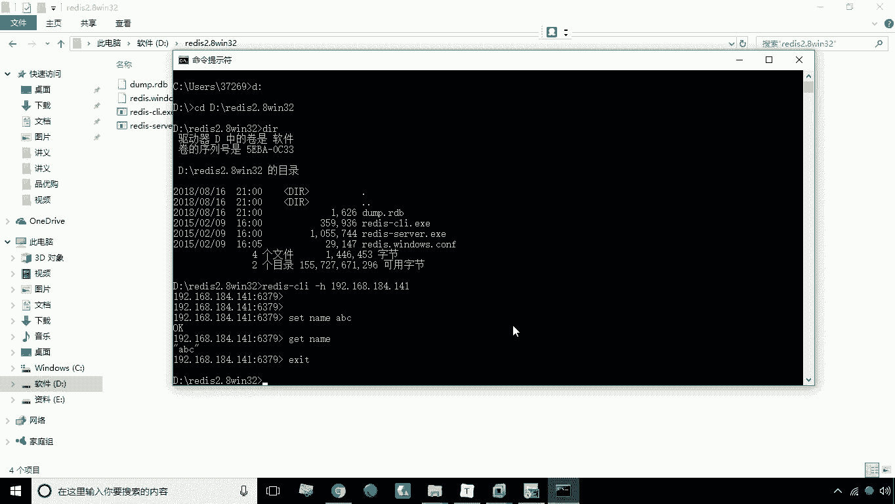

# 华为云PaaS微服务治理技术 - P14：14.redis部署 - 开源之家 - BV1wm4y1M7m5

好，接下来呢我们来学习使用docker，来搭建一个REDIS的环境，搭建REDIS环境呢，首先我们一样是要先拉取我们的REDIS的镜像，那么它的命令就是docker pull redis。

这一步呢我们依然是可以省略的，因为我给大家已经提前下载了这个REDIS镜像，那么我们接下来呢基于这个镜像，我们要怎么办，创建一个容器杠DI杠杠name等于买REDIS，杠P代表我要去做端口映射啊。

然后这个端口比如说65379，它默认还是6379啊，好那么接下来最后呢我们指定镜像名称REDIS好，这个镜像呢我们创建成功之后。

那么接下来我们要怎么办呢，我们就可以测试一下，看看到底能不能远程的去连接到这个REDIS啊，我们这里做了端口映射，那么我就可以通过连接什么连接宿主机，连接宿主机就可以连接这个容器的这个REDIS了啊。

我这里就有一个呃REDIS的一个windows的客户端。

咱们现在可以通过它来去做一个连接，现在切换到D盘。

切换到这个当前的目录啊，那么这个里头有两个文件，一个是REDISGUCLI，一个是REDIS杠server，那么cl i呢就是我们的客户端程序对吧，我们现在可以通过它来去来去连接远程的REDIS。

怎么连接呢，这时候如果说你直接的去执行这个命令，它连接的其实是你本地的这个REDIS，那么如果说你想连接远程的，这里就加一个杠H，然后呢这里空格写上你的远程连接的REDIS的IP好。

大家看一下现在是不是就连接成功了，哎那我们现在可以去敲这个命令也是一样的啊，比如说set name a b c，那这时候呢我就存了一个值，那这时候我们一样可以通过get内，把这个值再取出来，对吧。

哎一样啊，那这样一来呢。

