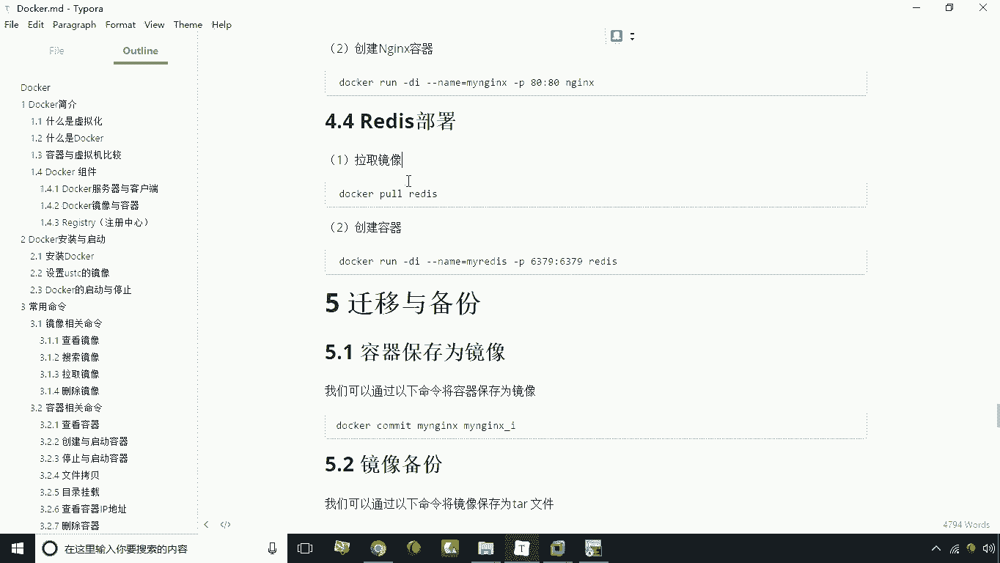
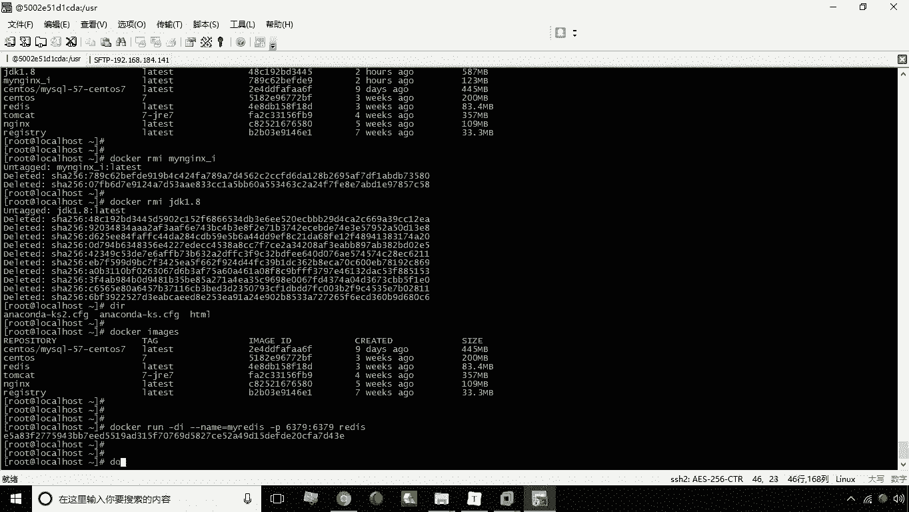
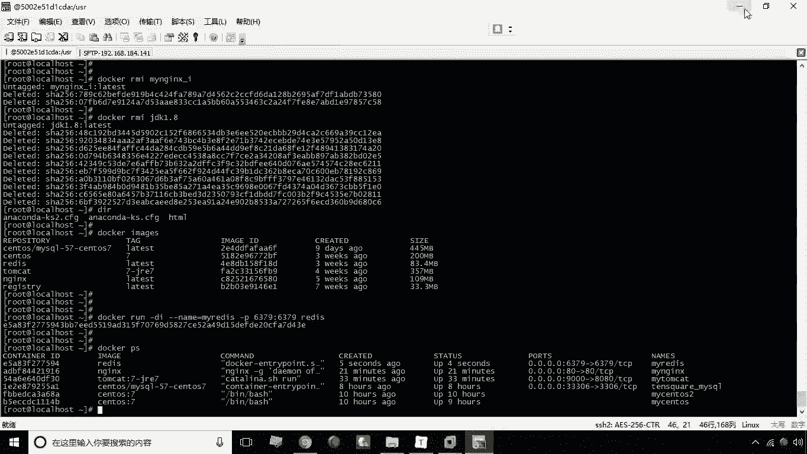
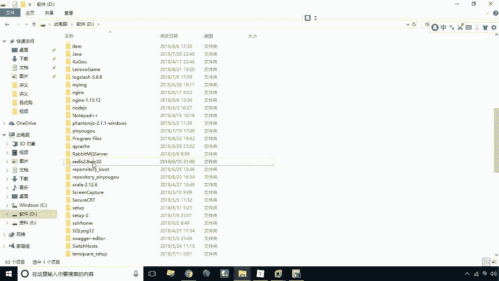
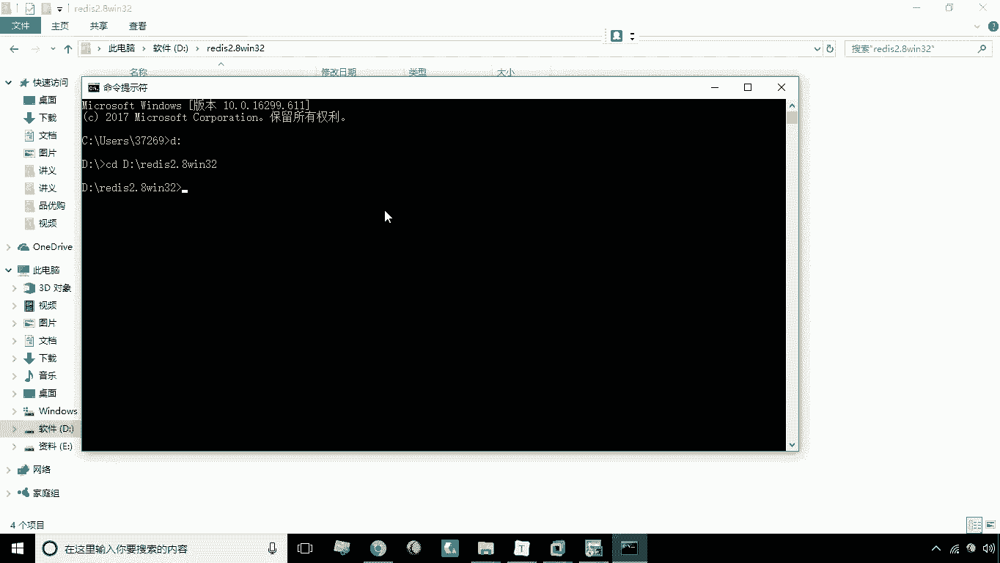
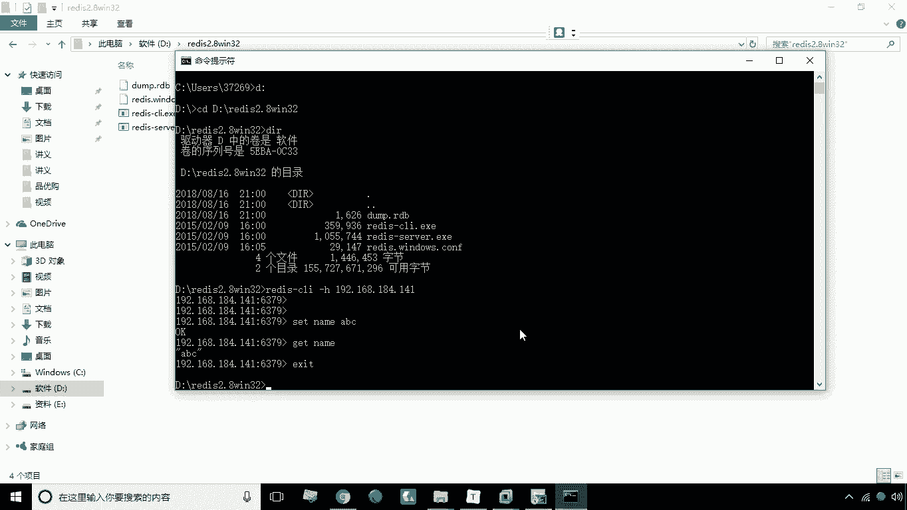

# 华为云PaaS微服务治理技术 - P14：14.redis部署

在本节课中，我们将学习如何使用 Docker 来搭建一个 Redis 环境。我们将从拉取镜像开始，逐步完成容器的创建、端口映射，并最终通过客户端工具测试连接。



## 概述

Redis 是一种高性能的键值数据库，常用于缓存、消息队列等场景。使用 Docker 部署 Redis 可以快速获得一个独立、可移植的运行环境。本节教程将指导你完成这一过程。

## 拉取 Redis 镜像

搭建 Redis 环境的第一步是获取 Redis 的 Docker 镜像。我们可以使用 `docker pull` 命令来完成。



以下是拉取 Redis 镜像的命令：
```bash
docker pull redis
```
这一步可以省略，因为我们已经提前下载好了 Redis 镜像。

## 创建并运行 Redis 容器

上一节我们介绍了如何获取镜像，本节中我们来看看如何基于该镜像创建并运行一个 Redis 容器。创建容器时，我们需要指定容器名称并进行端口映射。



以下是创建 Redis 容器的命令：
```bash
docker run -d --name my-redis -p 65379:6379 redis
```
*   `-d`：代表在后台运行容器。
*   `--name my-redis`：为容器指定一个名称，这里是 `my-redis`。
*   `-p 65379:6379`：进行端口映射。将宿主机的 `65379` 端口映射到容器内部的 `6379` 端口（Redis 默认端口）。
*   `redis`：指定要使用的镜像名称。

容器创建成功后，我们就可以进行连接测试了。



## 测试远程连接



由于我们进行了端口映射，现在可以通过连接宿主机的 IP 地址和映射的端口来访问容器内的 Redis 服务。

我们可以使用 Redis 的客户端程序进行连接测试。假设我们有一个 Windows 版本的 Redis 客户端，包含 `redis-cli.exe` 和 `redis-server.exe` 两个文件。

首先，切换到客户端程序所在的目录，例如 D 盘下的某个目录。

以下是连接远程 Redis 服务的命令：
```bash
redis-cli -h <宿主机IP> -p 65379
```
*   `-h`：指定要连接的 Redis 服务器主机地址（即宿主机 IP）。
*   `-p`：指定要连接的端口号（即映射的 `65379` 端口）。

连接成功后，命令行提示符会发生变化。此时，我们可以执行 Redis 命令进行测试。

例如，我们可以设置一个键值对：
```bash
set name abc
```
然后，再获取这个键对应的值：
```bash
get name
```
如果返回 `"abc"`，则证明 Redis 服务部署成功且可以正常访问。

## 总结



本节课中我们一起学习了使用 Docker 部署 Redis 的完整流程。我们首先拉取了 Redis 镜像，然后创建并运行了一个带有端口映射的 Redis 容器，最后通过 Redis 客户端成功连接并测试了服务。这种方法能帮助我们快速搭建一个可用于开发和测试的 Redis 环境。