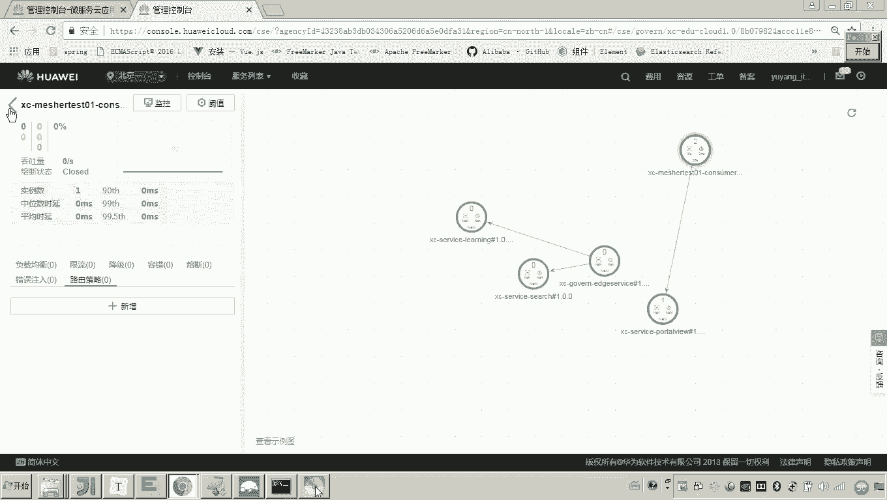

# 华为云PaaS微服务治理技术 - P151：11.mesher研究-mesher作为提供方-服务提供方和消费方工程构建 - 开源之家 - BV1wm4y1M7m5

好，那下边呢我们就来按照这个measure作为提供方的这个图呢，我们把消费方以及提供方的程序呢写好。然后我们来测试一下。哎，包括measure呢，我们也把它配置好。好，注意啊呃。

我们现在学的是不是me作为提供方呀？所以这里边又是提供又是消费，又是消费，又是提供。可能大家呢听着就有点晕了啊，你一定要注意呃，你的听课思路要跟着我的脚步走，对我说现在进行到这个图里边的哪一个节点啊。

你要现在想的就是这张图。好，注意看现在我们首先来做提供方。因为哎你你要做先做消费方的话，那你消费消费谁呀，是不是没有啊，所以你要先做提供方好了，那这个提供方，那我问你个问题啊，提供方提供方在这儿。

提供方有没有微服务能力。😊，你说有。那肯定是没有吧，有了，我还用asure干啥，他是不是就没有微服务的能力啊，是不是加了加装measure之后，是不是才有微服务能力了。

所以提供方它是一个没有微服务能力的哎这么一个服务。那这样的话，那怎么弄啊？微没有微服务能力，我是不是就怎么弄啊？我就开发一个单独的这个sring boot的工程，是不是就可以了？😡。

对，所以这么弄啊，我们。刚才我是不是写了一个单纯的一个spring boot的工程啊，各位我是不是在这写了一个对我就在这个工程上边，我再加一个类。😡。

就叫做provider controllert。这个类你没发现吗？它是不是就是一个普通的这个服务哎，有一个这个这个这个这个请求的地址叫刚好路，看见了吗？哎，将来返回监设数据。😡。

所以这个没有啥技术含量吧，所以我就不再敲了啊，来，我们把它拷过去。😡。

就是现在我要写的这些服务，你会发现一会儿我跑这个工程，一会儿跑这个工程，你的思路一定要清晰，否则你就你就晕了。😡，现在我做了这个写了这个类，这个类是不是就就是一个服务提供方？😡。

这个controller是不是就是服务提供方？这个controller，我为什么写的这个工程目的只有一个？因为这个工程是一个普通的一个spring boot的工程，是不是？😡。

所以啊所以他不具备微服务的能力嘛，所以我就在这个工程下边，我不想再创建功能了啊，我就在这再加一个类，他是不就表示了一个提供方了，他这个地址是不是叫杠好楼啊？嗯，然返回是不是就有一个监测数据啊？😡。

没问题吧，哎，可以。好。那现在呢，我们把这个也弄好了吧，弄好了之后，接下来再看。😊，有时候老师你这个提供方弄好了。😊，老师，你能测试一下吗？😡，吓。我你想测试一下还不简单吗？你把这个功能重启一下来。😡。

重启。看好啊，我给你测试A一下。😡，这个工程它的端口是不是叫4万呢？😡，来吧，请求一下吧，是不概个请求。😡。

砸酱油。HTTB冒号杠杠locgo house的4万hel喽。😊。

哎，没有出来没有出来，你得看嘛？你得看原因嘛，找嘛，看是啥。😡，你没发现吗？刚合同是不是还有一个参数嘞，这个ID嘛，ID是必填的嘛？这来问号ID等于随便说。😡。

出来了吧。看到了吧，所以这就是我们说的这个提供方的哎，这个接口就OK了。这个提供方我问你他用到微服务框架了吗？没有吧，所以现在现在我们最终实现的目标是不是想让我们具有微服务能力的这些服务。

要调用我们这个没有微服务能力的这个服务的，就是我说的这个杠好路的这个接口啊。😊。

懂我意思吧？哎，好，这个提供方就搞定了啊。哎哎，我们现在再说消费方。😊，我问你个问题，消费方有没有微服务能力？😡，哼。大家迷了，消费方这里边是有微服务能力的这个消费方就是我们用哎CSE框架所开发的。😊。

懂吧哎。那我再回过头来再看刚才我我讲的这个什么这个measure作为measure作为消费方。😡，我问你这张图上。😡，这个消费方有没有微服务能力？😡，你记着。

凡是加装measure的这个人都没有未服务能力，都是measure，让他具有未服务能力了。😡，懂我的意思吧？所以这里面看measure作为提供方，这个提供方不具备被服务能力，而消费方具备被服务能力。

提供方刚才老师是不是在这个普通的s boot工程当中写了一个类，并且还测试了这个杠好low是不是可以啊？就说明这个杠好low这个服务接口是不是可以用。而现在消费方我们要做了消费方怎么做？😊。

消费方具有微服务能力，是采用这个什么CID框架来开发出来的一个微服务。😡，那怎么弄？

有说那就开发呗，那我还真不想开发了，因为啥？因为你会发现吗？我们这里面这么多微服务，除了我刚才新加的这个consumer这个工程，其他都都是都已经接入CSE平台了。😡，所以呀哎我就我就我想难省事了啊。

这个port of view。😊，portto view是不是一个具有微服务能力的这么一个服务，所以这么弄。😡。

我在portle view里边，我加一个测试类啊，就这个controller。😡，啊，我加这个controller，我加完这个controller之后呢，我要告诉大家这个这个哎就是一个什么。

就是一个消费方，具有被服务能力的消费方。😊。

有说老师这个这个微服能力的消费方咋开发了，我都忘了。😡，当初我是不是讲过这个spring cloud工程如何接入CSE我们把它变成scom这个框架，然后是不是就可以零代码修改接入了，怎么做？😊。

首先这里边加一个request mapping。对吧然后其次这里边还要加一个什么东西？还有印象吗？是不是叫做rest schememer？😡，懂了吧？r的 gamemer里边，我们给他起个名，叫他。😊。

嗯，那这这这这应该这里面是个skimer IDD。😊，这一步是不是最关键哎。😡，好，下边那这里边是不是还有方法呀？这方法这里边什么方法呀？这不这边假如说这个这里边就就是这个方法吧。😊。

哪位。那我问你。😡，我问你。在这个里头，我们是不是就可以进行微服务调用了？懂我意思吧，进行微服务调用。😡，好了，那有说老师那这怎么调用调用谁呢？😡，对。

这里边我们就要去干嘛去调用mesure所代理的微服。

懂了吧？哎，我就是这么一个思路。好了，那么我们把程序写到这儿，我们把程序写到这儿，各位。😊。

我们的提供方，我们的消费方，我基本上这个代码是不是就完成了？😡。

提供方是不是一个没有微服务能力的这个这个代码，我刚才是不是已经写完了，在哪里呀？在这个我新建的这个工程当中。😊，这是不是就是一个提供方？他，看到啊。是不是有一个钢哈漏啊。

我准备一会儿是不是调用调用这个钢哈路这个接口啊？😡，而这个消费方，他是具有微服务的微服务能力的。那有说老师具有微服务能力，他要调用微服务，他咋调嘞？😡，他的调用方法非常简单。😡，他怎么调用啊？😡。

对他会还是用这个。ra呃这个什么r template。然后呢，res time plate里边有一个叫做servicecom这个框架给我们的一个builer，然后cre创建一个。😊。

然后在这儿我们就可以让他就干嘛发起调用。😡，发起调用。看懂了吧？而在发起调用的时候，这里边我是不是仍然要指定1个UL？😡，而指定这个URL的时候，一定要注意了，这要写CSE冒号杠杠。😡。

因为因为这个是不是就是CSE框架所开发的一个微服务啊，它是不是要连接CSE的这个服务注册中心来取出服务啊，所以这里面要写CSE冒号杠刚。😡，然后这里边后边要跟服务名，你你要调哪个服务呢？😡。

啊，你我我要调我要调钢材，哎，我要调，我要调，就是你这个measure所代理的那个服务。😡。

卖家代理哪个服务啊？😡，啊。那我们刚才matature是不是就就就代理的这个服务啊，我们是不是也可以我们我们现在是不是把这个服务都可以起来，matcha也可以起来是吧？

所以我们就要让他调用刚才matature所代理的这个服务。😡，看懂了吗？然后调用这个服务的调用这个服务的什么呀？调用这个服务的哪一个接口啊，杠哈喽。😡，看懂吗？然后后边加ID。😡，这就是URL。

所以这个URL这我写的这一步也是刚才我在讲的这个方法里边的哪一步啊，第一步。😡。

看懂了吗？对，这是最关键的。然后呢，你把这个URL把它放进去。😡，看懂吧？然后呢，这里边这里边有啥呀？😊，还有一个叫做嗯呃request对呗。😊，对 the moms body。

那我们就这就这么写就行了。那我是不是就可以来拿到一个包？😊，看见了吗？拿在包里，然后我们把这个包点让它返回就行了吗？😊。

这是不是就OK了？😊，这个调用是不是就写完了吧，这是不是就是服务消费方的这个什么这个调用吧哎。😡。

好，这这这就是我们写的这个这个调用的代码啊，这写用调用。那到这儿，各位有人说老师这能测吗？那现在各位都不能测，为啥？因为这个服务虽然在服务注册中心，但是这个接口却没有。😊。

也就是说什么意思啊，你打开你点开。😡，在这个服务契约里头，他有契约吗？没有他没有契约，那你怎么调用这个接口啊？所以这就是后边我们要做的一些工作了。好，到这儿。

我们哎在这个measure作为提供方的这个测试。这个章节呢，我们把服务的提供方和服务的消费方都已经完成了。😊。

