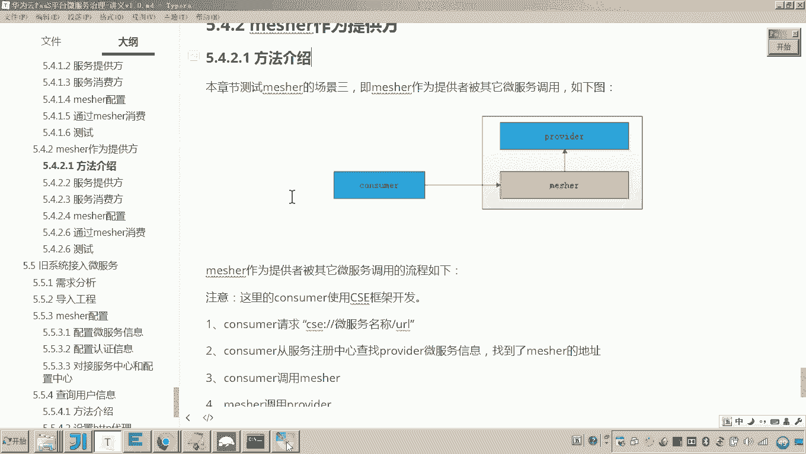
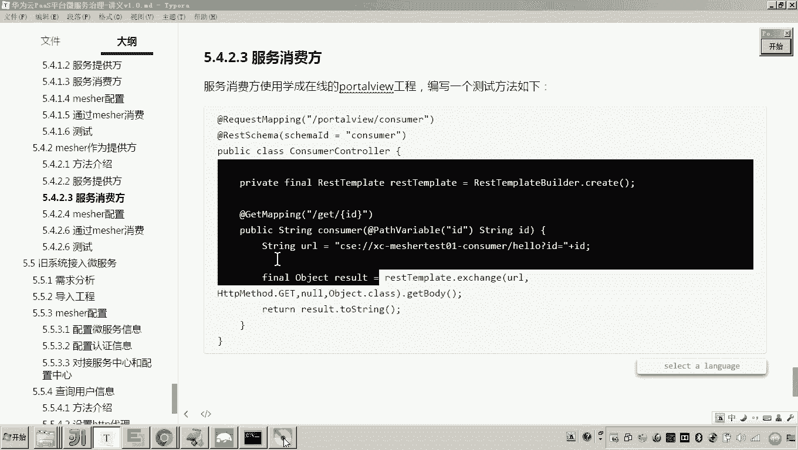
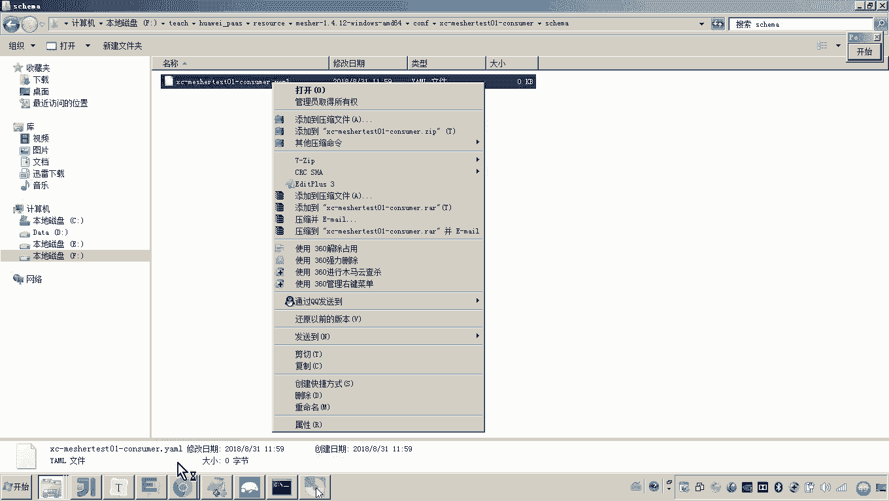
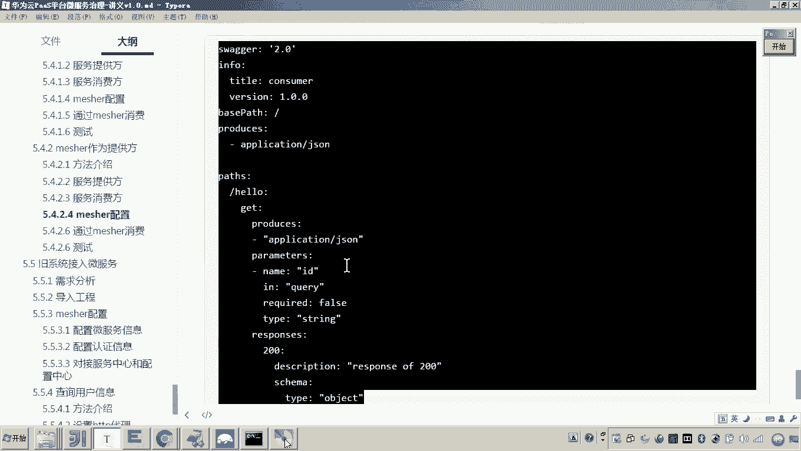
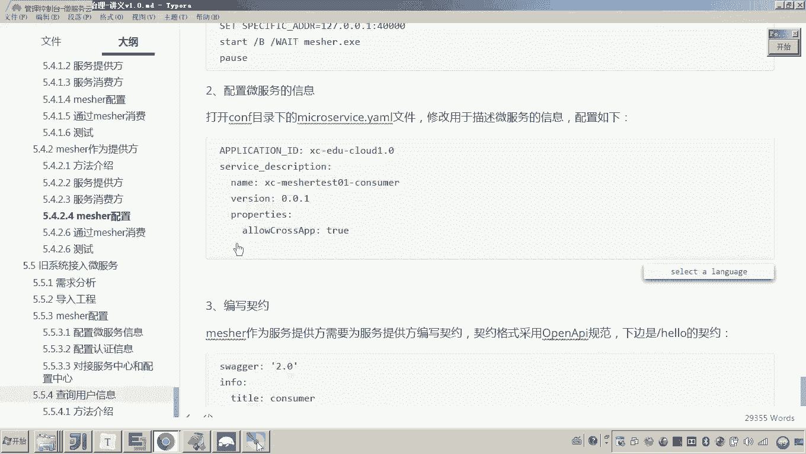
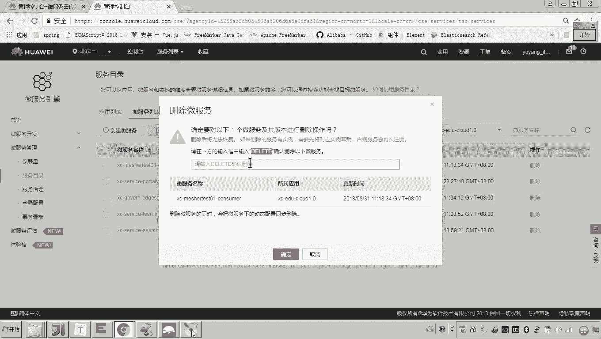
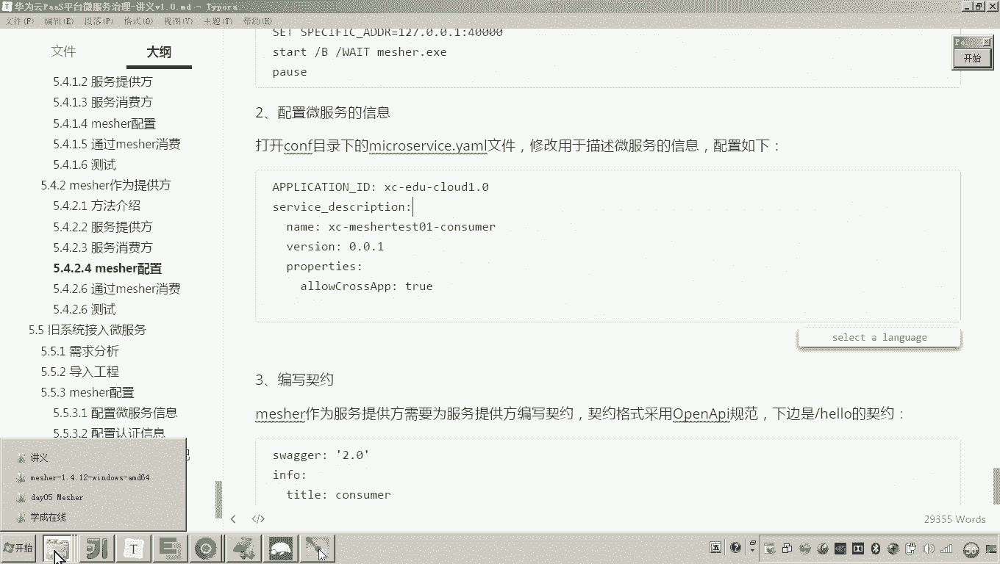
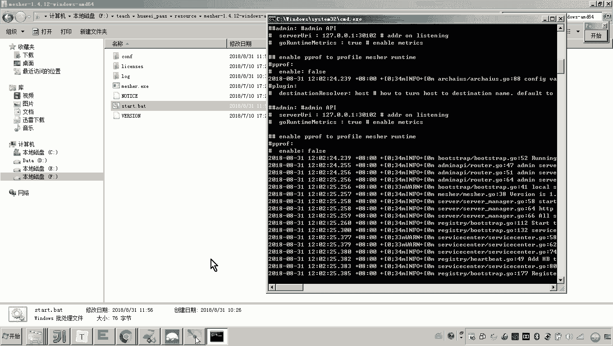
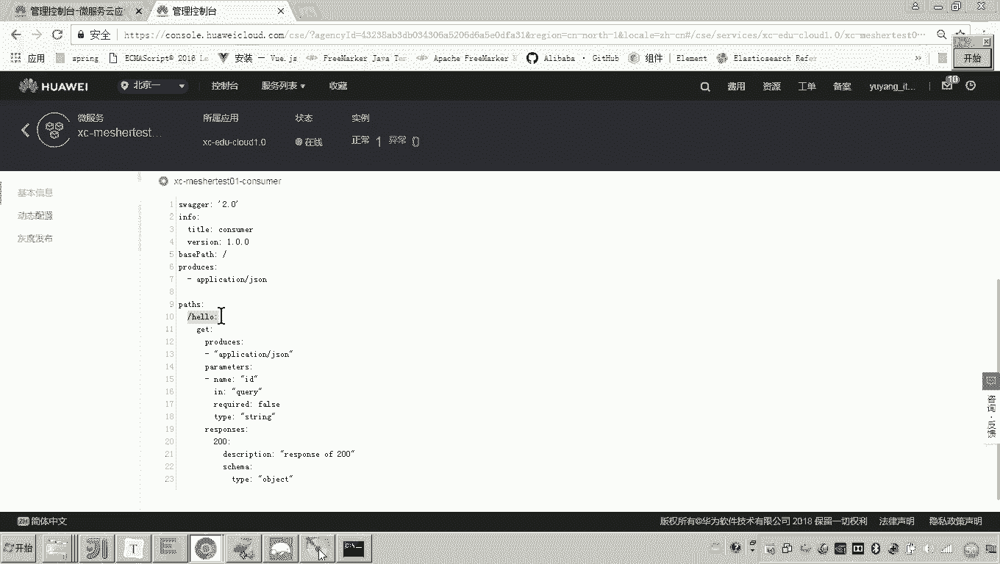
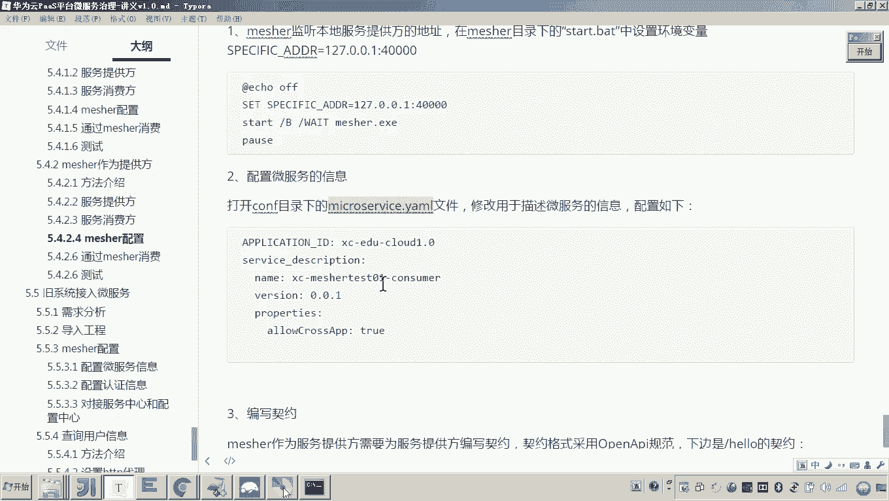

# 华为云PaaS微服务治理技术 - P152：12.mesher研究-mesher作为提供方-mesher配置 - 开源之家 - BV1wm4y1M7m5

好，那下面呢我们就来实现啊用matature呢呃来作为服务提供方来供其他的微服务来进行调用。嗯，刚才我们已经完成了提供方的这个代码以及消费方这个代码的编写啊。那现在我们看mat那怎么配置呢？

那这个与这个measure作为消费方不同的是什么呢？就是说这个呃这个这个这个mesure呢，它首先哎要把这个服务提供方的信息给它注册到服务注册中心。😡，这是不是他要做的事儿？哎。

其次就是当外界去请求这个matature的时候，matature要负责把这个请求转发给哎这个服务的本地的这个服务提供方。为什么说本地的？因为他俩是不是在一台计算机啊？😡，啊。

所以这里边呢我们说要对micer做一系列的配置。第一个配置。😡，就是要配置一个环境变量，哎，这个环境变量就要指定本地服务提供方的这个地址。好，那这个环金赔偿怎么配呢？😡，在这个match的安装目录里边。

是不是有一个叫做star点BAT这个脚本？对，这里边是不是就有可以可以通过s命令来配置这个环境变量，对吧？😊，这个127。0。0。1，这是固定的。

因为measure就要通过这个地址来访问它本机的这个提供方的这个服务。就是这个端口得注意啊，现在这个提供方各位这个提供方的这个端口是谁呀？mesure是不是要代理这个这个工程啊？

它这个提供方的这个端口是不是叫4万呢？所以他要配成4万。😡，在这个环境变量配就是这么配。配好之后呢，接下来你说要对外要通外界哎，要访问这个meer所代理的这个服务。

那访问这个服务是不是访问他的这个HTTP的这个接口啊，所以你要配接口契约。😡，这个接口契约呢一定注意，你要需要非常熟悉这个open APII的规范，才能把这个文档呢给它写出来。😡。

所以针对open APII这个规范的这个内容呢，大家可以去参考一些网上的一些教程。哎，然后呢把这个把这个怎么把这个接口的这个契约呢给它写出来。好，那但是啊这里边也有一些这个方法呢，我给大家介绍一下。😊。

再来看。首先这个mat说所代理的这个服务是不是就是这个是不是是不是就是这个杠好路接口了。那这个杠好路接口各位看一下，它是不是就是getge请求。所以你对着这个接口契约，这看我讲义里边这个接口契约的内容。

看这是不是就是get。😊，看懂了吗？这就是get吧。😊，注意这里边有点问题啊，这是杠hel喽。😊，这刚好是不是就是？😡，我们说的这个提供方的这个地址啊，刚好漏看懂了吧？哎，好，然后呢get请求啊，请求。

那将来响应什么格式呢？各位，你看我这写的是不是就响应jason呢，这个接口契约里边是不是也是响应jason请求什么参数呢？请求ID参数。😊，ID。参数的这个传输传入的这个方式是query。

这个query的意思就表示以这种key value的方式来传嗯，响应什么格式呢？响应哎响应你看这里边我是不是写一个type叫object，就是所有的内容我是不是都可以响应成object。😡，好。

然后这就是我们说的这个接口的契约。你说老师这个接口契约那你怎么弄啊，怎么怎么配呀？😊，对它的配置方法非常简单。你进入这个measure，是不是有一个confir文件？😊，对，然后呢。

现在你是不是想哎你是不是想把这个呃给这个服务？😊，给这个服务的名字。来注册。来配置这个借口续约呀。所以呀你要在哪里呀？😡，在这个啊m的这个confi当中，你建一目录。😊，鉴定目录。鉴定完目录之后呢。

在这个里边你还需要建一个目录，哎，叫做什么目录呢？哎，叫做smmer。😡，Just是给我。这个目录是固定的啊。啥意思？就第一级目录就是服务名，第二级目录叫skimer固定的。

第三个就是接口契约的这个名字了。这个名字的方法，这个名字的命名的这个名称其实就是这个服务名加YA。😊，海没有。哎，这个是不是一种文件格式叫杨某？😡，这个文件定义好了之后打开。

然后把刚才我们说的这个接口契约的内容贴进去，这就是一个接口契约的定义的方式都已经完成了。

来。他说还没有打开是吧，来看一下。好，那现在打开了之后呢，我们把它贴进去，是不是就可以了？😊，好，那这个呢这个就是一个接口契约的内容。基于open APII这个规范啊。

这个是这个华为CSE呢所遵循的一个接口这个定义的规范定义的标准。所以如果对这个规范不太熟悉的，大家可以去网上找一些参考资料，哎，或者去官网呢去看一下它这个规范的内容。不过大概大家也可以看得懂吧。嗯。

好了，那现在呢我们把这个嗯定义好了之后呢，接下来各位我们就要现在做一件事儿了。😊，做什么事啊？那你是不得启动myhir了？对吧启动卖相。那启动卖票之前，各位你需要做一件事儿。😡，还有一件事啊。

就是其实应该这个配置刚才我还落了一点，就是说你不光因为我现在这个配置是不是基于这个上面的这个这个这个这个作为消费方的这个来配的，是吧？其实这里边更全的这个这个配置应该是这里面还有。😡，看好啊。

因为你你还要配置这个微服务的信息吧。我给你补一下啊。首先是配置这个本地服务的这个地址吧。将来谁来请求meermeer把请求是不是转发到这个本地的服务了是吧？然后再要配置微服务的微服务的信息。

其实刚才我我都已经讲过了吧，是不是在这儿。😊，是是不是配套？没错吧。就打开这个miccroserv这个目录配这些东西，然后最后就是编写契约，所以这个不要落了啊。好。

然后因为这个服务现在是不是已经在这个管理平台，当初是不是已经注册成功了，所以你现在你现在是不是配了一个接口契约呀，你把原来的服务给它干掉。😡。

然后再来重启麦手。

这个时候他应该就重新再次注册。那我们的目的只有一个，你先看一下这个服务注册成功不成，然后点开要看接口契约，各位看一下是不是就有了。

这个是不是就刚才我编写的那个契约呀？😡，有了这个契约，将来我们说外部服务是不是还可以调用这个hello接口啊啊好，那到这儿其实我们就完成了这个measure的配置啊，那么measure作为提供方。

我们里边怎么配啊啊用三项配置啊，配置本地服务的这个地址，通过这个环境变量。第二，配置微服务的这个服务信息。第三，编写接口契约。😊。

好。