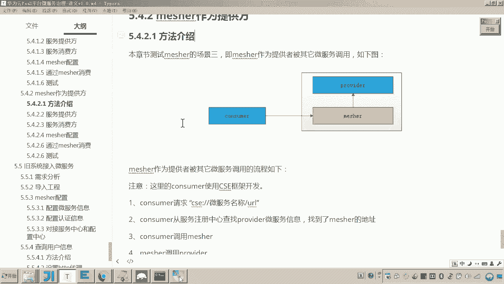
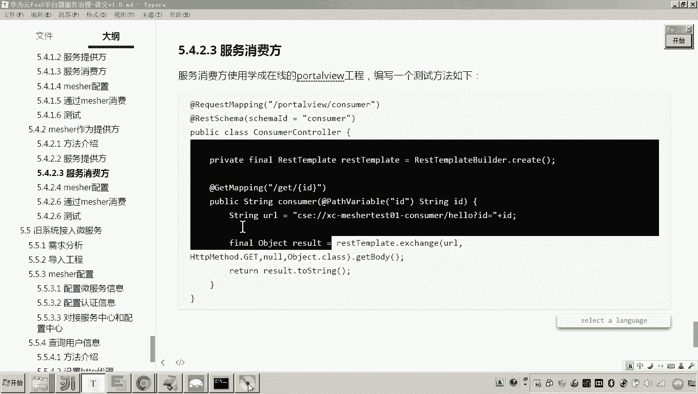
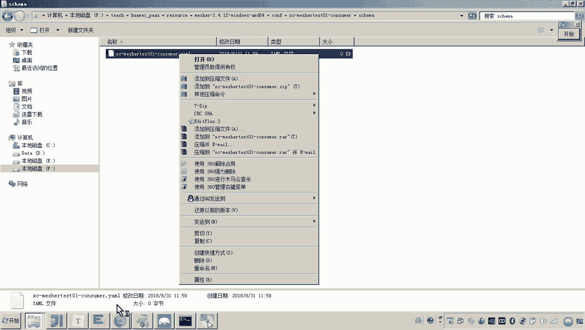
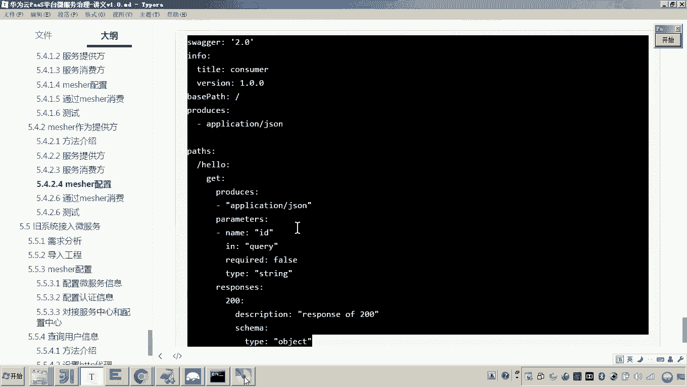
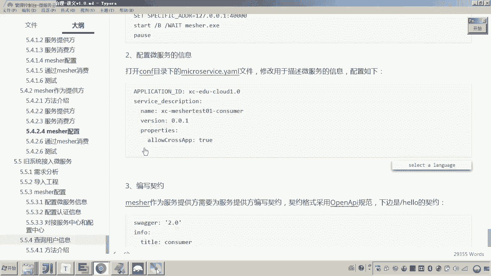
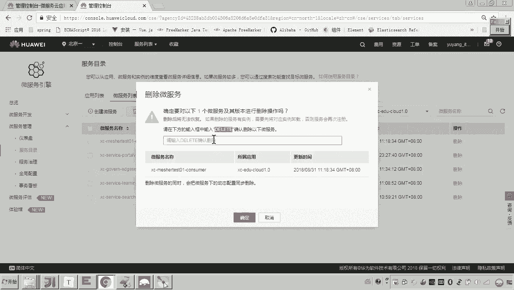
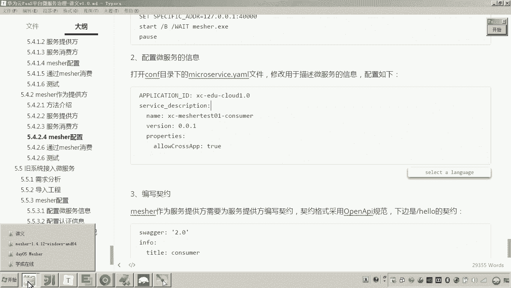
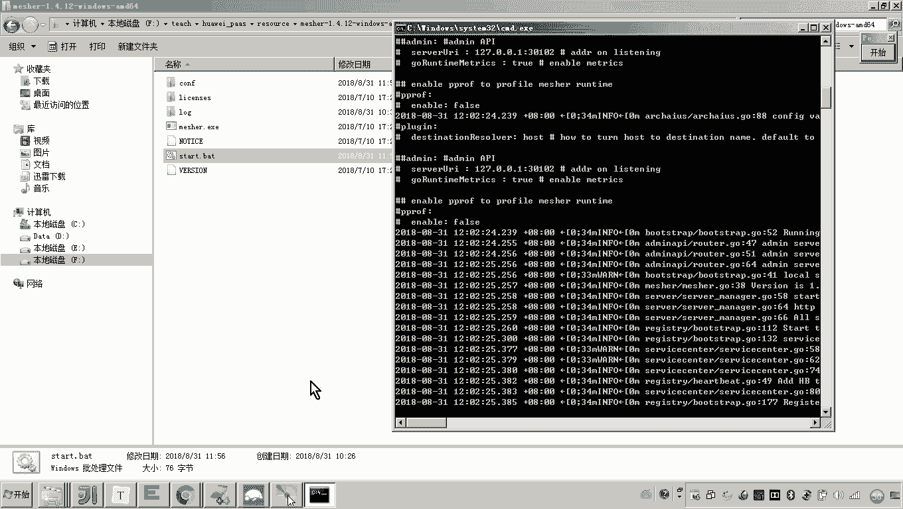
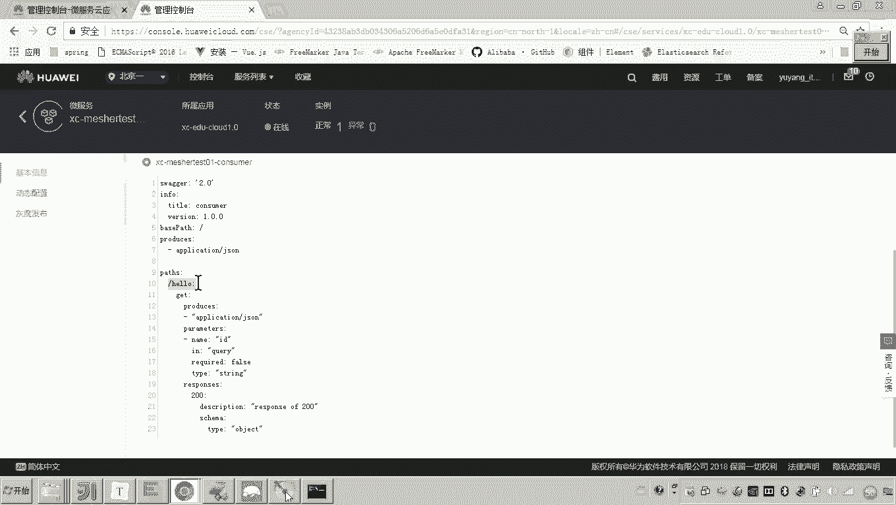
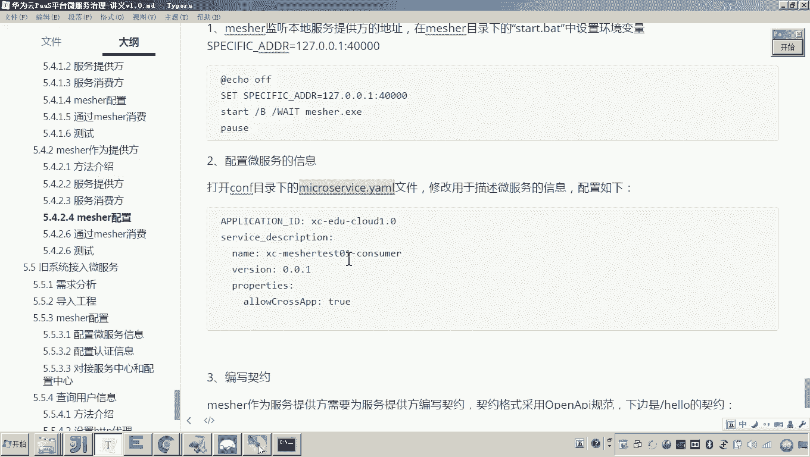

# 华为云PaaS微服务治理技术 - P152：12.mesher研究-mesher作为提供方-mesher配置 🛠️





在本节课中，我们将学习如何将Mesher配置为服务提供方，使其能够代理本地服务，并将服务信息及接口契约注册到服务注册中心，以供其他微服务调用。

上一节我们介绍了Mesher作为消费方的配置，本节中我们来看看如何将其配置为服务提供方。与作为消费方不同，Mesher作为提供方需要完成两项核心任务：首先，将服务提供方的信息注册到服务注册中心；其次，当外部请求到达Mesher时，Mesher需要负责将请求转发给运行在同一台计算机上的本地服务提供方。

因此，我们需要对Mesher进行一系列配置。

## 配置本地服务地址

首先，需要配置一个环境变量，用于指定Mesher要代理的本地服务提供方的地址。

以下是配置步骤：
1.  找到Mesher安装目录下的 `start.bat` 脚本文件。
2.  在脚本中，通过 `set` 命令设置环境变量 `SERVICE_ADDRESS`。
    ```bash
    set SERVICE_ADDRESS=127.0.0.1:40000
    ```
    *   `127.0.0.1` 是固定的，表示本机。
    *   端口 `40000` 需要修改为您的本地服务提供方实际监听的端口（本例中为40000）。

## 配置微服务信息

其次，需要配置微服务本身的信息，如服务名、版本等，以便注册到服务中心。

以下是配置方法：
1.  进入Mesher的 `conf` 目录。
2.  打开（或创建） `microservice.yaml` 配置文件。
3.  在其中正确配置服务名、应用名、版本等信息。此配置与Mesher作为消费方时的配置类似，但服务角色变为提供方。

## 编写接口契约 📄





为了让外界能够调用Mesher所代理的服务，必须按照OpenAPI规范编写并配置接口契约。这要求对OpenAPI规范有一定的了解。

以下是创建接口契约的步骤：
1.  在Mesher的 `conf` 目录下，创建一个以**服务名**命名的文件夹（例如 `hello-service`）。
2.  在该文件夹内，再创建一个名为 `schemas` 的固定名称文件夹。
3.  在 `schemas` 文件夹内，创建一个YAML格式的文件，文件名通常为 `{服务名}.yaml`（例如 `hello-service.yaml`）。
4.  在该YAML文件中，按照OpenAPI规范编写接口契约。

以下是一个针对 `/hello` 接口（GET请求，接收查询参数id，返回JSON格式对象）的契约示例：
```yaml
openapi: 3.0.0
info:
  title: Hello Service API
  version: 1.0.0
paths:
  /hello:
    get:
      parameters:
        - name: id
          in: query
          required: true
          schema:
            type: string
      responses:
        '200':
          description: 成功响应
          content:
            application/json:
              schema:
                type: object
```
*   `paths` 定义了接口路径 `/hello` 及其GET方法。
*   `parameters` 定义了查询参数 `id`。
*   `responses` 定义了成功响应时返回JSON格式的Object对象。

如果对OpenAPI规范不熟悉，建议参考官方文档或相关教程。





## 重启并验证服务



完成以上三项配置后，需要重启Mesher以使配置生效。



以下是操作步骤：
1.  由于服务可能已在管理平台注册过，建议先在管理平台将旧的服务实例下线。
2.  运行 `start.bat` 脚本重启Mesher。
3.  Mesher启动后，会自动读取配置，将本地服务（包含新编写的接口契约）注册到服务注册中心。
4.  登录微服务治理控制台，查看服务是否注册成功，并点击服务详情，确认接口契约（如 `/hello`）已正确显示在列表中。





本节课中我们一起学习了将Mesher配置为服务提供方的完整流程。关键点在于三项配置：通过环境变量指定本地服务地址、在 `microservice.yaml` 中配置服务信息、以及按照OpenAPI规范编写接口契约YAML文件。完成这些步骤后，Mesher就能成功代理本地服务，并将其暴露给其他微服务进行调用。