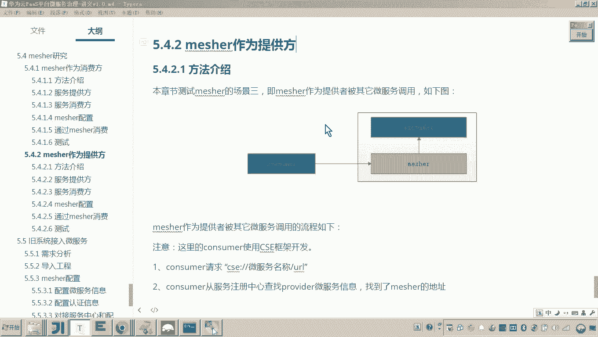

# 华为云PaaS微服务治理技术 - P153：13.mesher研究-mesher作为提供方-调用mesher提供方 - 开源之家 - BV1wm4y1M7m5

好，那么刚才呢我们已经完成了measure的配置啊，那么现在呢我们就准备用measure啊来完成这个服务作为服务提供方啊，供其他服务进行调用。好，那么其他服务调用的话。

首先我们是不是先要看消费方的这个代码了，对吧？首先打开呢，我们看到在我们这个消费方，这个消费方是具有微服务能力啊，然后这里边呃看到我刚才是不是已经在这里边把这个代码已经写好了啊。那大家来看这个代码呢。

我们再来过一遍啊。首先啊这个这个消费方的这个代码呢，它是具有微服务的这个能力，采用微服务框架来开发的啊，这里边采用的是CSE的这个开发框架，然后呢，他要去调用微服务。

它这个地址是不是就是写作CSE冒号刚刚然后呢，后边是不是就跟服务名了，那这个服务名各位是不是就是刚刚我们用measure所代理的这个呃这个这个这个consumer这个服务了是吧？

然后点开因为刚才我们也定义了这个服务的契约，所以在这里边你也可以看到是不是有服务的契约，对吧？所以这个服务的名称，就是复制这个微服务的名称，然后呢把它贴在这里。😊。

然后这个钢好楼从哪里找呢？这个钢好楼其实就是刚才我们定义的这个接口契约的这个方法。而这个钢好楼其实就是正好对应了哎我们服务提供方里面的这个什么这个钢好楼的这个UL。😊。

因为这个这个服务提供方是不是不具备微服务能力，对吧？它就是一个普通的工程。嗯，好，那么呃我们把这个呃来我们按照这个调用的这个这个这个地址呀。😊，就看按照这个调用的地址啊，就这么写，然后呢。

我们就可以发起什么，发起这个请求调用。其实这一步请求调用注意这一步就会首先请求到哪里呀？😊，因为这个当前的这个微服务，他是他是这么做的吧。当前这个微服务是不是具有这个微服务能力啊？这个当前的微服务呢。

它会去呃从这个服务的注册中心找到这个地址。😊，对对？找到他的地址，而这个地址注意此地址就是matature的地址。比如说为啥？因为这个服务是不是被mesure所代理呀？😊。

对吧他就找到这个matature的地址，而他所找到的这个matature的地址，嗯，正是matature所监听的这个什么这个地址。😊，matter所监听的这个地址。

各位这个IP是不是可以被访问到它是个外部IP是吧？所以他就访问哎地址就是mattter的地址。那这个时候呢，我们说这一步他就开始去调用。😊，调用maature地址。

对吧而调用mesure地址measure被调到之后，meature负责干嘛？负责meature现在measure说监听的这个地址。😡，maature监听的这个地址是不是已经在环境变量设好了。

是不是监听这个4万，对吧？所以当你去向哎这步调用matature的地址。😊，请求什么？请求杠号楼。😡，对吧而这个时候matter接到请求之后，matter就会去把这个杠hellow的这个请求。对。😡。

发给这个4万这个端口，而4万这个端口是不是就是我们说的这个本地的这个服务提供方了，这个是不是就是不具备微服务能力的那个服务啊？😡，所以meer呢就会把这个刚好楼请求到这儿。😊。

所以也正是我们这个测试的这个方法这所介绍的。哎，也就是说这里边请求杠好low，然后maature呢把杠好楼哎请求到这个服务提供方，然后最后mature把结果给他返回。😊，大概是这样一个过程。好了。

那现在这个代码就OK了。我们现在把这个代码测试一下，可以吧？然后我们启动。😊，嗯，停，那现在怎么测呢？😊，呃，首先呢我在这儿打一个断点。😊，首先因为这这个是服务的这个提供方，对吧？哎，注意啊，别弄错了。

注意这是不是服务的提供方，对吧？服务的提供方刚好漏是吧？而现在这个呢叫做嗯matched消这个这个服务的消费方是不是具有服务能力的这个这一方在这打一段点。好。

注意看我现在准备请求这是不是port view啊。😊，portal view的端口或者是是40200啊。然后呢，他要请求哪个地址，是不是叫做portal view consumer杠ge。好，注意看。

我现在是不是要请求他，然后portto view consumer是不是下边这个现在我一旦请求这个，他是不是就到这一步了，这是不是服务消费方？而这一步我往下走，这儿他是不是开始请求服务注册中心拿到。😊。

这个这个这个服务的地址，而这个服务地址是不是就正是micel的地址，然后开始请求meel。😊，而麦是不是就把请求转发到哪，是不是转发到这个服务提供方？😊，对，然后接下来是不是就这个数据就拿到了。

然后在浏览器是不是就可以把这个数据享应？😊，大家看懂了吗？哎。所以所以各位所以各位，那这里边有人说老师我那我那那我想测试一下到底这个measure起没起到作用。

其实最直接的一个办法就是你把你把measure关掉。😊，是吧那这时候我们再来请求。😡，这是不是又又到这了，然后到这儿之后再来，是不是他开始来请求了。请求的时候，各位他是不是要先调到mic啊。

miccher先生是不是已经死了，是不是就掉不到了，你是不是就抛一层了？😊，看懂了，这是又抛一层了。对，那这个时候就说明这个matature呢就无法到达。嗯，那你就需要把matature干嘛呀。

把它起起来。😡。

看懂了吧？哎。😊。

这是这么一个测试。注意注意这个mater把请求转发给谁，转发给这个环金变量也要配配对啊。对你也可以把这个端口写错，你可以试一下，它也是有问题的。

所以这个地址就是这这个端口就是mesure所代理的本地的那个哎服务提供方的哎那个端口。😊，好，那以上呢是不是就是我们说的matter作为提供方的，我们的这个测试是不是就完了。那这里边我们总结一下。

就是matature作为提供方，一定要注意有几个方面啊，三个步骤。第一步骤。😊，哎，我们说啊要这个消费方去请求mesure。这个我当然这个mesure作为提供方指的是呃，这个提供方不具备微服务能力啊。

而我说的这个消费方，我在这儿测试的这个消费方是采用了CSE框架来开发的这个微服务。所以呢他要去请求的话。😊，他怎么做，就采用这种呃CSE所要求的这个请求地址去请求就行了。就是微服务怎么要求的。

你就怎么请求。然后呢，他首先从服务注册中心根据服务名找到什么，找到meature的地址，然后请求meature。而meature接到请求之后，会根据这个环境变量，它的这个啊地址。

然后把这个请求转发到这个地址。😊，这个地址是不是就是他代理的那个服务的地址，对吧？然后呢呃那当然呃之所以要配置契约，第三步配置契约目的只有一个就是因为你要请求这个服务提供方的接口。

说matature所代理的这个服务啊，代理哪些接口以接口契约为准。所以这个mecher作为提供方要配置这三三部分呢？三部分。😊，好，那这个就是measure作为提供方啊这个整个的测试。

