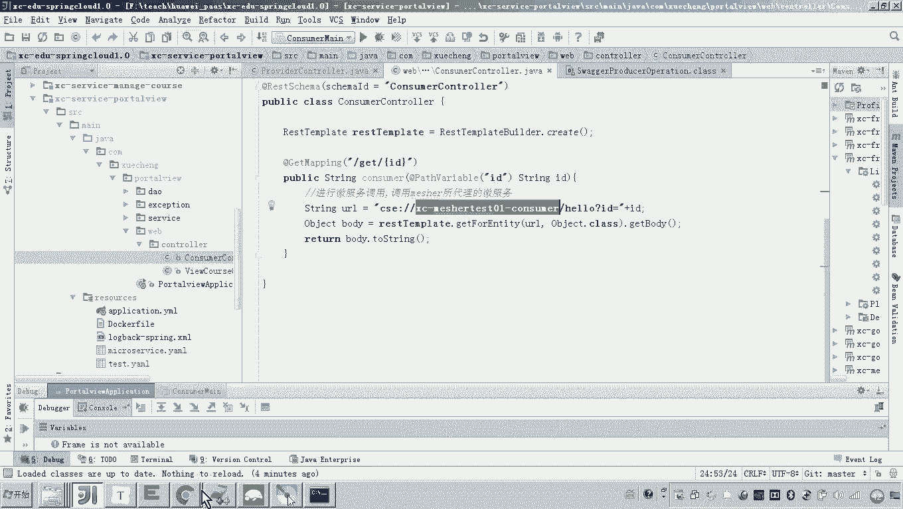
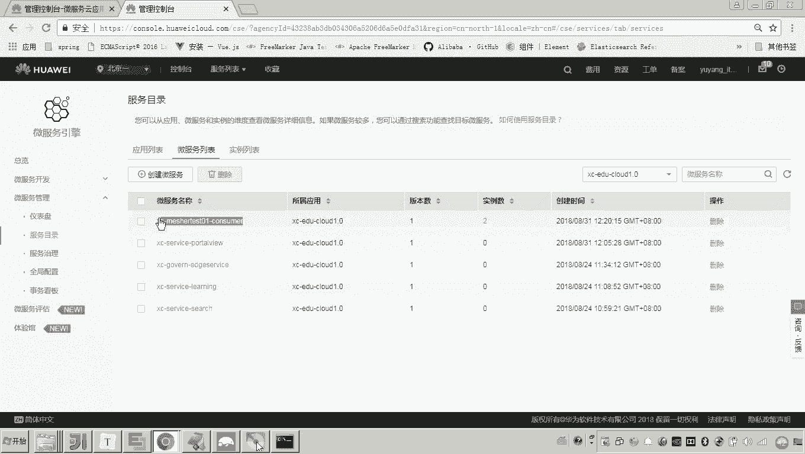
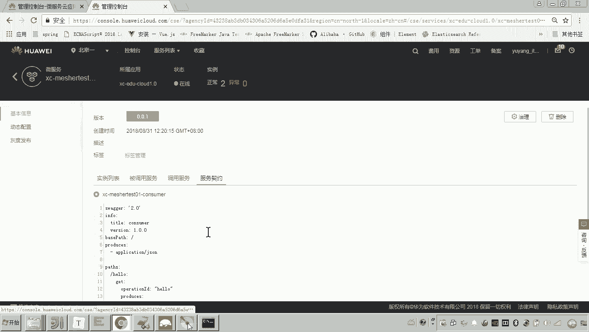
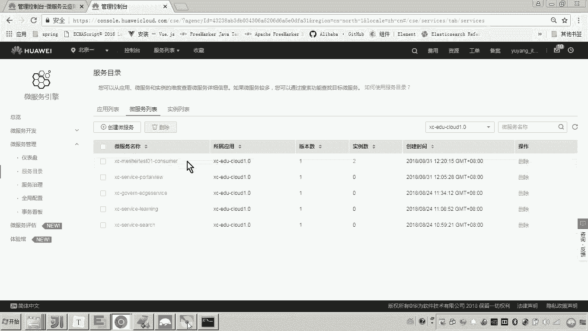
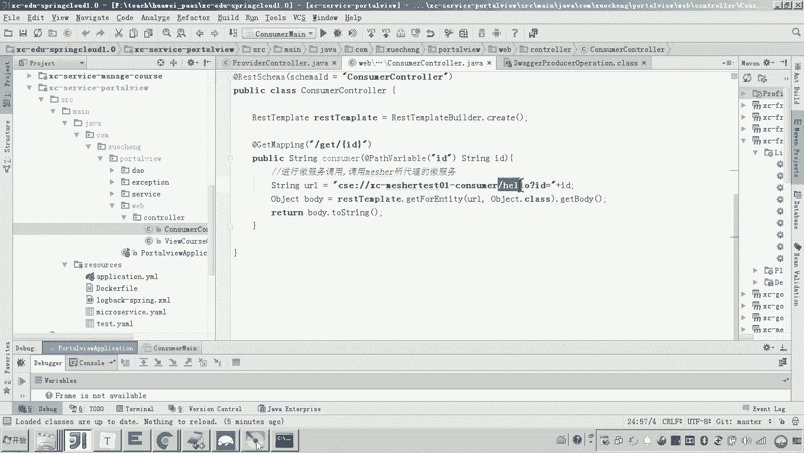
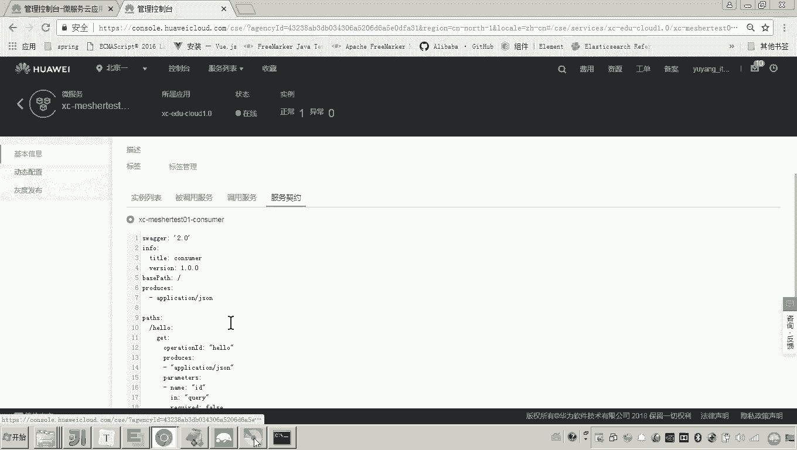
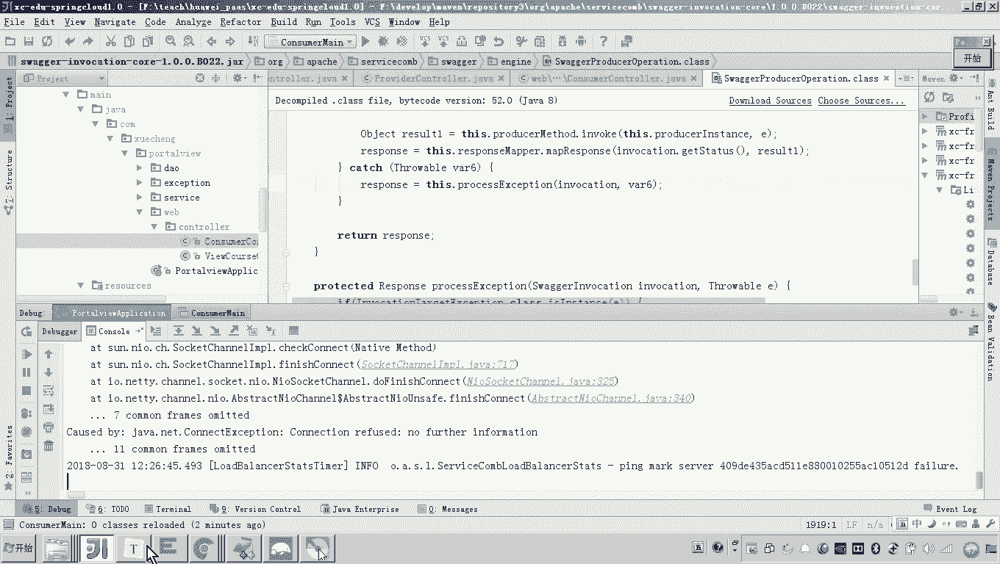
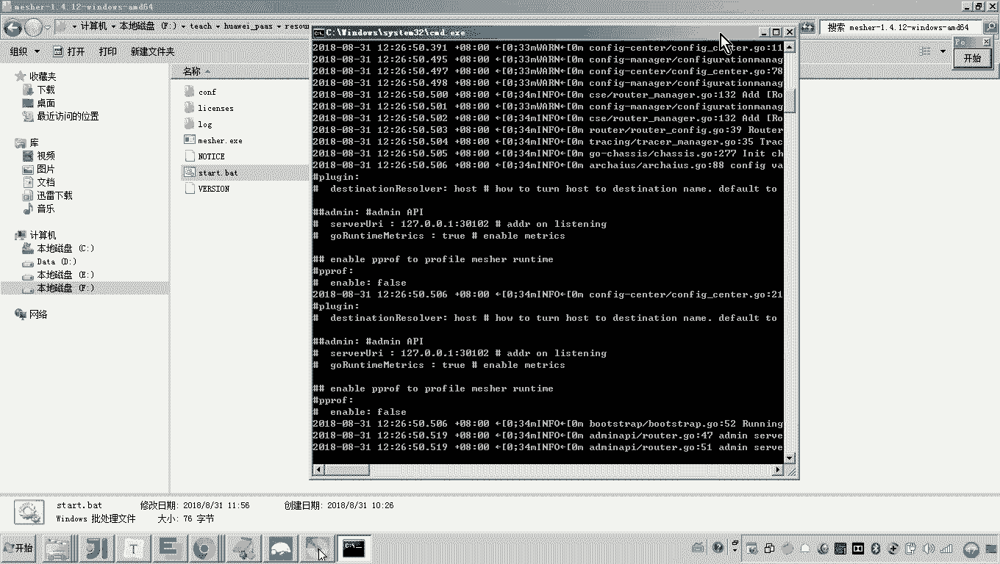
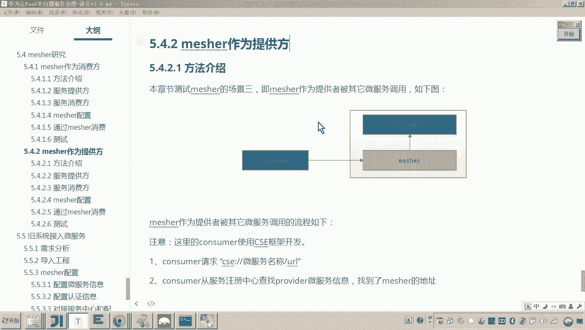

# 华为云PaaS微服务治理技术 - P153：13. Mesher研究 - Mesher作为提供方 - 调用Mesher提供方 🚀

在本节课程中，我们将学习如何配置和测试Mesher作为服务提供方的代理。我们将通过一个具体的例子，演示一个具备微服务能力的消费方如何通过Mesher，成功调用一个不具备微服务能力的普通服务提供方。

## 概述

上一节我们完成了Mesher作为提供方的基础配置。本节中，我们来看看消费方如何编写代码，并通过Mesher成功调用到被代理的服务提供方。整个过程涉及服务发现、请求转发和契约配置。







## 消费方代码解析



以下是消费方调用服务的核心代码逻辑。该消费方采用CSE微服务框架开发，具备完整的微服务能力。





```java
// 示例：消费方调用服务提供方的代码片段
// 请求地址格式为：cse://服务名/接口路径
RestTemplate restTemplate = new RestTemplate();
String result = restTemplate.getForObject("cse://portalview-consumer/hello", String.class);
```

在这个代码中：
*   `cse://` 是CSE框架约定的协议前缀。
*   `portalview-consumer` 是我们在上一节中为被Mesher代理的服务定义的服务名称。
*   `/hello` 是对应服务提供方中定义的接口方法路径。

## 调用流程详解

现在，我们来详细拆解一次完整的调用过程，理解Mesher在其中扮演的角色。

1.  **消费方发起调用**：消费方代码执行，准备调用 `portalview-consumer` 服务的 `/hello` 接口。

2.  **服务发现**：由于消费方具有微服务能力，它会向服务注册中心查询名为 `portalview-consumer` 的服务实例地址。

3.  **获取Mesher地址**：服务注册中心中注册的 `portalview-consumer` 服务地址，实际上是**Mesher进程的监听地址**（例如 `192.168.1.100:30100`）。消费方因此获取到的是Mesher的地址。

4.  **请求转发至Mesher**：消费方向获取到的Mesher地址（`http://192.168.1.100:30100/hello`）发起HTTP请求。

5.  **Mesher处理请求**：Mesher接收到 `/hello` 请求后，根据其配置的环境变量（如 `SERVICE_ADDRESS=127.0.0.1:40000`），将请求转发给本地真正的服务提供方。

6.  **服务提供方响应**：本地的普通服务（监听40000端口）处理 `/hello` 请求，并返回结果。

7.  **结果返回**：Mesher将服务提供方的响应结果原路返回给消费方，完成一次调用。

**核心转发逻辑可以用以下伪代码表示：**
```
消费方请求 -> 服务注册中心 -> Mesher地址 -> Mesher进程 -> 本地服务提供方
```

## 实战测试与验证



我们可以通过启动服务并观察日志来验证整个流程。



以下是测试步骤：

1.  **启动服务提供方**：确保你的普通Spring Boot应用（服务提供方）在本地40000端口运行。
2.  **启动Mesher代理**：在服务提供方所在机器上，运行配置好的Mesher程序。
3.  **启动服务消费方**：启动你的CSE微服务应用（消费方）。
4.  **触发调用**：通过浏览器或工具访问消费方提供的接口（例如 `http://localhost:40200/portalview`），该接口内部会调用 `portalview-consumer/hello`。
5.  **观察断点**：在消费方调用代码和服务提供方的 `/hello` 方法处设置断点，可以看到请求依次经过消费方、Mesher，最终到达服务提供方。
6.  **关键验证**：**关闭Mesher进程**，再次触发调用。此时消费方无法从Mesher获取响应，调用会失败并抛出连接异常。这直接证明了Mesher在调用链路中不可或缺的代理作用。

## 配置要点总结

本节课中我们一起学习了Mesher作为提供方的完整调用流程。要成功配置，需关注三个核心步骤：

1.  **消费方规范调用**：消费方只需按照微服务框架的标准方式（如使用`cse://服务名`）发起调用，无需感知后端是否为Mesher代理。
2.  **Mesher正确转发**：Mesher必须正确配置 `SERVICE_ADDRESS` 环境变量，确保能将接收到的请求转发到正确的本地服务地址和端口。
3.  **契约定义接口**：在Mesher配置中定义服务契约（如`service.yaml`），是为了明确告知Mesher它需要代理哪些服务接口（如`/hello`）。消费方调用的接口路径必须与契约中定义的路径一致。



通过以上配置和流程，Mesher成功地将一个不具备微服务能力的普通服务，融入到了微服务生态中，使其能够被其他微服务发现和调用。