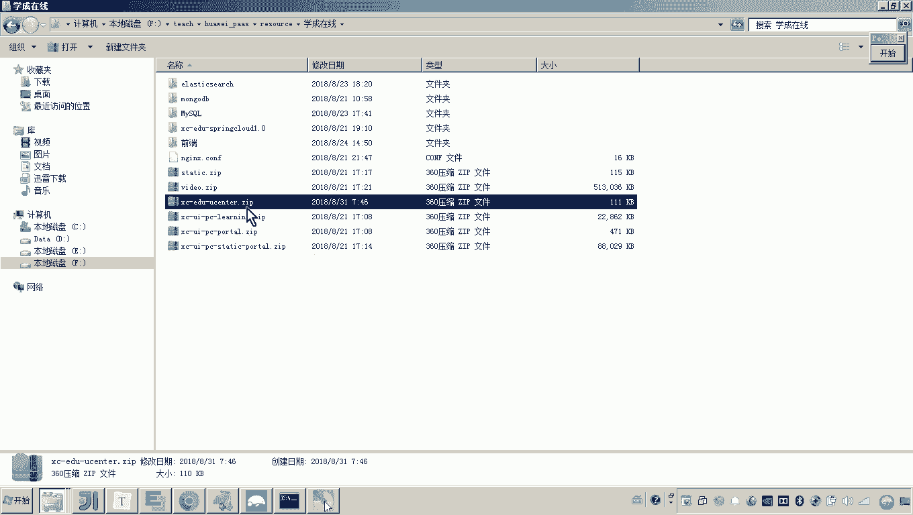
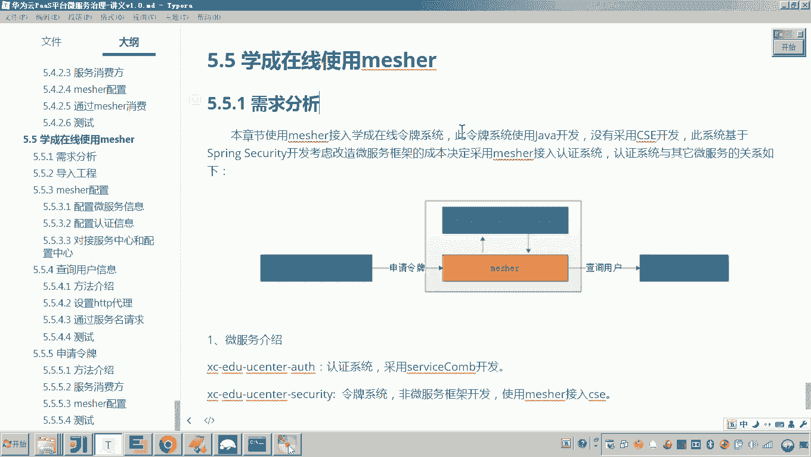

# 华为云PaaS微服务治理技术 - P154：14.学成在线使用mesher-需求分析和导入工程 - 开源之家 - BV1wm4y1M7m5

好，那接下来呢我们就来做一个案例啊，就是学生在线呢准备使用matsure啊，将一个令牌系统啊，这个令牌系统呢是一个旧系统，把它接入CSE。😊，好，那我们具体先看一下需求分析。

首先大家看到这个图啊啊这个图，那首先来看这个上面这个服务啊啊，这个你名字挺长的啊，叫做XCEDUU center security这个系统就是学生在线的一个啊旧的系统。

它并没有采用这个CSE啊微服务框架进行开发。它是基于spring security嗯所所构建的一个啊令牌生成的这么一个系统。😊，但这个系统呢，我们说它会使用啊学生在线最新开发的这个用户中心的这个微服务。

而这个用户中心的微服务呢，它其实是采用了CSE框架进行开发的对，所以啊这里面就有一个需求，就说这个令牌系统啊定牌系统啊，需要通过measure来调用我们的用户中心。😊，看懂了吧？

但是呢我们外边还有一个系统，就是学生在线新开发的这个认证系统。这个认证系统呢，它因为认证的过程是不是要生成令牌啊？认证系统需要请求我们说的这个旧系统，这个令牌系统来申请令牌。😊。

所以这个案例应该是上边我们研究me的一个综合体。就是说这个哎这个令牌系统是一个旧系统，并没有采用微服务框架，它是采用准备采用measure啊来这个改造为微服务。同时它既是一个服务提供方，哎。

同时也是一个服务的消费方。那么之所以说他是一个服务的这个消费方，那是因为他要去请求呃用户中心微服务来查询用户信息。根据用户信息生成令牌。之所以说他是一个服务的这个什么提供方。

是因为他要供啊认证系统来请求他来生成令牌。懂我的意思吧？所以其实这个需求呢就是我们要实现啊我们要实现这个令牌系统，通过measure接入CSE啊，同时它要实现两个功能，一个是作为提供方。

一个是作为消费方。😊。

好，那么刚才呢其实我在介绍的时候呢，基本上这个微服务的啊这几个微服务我也介绍了，这个是令牌系统，一个老系统啊，并没有采用微服务框架啊，负责生成令牌。那这个系统呢是一个认证系统。这个认证系统呃。

它需要请求这个令牌系统来生成令牌。啊，下面还有一个系统就是这个用户中心。这个用户中心呢专门提供用户信息管理，而这个申请令牌需要用到用户中心，所以老系统需要申请这个需要请求这个微服务来查询用户。

所以这是三个微服务。😊，而这三个微服务需要改造的点在哪呢？就是这个令牌系统，这个令牌系统。😊。

好。大概的一个认证的流程呢，大家也了解一下啊，就是用户登录啊，输入账号和密码。首先用户这里边是一个用户，这个用户登录的话，他就会请到认请求到认证。而这个认证会请求到令令牌系统，申请令牌。

令牌系统呢在申请令牌的时候呢，会请求用户中心来查询用户信息。好，大概是这样一个呃流程。😊。

那么这个measure的接入啊，measure的接入，刚才我们也大概说了，这个measure的接入呃，需要接入什么呀？一个是这个呃这个measure作为服务的这个什么呀消费方去查询用户。

一个是measure作为服务的提供方供啊认证系统去请求申请令牌。😊。

好，那么这就是我们的这个需求啊需求。那现在这个需求清楚了之后呢，我们先把这个工程原始的工程导进去啊，原始的工程。😊。

这个工程在哪呢？呃，在给大家提供的资料，学生在线里边有一个压缩文件，哎，叫做XEDUU centerer。好，然后在这个zip包下边有三个工程，看到了吧？

然后然后我们把这三个工程呢把它导到哎我们现有的这个哎工作这个这个这个项目当中嗯。😊。

导工程的这个过程呢，我就省略了啊，大家可以看到这个工程呢在这儿就已经导入成功了。😊，好，这三个工程我们可以简单的来瞅一眼啊，这个us centerer就是我们说的用户中心，它提供用户的信息管理。

那大家从配置文件其实都应该看到呃，它是不是就使用了什么呀？CSE。😊。

是不是使用了CSC框架，对吧？嗯。😊，好，那么另外的话就是这个这个是认证系统。这个认证系统呢就是提供一个用户登录的啊这个功能接口。然后他呢要去请求这个呃令牌系统。但是这个认证系统大家也可以看到。

它也是一个什么，也是一个CSE框架开发的微服。😊。

但最后一个令牌系统是一个老系统啊，这个令牌系统呢它并没有用到微服务啊这个框架。😊，啊，大家可以看到它是一个基于什么？基于sppri boot开发的一个项目。

对，基于spring boot开发的项目啊，但是他他他用到了一个spring的一个spring security这个认证框架啊，他负责生成令牌，他只负责生成令牌。好，这是一个三个系统呢。

这里面我就导入成功了啊。好，那到这呢，我们先简单了解一下本次这个学生在线要使用mat的一个啊目的啊啊准备把这个什么呀这个这个令牌系统，把它接入我们的这个CSE的这个啊微服务引擎中啊。

让他提供既作为服务的提供方，也作为服务的消费方。好。😊。

