# 华为云PaaS微服务治理技术：P154：14.学成在线使用mesher-需求分析和导入工程 🚀

在本节课中，我们将学习如何将一个遗留的令牌系统通过华为云Mesher接入CSE微服务引擎。我们将分析具体需求，并导入相关的示例工程，为后续的改造工作做好准备。

上一节我们介绍了Mesher的基本概念和部署方式，本节中我们来看看一个具体的应用案例。

## 需求分析

本次案例的目标是“学成在线”项目希望使用Mesher，将一个旧的令牌系统接入CSE微服务引擎。

以下是本次案例涉及的三个系统及其关系：

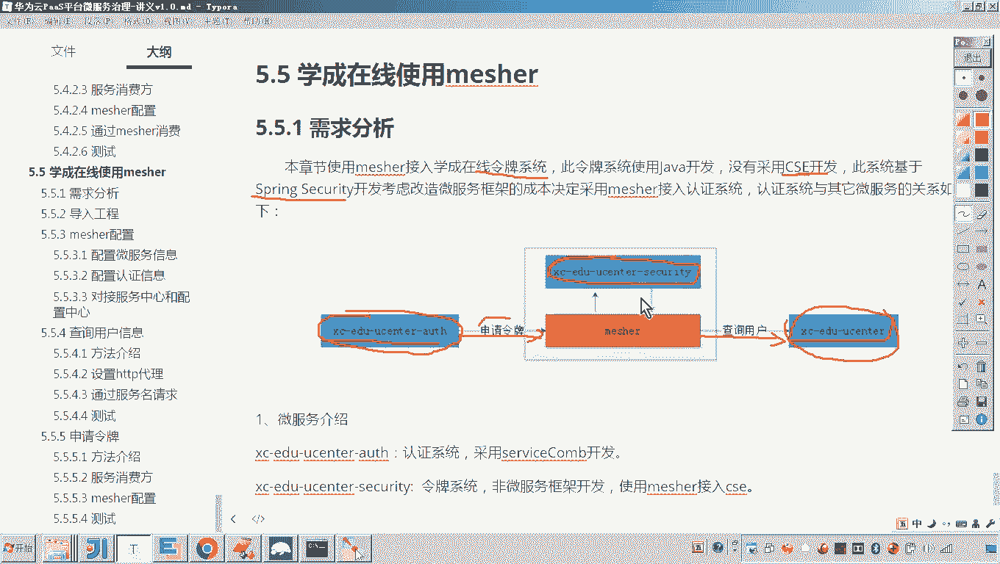

*   **令牌系统**：一个基于Spring Security构建的旧系统，负责生成令牌。它**未采用**CSE微服务框架开发。
*   **认证系统**：一个新开发的系统，采用CSE框架开发。它负责用户登录认证，并需要调用令牌系统来申请令牌。
*   **用户中心**：一个新开发的微服务，同样采用CSE框架开发。它提供用户信息管理功能。

这个案例的需求是综合性的。令牌系统作为一个旧系统，需要通过Mesher改造为微服务。具体而言，它需要扮演两个角色：

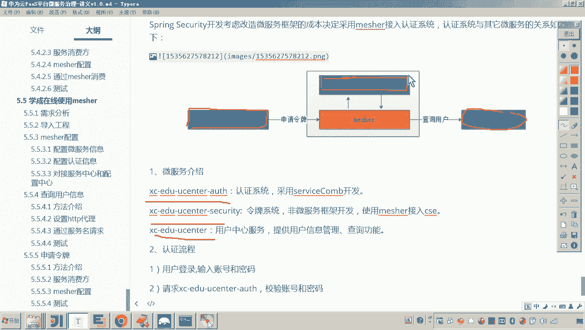

1.  **作为服务消费方**：令牌系统在生成令牌前，需要调用用户中心微服务来查询用户信息。
2.  **作为服务提供方**：令牌系统需要对外提供生成令牌的接口，供认证系统调用。

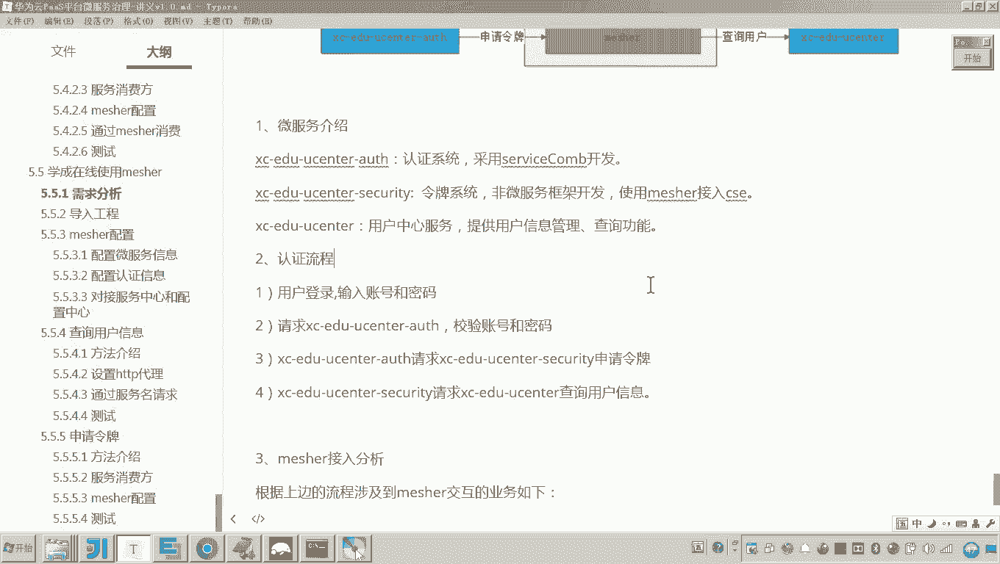

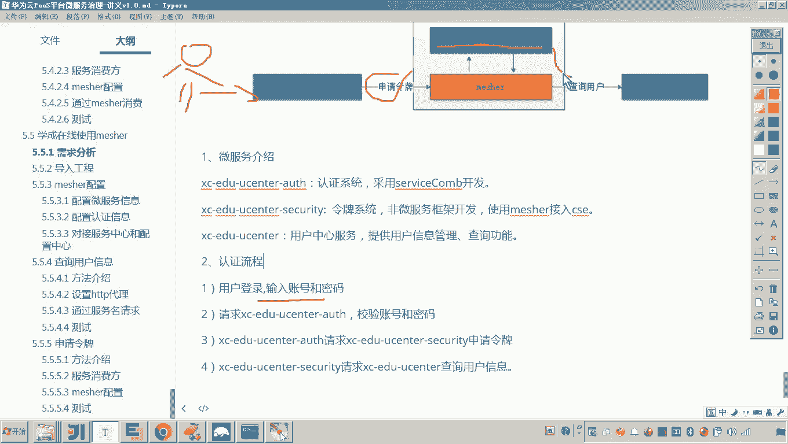

因此，我们的改造核心在于**令牌系统**，需要让它既能通过Mesher调用其他微服务，也能通过Mesher对外提供服务。

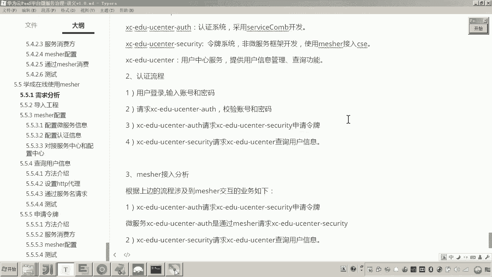

## 系统交互流程

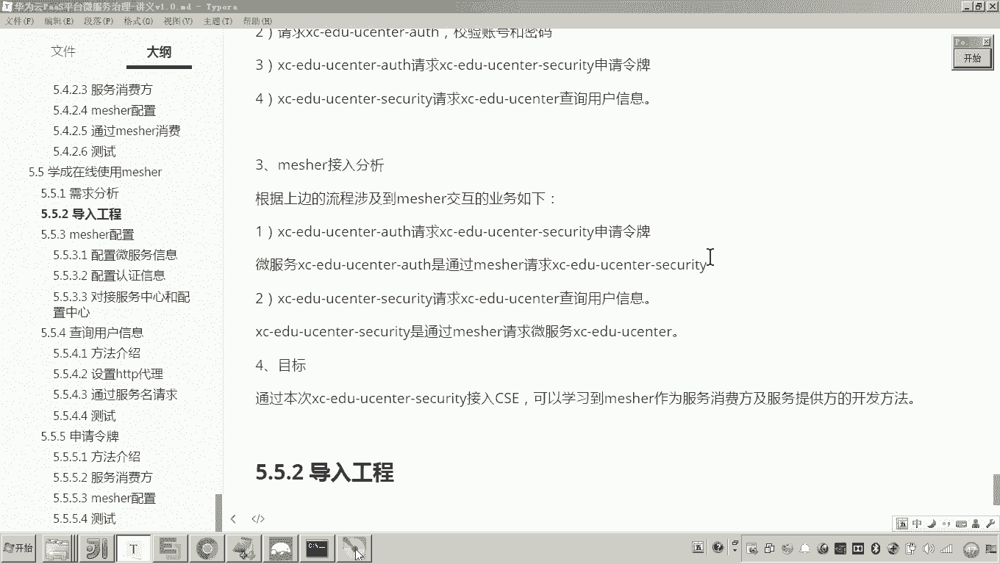

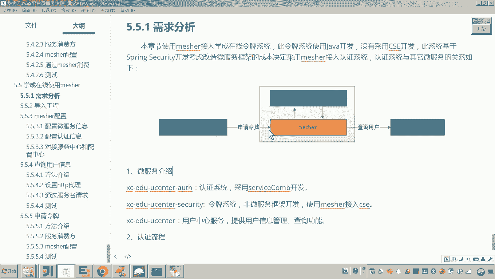

以下是用户登录时，各系统间的认证流程：

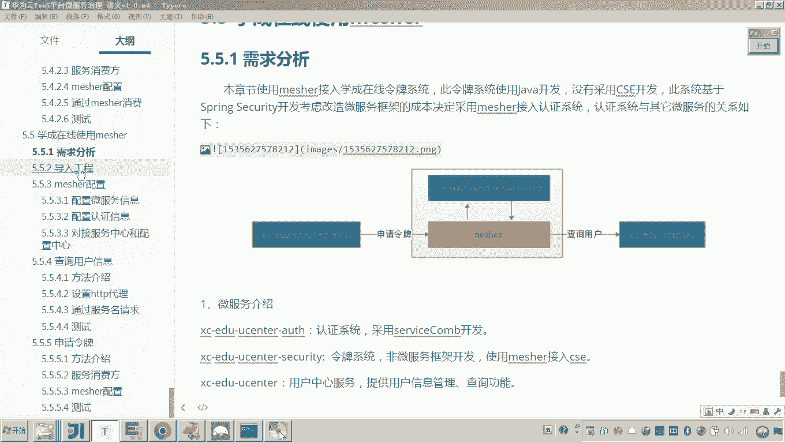

1.  用户输入账号和密码进行登录。
2.  请求首先到达**认证系统**。
3.  认证系统请求**令牌系统**申请令牌。
4.  令牌系统在生成令牌前，会请求**用户中心**查询用户信息。
5.  最终完成令牌生成与返回。

## 导入示例工程

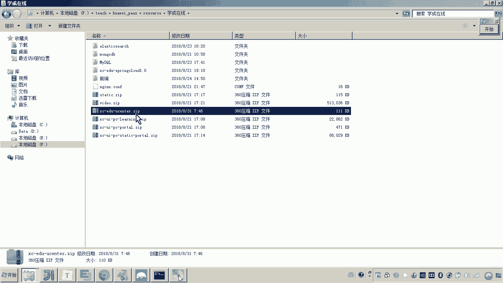

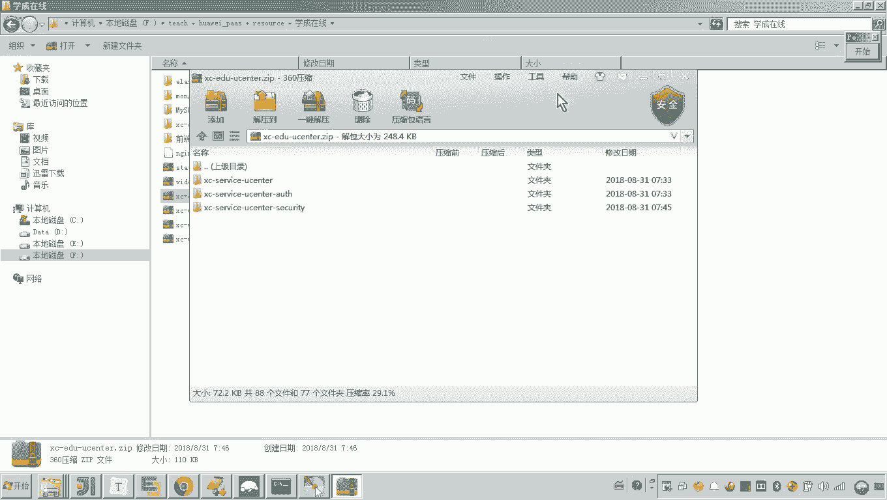

需求明确后，我们需要将原始的示例工程导入到开发环境中。

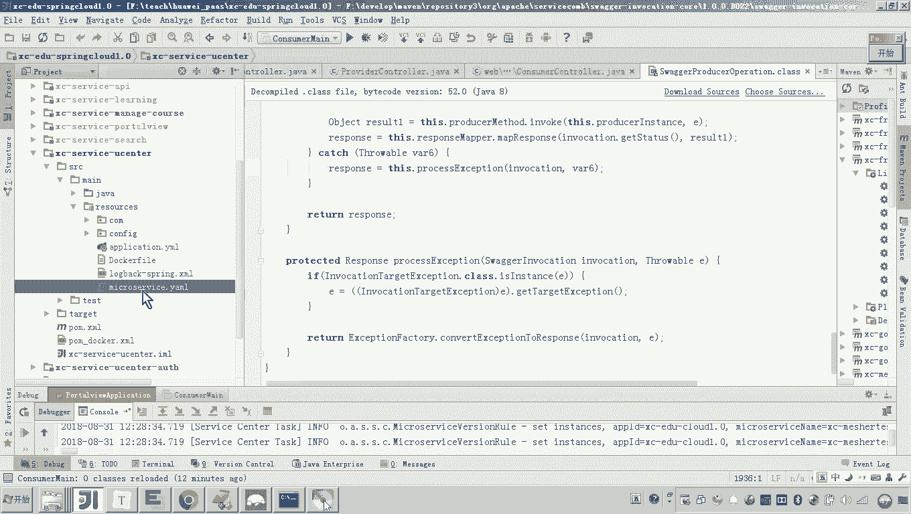

以下是导入工程的步骤：

1.  在提供的资料“学成在线”目录下，找到名为 `XCEduUcenter.zip` 的压缩文件。
2.  解压该文件，其中包含三个独立的工程。
3.  将这三个工程导入到现有的IDE（如IntelliJ IDEA或Eclipse）工作空间中。

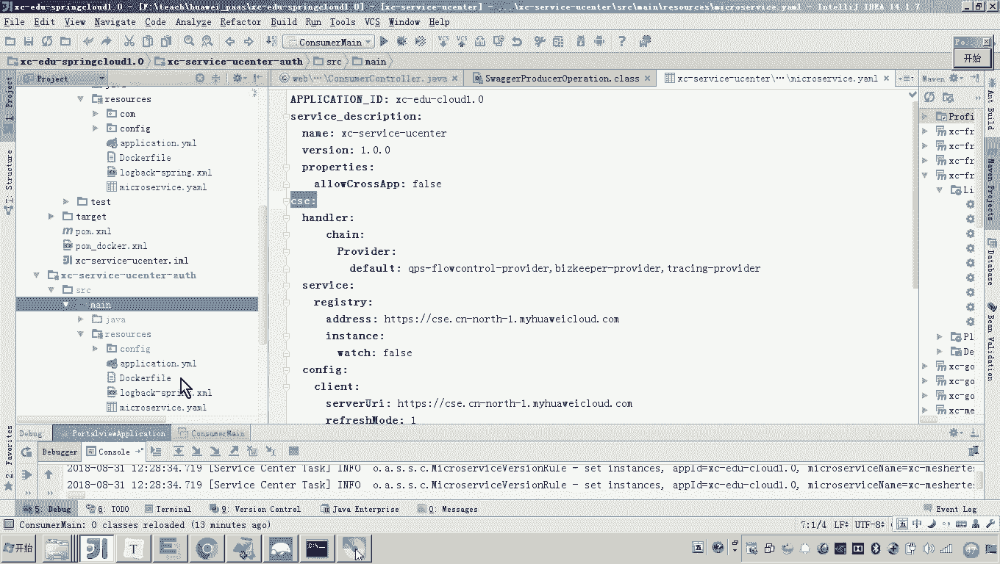

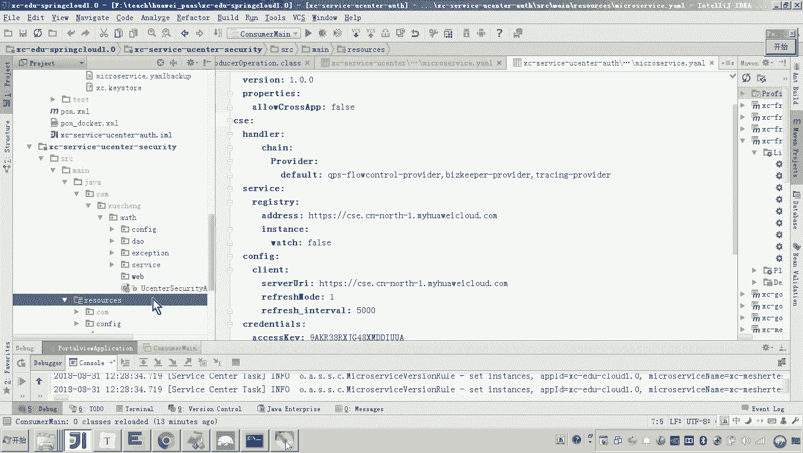

导入完成后，我们可以在项目中看到三个工程，分别对应之前分析的三个系统：

*   **`ucenter` (用户中心)**：这是一个采用CSE框架开发的微服务，提供用户信息管理。从其配置文件中可以确认它使用了CSE。
*   **`auth` (认证系统)**：这也是一个采用CSE框架开发的微服务，提供用户登录认证接口。它将请求令牌系统。
*   **`security` (令牌系统)**：这是一个基于Spring Boot开发的旧项目，使用了Spring Security框架来生成令牌。它**没有使用**任何微服务框架，是我们本次需要通过Mesher进行改造的核心对象。

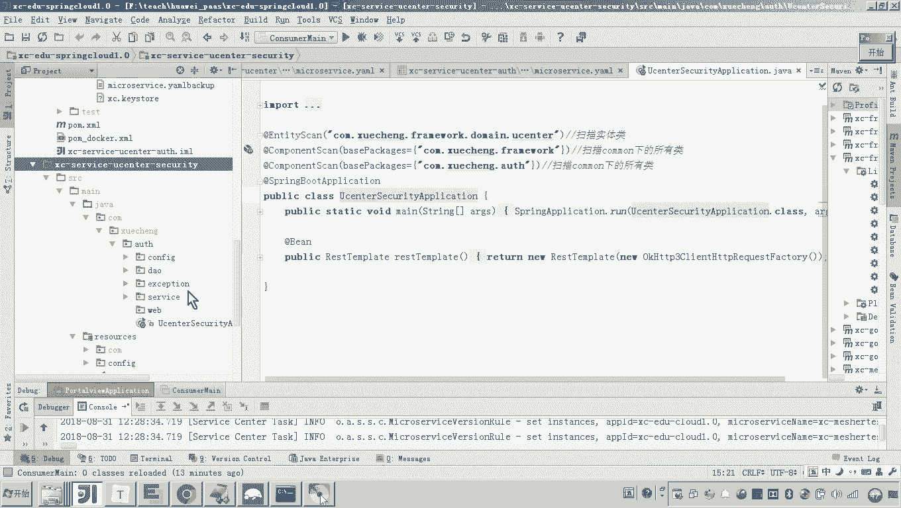

## 总结

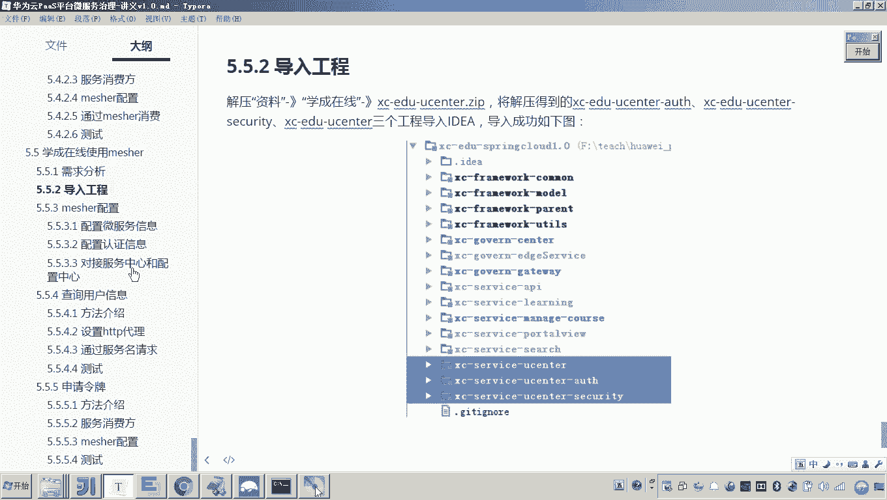

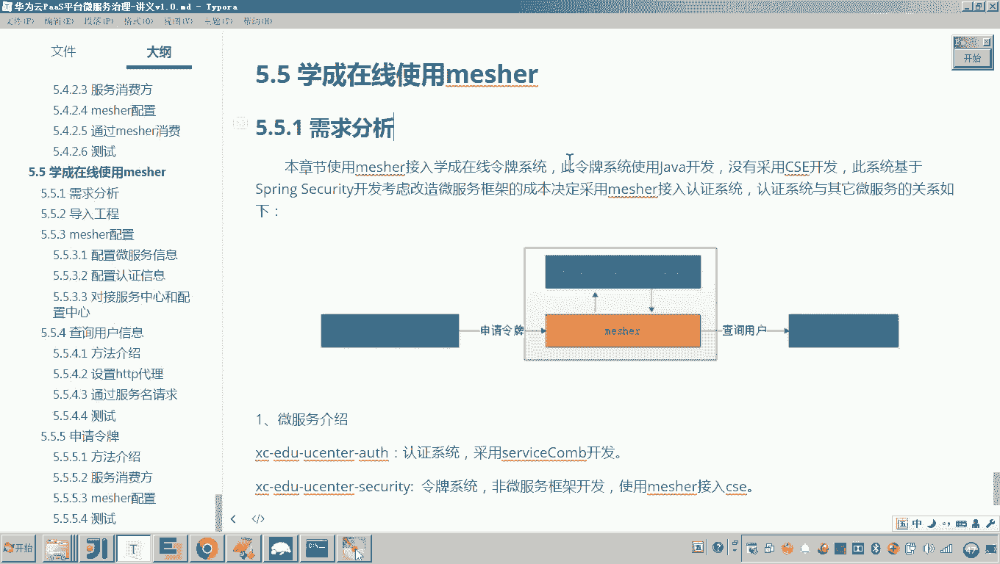

本节课中我们一起学习了“学成在线”项目使用Mesher改造旧系统的案例背景。我们分析了具体需求，明确了令牌系统需要同时作为服务提供方和消费方接入CSE。随后，我们成功导入了包含用户中心、认证系统和令牌系统在内的三个示例工程，为后续的实际改造操作打下了基础。下一节，我们将开始着手配置和部署Mesher，以实现令牌系统的微服务化接入。