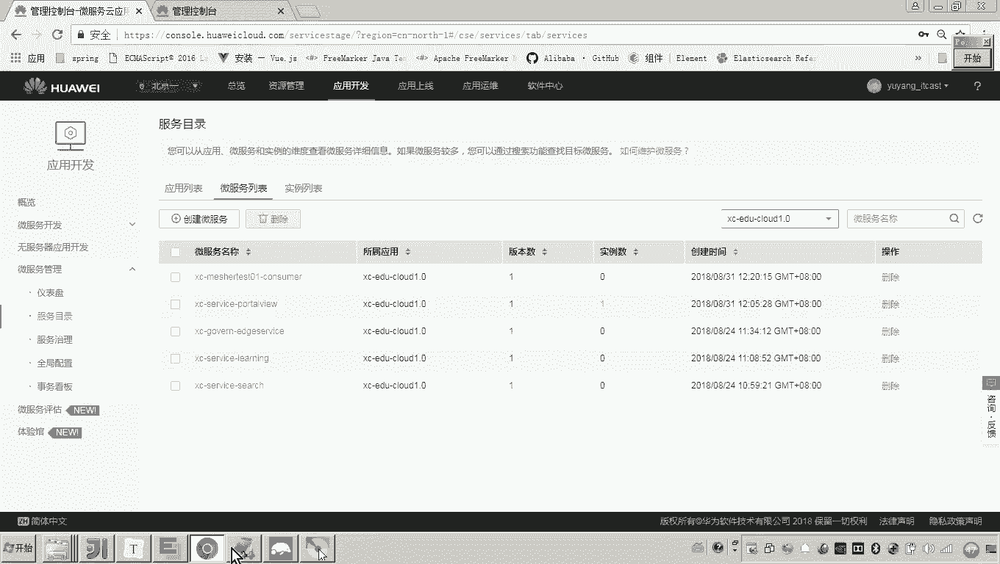
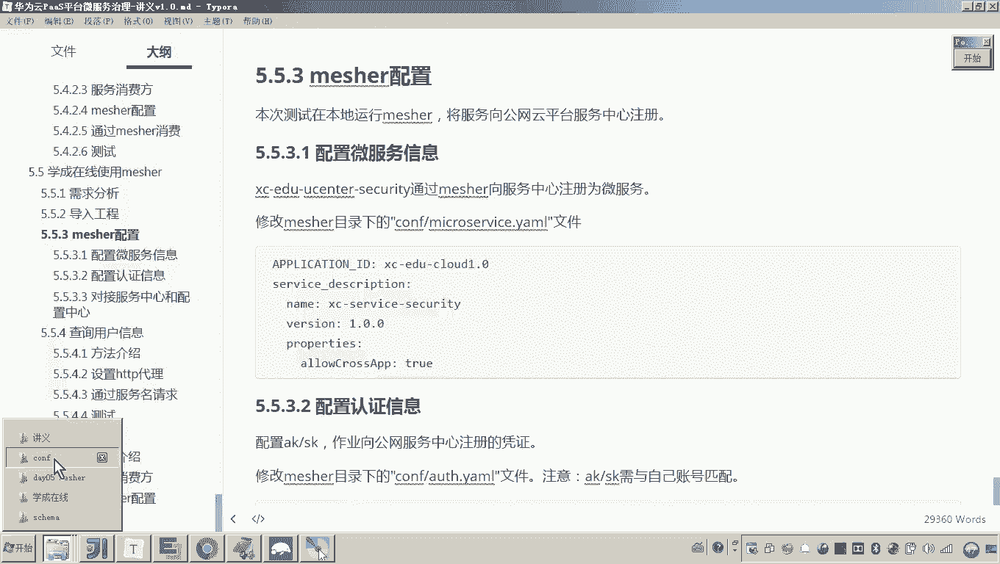
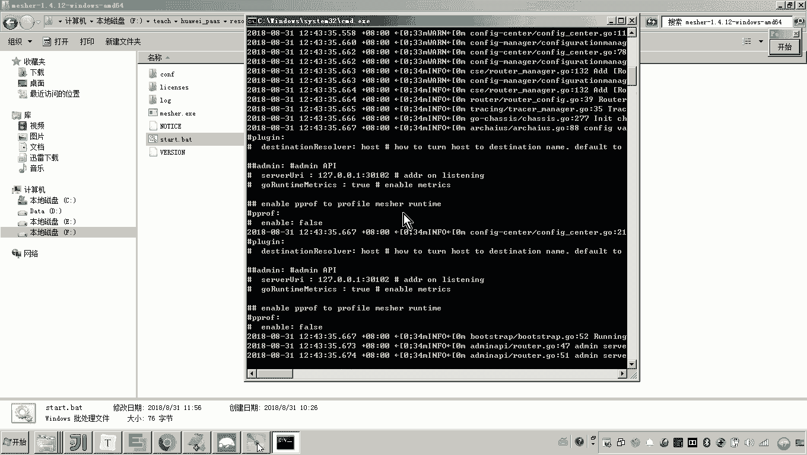
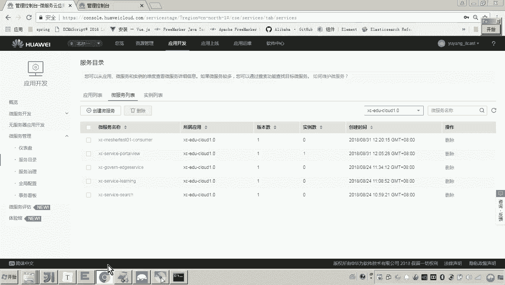
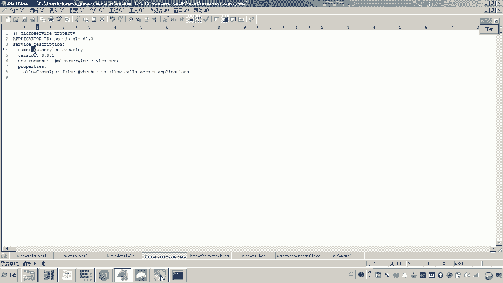
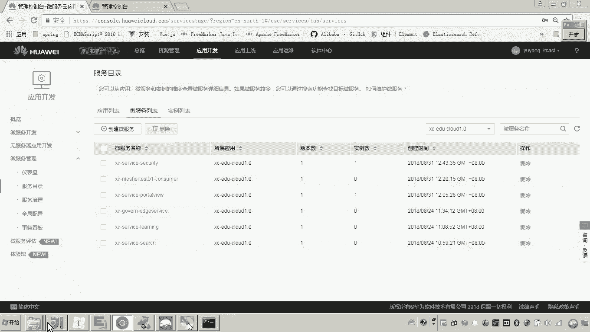
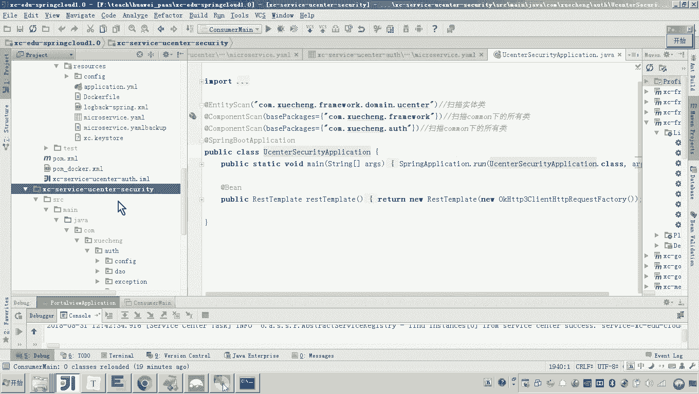
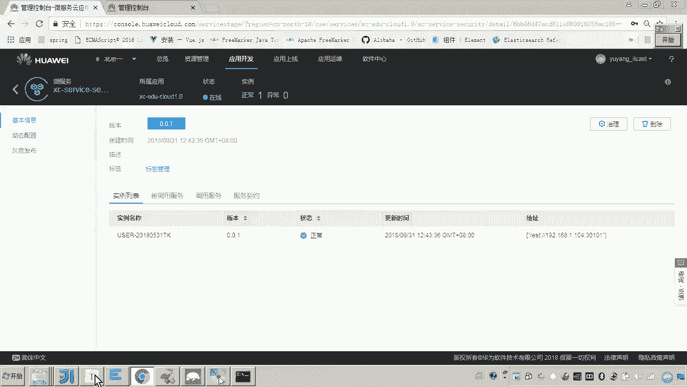
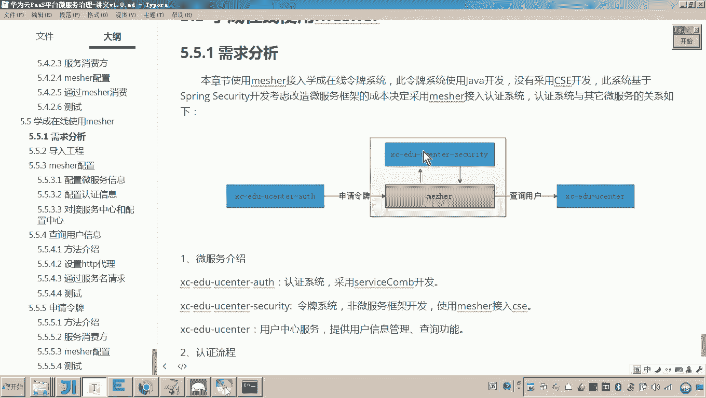

# 华为云PaaS微服务治理技术 - P155：15.学成在线使用mesher-mesher基本配置 - 开源之家 - BV1wm4y1M7m5

好，那下边呢我们就准备来呃使用measure呢来把这个令牌系统呢接入我们的这个微服务引擎中。好，那怎么做呢？首先我们说measure，我们先把measure的基本信息给它配置一下啊。好。

那这里边呢有几个基本的配置啊，通过刚才measure的研究呢，想必大家也都清楚。首先要配置这个这个微服务的信息，对吧？好呃，那这里边呢我们先把这个measure给它关掉啊。

这是我之前测试的这个measure。好，大家来看。😊，好，那这个这个这个这个measure呢，大家一定要注意啊，现在我这个测试是在本机测试是吧？呃，其实正常情况下。

这个这个measure呢会和这个我们的微服务呢都部署在这个容器当中哎，都部署在容器中。所以应该说每一个微服务。如果是我们需要通过measure接入微服务的。😊。

应该说每个微服啊都需要去部署一个meature的代理，懂吗？这个小方框就代表mecha的代理。那现在我去测试的话，因为我我这个本机只能跑一个measure啊。

因为这个measure是不是要代理这个代理对这个服务的请求是吧？所以我在本机测试的呃，正好刚刚刚刚好，我就这个measure呢只是负责代理刚才我们说的这个令牌系统，对吧？

如果现在我这个我这个机器我这个本机要跑多多个measure的话，那我就需要用到虚拟机了啊。所以现在我呢我暂时就用不到，我就只是用这个单机的这个measure就可以了啊，我说明一下啊。

因为因为回头我们要部署的话，是每一个呃每一个微服务都要对应一个measure进行部署。😊，好，那现在呢我们因为是测试嘛，所以现在呢我就用这一个meer就可以了。哎啊这里边我就开始配置了啊，先配置微服。

😊，配置这个微服务的话，这里边呢服务名字嗯，服务的名字我叫这个叫做X serviceice security啊，跟我这个讲义上保持一致就可以。😊，那我问你，我现在这个服务的名字是谁的名字？😊。

就就你你你现在回答我啊，看好啊看好啊，我这三个对勾，我现在配的这个名字是哪一个服务的名字？😊，嗯。各位mesure是不是代理这个令牌系统？要把这个令牌的系统的信息注册到这个服务注册中心呀。

所以我现在配置的这个我现在配置的这个微服务的名字，就是为令牌系统所配置的，懂吧？这就是令牌系统的微服务的名字。😊，哎，这是他所属的这个这个什么这个这个这个项目啊。

那这个这个名字是不是和我们刚才说的这个目录哎，这个服务目录对应的，在这是不是有一个？😊，看到了吧，哎，就他。

好，那现在呢我们继续来配置啊，我们一边配一边复习。因为因为这个配置太多了啊，所以大家呢一边配一边复习，你注意听。😊，好，首先再来配的话，就是配置这个AKSK这个认证的密钥了吧。这个密钥我就不再说了吧。

是不是要和你的这个什么账号保持一致就可以。嗯，这个已经配过了。刚才不不再不再管它了啊，还有就是对接服务中心和配置中心。😊，那这个做这个是不是也配过了？在我们说的这个cheese里头。😊。

包括这个监听的地址。和这个注册中心和配置中心，这两个事都都配过了。😊，所以这就是measure的配置就搞定了。现在measure的配置我搞定了之后。😊，注意。还有什么？😡。

那我现在就可以启动matature了吧。😡。

那好了，那我问你，我现在一旦启动miccha之后，我一旦启动麦cha之后，那我应该从哪看效果？在我的这个服务注册中心里面，是不是就多出了一个服务。

这个服务名是不是叫做XCservice security？😊。

对你刷新。有了吧。对吧，但是只是说这个服务它是meature，对吧？meature所代理的那个服务，我问你我启动了吗？😡。

是不是这里边并没有启动啊，对，所以你真正去访问micer，我告诉你，他是访问不通的。因为micel说代理这个服务现在还没有起来。😡。

明白吧？哎好，嗯，那现在呢我们就把这个matature的这个基本的配置呢就配置完成了。那接下来其实就是按照我们说的这个需求啊，一个是作为消费方，一个是作为提供方，我们把它完成。

那这个过程其实这个这个什么这个这个令牌系统，就通过matature呢就接入我们的这个CSE了。😊。

好。