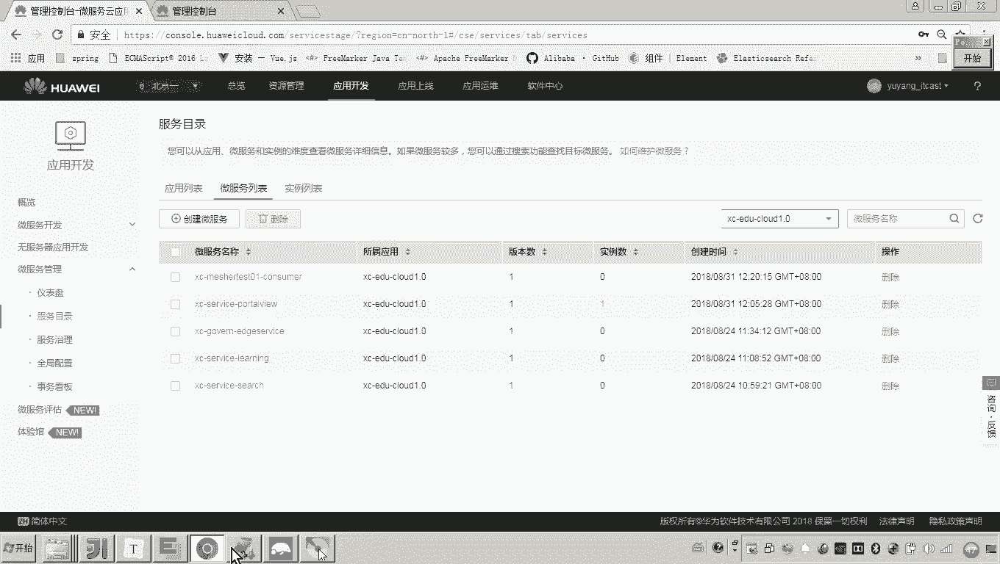
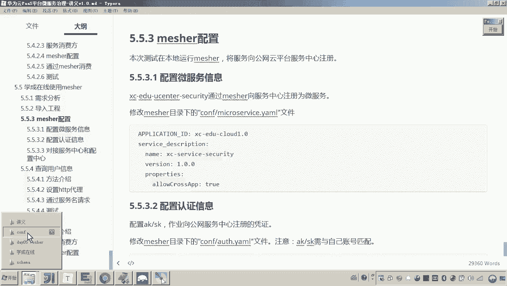
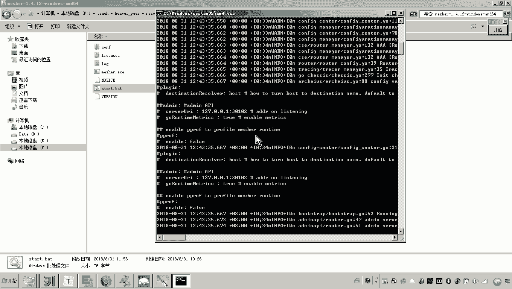
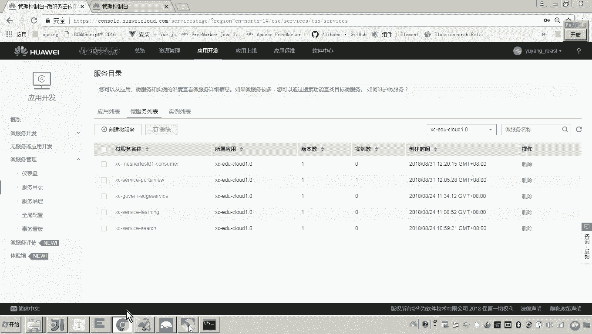
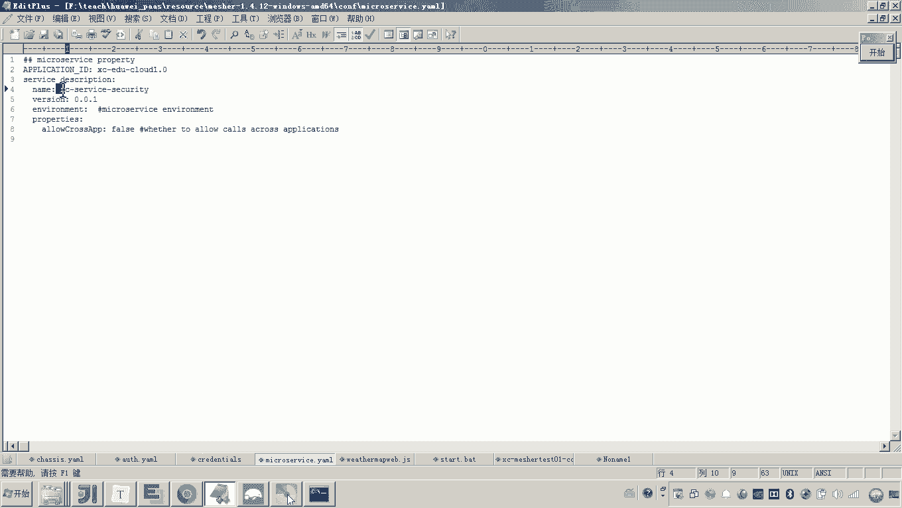
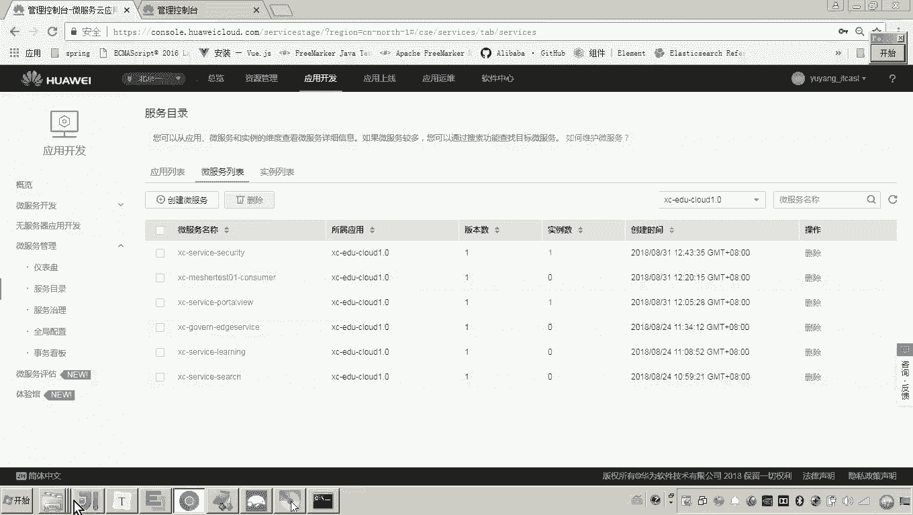
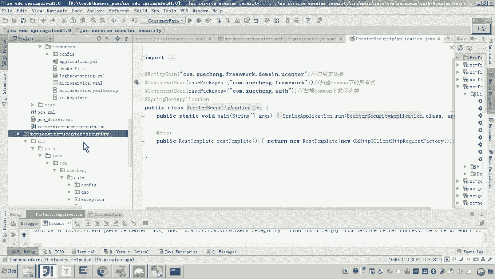
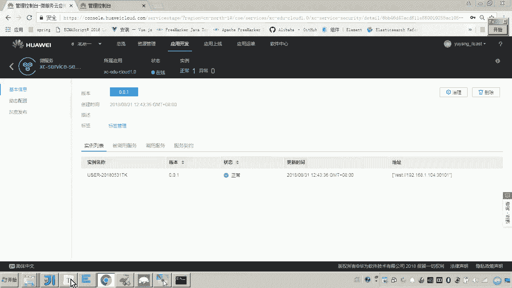
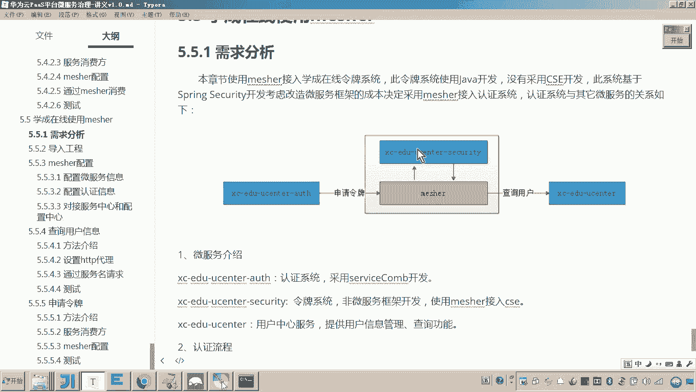

# 华为云PaaS微服务治理技术 - P155：15. 学成在线使用Mesher - Mesher基本配置 🛠️

在本节课程中，我们将学习如何将学成在线项目的令牌系统通过Mesher代理接入华为云微服务引擎。我们将从配置Mesher的基本信息开始，为后续将其作为服务提供方和消费方接入CSE做好准备。

## 概述

我们将使用Mesher代理令牌系统，并将其信息注册到服务注册中心。首先需要完成Mesher的基本配置，包括服务名称、认证密钥以及对接服务中心和配置中心。

## 配置Mesher基本信息

上一节我们介绍了Mesher的基本原理，本节中我们来看看如何为令牌系统配置Mesher。配置的核心是为Mesher指定它所代理的微服务信息。

以下是配置Mesher的几个关键步骤：



1.  **配置微服务名称**：此名称对应令牌系统在微服务引擎中的标识。根据讲义，我们将其命名为 `XCserviceSecurity`。这个名称需要与项目中的服务目录保持一致。
    ```yaml
    # 在Mesher配置文件中
    service:
      name: XCserviceSecurity
    ```

2.  **配置认证密钥（AK/SK）**：此密钥用于Mesher与华为云服务之间的身份认证，需要与您的云账号信息保持一致。此项配置通常已在之前的 `cheese` 配置中完成。

3.  **对接服务中心与配置中心**：需要配置Mesher监听的地址，并指定服务注册中心和配置中心的地址。这些配置同样已在之前的步骤中完成。



## 启动Mesher并验证





完成上述基本配置后，即可启动Mesher代理。



启动Mesher后，我们可以前往华为云微服务引擎的服务注册中心进行验证。如果配置正确，在服务列表中应该能看到一个名为 **`XCserviceSecurity`** 的新服务被注册上来。





**请注意**：此时Mesher代理的令牌系统服务本身尚未启动。因此，虽然服务已注册，但直接通过Mesher访问该服务的接口将是不可用的。这验证了Mesher作为独立代理，其注册行为与后端真实服务的状态是分离的。

## 总结





本节课中我们一起学习了为学成在线令牌系统配置Mesher代理的基本步骤。我们完成了服务名称、认证信息的配置，并成功启动Mesher，将服务信息注册到了CSE的服务注册中心。目前，`XCserviceSecurity` 服务已出现在注册中心，这为下一步将其作为服务提供方（接收请求）和消费方（发起请求）接入整个微服务网格奠定了基础。