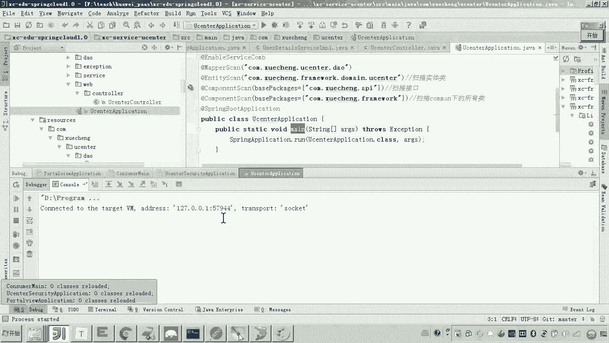
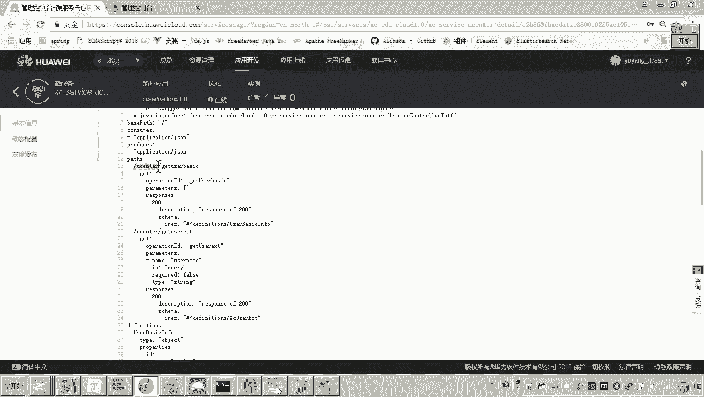
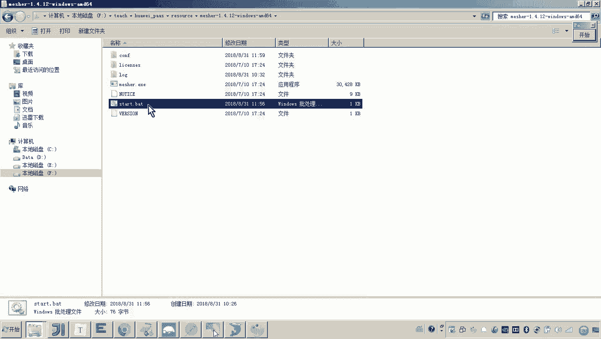
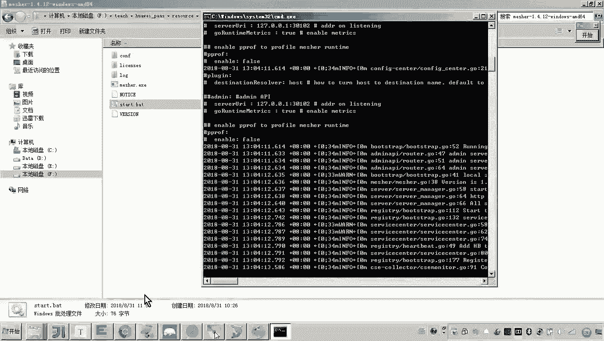
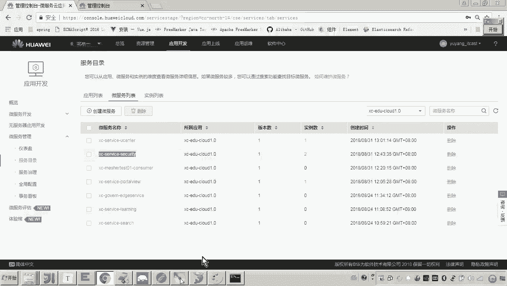
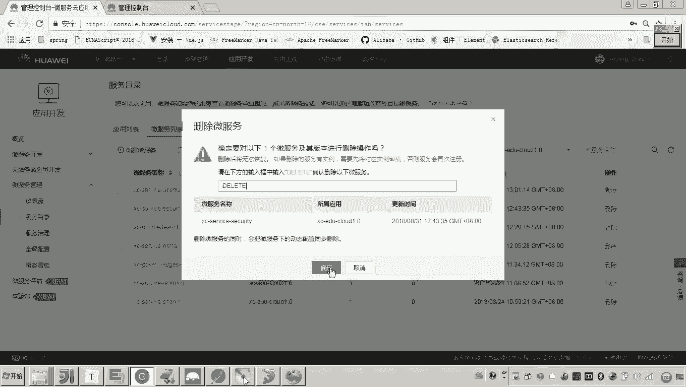
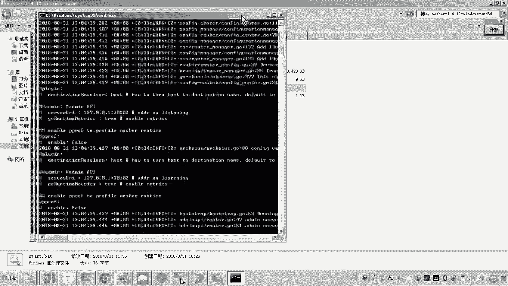
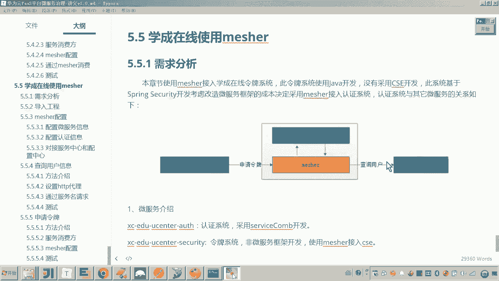

# 华为云PaaS微服务治理技术 - P156：16.学成在线使用mesher-mesher作为消费方查询用户信息 - 开源之家 - BV1wm4y1M7m5

好，那么下边呢，我们就分成两个部分啊来。来把使用这个measure呢来接入我们的这个令牌系统。好，那两哪两个部分呢？大家来看一下需求分析，我们是不是说了啊。

首先micer作为服务的消费方来查询我们的用户中心。😊，其次呢，measure作为服务的这个提供方来供我们的认证系统呢去请求，对吧？好，那现在呢我们其实就通过这两个方面呢来呃来实现就可以了。

首先我们先实现呃meer作为服务的消费方来查询用户。好。那么先看一下，因为这个代码呢，当初大家没有接触过，我先介绍一下啊，就这个查询用户啊，令牌系统查询用户在哪里用到的呢？大家来看啊。

我们打开令牌系统嗯。😊，那这个令牌系统是基于spring security这个框架啊，那这个令呃这个这个ring security的具体的这个用法呢，在这个学生在线项目当中有详细的讲解。

在这里呢呃我就不再去详细说然后呢这里边我只把流程告诉大家就可以了。首先呢我们说这个ring security在这个学生在线里边它是呃这个结合os oos to协议以及GWT啊。

然后实现了这么一个令牌的啊发放和令牌的销毁啊，这个这个功能。所以这里边呢呃我们先看这个令牌的这个申请啊，令牌的申请这里头它是怎么做的呢？啊，这里边有一个叫user service啊。

那这个user detail service它呢就是当去申请啊，基于os to协议来申请令牌的时候呢，ring security会调用这个啊会调用这个类。😊，调用这个类的这个方法来查询用户。

大家可以看到。原始的代码，各位原始的代码，这里面是不是它直接查询数据库啊，那你也知道这个本身这个用户管理的这个功能就在用户啊在在在这个us centerer这个服务里边存在了。

所以你如果是这里边让他直接查询数据库的话，这个代码就非常冗余，哎，不利于日后我们的维护说是吧？所以这里边呢我们应该怎么做呢？我们应该把它给呃屏蔽掉。我们要把这个呃查询数据库。

通过service查询数据库的这代码改成远程调用微服务来获取用户信息。😊，大概知道这意思了吧。所以这里边这一步就是什么查询用户查询用户我们要呃将啊查询。

将查询数据库的这种方式改为啊调用微服务来获取用户信息。而这这一点呢正是我们要啊我们要实现的。因为本身这个服务是一个普通的服务，不具备微服务能力。我们要借助于measure，让他调用微服务。😊，对吧？好。

那现在这样弄啊，咱们先把这个接口给大家演示一下，看看它这个能不能被调到。哎，能不能去正常的去申请这个什么这个这个这个令牌啊。好，那这个spring secret呃，这里边是基于这个什么呀。

这个Oos啊Oos to协议啊。所以这里边呢注意看啊，我先怎么请求啊。😊，看他的端口。它的端口是不是叫40401啊，这是这是这个令牌系统。好，你在这儿写。😊，然后他这里边后面还是怎么写呢？

后边叫做Oos，然后呢token。好，这个请求是post。这里面首先它是基于HTTP basicsic哎这个认证方式啊认证方式。然后呢，呃这个user name这个user name呃，当初大家在呃。

😊，学习这个学生在线的时候，应该是建立了这个什么us着的这个数据库啊。这个用户的数据库里边在这儿啊，就有这个什么就有这个注意看啊。😊，有这个XC webAPP这个cl的这个这个信息。

所以这个信息一定要和数据库里边的这个啊信息保持一致。😊，好，那现在呢还有一个请求，就是说现在你是要请求这个user name password。另外Oos to协议，我们是不是还要有一个叫什么呢？😊。

Ground type， ground type。然后ground type的话呃是什么呀？😊，叫做。pass word基于这个密码的方式进行什么进行请求，对吧？g roundg啊，这写错了啊。

g type。然后呢，那现在呢我要去呃加一个断点吧。😊，我在这儿，我刚才是不是说了，一旦请请求申请令牌，这个他是不是会请求这个类啊？😊，啊，所以这里边呢我们点好，大家可以看到是不是到这里了。😊，对吧。

然后到这里现在这一步的话，各位他是不是走的数据库直接把这个用户查到了，看到了吗？所以你让他放行。好，这里边你可以看到他是不是把令牌都申请到了。这个令牌是不是就基于GWT的这个令牌方式啊？😊。

这个具体的这个呃认证这一块的这个课程内容啊，大家如果就是感兴趣的话，可以去详细的学习一下学生在线的这个项目啊。那这里呢我就不再详细的去说GWT以及O two协议的一些详细内容了。好。

那到这儿其实这个这个接口应该我已经测通了。这是不是就是一个申请令牌的接口，对吧？而现在我要做的事呢，我要准备在这里做手术了。我要把它给干嘛干掉。😊，看懂吧？然后这里边我是不是要改成这个什么呃，使用这个。

😊，调用微服务的方式，调用微服务的方式，对吧？那怎么调用呢？😊，怎么调用啊？他是不是就开始通过matature？来调用微服了。因为当前的这个服务，它是一个普通的服务，不具备微服务能力是吧？

它如果通过外me来代再来来调用的话，其实就是通过什么？通过这个代理的方式来调用，对不对？😡，通过代理的方式是怎么去调用呢？呃，那应该是通过代理。通过设置代理。啊，然后呢。

通过设试代理这个代理的地址大家还有印象吗？代理的地址是不是就是。😊，麦下的地址呀嗯。通过诉人代代理来调用微辅。是这样一个过程吧。好了，那现在呢我们来看怎么做吧。😊，设置代理的话。

首先我们是不是要设置HTTP的代理啊？😊，设置HTTP的代理。首先我们是不是要定义一个res template对吧？然后在这个定义re rest template的时候，注意看这啊。😊。

定义re time play的时候，各位这是不是就是本地的这个measure的这个代理啊？😊，啊，然后呢，这里边啊我写好了之后呢，在这儿我是不是就可以把这个呃retlate给它注进来？😊，没错吧。好。

然后呢在这个right time plate这，我们是不是就可以。😊，呃，在这儿。我们去调用他。怎么调用？你是不是可以。怎么写呀？定1个URL吧。😡，那UIL的话，它这个是不是HTTP冒号杠杠。

然后这儿是不是就开始写服务了，是不是啊服务。那这个服务名啊，你要你要请求哪个服务啊？😊，你是不是要请求这个us centerer呀？所以他这个服务名将来这个服务名是不是会注册到服务中心呀？

所以你把这个服务名复制过来，贴到这儿。😊，看懂吗？那你要请求us centerer的哪一个地址呢？😡，那你得找这个服务了，因为这个这个代码都不是大家写的，所以这个这个代码大家需要找啊。

看好这里面是不是有一个叫做呃叫做什么呢？叫做get user EXT看见了吗？😊，所以这里边呢我们就可以直接get usererEXT嗯，然后还有啥呀？😊，他是不是还有一个叫做你看传一个账号，看见了吗？

这个账号我可以让他哎这么传过去。😊，然后把这个user name呢贴到这儿。那这个URL我是不是就写好了，看见吗？那后接下来还要写什么呀？😊，是不是就是你的这个请求的方式？嗯，叫做什么样get请求。

然后还有什么？还有的话，这里边是不是就开始去写这个呃，你请求的这个内容了，是吧？😊，那这个内容的话，如果你没有的话，你就可以写写成not。哎，那最终返回的就返回一个object。😊，Clus。哎，别姐。

第二class各位，最后我拿到这个请求的这个请求内容，反响应的内容，这是不是就成了？😊，这个body是不是就是改造后哎来请求这个用户中心系统来得到这个信息呀？得到完这个信息之后呢。

我是不是要把它给转成怎么样？😡，各位。我是不是可以完，因为它返回的是一个什么是一个阶证数据吧，我是不是可以把它返转成这个。😊，转成这个map呀。没问题吧，所以这里边呢我们就把它转成转成什么。

转成map吧，叫做呃。😊，有的。map。包的。啊，一会儿我们先在调一下啊，先大概写一下，可以吧。嗯，那这个这个。😊，这样是不是得先定义出来，它等于空。好，我们就先写到这儿。我们先看这个转成了map。

这个这个这个map有值没有？😡，好了，那现在呃，我来看一下啊。😊，还有哪里报错？啊，这个也就错啊。好，把这个改一下。好，那大家来看啊。

那现在我要想我要想去调用这个uscenter这个注册中心这个用用户管理，我是不是先把它起起来呀？起起来之后，它必须得向我们的这个服务注册中心注册成功吧，你才能调，对不对？你先把它起起来。😊。

提起来之后呢，我们就可以来观察这个。服务目录里面有没有这个优er？😡，没错吧。啊，还没有记来啊。好，有了。你看这UC那是不是就有了，然后你点开你看它的服务契约其实都是刚才我们诶好像有问题。😊。

你看你看服务器约都能看出来杠，然后这里边是不是有一个叫usenter？😡。

get user看见了吧？所以你看这个契约呢，你就可以。因为你这这不是有一个前缀嘛，是吧？其实我们刚才没有看出来，在我们契月里头就可以看出来。7月看出来的话，我再去调用的话，这里边你就应该这么写了。😊。

叫杠user杠。懂了吧？这根据契约去写。好，那现在我们说那这个优势那就写好了呀。然后呢，我们就可以把这个什么呀scurity再重启一下。😊，security是不是就是一个消费方呀？

因为我们现在做的是不是就是measure作为消费方，然后呢去调用这个usenter啊。😊，那来看一下他能不能正常的去调用呢。呃，我先在我在这打断你啊。😊，然后还是刚才那个来走。是不就进来了吧。😊。

那我们往下往下走一步。好，这一步是不是就开始往下掉了？😊，好，调用。那这时候大家可以看到咦好像有问题。你看。对吧啊，这个这个应该就有问题了。这明显的就是没有没有调到嘛，对不对？嗯，好，让他走弯啊。

我们来看一下。😊，有没有一个错嗯有没有一个错误？那大家发现现在它是空，对吧？它是空的话，大家想一下这是什么原因呢？😊，因为这一步的话，首先你你是不是要调用这个这个这个服务啊？

因为你这个res time plate本身我是不是加了代理的，你这个代理是不是要通过这个mesure来调用？😡，对吧哎，通过卖手来调用。所以现在你你要调用的话，你是不是需要怎么做？😡。

是不是要把这个麦sure给他提起来？😡，是不是啊把麦票给他提起来。😊。

好。那麦克骑起来之后呢。😡。

那我们说他是不是就可以来注意看啊，我们先看一下这个服务目录里头有没有这个实例啊，看一下。😊，啊，这个有个叫X serviceice security，这个是不是已经注册成功了，对吧？😊。

他说要我再我再注册一下。把它先删了。

好，然后呢再启动启动麦手。

嗯，好，那也也就是说现在呢我的目的其实很明确，就这一步就是要通过代理这个rest template。在这里rest template已经把这个代理这个me的地址写进去了。所以现在这个请求啊。

这个请求就是要通过代理的方式来做。😊，这一步是不是就是通过代理来请求了是吧？好，我们再来看一下啊。😊，那首先这里边呢，首先是请求到这里。对吧然后呢，然后在这里我们执行，这是1个UIL吧。

然后往下这一步应该就是该走代理了吧。😊，对吧这一步该走代理了，而这一步去走代理的话。😡，那这个UIL是是叫ITcast是吧？走代理的话，它会请求到哪里呀？😊，他肯定会请及到这个服务的这个调用方嘛。

你在这打一段呢。😊，这没问题吧，因为正常情况下，他就会调用到这儿了。😡，你看是不是就到这儿了，那到这儿之后呢，往下走一步。😊，你看哦，原来我知道了，就是这个远程调用是没有问题的，远程调用没问题。

只是到这个uscenter这儿，你没有调用到，你看它是个空。😡，看懂我是啥意思吧？所以其实maature其实maature本身这个代理的功能已经OK的。😡。

那只是这个us centerer这里边他没有去把这个用户呢呃查询出来。因为这个这个优C呢是我导进来的工程，我们是需要去看一下它哪里是不是就配错了，或者怎么回事，对吧？😊，那我们现在来看一下，就是这个呃。

他要请求的这个us centerer。那个刚才我们测试一下，他是不是us centerer本身这个数据就没有查到，对吧？那现在我们再来测试一下啊，看好啊，来再走。

所以首先我们这一步这一这一这首先它是要请求的URL，大家来看一下它是不是现在URL我们来看这是不是就拼好了，对吧？哎，注意啊，这里边有点问题啊，大家可以看到这个URL拼接的这儿这儿应该是错了。

这是不是少了一个什么呀，是不等号啊？😊，对，好，那这里边呢我们把它更改一下。😊，再启动一下。然后现在呢我们说刚才我们测试的这个呃user是不是没有把用户查出来呀？好，我们现在再测一遍，走这个流程啊。

好走。😊，然后进来之后，我们先看哦，先一步一步跟踪啊，就是这个UIL好，这个是对对的吧。然后接下来再走一步，是不是到这儿了？然后这个ULU的内部是不是就有了，然后接下来再走。😊。

这个数据是不是就查到了啊，刚才应该是username没有传进来，对吧？然后再往下走。好，这样的话我们说到这儿各位他这个map的数据是不是就拿到了这mm数据里边有多少啊？各位可以看一下。😊，嗯。

这里面是不是有有什么，是不是有这几项？😊，看见吧？好了，那么那么这里边呢，这就是用户的什么信息了吧。这个用户的信息的话，我们已经拿到了。那接下来我们要做的事是什么呢？就是要把这些信息。

要把这些信息放到这个里头。😊，是这个吧？哎要放到这里头，那怎么做呢？因为这个里边就涉及到一些业务的东西了。所以这个只要刚才这一步大家听懂了，就是啊需要把这个数据已经拿过来了。下边呢大家啊就。😊。

看一下了解一下就可以了啊。然后这里边我们来看啊，他就是呃。😊，首先呢这里边我是不是要定义一个6一个新的对象吧。嗯，然后这里边呢我就开始去。这样如果拿过来的数据是空的话，就返回一个空，说明没有查到数据。

好，那这里边我就开始给它往里边放了啊，放了，比如说放name幕呃放name幕。还还放什么呀？啊，所以大家直接来打开讲义，我们看一下有没有相关代码。如果有的话，我们直接拿过来看一下放ID放name。

放密码。嗯，因为这些是涉及到一些业务的一些数据了。所以因为大家如果没有做过这个学生在线开发的话，对这些字段可能也不太了解啊。所以这里边呢我就。😊，呃，直接把这个代码拿过来。嗯。好。

那这个这个这个这个这个map的话，这里边也有一些问题啊。这个map的话呃，我这里边呢用用这有一个范型的，把它省了，我就去每次都转。😊，好，这样的话，我是不是把这个map的里边的数据就拿到了。

放到这个对象了，看懂了吗？然后拿到这个通拿到这个里头，各位我是不是把原来的这个调用数据库的这个代码就更改为这一段，这一段是不是就是我们说的远程。😊，调用微服务是不是通过mecha来代理调用微服务？

然后这样的话，我们是不是就拿到了这个。这些信息啊，拿后到这些信息这里面呢这里面加一个判断啊。😊，啊，如果说因为这个信息我应该是都拿到了，但是我这儿只是写了几个简单的啊，没有拿全呃呃。

我们的目的其实还是去通过me调用这一步已经测试过了啊，只要这一步测试通的话，那好，这里边呢我们其他的我们代码呢就简单写一下。那大家了解一下就可以了。好，那现在呢我们是不是就做完了吧，这个做完了话。

我们就把这个嗯令牌系统重新启动一下。😊，令排系统呢是一个普通的系统，它要通过meser来调用我们的微服务。哎，那刚才我们测试这个body这个数据是不是已经拿到了？好，然后呢我们再来。好。

然后呢我们再走完。那这个数据大家可以看到是不是可以正常了。所以现在的话各位现在我们做的这个工作其实就是呃使用measure啊，使用measure。然后呢。

这个令牌系统借助measure来调用外部的微服务。那刚才我们是不是就实现了这个过程啊，如果你要想测试，我们说这个正常情况下我们已经测通。想测异常情况下的话，那么你可以把这个measure给它关闭啊。

也可以把这个什么呢？这个微服务呢给它关闭。那这个调用的这个过程呢应该是不同的。😊，好，那么以上呢我们说啊mesure作为这个服务的消费方去调用用户中心查询用户信息的这个功能啊，我们就已经实现了。啊。

那其实大家呢我我给大家说一下，大家在听这个学生在线啊，这种案例的时候呢，如果对于学过学生在线的同学呢，他可能对我刚才说的那些业务呢比较理解啊。如果没有学过的话。

各位把重点放在这个技术层面就是现在我要做的这个工作，就是这个令牌系统来请求这个用户中心啊，你的你的这个关注点在哪呢？就是看啊他如何去啊远程调用啊，如何配我们matature如何配matature之后呢。

如何去远程调用我们的微服务，这整个实现的过程，你需要去关注好。😊。

