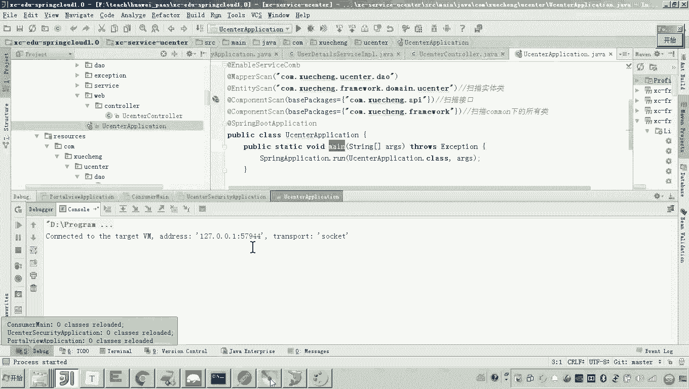
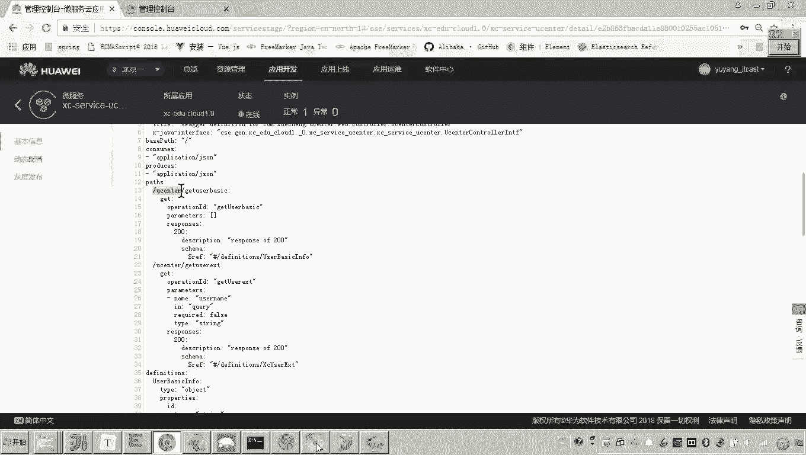
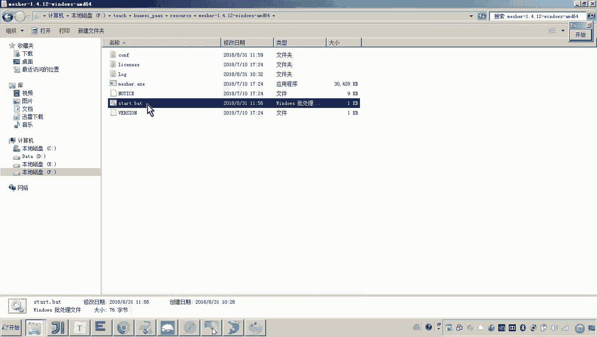
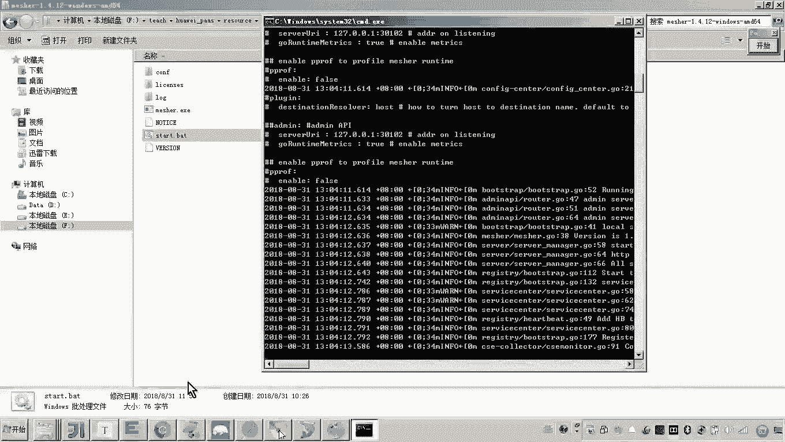
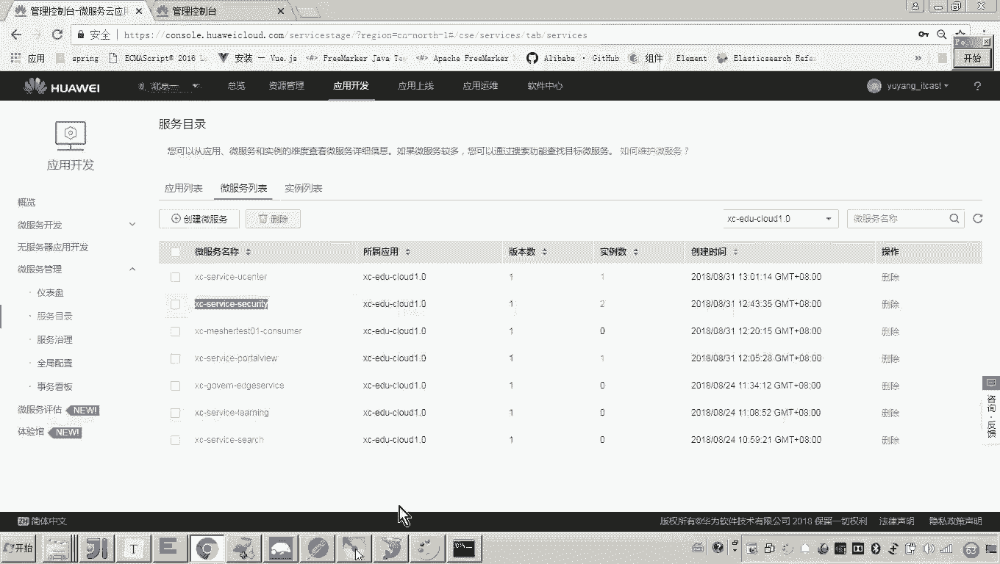
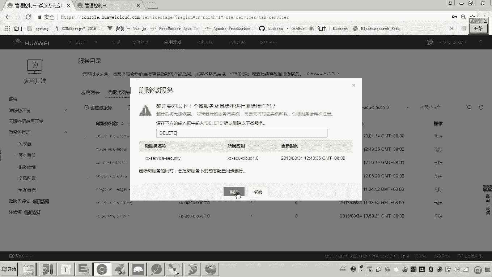
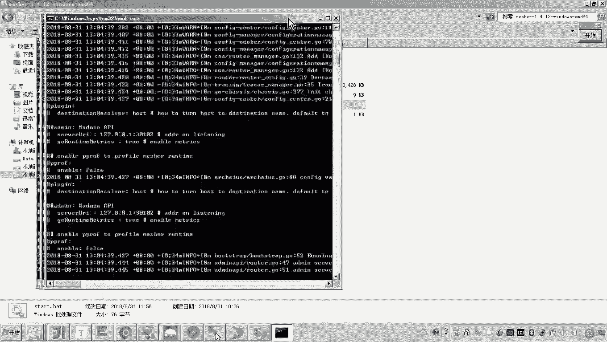
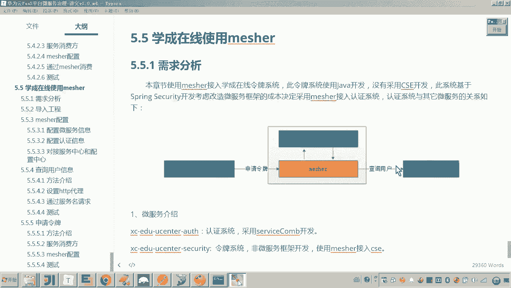

# 华为云PaaS微服务治理技术 - P156：16. 学成在线使用Mesher作为消费方查询用户信息 🚀

在本节课中，我们将学习如何将一个普通的Spring Boot应用（令牌系统）通过Mesher接入微服务架构，使其能够作为服务消费方，远程调用用户中心微服务来查询用户信息。我们将重点关注技术实现过程，而非具体的业务逻辑。

---

## 概述

我们的目标是改造“学成在线”项目中的令牌系统。该系统原本直接查询数据库来验证用户，现在需要将其改为通过远程调用“用户中心”微服务来获取用户信息。由于令牌系统本身不具备微服务能力，我们将借助Mesher作为代理来实现这一目标。

上一节我们介绍了Mesher的基本概念和部署，本节中我们来看看如何将其应用于实际的消费方场景。

---

## 需求分析

本次改造主要分为两个部分：
1.  **Mesher作为服务消费方**：令牌系统通过Mesher调用用户中心服务。
2.  *（下一节内容）Mesher作为服务提供方*：供认证系统调用。

本节我们专注于实现第一部分。

---

## 代码定位与流程说明

首先，我们需要找到令牌系统中查询用户的核心代码位置。

在基于Spring Security和OAuth2协议的令牌系统中，申请令牌时会调用一个名为 `UserDetailService` 的类来查询用户。原始代码如下所示，它直接通过Service层查询本地数据库：

```java
// 原始代码：直接查询数据库
UserDetails userDetails = userService.loadUserByUsername(username);
```

这种做法存在代码冗余和维护困难的问题，因为用户管理功能本已存在于独立的“用户中心”微服务中。因此，我们的改造目标很明确：

**将查询数据库的方式，改为调用微服务来获取用户信息。**

---

## 实现步骤

以下是实现令牌系统通过Mesher调用微服务的具体步骤。



### 1. 设置HTTP代理



由于当前服务是普通应用，需要通过设置HTTP代理，将请求转发给Mesher，由Mesher代为调用目标微服务。

我们需要在代码中配置一个使用代理的 `RestTemplate` Bean。关键配置如下，其中代理地址指向本地运行的Mesher实例（默认端口为`8081`）：

```java
@Bean
public RestTemplate restTemplate() {
    // 创建SimpleClientHttpRequestFactory
    SimpleClientHttpRequestFactory requestFactory = new SimpleClientHttpRequestFactory();
    // 设置代理服务器地址和端口（Mesher默认运行在8081端口）
    Proxy proxy = new Proxy(Proxy.Type.HTTP, new InetSocketAddress("localhost", 8081));
    requestFactory.setProxy(proxy);
    // 使用配置了代理的RequestFactory创建RestTemplate
    return new RestTemplate(requestFactory);
}
```

配置完成后，在需要远程调用的Service中注入这个 `RestTemplate`。



### 2. 构造微服务调用请求



接下来，我们使用配置了代理的 `RestTemplate` 来构造对“用户中心”微服务的调用。







我们需要确定以下信息：
*   **服务名**：目标微服务在服务中心注册的名称，例如 `user-center`。
*   **接口路径**：要调用的具体API路径。可以通过服务中心的服务契约查看，例如 `/user/getUserExt`。
*   **请求参数**：接口所需的参数，例如用户名 `username`。

构造请求的示例代码如下：

```java
// 注入配置了代理的RestTemplate
@Autowired
private RestTemplate restTemplate;

public UserDetails loadUserByUsername(String username) throws UsernameNotFoundException {
    // 1. 构造请求URL
    // 格式：http://{服务名}/{接口路径}?{参数名}={参数值}
    String url = "http://user-center/user/getUserExt?account=" + username;
    
    // 2. 发起GET请求
    // 使用restTemplate.exchange方法，指定HTTP方法、URL、请求体、响应类型等
    ResponseEntity<Map> response = restTemplate.exchange(
            url,
            HttpMethod.GET,
            null, // GET请求通常没有请求体，所以为null
            Map.class
    );
    
    // 3. 获取响应体
    Map<String, Object> body = response.getBody();
    
    // 4. 后续处理：将Map数据转换为业务所需的UserDetails对象
    // ... (业务逻辑转换)
}
```

### 3. 启动依赖服务并测试

在运行改造后的令牌系统前，必须确保以下服务已正常启动：
1.  **用户中心微服务**：确保其已启动并向服务中心成功注册。
2.  **Mesher代理**：在令牌系统所在机器上启动Mesher。

启动后，可以在服务中心的控制台查看服务注册情况，确认 `user-center` 和 `xc-service-security`（令牌系统通过Mesher注册的服务名）均在线。

然后，通过API工具（如Postman）模拟令牌申请请求，触发代码执行。在 `loadUserByUsername` 方法中设置断点，可以观察到请求是否通过代理发出，并成功获取到用户中心返回的数据。

### 4. 数据处理与替换

成功接收到用户中心返回的JSON数据（通常被转换为`Map`）后，需要将其中的字段（如用户ID、用户名、密码等）提取出来，并构建成Spring Security框架所需的 `UserDetails` 对象，以替换原有的数据库查询结果。

此部分属于业务逻辑适配，核心在于确认远程调用的数据格式与本地业务对象字段的映射关系。

---

## 核心要点总结

本节课中我们一起学习了如何将普通Spring Boot应用改造为微服务消费方，关键点如下：

1.  **代理配置**：通过自定义 `RestTemplate` 并设置HTTP代理（指向Mesher），使应用的出站请求被Mesher接管。
2.  **服务发现**：在发起远程调用时，URL中的主机部分使用**目标微服务在服务中心注册的服务名**，而非具体的IP和端口。Mesher负责根据服务名进行寻址和负载均衡。
3.  **调用方式**：使用配置好的 `RestTemplate` 发起HTTP请求，其调用方式与调用普通HTTP接口一致，但实际流量经由Mesher转发。
4.  **依赖服务**：必须确保Mesher代理和目标微服务实例均正常运行并注册到服务中心，调用才能成功。



通过以上步骤，我们成功让一个不具备微服务能力的令牌系统，借助Mesher融入了微服务架构，实现了对“用户中心”服务的透明化远程调用。下一节，我们将继续探索Mesher作为服务提供方的应用场景。