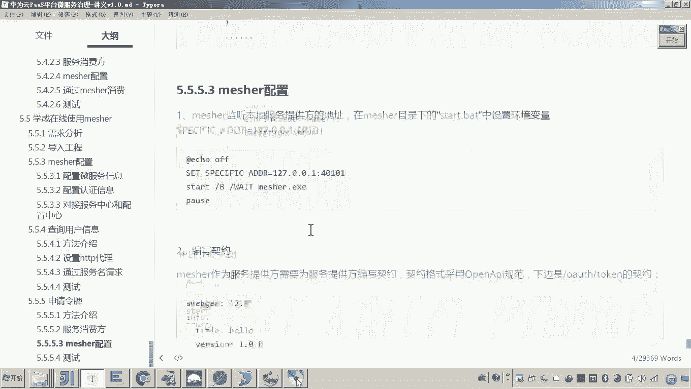
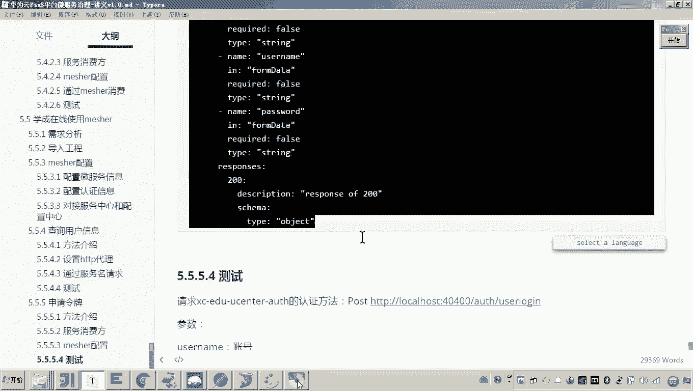
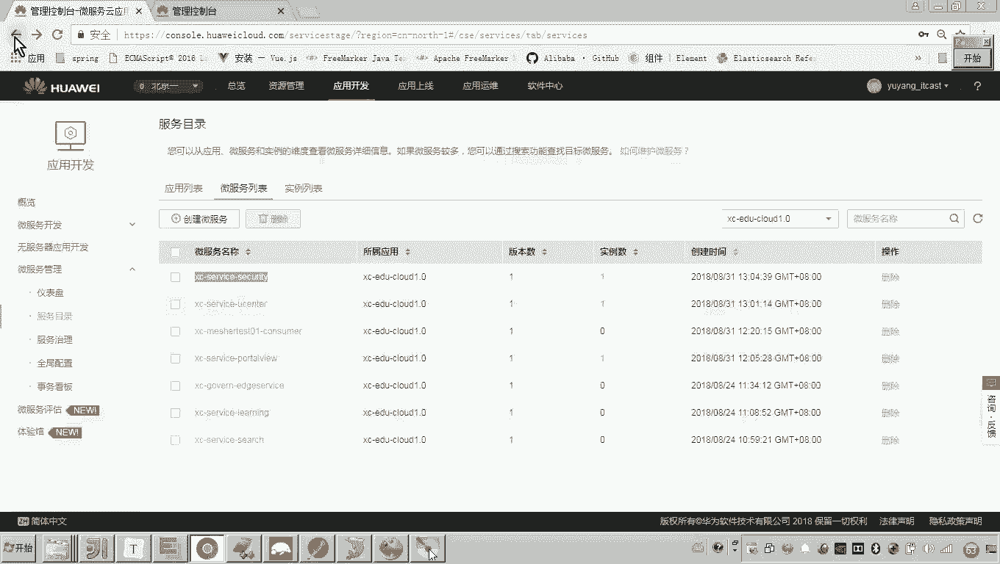
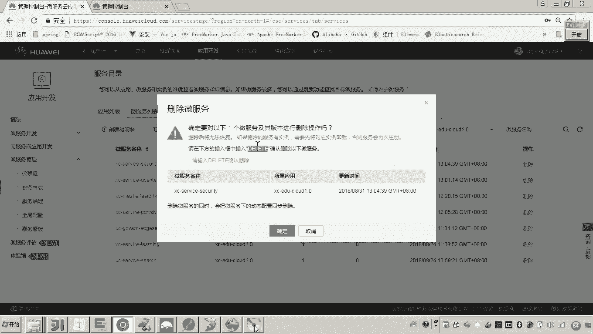
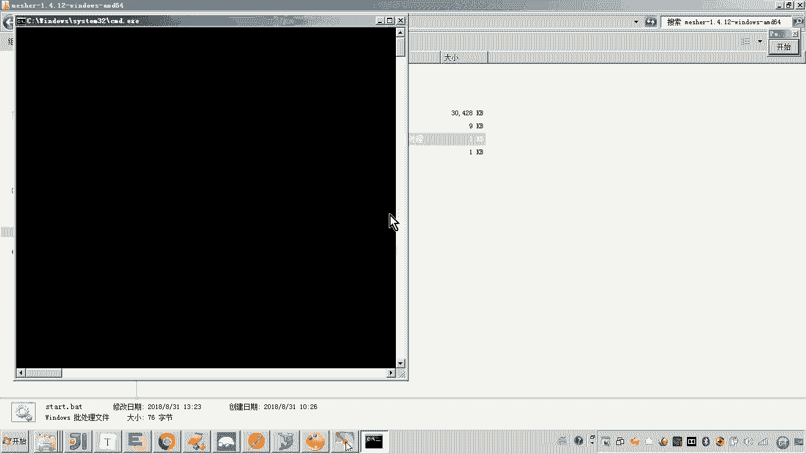
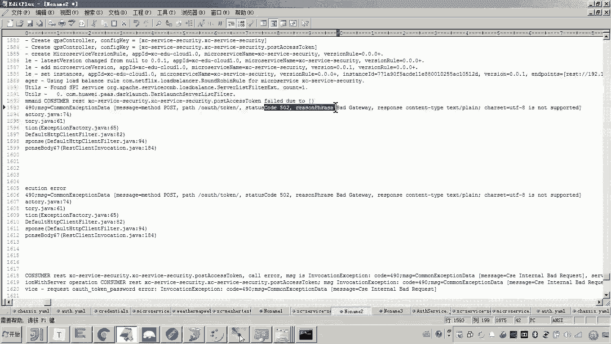
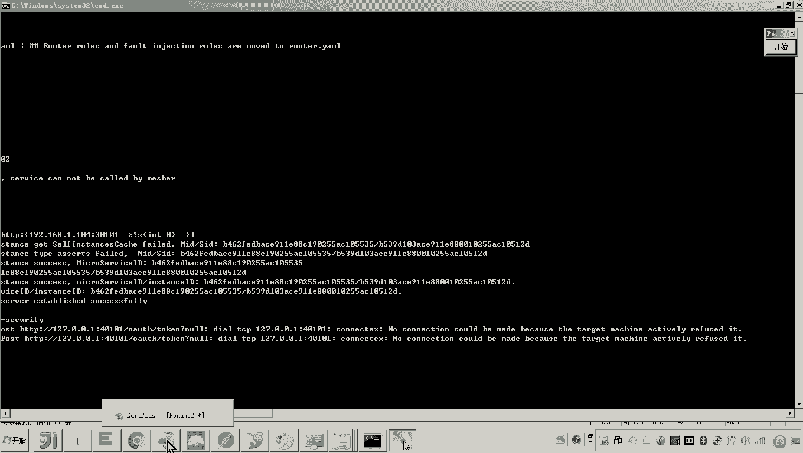
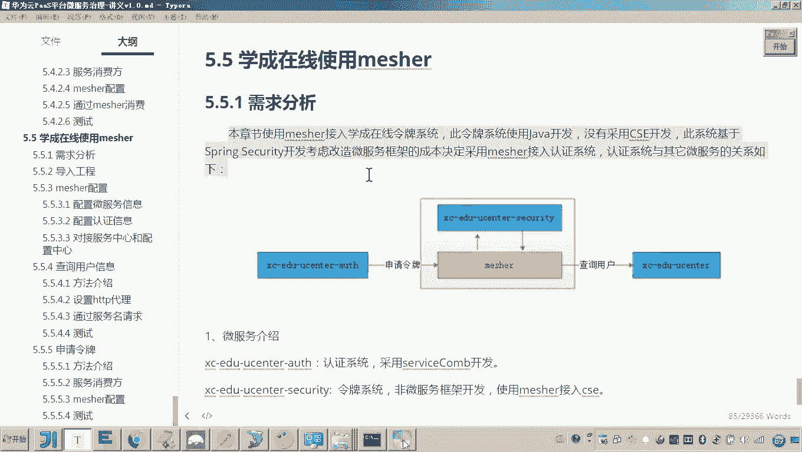

# 华为云PaaS微服务治理技术 - P157：17.学成在线使用mesher-mesher作为提供方供微服务调用 - 开源之家 - BV1wm4y1M7m5

好，那么下边呢我们再来做呃最后一个功能，就是说这个meser呢作为服务提供方来供其他的微服务调用它申请令牌。好，其实就是这个图当中的是哪一部啊，就是这部分。me呢作为这个服务提供方。

是不是要供这个认证系统去请求他来调用这个申请令牌量？好，那首先呢我们来看啊，这里边我们要做几个工作啊。首先呢我们要让这个认证系统呢去调用微服务，我们请求这个地址。啊。

认证系统大家看拿到认证系统在这儿这个认证系统呢，这个代码呢我们简单来看一下啊，它其实这里边有一个什么呢？有一个认证的。😊，哦，这里边报错了啊，来把这个稍微改一下。有一个认证的这个接口啊。

这个接口其实你可以理理解为是不是就是一个登录接口，对吧？好，那这个登录接口大家来看啊，这个登录接口。😊，啊。这里边他要请求申请令牌的话，在哪里呢？啊，这些过程这都是校验账号和密码的啊。

查询这个用户的这不用管了。然后申请令牌在这里。😊，看见吧？在这儿那我们进到这个方法啊，在这里申请的令牌。好，那这个申请令牌我们看一下原始代码是怎么写的。申请令牌这里边你看你主要关注那个重点啊。

这里边你看这里边是不是就开始准备一些数据，然后这里边是不是开始请求这个地址。😊，来申请令牌了。而这个地址，各位，你看这个变量。😊，你看这个变量在哪，是不是这是不是配置文件当中配置的是吧？

那这个这个这个这个变量呢，这个这个配置文件的地址在哪呢？你找到。😊，你看啊这AUTH在这儿。各位你可以看到这个申请令牌，你看它是不是通过IP和端口的方式，当时是不是写死了再调用。因为当初我们走这个什么。

因为这个令牌系统是一个老系统嘛，而这个认证系统是一个新的微服务系统。它当时没有采用mesure的时候，它就是采用这种IP端口的方式来调用。😊，没错吧，所以现在我们要把它改造成什么呢？

我们要把它改造成通过微服务的方式来调用，也就是这里就不要这么写了。😊，所以来我们看这个过程呢，首先啊在我们的这个认证服务消费方，就是我们的这个认证系统这里边我们要把这个地址改着改了。😊，对吧改了。

然后改的话，我们要改成什么样子呢？😊，首先我们要改成这种呃呃以这种CSE打头的这种地址。那现在呢我就开始准备改造了，来把它屏蔽了。😊，屏蔽之后呢，在这里面有一个pass，我们就这这个地址叫什么呢？

叫做CSE冒号杠杠。😊，那后边是不是跟服务名啊，哪个服务呢？😊，就是meer是不是代理的这个令牌系统啊，所以meer代理的令牌系统的那个服务的名字就这个名字。😊，你是不是把他复制过来？对吧把它复制过来。

贴到哪了，贴到贴到这儿。对吧啊，这个讲义上这里边写的有点不对啊，把它干掉。😊，好，然后弄完了之后呢，各位后边还有那你这个是我们令牌系统，它的一个服务名。后边的地址呢。

后边的地址是不是就刚才我测试的这个地址了？😊，这是不是就是申请令牌的UL？暂时不就OK了。😊，好，那么这个对，注意，因为这个是CSE框架的1个UIL写法是吧？而现在如果你要想请求CSE框架。

这种啊这个这个所提供的这个URL的这种方式，你这个res的t的这个构造方式你也要变了。😊，这种构造方式应该变成什么呢？哎，应该变成这个res template。

 rest template有一个比叫builder create。😊，你变了。懂这意思吧？所以这样的话，我们是不是就把这个地址先改改改对。嗯，然后呢在他的请求的方式就是他变成这种。嗯。

然后注意这里边要注意了。😊，大概我们写到这儿了之后呢，我们觉得这个是不是就写完了，一会儿我们出错了再说啊，再说。好，这是第一步。我们做的。第二步呢就是measure要监听的本地服务的地址。

是不是就是我们说的令牌系统。而令牌系统的端口刚才我们测试的令牌系统，原始的令牌系统是不是叫40401啊？所以meature说监听的这个服务的这个地址，你要把它环境变量给它改一下。😊，看懂了吧？对。

所以这个时候我们把这个matction呢稍后再启动一下。😊，这个是不是就是我们说的这个服务消费方，我们说做这个。😊，这个measure作为服务提供方，供其他服务调用的时候，我们的这个配置对吧？

这是两点啊，还有第三点是要配置什么呀？契约。这个契约是指的是哪一个契约呢？就是这个measure作为服务提供方，供其他微服务所调用的那个方法的契约。😡，调用的这个方法这个方法是什么？

这个方法是不是就是这个杠Oos杠token是不是就是他那他的这个契约呢，我们也需要配置一下，就这个契约。😡，嗯，好了，那现在呢我们把这个契约呢也配置一下。😊，那这个契约怎么配置呀？那配置的方法。

当初我是不是已经在这个me研究的时候教过大家了，在这里头呢，你是不是要新建一个目录，哎，就是我们的这个服务名啊，这个服务的名称是不是就是measure所代理的这个服务的这个微服务的名称呀，给它起个名。

对吧？然后里边的这个固路固定的这个目录的这个名称，是不是叫smer，然后在这里面再建一个目录名s，然后在这个里边再干嘛呀？注意啊，再建一个什么呀文件是吧？

而这个文件的这个名称名称是不是就是这个文件的名称是不是就是这个服务名的这个名称啊？😊，看见了吧？这是不是就是一个契约，这这个契约是不是就是这个微服务的这个契约文件呀？好，然后呢打开，然后在这个里边呢。

我们需要把这个杠Oos杠token的这个契约呢把它贴过去。😊。

嗯，这个契约呢这里边我也都已经写好了，大家可以看一下。那看一下，我们首先刚开始学这个契约的写法呢，不要不要想的是一次性的就学会写，我就学会先读怎么读啊，看好这个URL是不是就是杠OOS杠taken呢？

然后它的这个请求是不是叫pos的方法？😊。

对它接的参数接哪几个参数ground type，还有就是这个哎，你看这儿这个in是不是叫form data，是不是通过form哎，是不是通过form data来。😊，传输呀。通过这个什么。

看大家看到这种类型，是不就是form的这个date或者或一个是这个用post测试话，这两项都可以啊。一个是这个哎这个这个类型就是form表单的这种数据类型，一种是form date都可以。好。

还有一个user name啊叫这个pas word嗯，这是请求吧。响应的话到大家可以看到响应的是不是就ject。😊，对，这就可以了。好，那这个契约我也配好了啊。

这个这个刚才的这个坚定的这个本地服务的这个端口我也配好了。那接下来其实我就可以把这个meer干嘛呀，给它启动了。那启动meer之前一定记得接口只要改了。那你哎我就建议你把原来的这个删掉。

重新让它重新注册。😊。

懂吧，所以现在呢我们再次来启动麦hir。

好，这样的话，如果我们再次启动完mesure之后呢，你就要仔细看啊，那这个令牌系统它是不是就注册成功了。并且你要看它的这个什么，它的这个契约有没有我们刚才配的，看有了吧，这是不是就OK了，那OK了之后。

下面我们是不是就准备开始调用它就可以了。那怎么调用了？刚才我是不是在服务的这个认证系统当中准备去调啊，这里面我们要改一些东西了，注意改哪些。因为刚才那个返回的这个类型是不是叫object。

所以这里边呢你把它改成object。😊。

懂吧？然后这里也是object。嗯，Oject。然后改成obpoject了之后呢，因为你最终他返回这个数据啊。😡，我们是不是可以把这个数据转成map吧？😡，对吧所以你可以把这个数据呢给他转成。卖吧。

这样这个这个这个m部数据是不是就有了？😡，嗯，好了，那现在呢我们这个就改完了啊，改完了之后我们是不是就可以来测试一下，看看这个效果了。看好呃，再怎怎么做呀？😊，首先啊你需要把认证系统给他起来。

因为你现在认证系统是不是就是消费方了，是不是就是微服务来请求我们的这个mesure服务提供方了。好，你把认证系统起来。😡，这个认证系统大家看一会儿我要请求的是不是就是这个叫做user log in呢？

user log in里边是不是就呃在这个。😊，调用这个我们说的这个。令牌系统来申请令牌啊。而在申请令牌的时候，各位可以看到了是不是就用到了meer。😊，嗯。好。好，那现在呢我们是不是就可以怎么做呀？

是不是就可以呃来看一下这个认证系统应该它也是个微服务，也看一下，它应该是注册进去了，看一下啊。😊，大家可以看到认证系统有了，这个是不是就是mesure所代理的那个令牌。

这个是不是就是用户中心这三个系统是不是都齐了。好，那现在呢我们就来注册吧，怎么做。😊，啊，还是通过pos man来测吧。呃，这里边呢我们说这个认证我们要通过认证啊，认证是不是消费方是吧？😊。

认证系统来调用认证系统，他的他的他的地址。那个叫40400，对吧？好，40400。然后怎么弄啊，后边是不是有一个叫user log in呢？😡，是是这个地址吗？来看一下user log。没错吧，哎。

user log in呢，这里边我们要请求一个叫做user name和pass word。好，那现在我打断点了。😊，打到脸在这儿。可以吧，然后请求。哎，不对。没有进来吧。对不对？这是40。

这是认证系统的端端口是几啊，叫40400嘛。😊，40400嗯，然后呢，他的这个呃。地址应该我写错了吧，你看他的地址是哪个？你看还有一个叫杠OO杠AOTH是吧，写错了啊。😊，AOTH好。

现在我们再请求走嗯就进来了。进来之后大家来看我们往下走啊，走到哪里呢？我们让他走到我申请令牌的这一点放行，让它走到这儿。😊，你看是不是走到这儿了，走到这儿之后往下再走啊，一直走到哪。

走到准备请求的这一点。😡，走放在这儿。好，我下面开始走了。到这一步这儿。😡，咱们说这一步是不是就是要干嘛，是不是要先找到什measure，因为这个是不是measure代理的这个服务啊。

先找到measure，然后meature是不是把这个请求转发到我们这个老系统。😡，懂我一思吧？好，往下走。😡，哎，报错了，你看报了啥错啊，我们来看一下。嗯。那打一下啊，来，我们把它复制一下。

看报的啥错误，我们看一下。因为这个系统改造呢，其实就会有这样的问题啊。哦，这里边说到说什么呀，说这个请响应的这个内容的格式是。这种文本的格式说这个是不支持。呃，响应的是文本的格式不支持。

那我们就在思考一个问题啊。😊，现在我们请求的这个。是不是通过po的来请求这个地址呀？那我们的那个接口的契约呢，接口的。😊，接口的契约它响应的是什么格式啊？我看一下借口的契约。😊，借入的契约定义。好。

接口的契约的定义是响应的是jason，对吧？而刚才他所报的错，说的是啥？说的是这个杠OS杠token说响应的这个内容是文本类型，说这个是不支持。😊，那这一点他返回的是一个文本，说他是不支持，这个应该是。

呃，是不是我们的这个借口契约写的有问题啊？或者说我们现在再来看一下他这个measure的他这个日志。

啊，你看大家来看这个mesure的日志，这里边说的是什么呀？mehy的日志呃，大家可以看，现在应该说已经调到mecy了，说在请求这个这个地址啊，这个地址应该就是me写的地址。对，这里对吧？

说这个在请求这个地址的时候，你往后看啊，说。说是不是就是连接被拒绝吧，对吧？应该应该说这个哎，应该是没有请求到才对，对吧？这是哪里的问题呢？那首先你是不是得检查一下，看到这个日志。

你是不是得检查一下这个端口，对吧？这个端口40101，这个是我们这个因为这个端口大家知道还在哪配吗？这个端口是不是就是在我们的这个呃measure的这个什么呀？这个启动脚本当中，我们来配置的这个地址。

对吧？这个地址是不是就是本地服务的那个端口啊？😊。

那本地服务我们调的就是通过measure代理的，是不是就是代理这个呃令牌的这个服务。我看一下它这个端口多少，对它的端口应该是40401，应该是我们配错了，对吧？所以应该说是这里嗯我们把这个它改一下。😊。

可以吧，然后然后咱们把这个再重启一下吧，把这个麦小。重写一下。重启下，我们再来调用一下啊，现在我们就是看它这个。能不能正常的被调到嗯。然后我们再往下走吧。哎。

大家可以看到这个时候是不是就掉到了我们说的这个老系统啊，令牌系统当中啊？😊，没错吧。哎，这个是不是就可以正常的来正常调用正常调用。然后这个数据已经正常了。好，那么这个就是呃我们说的第二部分啊。

就是申请令牌这一块。申请令牌这一块呢，我们是不是就完成了呃measure呢来呃作为提供方供其他微服务进行调用。这里边的关键点呢给大家总结一下呃，其实第一点呢就是要配置对呃。

这个这个在讲义上这个地址就错的。就40401对吧？这是我们老系统的这个端口。😊，好，然后呢，另外还有就是他这个要编写这个接口的契约啊，这个接口契约编写来稍微有一些麻烦啊，我们得一点点调试啊。

根据这个接口。好，那以上呢就是我们说的这个当呃measure作为提供方啊，他这个开发的方法啊，那么也就是说这个呃在消费方去请求的时候呢，依然是采用最标准的CSE的这种链接的形式去请求啊。

mesure呢开始监听本地服务的这个端口。如果呃这个端口。被呃就是监听这个这个端口所有的这个请求到mesure之后，mecher会把这个请求转发到这个端口上啊。

然后呢去调用这个啊这个他所代理服务的这个接口。最终meer把这个数据呢啊返回给这个消费方，其实也就是mecher是一个代理，对吧？好了，那以上呢其实就是学程在线在使用measure啊。

在使用measure，把我们的这个令牌系统呢介入到CSE啊微服务这个引擎当中。呃，它可以用于这个呃消费方来请求其他微服务啊，也就是我们说的这一条流程是吧？也可以用于提供方供其他微服务来请求。好。

这两部分呢我们就测试完成了嗯。那么在呃正式去使用measure。因为现在我们做的这个过程是不是就是测试阶段，就是我们在本地，就像当初我们把学生在线接入CSE一样，是不是在本地测试。

然后呢把这个呃服务呢注册到这个这个这个什么呢云平台当中，是吧？嗯，那其实我们呃正式去用的话，也是需要把这个服务呢和measure一块部署到这个什么呀这个呃云平台。嗯，所以呢大家可以。😊。

大家可以参考一下什么呢？可以参考一下我们看到的这个另外我我给大家说一下啊，就是在这个呃微服引擎华为的平台有一个叫service stage啊。那这个这个这个这个微服务云开发平台呢。

它的主要的做法的它这个作用是什么呢？我们简单了解一下，就是可以完成的这个。😊，完成的这个用户呢，这个应用呢从这个开发一直到部署啊，到这个。那大家可以看一下啊，微服务的开发可以看一下。

首先这里面他可以在这建工程。另外呢这个可以把这个工程呢放在这个云上呢，这个代码放在云上进行管理，也可以基于这个云上的这个代码呢进行构建进行构建。好，啊这里边创建一个叫吧的就可以构建。

你看直接从这里边呢去下载代码呢去构建。好，然后构建完成之后呢，他就可以去进行这个部署进行部署。那我们刚才所说的这个嗯这个measure的使用呢。

其实也是最终啊要采用啊华为的这个stageservice stage这个平台呢进行部署啊，大家呢可以参考一下华为这个平台的帮助文档。因为部署呃这个云服务引擎CCE呢。之前我讲过。

大家可以参考一下这个service stage的这个文档呢啊来看一下它这个是怎么去部署的。其实这里边呢大家可以去。搜一下吧，这里边有一个看一下啊，有一个帮助。好，这里边呢其实你可以搜啊。

叫maature。😊，me然后在这个里面呢，其实他就打开了这个有关measure的一些这个信息啊啊然后呢包括啊包括这个measure的这个你看微服务云应用平台，它的使用方法。在这里面呢。

这里这里边呢就是呃有一个详有些详细的介绍。然后介绍呢怎么用这个呃service stage来呃部署我们的这个mesure。你看这里面是不是有一个叫service stage的快速部署和高级部署。好。

大家呢参考一下，可以把我们学生在线的这个刚才我给大家讲的这个呃令牌系统以及用户中心呢部署到云平台。好，以上呢就是我们说的这个学程在线使用measure啊。

我们把我们的令牌系统接入到我们的这个微服务引擎CSE当中。好，整个测试呢到这里就完成了。

