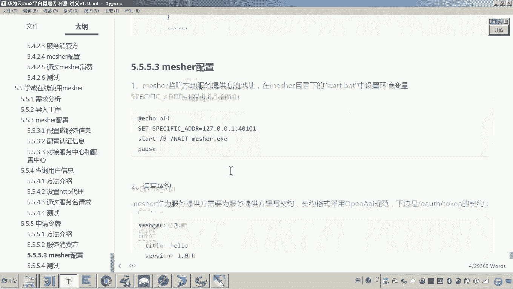
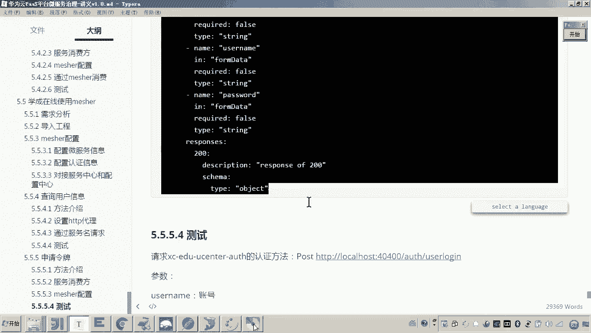
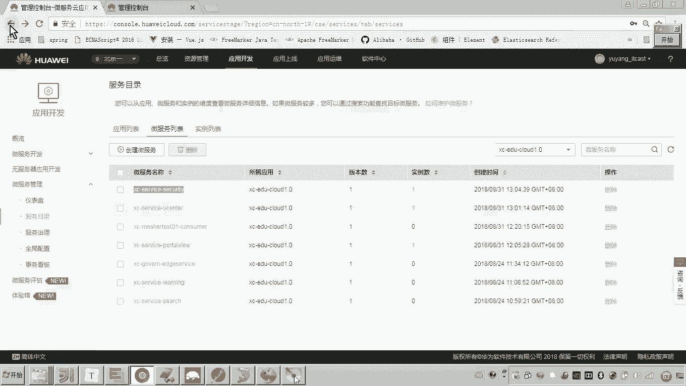
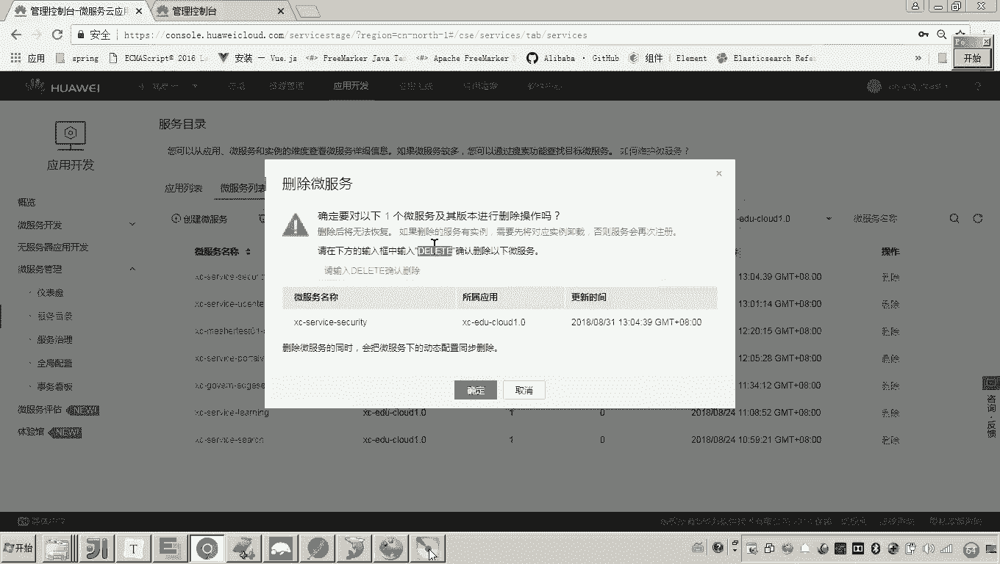
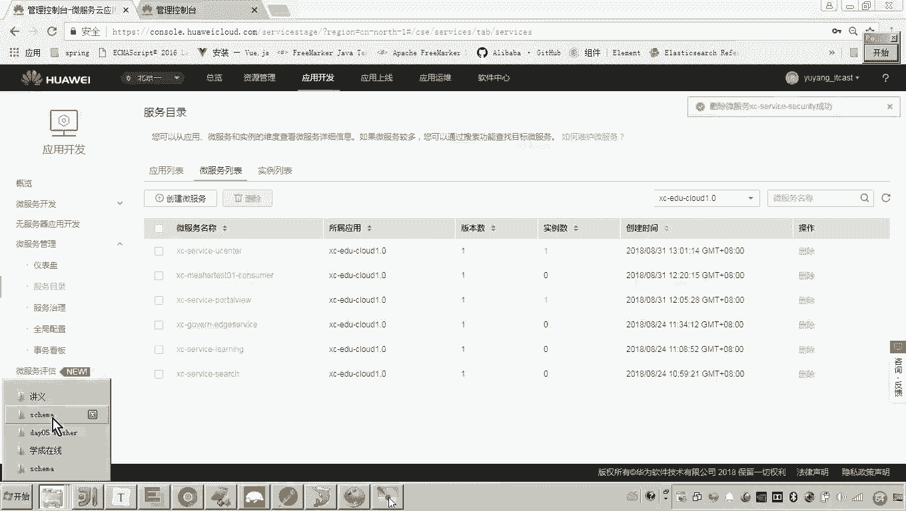
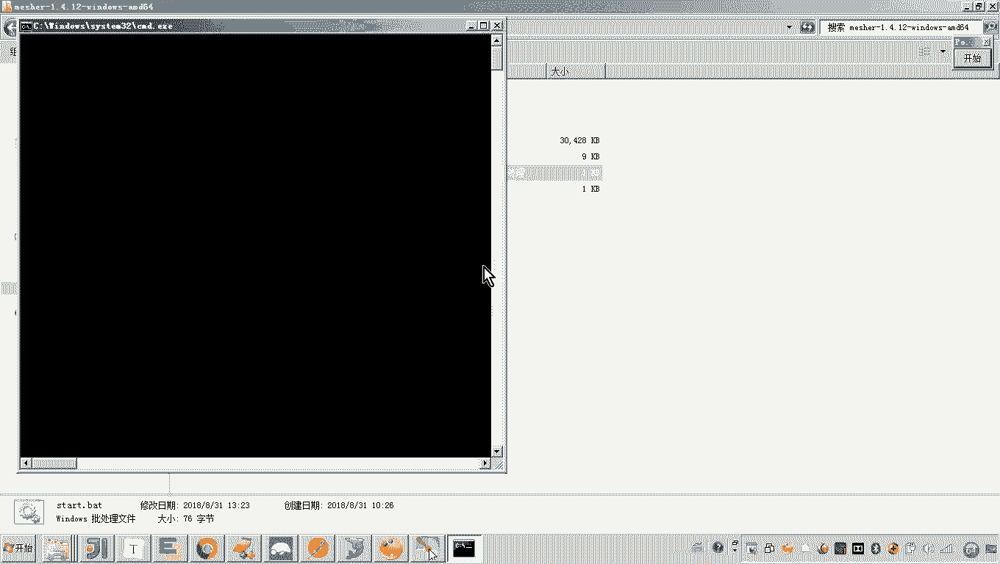
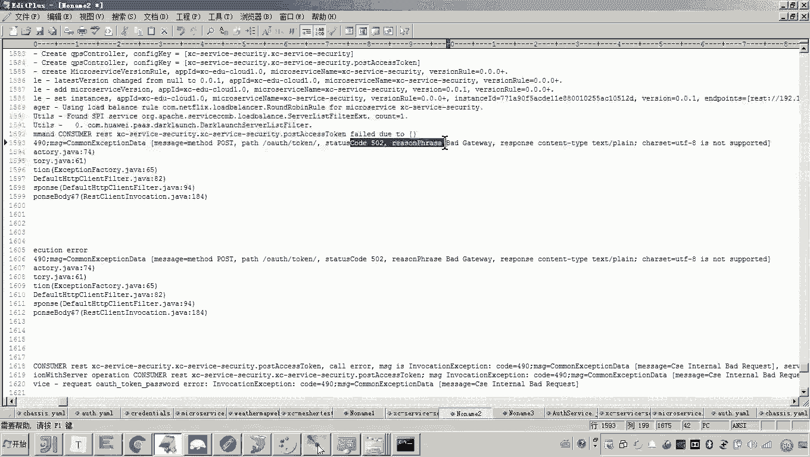
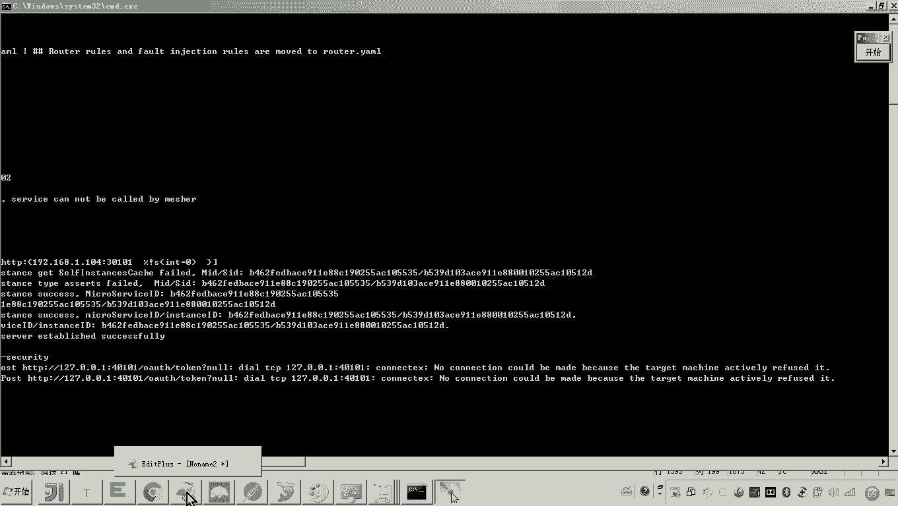
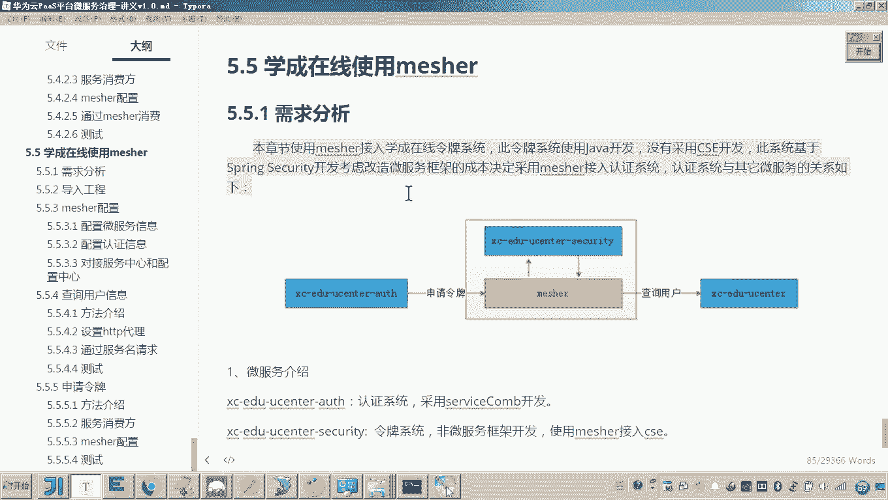

# 华为云PaaS微服务治理技术 - P157：17. 学成在线使用mesher作为提供方供微服务调用 🛠️

在本节课中，我们将学习如何配置和使用华为云的Mesher组件，使其作为服务提供方，供其他微服务（如认证系统）进行调用。我们将重点改造认证系统，使其通过微服务方式调用令牌系统，并完成相关的契约配置与调试。

---

## 概述

上一节我们介绍了Mesher作为服务消费方的用法。本节中，我们来看看如何让Mesher作为服务提供方，代理一个已有的老系统（令牌系统），并让其他微服务（如认证系统）通过标准的微服务调用方式来请求它。

## 改造认证系统（消费方）

首先，我们需要修改认证系统的代码，使其不再通过硬编码的IP和端口调用令牌系统，而是通过CSE框架的服务发现机制进行调用。

以下是需要修改的关键步骤：

1.  **定位调用点**：在认证系统的登录接口中，找到申请令牌的代码位置。原始代码通过`RestTemplate`直接请求一个固定的URL（如 `http://localhost:40401/oauth/token`）。
2.  **修改请求地址**：将硬编码的URL替换为CSE框架的服务调用地址。格式为：`cse://{服务名}/{接口路径}`。
    *   `{服务名}`：Mesher代理的令牌系统在CSE中注册的服务名称。
    *   `{接口路径}`：令牌系统申请令牌的具体接口路径，例如 `/oauth/token`。
3.  **修改RestTemplate构造方式**：为了适配CSE的调用方式，需要将`RestTemplate`的实例化方式改为通过`RestTemplateBuilder`创建。

**代码示例：**
```java
// 修改前
String url = "http://localhost:40401/oauth/token";
RestTemplate restTemplate = new RestTemplate();





// 修改后
String url = "cse://mesher-token-service/oauth/token";
RestTemplate restTemplate = restTemplateBuilder.build();
```

## 配置Mesher（提供方）



接下来，我们需要配置Mesher，使其能够正确代理后端的令牌系统。





以下是Mesher作为提供方需要配置的关键点：



1.  **监听地址**：修改Mesher的启动配置，确保其监听的本地服务地址和端口与真实的令牌系统一致。例如，令牌系统运行在`localhost:40401`，那么Mesher就需要配置为监听该地址。
2.  **服务契约**：为了让消费方能够正确调用，需要为Mesher代理的接口（如`/oauth/token`）定义并配置契约文件。

### 配置服务契约

契约文件定义了接口的请求方法、参数和响应格式，是服务间调用的“合同”。

以下是配置契约的步骤：

1.  在Mesher的配置目录下，创建以服务名命名的文件夹（例如 `mesher-token-service`）。
2.  在该文件夹内，创建固定的目录结构：`schema/接口名`。
3.  在接口名目录下，创建一个文件，文件名通常为接口名（如 `oauth.token.yaml`）。
4.  在该YAML文件中，按照OpenAPI规范编写接口契约。

**契约文件示例 (`oauth.token.yaml`)：**
```yaml
swagger: '2.0'
info:
  title: 'Token Service API'
  version: '1.0.0'
paths:
  /oauth/token:
    post:
      consumes:
        - 'application/x-www-form-urlencoded'
      parameters:
        - name: 'grant_type'
          in: 'formData'
          required: true
          type: 'string'
        - name: 'username'
          in: 'formData'
          required: true
          type: 'string'
        - name: 'password'
          in: 'formData'
          required: true
          type: 'string'
      responses:
        '200':
          description: 'success'
          schema:
            type: 'object'
```
这个契约定义了`POST /oauth/token`接口，它通过`formData`接收`grant_type`、`username`、`password`参数，并返回一个JSON对象。

## 启动与测试



完成以上配置后，按顺序启动服务并进行测试。

1.  **启动令牌系统**：确保后端老系统正常运行。
2.  **启动Mesher**：使用更新后的配置启动Mesher。观察日志，确认其成功注册到CSE服务中心，并且契约已加载。
3.  **启动认证系统**：启动改造后的认证服务微服务。
4.  **发起测试请求**：通过Postman或前端页面，向认证系统的登录接口发起请求。
5.  **跟踪调用链**：在认证系统申请令牌的代码处设置断点，观察请求是否通过`cse://`地址发出，并最终经由Mesher转发到令牌系统，成功获取响应。



在测试过程中，可能会遇到契约不匹配、端口配置错误等问题，需要根据错误日志仔细排查。例如，若响应格式不符，需检查契约中定义的`responses`格式与实际接口返回是否一致。

## 总结

本节课中我们一起学习了如何将Mesher配置为服务提供方。核心流程包括：
1.  改造消费方（认证系统），将硬编码调用改为CSE微服务调用。
2.  配置提供方（Mesher），正确设置其代理的后端服务地址和端口。
3.  编写并配置服务契约，明确接口规范。

通过以上步骤，我们成功将老旧的令牌系统无缝接入CSE微服务架构，使得其他微服务可以通过标准、统一的方式调用它，实现了架构的现代化升级。

---

## 延伸：部署到云平台（ServiceStage）

上述操作是在本地开发测试环境完成的。若需正式部署到生产环境，可以参考华为云**应用平台ServiceStage**进行部署。

ServiceStage提供从代码开发、构建、部署到运维的全生命周期管理。你可以：
*   将集成Mesher的应用代码托管在云端。
*   使用ServiceStage的构建功能制作容器镜像。
*   将应用部署到云容器引擎（CCE）等环境中。



具体部署方法，请参阅华为云官方文档中关于**ServiceStage快速部署**和**Mesher使用指南**的相关章节，将学成在线的令牌系统、用户中心等服务安全、高效地部署至云平台。