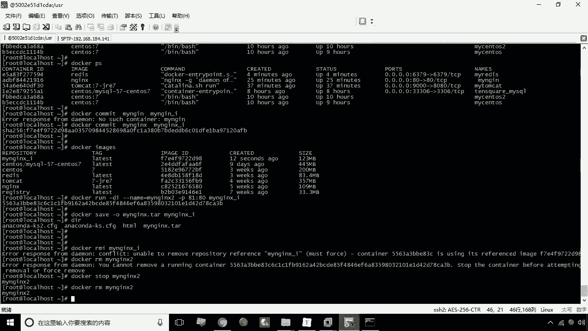

# 华为云PaaS微服务治理技术 - P15：15.迁移与备份 - 开源之家 - BV1wm4y1M7m5

好接下来呢我们来讲解这个docker的备份与迁移，这个备份与迁移呢我们分为三个命令，第一个呢我们可以将容器保存为镜像，第二呢我们可以对镜像进行一个备份，也就是将镜像我们可以导出为一个文件。

那么第三呢我们叫镜像的恢复，恢复呢也就是将我们的一个文件啊，事先备份的这个文件可以再恢复成一个镜像，那么这个docker的备份迁移呢，在实际应用中呢，它其实是非常有用的啊。

比如说我们需要将这个其中这一台服务器的，这个镜像，我想迁到另一台服务器上，那这时候呢啊，这个就可以先把它保存为一个文件，然后把文件拷到另外一台机器呢，我再去怎么呢，我再去恢复啊，他就通过恢复就行了。

或者还有一种情况，就是我们比如说啊通过某一个镜像操作了这个，这个创建了这么一个容器，那么对于容器呢，我进行了一些配置上的修改，或者部署的一些内容，我希望我可以通过基于这个容器，再创建另外一些容器。

我就可以首先把这个容器先保存一个镜像，那保存这个新的镜像呢，基于这个新的镜像，我们创建的容器，那么就是就具有刚才我们所修改的内容了啊，这就是我们说备份与迁移，那好了。

那接下来呢咱们就分别演示这几个命令的用法，首先我们来看第一个命令，就是将容器保存为镜像。

我们刚才呢其实已经给大家呃，演示了一个NGINX用法啊，呃现在呢有一个正在运行的NGINX，就是买NGX，这个MYNGX呢已经部署了一些静态页面，对不对啊，那我现在可以给大家演示的就是。

我可以把这些当前运行的这个MYN，这个再去保存为一个新的镜像，而这个新的镜像，就包含了刚才我所部署的那些静态页面了，那么怎么做呢，唉使用的命令就是comment comment。

然后接下来呢我们要写的这个部分是什么呢，就是我们的容器名称和镜像名称。

那么容器名称就是刚才我们写的这个买，那么镜像名称的话，我们这里就需要写个新的名称了，比如说我这写个MYNGX杠A，表示的是我的这个镜像兴起的一个镜像啊，好保存。

啊这里少了一个XNGINXNGINXNGINX。

好现在呢已经把它保存为一个镜像了啊，保存一个镜像了，那么保存为镜像之后，那接下来我们来看一下，来看一下啊，现在呢就有一个MYNGX杠I了啊，那么接下来我们来测试一下，比如说我现在呢这个要创建一个。

再创建一个容器，我基于这个新创建的定向来创建容器，比如说叫my n gx，NGX2啊，然后呢进来杠P80冒号，这个不能用八零了，改个端口叫八零啊，就是8180啊，就硬扯成速主机的八幺端口。

因为八零已经被占用了啊，那么接下来呢我们再写上，就是我们新创建的这个这个这个镜像好。

那么创建好之后呢，我们现在来测试一下啊，现在呢再测试一下，通过这个冒号八幺看一下到底能不能访问，大家看是不是就直接就能访问了。

哎你说这个镜像，这个镜像中其实就包含了我们所部署的那些啊，这些静态页面了，包括之后我们修改一些配置也是一样的，我们希望说以后啊基于这套配置来去创建容器，那这时候这时候呢。

我们可以在修改某一个容器内容之后呢，将容器保存为镜像之后呢，我们可以用这个新构建，构建的这个镜像来去操作就可以了，就是我们说的这个啊，关于这个容器的这个容器保存为镜像啊。

咱们就说到这儿，那么接下来咱们看一下第二个，第二个命令，就是我们说的备份。

有的时候我们经常需要说这个镜像，我需要去放在另外一台服务器去部署，那怎么办呢，哎这时候我们可以可以把这个，这个镜像保存为一个文件啊，可以导出一个文件啊，那么导出文件我们用save杠O。

杠OO就代表output啊。

就输出的意思输出到哪一个文件呢，我们在这里指定它的文件名就可以了啊。

这个文件名就可以了，然后呢我们这里可以用NGINX，NGINX第2TR，然后呢接下来我们就写这个你的这个镜像，你要保存哪一个镜像啊，你要导出哪一个镜像就写就行了，好现在呢我们看一下啊。

当前目录是不是就多了一个买NGX点tr啊，就多了这么一个文件了啊，多了这么一个文件了，那么我们说这个文件拷到另外一台机器上，我需要怎么办呢，我需要最再把这个文件再给他，转换出一个镜像啊。

这就根据这个文件我可以再恢复成一个镜像，那这时候我们怎么办，这时候我们就需要把这个MYNG杠A，这个镜像呢给它删掉，那这时候我们如果直接这么删的话，其实是有问题的，这时候会提示你什么呢。

因为这个镜像新构建镜像，是不是我们已经创建容器了，所以说我们应该先把这个刚才我们创建这个，基于这个镜像所创建的这个容器先给它删掉啊。

先stop一下啊。

先stop刚才的容器，然后呢再去删除刚才的这个容器。

最后呢我们再去删除这个镜像。

好现在我这个镜像已经被删掉了啊，我们来看一下，现在已经不存在这个现象了，那我现在呢就可以根据这个文件我在恢复啊，我在恢复怎么恢复呢，load杠II就代表input对吧，就input就代表输入。

输入什么呢，我这里要指定这个这个文件啊，就买NXCETT回车，这时候呢他就开始恢复了，恢复之后我们再加入这个docker images命令，这时候大家会发现诶，这个镜像是不是又又回来了，哎。

这是我们说的一个啊容器的这么一个，就是镜像的这么一个导入和导出这么一个功能。

